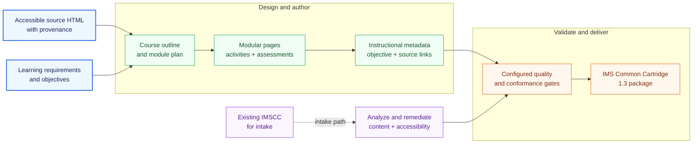

<div align="center">

<pre align="center">
╭──────────────────────────────────────────────────────────────────────────────────────────────────────────╮
│   ██████╗  ██████╗  ██╗   ██╗ ██████╗  ███████╗ ███████╗ ███████╗  ██████╗  ██████╗   ██████╗  ███████╗  │
│  ██╔════╝ ██╔═══██╗ ██║   ██║ ██╔══██╗ ██╔════╝ ██╔════╝ ██╔════╝ ██╔═══██╗ ██╔══██╗ ██╔════╝  ██╔════╝  │
│  ██║      ██║   ██║ ██║   ██║ ██████╔╝ ███████╗ █████╗   █████╗   ██║   ██║ ██████╔╝ ██║  ███╗ █████╗    │
│  ██║      ██║   ██║ ██║   ██║ ██╔══██╗ ╚════██║ ██╔══╝   ██╔══╝   ██║   ██║ ██╔══██╗ ██║   ██║ ██╔══╝    │
│  ╚██████╗ ╚██████╔╝ ╚██████╔╝ ██║  ██║ ███████║ ███████╗ ██║      ╚██████╔╝ ██║  ██║ ╚██████╔╝ ███████╗  │
│   ╚═════╝  ╚═════╝   ╚═════╝  ╚═╝  ╚═╝ ╚══════╝ ╚══════╝ ╚═╝       ╚═════╝  ╚═╝  ╚═╝  ╚═════╝  ╚══════╝  │
╰──────────────────────────────────────────────────────────────────────────────────────────────────────────╯
</pre>

# Courseforge

### Turn accessible learning material into a course people can use anywhere

Courseforge is Ed4All's source-grounded course-authoring and packaging engine.
It turns accessible HTML and learning requirements into teachable modules,
activities, assessments, machine-readable instructional metadata, validation
evidence, and an IMS Common Cartridge for LMS review and import.

**From structured source to portable learning experience.**

[](https://www.python.org/downloads/)
[](../LICENSE)

[Build a course](#quick-start) · [See the workflow](#from-source-to-course-package) · [Explore the outputs](#what-courseforge-delivers) · [Read the docs](#documentation)

</div>

---

## What Courseforge delivers

- **A source-grounded course plan** with canonical terminal and chapter
  learning objectives.
- **Modular HTML learning experiences** with lessons, activities, discussions,
  worked content, and self-checks.
- **Assessments and instructional metadata** that preserve objective alignment
  and support downstream Ed4All stages.
- **An IMS Common Cartridge 1.3 package** for standards-based LMS review and
  import.
- **Validation evidence** that surfaces accessibility, structure, grounding,
  and packaging defects before release.

Automated validation is evidence, not an unconditional accessibility or
cross-LMS compatibility guarantee. Review the reports, complete human
accessibility checks, and import-test the finished cartridge in the target LMS.

## From source to course package



In the creation path, Courseforge combines SemantiK-produced accessible HTML
with learning requirements, plans a teachable sequence, authors modular content
and assessments, then validates and packages the result. The intake path starts
with an existing cartridge, inventories and remediates its content, and rejoins
the same validation and packaging boundary. Both paths retain reviewable
evidence; neither bypasses the configured gates.

## Quick start

### 1. Install Ed4All and its Courseforge dependencies

From the repository root, follow the
[installation guide](../docs/operations/installation.md). IMSCC conformance
checks also require the locally installed, gitignored
[third-party schema dependencies](schemas/imscc/README.md).

```bash
pip install -e ".[full]"
```

Authoring phases require a configured model provider. Review the
[pipeline invocation guide](../docs/operations/pipeline-invocation.md) and
[licensing posture](../docs/LICENSING.md) before selecting one.

### 2. Build a course from learning material

Use private-safe operator values for the source path and course name:

```bash
ed4all run textbook-to-course \
  --corpus <path-to-source> \
  --course-name <course-name>
```

When conversion is needed, the workflow routes the source through SemantiK and
stages its accessible HTML for Courseforge. Courseforge then plans, authors,
validates, and packages the course. Generated projects remain under the
gitignored `Courseforge/exports/` boundary.

### 3. Review before delivery

Inspect the workflow's validation evidence, complete a human accessibility
review, and import-test the `.imscc` package in its target LMS. Use the
[troubleshooting guide](docs/guides/troubleshooting.md) when a package or gate
does not pass.

Working with an existing cartridge? Start with the supported intake and
remediation path in the
[workflow reference](docs/reference/workflow-reference.md).

## Built for grounded course content

Courseforge keeps instructional structure connected to its source. Generated
pages can carry stable block identifiers, source references, learning-objective
alignment, Bloom metadata, teaching roles, key terms, and page-level JSON-LD.
Trainforge consumes that structure downstream, preferring JSON-LD and explicit
`data-cf-*` attributes over heuristic extraction.

The detailed attribute, block, routing, compatibility, and behavior-flag
contracts belong in the maintainer guide rather than this landing page. See
[Courseforge agent guidance](CLAUDE.md) when changing implementation behavior.

## Documentation

- [Architecture](architecture.md) — system boundaries, two-pass authoring,
  artifacts, dispatch, and delivery contracts.
- [Getting started](docs/guides/getting-started.md) — prerequisites and the
  supported first-run journey.
- [Workflow reference](docs/reference/workflow-reference.md) — course creation,
  staged authoring, intake, and remediation.
- [Troubleshooting](docs/guides/troubleshooting.md) — common generation,
  validation, and packaging failures.
- [Learning-objective contract](docs/reference/per-week-learning-objectives.md)
  — alignment between page objectives and course outcomes.
- [Template-chrome contract](docs/reference/template-chrome-roles.md) — keeping
  repeated interface furniture out of retrieval and training text.
- [Courseforge schema index](schemas/README.md) — rendering, metadata, and IMSCC
  contracts.
- [Validation gates](../docs/validation/gates.md) — canonical repository gate
  inventory and severity behavior.
- [Behavior flags](../docs/operations/behavior-flags-courseforge.md) — opt-in
  Courseforge runtime behavior.
- [Ed4All overview](../README.md) — the complete conversion, course, retrieval,
  and optional training pipeline.

## License

Courseforge is part of Ed4All and is available under the Apache License 2.0.
See [LICENSE](../LICENSE).
