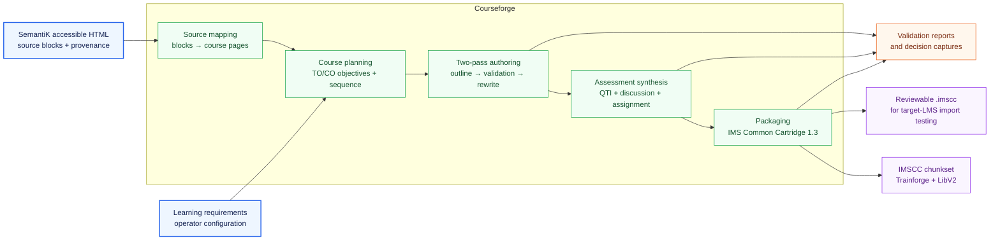
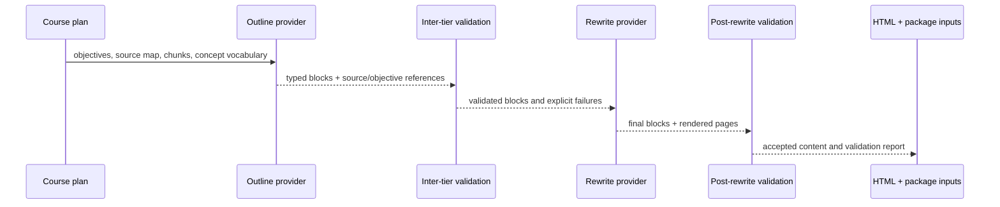

# Courseforge architecture

Courseforge is Ed4All's course-design and packaging boundary. It consumes
SemantiK-derived accessible HTML, source-grounded chunks, and learning
requirements; it emits modular course content, validation evidence,
assessments, and an IMS Common Cartridge for review in a target LMS.

This overview describes the stable system shape. The executable phase and gate
definitions remain authoritative in
[`../config/workflows.yaml`](../config/workflows.yaml); agent registration lives
in [`../config/agents.yaml`](../config/agents.yaml); phase-specific dispatch
overrides live in [`../MCP/core/executor.py`](../MCP/core/executor.py).

## System boundary



The source-mapping layer binds SemantiK block identifiers to planned course
pages. Planning synthesizes canonical terminal (`TO-NN`) and chapter (`CO-NN`)
objectives and records their grounding. Authoring turns that plan into blocks
and HTML. Assessment synthesis produces package resources before the packager
assembles the cartridge. The packaged course then becomes an input to the
post-Courseforge chunking, assessment, archival, retrieval, and optional
training stages; those stages are downstream consumers, not Courseforge
implementation modules.

## Two-pass authoring

Courseforge separates structural intent from polished prose. This makes block
identity, source grounding, objective alignment, and validation failures
visible before a rewrite spends its authoring budget.



The live workflow phase chain is:

1. `content_generation_outline`
2. `inter_tier_validation`
3. `content_generation_rewrite`
4. `post_rewrite_validation`

These four phases dispatch by **phase name** through
`MCP/core/executor.py::_PHASE_TOOL_MAPPING`, rather than relying only on the
agent name. The two validation phases declare no agents; the workflow runner
creates their virtual phase-handler tasks because their phase names have
explicit tool mappings. Gate lists and severity behavior come from the workflow
configuration and must not be inferred from this diagram.

Courseforge retains the earlier `content_generation` phase as the single-pass
compatibility route. It is mutually exclusive with the four-phase authoring
route in a given run: `COURSEFORGE_TWO_PASS=true` disables
`content_generation` and enables the outline, inter-tier validation, rewrite,
and post-rewrite phases. Downstream packaging and assessment resolve the
output of whichever route is active; they do not combine both authoring
contracts.

## Artifacts and contracts

| Contract | Produced or owned by | Consumed by |
|---|---|---|
| `synthesized_objectives.json` | course planning | source mapping, authoring, assessment and objective gates |
| `source_module_map.json` | source mapping | outline and rewrite authoring |
| Outline block JSONL | outline authoring | inter-tier validation and rewrite |
| Final block JSONL and course HTML | rewrite authoring | post-rewrite validation and packaging |
| QTI, discussion and assignment XML | assessment synthesis | packaging and assessment validators |
| `.imscc` package | packager | target LMS, IMSCC chunking and downstream archive stages |
| Validation reports and decision events | workflow runner and phase handlers | operators, retry tooling and audit surfaces |

Courseforge pages expose downstream structure through page-level JSON-LD and
`data-cf-*` attributes. Stable block IDs connect rendered HTML to block records;
source references connect authored material back to SemantiK; learning-objective
references connect pages and assessments to the course plan. The detailed wire
shape lives in [`CLAUDE.md`](CLAUDE.md) and the local
[`schemas/`](schemas/README.md) documentation.

Generated projects live under the gitignored `Courseforge/exports/` boundary.
Private source material, operator course names, generated page contents, and
package payloads are runtime data and must not be committed.

## Validation and delivery boundary

Validation is layered rather than represented by one universal score:

- Inter-tier gates check block shape, grounding, objectives, cognitive load,
  retrieval presence, assessment payloads, and related authoring contracts
  before rewrite.
- Post-rewrite gates check rendered shape, source support, content quality,
  accessibility-oriented component contracts, and course-level consistency.
- Packaging gates check IMSCC structure, page objectives, WCAG-oriented
  signals, and cartridge conformance.

Automated success is necessary evidence, not an unconditional accessibility or
LMS-import guarantee. Delivery still requires human accessibility review and
an import test in the target LMS.

## Operator surfaces

The canonical full workflow is:

```bash
ed4all run textbook-to-course \
  --corpus <path-to-source> \
  --course-name <course-name>
```

Four stage commands can re-drive the Courseforge authoring slice from an
existing project without rerunning upstream conversion and planning:

- `ed4all run courseforge-outline --corpus <private-source-path> --course-name <private-course-name>`
- `ed4all run courseforge-validate --corpus <private-source-path> --course-name <private-course-name>`
- `ed4all run courseforge-rewrite --corpus <private-source-path> --course-name <private-course-name>`
- `ed4all run courseforge --corpus <private-source-path> --course-name <private-course-name>`

They reuse the canonical `textbook_to_course` workflow with a
`courseforge_stage` parameter. They intentionally skip packaging and later
pipeline stages. Use the full workflow when a new cartridge or downstream
archive is required. See the
[`workflow reference`](docs/reference/workflow-reference.md) for arguments,
retry behavior, and artifact locations.

## Further reading

- [Courseforge overview](README.md)
- [Getting started](docs/guides/getting-started.md)
- [Workflow reference](docs/reference/workflow-reference.md)
- [Learning-objective contract](docs/reference/per-week-learning-objectives.md)
- [Template-chrome contract](docs/reference/template-chrome-roles.md)
- [Repository validation gates](../docs/validation/gates.md)
- [Courseforge behavior flags](../docs/operations/behavior-flags-courseforge.md)
