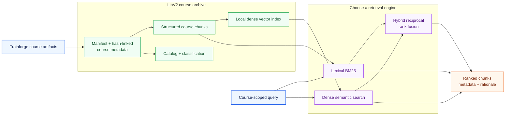

<div align="center">

<pre align="center">
╭──────────────────────────────────────────────────────╮
│  ██╗     ██╗██████╗ ██╗   ██╗██████╗                │
│  ██║     ██║██╔══██╗██║   ██║╚════██╗               │
│  ██║     ██║██████╔╝██║   ██║ █████╔╝               │
│  ██║     ██║██╔══██╗╚██╗ ██╔╝██╔═══╝                │
│  ███████╗██║██████╔╝ ╚████╔╝ ███████╗               │
│  ╚══════╝╚═╝╚═════╝   ╚═══╝  ╚══════╝               │
╰──────────────────────────────────────────────────────╯
</pre>

# LibV2

### Archive a course once. Retrieve its best evidence when you need it.

LibV2 is Ed4All's local course library: an auditable archive for structured
course artifacts with lexical BM25, dense semantic search, and hybrid
reciprocal rank fusion (RRF).

[](https://www.python.org/downloads/)
[](#retrieval-flow)
[](../LICENSE)

[Quick start](#quick-start) · [See retrieval](#retrieval-flow) · [Browse commands](#everyday-commands) · [Read the architecture](../docs/architecture/retrieval-and-serving.md)

</div>

---

## What LibV2 delivers

- **A durable course archive.** Each course keeps its manifests, structured
  chunks, learning outcomes, graphs, quality artifacts, and source lineage
  together under one immutable slug.
- **Three explicit retrieval engines.** Use lexical BM25, dense semantic
  search, or hybrid RRF—without an external vector database.
- **Auditable results.** Retrieval preserves chunk identity and course metadata
  so downstream systems can inspect why evidence was selected.
- **Local lifecycle tools.** Import, validate, index, migrate, back up, evaluate,
  and query course archives through the LibV2 CLI.

## Retrieval flow



In plain language: LibV2 imports a course into a manifest-backed local archive.
A query can use BM25 for lexical matching, a local vector index for dense
similarity, or hybrid RRF to combine both rankings. Each engine returns bounded,
structured results; semantic and hybrid retrieval fail loudly when their
required vector index is missing or stale rather than pretending BM25 was used.

## Quick start

Install from the Ed4All repository root, then use the module CLI directly or
create the optional `libv2` shell alias documented in the operating contract.

```bash
pip install -e '.[full,embedding]'

# List archived courses without loading chunk content.
python -m LibV2.tools.libv2.cli catalog list

# Query one course with lexical retrieval.
python -m LibV2.tools.libv2.cli retrieve "<QUERY>" \
  --course <COURSE_SLUG> \
  --engine lexical \
  --limit 10

# Build the local dense index, then run hybrid RRF.
python -m LibV2.tools.libv2.cli vector-index build \
  --course <COURSE_SLUG>
python -m LibV2.tools.libv2.cli retrieve "<QUERY>" \
  --course <COURSE_SLUG> \
  --engine hybrid-rrf \
  --limit 10
```

Course content is runtime data and remains ignored by Git. Use query-based
retrieval instead of opening an entire `chunks.jsonl`; keep result sets bounded
so content stays useful and reviewable.

## Everyday commands

```bash
# Inspect and validate.
python -m LibV2.tools.libv2.cli info <COURSE_SLUG>
python -m LibV2.tools.libv2.cli validate course <COURSE_SLUG>
python -m LibV2.tools.libv2.cli vector-index status --course <COURSE_SLUG>
python -m LibV2.tools.libv2.cli vector-index verify --course <COURSE_SLUG>

# Compare retrieval engines over an authored gold set.
python -m LibV2.tools.libv2.cli retrieval-benchmark \
  --course <COURSE_SLUG>
```

The lexical engine works without the dense index. Semantic and hybrid-RRF modes
require a valid index whose manifest matches the current chunkset. Rebuild the
index when the source chunk hash changes.

## Archive model

Each ignored `courses/<COURSE_SLUG>/` directory can carry canonical chunksets,
course metadata, a concept graph, training specifications, quality reports,
queries, retrieval evaluations, vector-index artifacts, and optional trained
adapters. Catalog files are derived navigation surfaces; course manifests and
their artifact hashes are the integrity boundary.

Do not edit archived course data directly. Use LibV2 commands so validation,
backup, migration, and index consistency checks remain in the loop.

## Documentation

- [LibV2 operating contract and command reference](CLAUDE.md)
- [Retrieval and serving architecture](../docs/architecture/retrieval-and-serving.md)
- [Library versioning and migration](../docs/operations/library-versioning.md)
- [Installation and local dependencies](../docs/operations/installation.md)
- [Validation gates](../docs/validation/gates.md)
- [Ed4All overview](../README.md)

## License

LibV2 is distributed with Ed4All under the [Apache License 2.0](../LICENSE).
