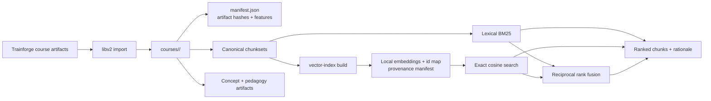
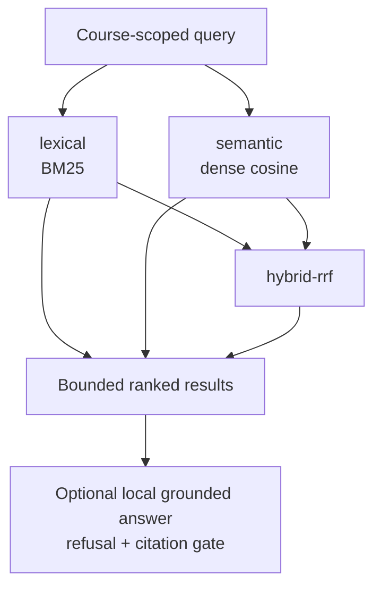

# LibV2 architecture

LibV2 is Ed4All's local, manifest-backed course archive and retrieval layer. It
stores course artifacts, derives catalogs and indexes, and exposes bounded
lexical, semantic, and hybrid retrieval without an external vector database.

## Storage and retrieval flow

The course manifest is the integrity boundary. Catalogs and indexes are derived
navigation surfaces. Semantic and hybrid retrieval require a vector-index
manifest whose source-chunk hash matches the active chunkset; missing, fake, or
stale indexes fail loudly unless a test-only fake provider is explicitly
allowed.

## Course layout

| Surface | Purpose |
|---|---|
| `semantik_chunks/` | Canonical staged-accessible-HTML chunkset and sidecar manifest |
| `imscc_chunks/` | Canonical packaged-course chunkset and sidecar manifest |
| `concept_graph/` | Semantic concept graph pinned by the course manifest |
| `course.json`, `objectives.json` | Course metadata and learning outcomes |
| `training_specs/` | Validated SFT/DPO inputs consumed by optional training |
| `models/` | Additive adapters, model cards, eval reports, and promotion pointers |
| `vector_index/` | Dense embeddings, row-to-chunk map, and replay provenance |
| `retrieval_eval/` | Authored gold sets and retrieval benchmark reports |
| `queries/` | Persistent course-scoped question/answer records |

Legacy chunk directories are read through `lib/libv2_storage.py` resolvers. New
writers use canonical directories; compatibility reads do not redefine the
current storage contract.

## Retrieval engines

`retrieve` selects `lexical`, `semantic`, or `hybrid-rrf`. Hybrid RRF combines
rankings; it does not conceal a failed dense arm. `answer-grounded` adds a
loopback-only model, calibrated refusal, and a non-bypassable citation gate.
The `ask`/`answer` surface is distinct: it persists retrieval and assistant
answers for audit rather than running the automated grounded-answer pipeline.

## Lifecycle and integrity

- `import` creates the course archive; direct manual edits are unsupported.
- `validate` checks course shape and catalog/index consistency.
- `vector-index status` reports provenance and staleness; `verify` recomputes
  artifact hashes.
- `migrate` is dry-run by default; `--apply` backs up, validates, and rolls back
  a failed manifest migration.
- `backup` and `restore` protect the LibV2 metadata spine. Whole-project backup
  remains an Ed4All-level operation.
- `ed4all fsck` checks broader storage integrity, including hashes, symlinks,
  orphaned files, run manifests, and cross-package-index freshness.

Course slugs are immutable. Catalogs are rebuilt rather than hand-edited, and
the retrieval path never reads every chunk into an agent context.

## Code map

| Module | Responsibility |
|---|---|
| `tools/libv2/importer.py` | Import and manifest construction |
| `tools/libv2/validator.py` | Course and index validation |
| `tools/libv2/catalog.py`, `indexer.py` | Derived catalog navigation |
| `tools/libv2/retriever.py` | Lexical retrieval |
| `tools/libv2/semantic_retriever.py` | Dense retrieval with provenance checks |
| `tools/libv2/result_fusion.py` | Reciprocal rank fusion |
| `tools/libv2/retrieval/vector_index.py` | Local vector-index build and exact search |
| `tools/libv2/multi_retriever.py` | Decomposition and multi-query fusion |
| `tools/libv2/evaluation/` | Evaluation generation, retrieval harness, and fresh-adapter bridge |
| `tools/libv2/migrate.py` | Versioned, rollback-safe migrations |
| `tools/libv2/cli.py` | Public command surface |

## Canonical references

- [LibV2 overview](README.md)
- [LibV2 operating contract](CLAUDE.md)
- [Retrieval and serving](../docs/architecture/retrieval-and-serving.md)
- [Library versioning](../docs/operations/library-versioning.md)
- [Course manifest schema](../schemas/library/course_manifest.schema.json)
- [Vector-index manifest schema](../schemas/library/vector_index_manifest.schema.json)
- [Validation gates](../docs/validation/gates.md)
