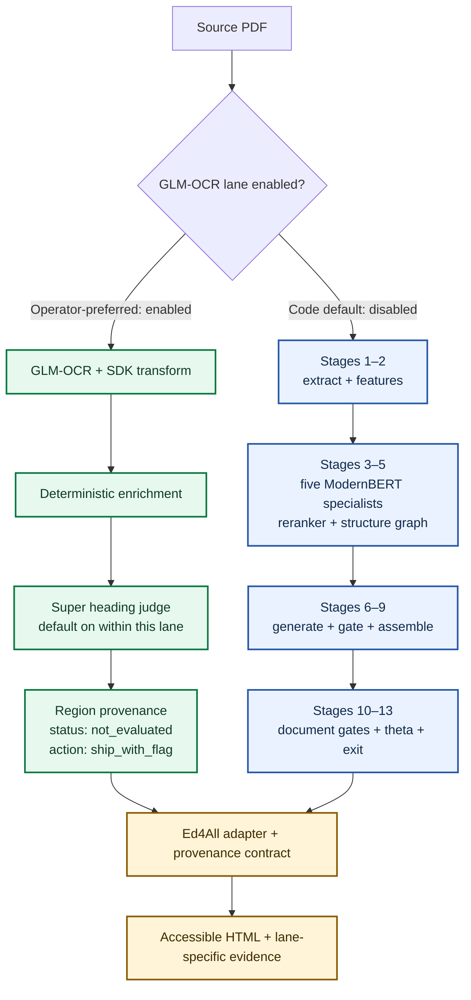

<div align="center">

<pre align="center">
╭───────────────────────────────────────────────────────────────────╮
│ ███████╗███████╗███╗   ███╗ █████╗ ███╗   ██╗███████╗██╗██╗  ██╗  │
│ ██╔════╝██╔════╝████╗ ████║██╔══██╗████╗  ██║╚══██╔══╝██║██║ ██╔╝ │
│ ███████╗█████╗  ██╔████╔██║███████║██╔██╗ ██║   ██║   ██║█████╔╝  │
│ ╚════██║██╔══╝  ██║╚██╔╝██║██╔══██║██║╚██╗██║   ██║   ██║██╔═██╗  │
│ ███████║███████╗██║ ╚═╝ ██║██║  ██║██║ ╚████║   ██║   ██║██║  ██╗ │
│ ╚══════╝╚══════╝╚═╝     ╚═╝╚═╝  ╚═╝╚═╝  ╚═══╝   ╚═╝   ╚═╝╚═╝  ╚═╝ │
╰───────────────────────────────────────────────────────────────────╯
</pre>

# SemantiK

### Turn source documents into accessible, traceable HTML

SemantiK is Ed4All's document-conversion engine. It extracts source content,
reconstructs reading structure, generates semantic HTML, validates the result,
and preserves block-level provenance for downstream course and retrieval tools.

[](LICENSE)
[](#output-contract)
[](#runtime-options)

[Quick start](#quick-start) · [Conversion flow](#conversion-flow) · [Output contract](#output-contract) · [Architecture](architecture.md) · [Ed4All](../README.md)

</div>

---

## What SemantiK delivers

- Semantic HTML organized for assistive technology and downstream processing.
- Lane-specific accessibility evidence that never presents an unevaluated check
  as a pass.
- Stable source references and physical-page provenance for citations and review.
- Explicit status and audit data for review, publication, and downstream use.

The compatibility cascade targets WCAG 2.2 AA requirements through
deterministic assembly and automated gates. Automated checks do not prove that
every document is fully conformant; skipped, unevaluated, and flagged output
still requires appropriate review.

## Conversion flow



SemantiK has two live, non-convergent conversion routes. The operator-preferred
route uses GLM-OCR, SDK transformation and normalization, deterministic
enrichment, and a default-on Super heading judge. It produces ordered
`region_provenance` for the Ed4All adapter without entering the staged
generation, gate, assembly, or theta pipeline. Its current posture is explicit:
accessibility is `not_evaluated`, and the exit action is `ship_with_flag`.

When the GLM-OCR lane is not enabled—the code default—the compatibility route
runs the Stage-1–13 cascade in `semantik_structure/cascade.py`. Five ModernBERT
specialists cover structure, semantics, merge/split, tables, and math through a
shared backbone. A cross-reranker and deterministic structure graph feed Qwen
candidate generation, hard gates, document assembly, theta evaluation, and the
exit policy. Both routes meet only at the Ed4All adapter and public provenance
contract. See [the architecture guide](architecture.md) for the complete map.

## Quick start

SemantiK is exposed through Ed4All's CLI. Convert one PDF, a directory of PDFs,
or a directory of publisher HTML without creating a course:

```bash
ed4all convert <INPUT_PATH> --output <OUTPUT_DIR>
```

Useful conversion options include `--figures-dir <FIGURES_DIR>` for PDF figure
assets and `--reuse-conversion` to reuse compatible artifacts already present
in the output directory. The command writes `{stem}_accessible.html` and its
sidecars beneath `<OUTPUT_DIR>`.

Run conversion as part of the complete source-to-course workflow:

```bash
ed4all run textbook-to-course \
  --corpus <SOURCE_PATH> \
  --course-name <COURSE_NAME>
```

Use non-identifying placeholders in examples, logs, fixtures, and tracked
configuration. Course names, course slugs, source filenames, and generated
content may be private and should not be committed.

Start with the [installation guide](../docs/operations/installation.md) and the
[conversion command guide](../docs/operations/convert-verb.md). Runtime flags
are listed in the [SemantiK behavior-flag reference](../docs/operations/behavior-flags-semantik.md).

## Runtime options

SemantiK's heavy ML dependencies may run in the Ed4All environment or in a
dedicated SemantiK environment behind the JSON bridge at
`scripts/run_cascade_json.py`.

- **Local specialists are the default.** With
  `SEMANTIK_SPECIALIST_PROVIDER=local` (or unset), configured Stage-6 GGUF
  specialists run through `llama-cpp-python` without a hosted API.
- **Hosted generation is explicit.** A non-local provider configures an
  OpenAI-compatible endpoint but does not by itself replace local Stage-6
  authoring. `SEMANTIK_SPECIALIST_REFINE=1` enables endpoint refinement;
  `SEMANTIK_SPECIALIST_ENDPOINT_DISPLACE=1` enables endpoint-only generation.
- **GLM-OCR is operator-preferred and explicitly enabled.** The compatibility
  Stage-1–13 cascade remains the code default when the lane flag is off.
- **Scan-page arrangement is also explicit.** Optional routing never activates
  silently because a dependency or model is unavailable.

Provider and model licensing considerations are documented in
[the licensing guide](../docs/LICENSING.md). Deployment flags and model paths
belong in local environment configuration, not tracked documentation.

## Output contract

The Ed4All adapter in `lib/semantik/` normalizes conversion results into one
downstream-facing contract:

- `{stem}_accessible.html` contains the assembled document.
- Provenance-stamped sections carry `data-semantik-*` attributes for stable
  block identity, source type, physical pages, confidence, and gate status.
- Source references use the public shape
  `semantik:{document-slug}#{block-id}`. The concrete document slug is private
  run data and must not be hardcoded in tracked files.
- `region_provenance` records regions in emission order with their source text,
  page span, structure, confidence, and available review metadata.
- Lane-specific evidence records the route and exit posture. The compatibility
  cascade can include full conformance-audit data: gate results, skip counts,
  semantic-preservation evidence, thresholds, and heading tree. The GLM route
  reports accessibility as `not_evaluated` and exits `ship_with_flag`; consumers
  must not infer that compatibility gates ran.

Stable identifiers support repeatable source mapping, but content-hash IDs are
used only when their documented flag is enabled. A skipped gate means no
measurement was made; it must never be presented as a verified pass. The
complete wire contract is in [architecture.md](architecture.md#data-contracts).

## Design boundaries

- Learned components propose classifications, structure corrections, or HTML;
  deterministic code owns orchestration, text-conservation checks, hard gates,
  hierarchy normalization, and final assembly.
- Hard validation failures eliminate a candidate before soft quality ranking.
- The semantic-preservation score cannot override an accessibility-gate result.
- Optional reviewers and refinement passes must preserve source text and revert
  or fail closed when their invariants are violated.
- Model weights are deployment artifacts and are not included in this source
  tree. Review the license of every selected weight and hosted provider.

## Project map

| Path | Purpose |
|------|---------|
| `semantik_structure/` | Extraction, routing, conversion cascade, gates, assembly, and model runtimes |
| `scripts/run_cascade_json.py` | Out-of-process JSON bridge entry point |
| `../lib/semantik/` | Ed4All adapter, output normalization, and deterministic front-matter handling |
| `../MCP/tools/pipeline_tools.py` | Conversion bridge and workflow integration |
| [architecture.md](architecture.md) | Detailed architecture, contracts, and limitations |
| [CLAUDE.md](CLAUDE.md) | Maintainer instructions, flags, tests, and operational invariants |
| [Ontology](../schemas/ONTOLOGY.md) | Canonical semantic types and vocabulary |

## License

SemantiK source code is available under the [Apache License 2.0](LICENSE).
Model weights are separate artifacts; their licenses and any provider terms
must be reviewed independently.
