<div align="center">

<pre align="center">
╭───────────────────────────────────────────────────────────────────╮
│ ███████╗███████╗███╗   ███╗ █████╗ ███╗   ██╗████████╗██╗██╗  ██╗ │
│ ██╔════╝██╔════╝████╗ ████║██╔══██╗████╗  ██║╚══██╔══╝██║██║ ██╔╝ │
│ ███████╗█████╗  ██╔████╔██║███████║██╔██╗ ██║   ██║   ██║█████╔╝  │
│ ╚════██║██╔══╝  ██║╚██╔╝██║██╔══██║██║╚██╗██║   ██║   ██║██╔═██╗  │
│ ███████║███████╗██║ ╚═╝ ██║██║  ██║██║ ╚████║   ██║   ██║██║  ██╗ │
│ ╚══════╝╚══════╝╚═╝     ╚═╝╚═╝  ╚═╝╚═╝  ╚═══╝   ╚═╝   ╚═╝╚═╝  ╚═╝ │
╰───────────────────────────────────────────────────────────────────╯
</pre>

# SemantiK

### From source document to structured, accessibility-oriented HTML

SemantiK is Ed4All's document-conversion engine. It turns PDFs and existing
HTML into semantic web content, preserves source provenance, and produces the
structured foundation used by Courseforge, Trainforge, and LibV2.

**Extract clearly. Structure deliberately. Keep every block traceable.**

[](https://www.python.org/downloads/)
[](LICENSE)
[](#what-semantik-delivers)

[Quick start](#quick-start) · [See the flow](#the-conversion-flow) · [Understand the output](#output-contract) · [Read the architecture](architecture.md) · [Explore Ed4All](../README.md)

</div>

---

## What SemantiK delivers

- **Structured HTML** with headings, sections, tables, figures, math, and other
  document regions represented for web and assistive-technology workflows.
- **Source-level traceability** through stable block identifiers, physical-page
  references, and ordered region provenance.
- **Deterministic normalization and enrichment** around model-produced OCR,
  keeping the output contract inspectable and repeatable.
- **Explicit quality evidence** that distinguishes evaluated, flagged, and
  not-evaluated checks instead of presenting missing evidence as success.
- **A clean downstream handoff** for course creation, content chunking,
  retrieval, accessibility review, and source-grounded citations.

SemantiK is designed to support WCAG 2.2 AA remediation. Automated conversion
and validation are evidence toward accessibility, not a guarantee that every
source document is fully conformant. Publication still requires review of the
source, generated structure, and reported findings.

## The conversion flow

```mermaid
flowchart LR
    source["Private source<br/>PDF or HTML"]
    extract["GLM-OCR<br/>SDK extraction"]
    normalize["SDK normalization<br/>ordered document regions"]
    enrich["Deterministic enrichment<br/>tables · figures · math · provenance"]
    judge["Super Judge<br/>heading hierarchy review"]
    adapt["Ed4All adapter<br/>stable output contract"]
    output["Private output<br/>semantic HTML + audit evidence"]

    source --> extract --> normalize --> enrich --> judge --> adapt --> output

    classDef sourceNode fill:#EEF6FF,stroke:#2563EB,color:#172554,stroke-width:2px;
    classDef modelNode fill:#FAF5FF,stroke:#9333EA,color:#581C87,stroke-width:2px;
    classDef deterministicNode fill:#F0FDF4,stroke:#16A34A,color:#14532D,stroke-width:2px;
    classDef outputNode fill:#FFF7ED,stroke:#EA580C,color:#7C2D12,stroke-width:2px;

    class source sourceNode;
    class extract,judge modelNode;
    class normalize,enrich,adapt deterministicNode;
    class output outputNode;
```



The preferred PDF route uses GLM-OCR through its SDK, converts the response
into SemantiK's ordered region model, and enriches those regions without
discarding their source lineage. The Super heading judge reviews the recovered
heading hierarchy, while deterministic code owns normalization, provenance,
output assembly, and the final contract.

The preferred lane currently reports accessibility as `not_evaluated` and the
exit action as `ship_with_flag`; it does not claim that the compatibility
route's WCAG gate suite ran. Review that evidence before publication.

This division is intentional: learned components interpret difficult source
material; auditable code decides how that interpretation becomes a document.
See [architecture.md](architecture.md) for the implemented stages, evidence
boundaries, and current limitations.

## Quick start

Install Ed4All and only the capabilities needed for your environment. Runtime
dependencies and platform packages are documented in the
[installation guide](../docs/operations/installation.md); dependencies and
model weights are not vendored in this repository.

Convert a PDF, a directory of PDFs, or publisher HTML without building a
course:

```bash
SEMANTIK_GLMOCR_LANE=1 \
ed4all convert <PRIVATE_INPUT_PATH> --output <PRIVATE_OUTPUT_DIR>
```

Or run SemantiK as the conversion stage of the complete Ed4All pipeline:

```bash
SEMANTIK_GLMOCR_LANE=1 \
ed4all run textbook-to-course \
  --corpus <PRIVATE_SOURCE_PATH> \
  --course-name <PRIVATE_COURSE_NAME>
```

The GLM-OCR route is the preferred conversion path but remains explicitly
selected by `SEMANTIK_GLMOCR_LANE=1`. Configuration details live in the
[SemantiK behavior-flag reference](../docs/operations/behavior-flags-semantik.md),
and standalone conversion semantics are covered by the
[conversion guide](../docs/operations/convert-verb.md).

Source material, course names, generated HTML, sidecars, logs, and concrete
document slugs are always private working data. Keep them in ignored input and
runtime locations; do not commit them or embed them in code, comments, tests,
examples, or documentation.

## Output contract

For each converted document, SemantiK produces assembled HTML plus structured
evidence used by Ed4All's downstream stages. The adapter under `lib/semantik/`
normalizes the result into a stable interface:

- HTML blocks carry `data-semantik-*` metadata for identity, source type,
  page provenance, confidence, and available review status.
- Source references use the generic form
  `semantik:{document-slug}#{block-id}`; concrete values remain private run
  data.
- Ordered `region_provenance` retains the relationship between emitted blocks
  and their source regions.
- Heading and conformance evidence records what was evaluated, what was
  flagged, and what still needs review.
- GLM-OCR results retain the explicit `not_evaluated` / `ship_with_flag`
  posture until the required accessibility review is complete.

Downstream consumers can therefore map course content and retrieval results
back to the converted source without treating the HTML as an anonymous text
dump. The complete contract is defined in [architecture.md](architecture.md).

## Why SemantiK

- **Accessibility-oriented by design.** Structure and review evidence are
  produced as part of conversion, not added as an afterthought.
- **Provenance survives transformation.** Page and block lineage remain
  available after OCR, normalization, enrichment, and heading review.
- **Deterministic ownership is clear.** Code owns document assembly and output
  contracts; model responses remain bounded inputs to that process.
- **Private by default and by policy.** Source corpora and generated artifacts
  stay outside the public repository.
- **Built for reuse.** The same semantic HTML can feed course generation,
  chunking, retrieval, validation, and human remediation.

## Project map

| Path | Purpose |
|---|---|
| `semantik_structure/glmocr/` | GLM-OCR SDK client, document transform, enrichment, and heading judgment |
| `semantik_structure/` | Conversion models, document structures, assembly, and supporting utilities |
| `scripts/run_cascade_json.py` | Out-of-process JSON bridge used by the Ed4All conversion seam |
| `../lib/semantik/` | Downstream adapter, normalization, provenance, and deterministic remediation helpers |
| `../MCP/tools/pipeline_tools.py` | Workflow integration and conversion-phase orchestration |
| [architecture.md](architecture.md) | Detailed architecture, contracts, and limitations |

## Documentation

- [Installation and dependencies](../docs/operations/installation.md)
- [Standalone conversion](../docs/operations/convert-verb.md)
- [SemantiK architecture](architecture.md)
- [Behavior flags](../docs/operations/behavior-flags-semantik.md)
- [Licensing and model posture](../docs/LICENSING.md)
- [Ed4All overview](../README.md)

## License

SemantiK source code is available under the [Apache License 2.0](LICENSE).
Runtime dependencies, model weights, and hosted providers retain their own
licenses and terms; review the [licensing guide](../docs/LICENSING.md) before
selecting them.
