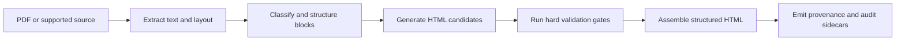

<div align="center">

<pre align="center">
  ____                       _   _ _  __
 / ___|  ___ _ __ ___   __ _| \ | | |/ /
 \___ \ / _ \ '_ ` _ \ / _` |  \| | ' /
  ___) |  __/ | | | | | (_| | |\  | . \
 |____/ \___|_| |_| |_|\__,_|_| \_|_|\_\
</pre>

# SemantiK

### Turn source documents into accessible, traceable web content

SemantiK converts PDFs into structured HTML while preserving the block-level
provenance downstream systems need for citations, review, and reprocessing.

[](../LICENSE)
[](#integrate-reliable-outputs)
[](#choose-a-runtime)

[Quick start](#quick-start) · [See the flow](#how-conversion-works) · [Output contract](#integrate-reliable-outputs) · [Architecture](architecture.md) · [Ed4All](../README.md)

</div>

---

Its ML cascade is built on one principle:

> **Learned models are narrow candidate generators; deterministic code
> orchestrates, gates, and assembles.**

BERTs classify, Qwens generate candidates, and deterministic code owns
composition, hierarchy, ARIA wiring, validation, and final assembly. That
split makes accessibility decisions inspectable: the rules that validate and
assemble output are visible code, not hidden in model weights.

- **Auditable open-source foundation.** The PDF stack uses
  permissively licensed tooling — pypdfium2 (Apache-2/BSD-3) for text
  extraction and rendering, pdfplumber (MIT) for layout, pikepdf (MPL-2.0)
  for structure, and Tesseract (Apache-2) for OCR. The code ships Apache-2.0
  (see `LICENSE`).
- **Local by default.** The Stage-6 specialists can run offline on local GGUF
  weights. A hosted model endpoint is an explicit opt-in quality seat, not a
  dependency.
- **Explicit outcomes.** Four deterministic exit actions distinguish
  validated output, flagged output, retry routing, and non-certified output.

## Explore the project

| Path | What |
|------|------|
| `SemantiK/semantik_structure/` | The 13-stage cascade + model runtimes |
| `lib/semantik/` | The Ed4All-facing adapter seam (output-contract normalizer + deterministic front-matter filter) |
| `MCP/tools/pipeline_tools.py` | The bridge wiring into the Ed4All pipeline |
| [`architecture.md`](architecture.md) | **Canonical** cascade deep-dive (read this for the design) |
| [`CLAUDE.md`](CLAUDE.md) | Subsystem guide for coding agents (runtime modes, flags, bridge, tests) |
| [`schemas/ONTOLOGY.md`](../schemas/ONTOLOGY.md) | Canonical ontology and standards-facing semantic contracts |

## How conversion works



In words: SemantiK extracts source text and geometry, classifies the resulting
blocks, generates structured HTML candidates, removes candidates that fail hard
validation, assembles the surviving document, and emits provenance and audit
sidecars with the HTML. The diagram is a summary; the stage table below is the
implementation map.

Entry point: `semantik_structure/cascade.py::run_full_cascade` (reachable as
`pipeline_v2.run(pdf, mode="v2")`). Per-stage depth is in
[`architecture.md`](architecture.md); the one-liner map:

| # | Stage | What it does |
|---|-------|--------------|
| 1 | extract | pikepdf + pypdfium2 + pdfplumber + Tesseract → per-page text/bbox |
| 2 | features | font/geometry/column/reading-order features per block |
| 3 | council | BERT specialists (Structure · Semantic · MergeOrSplit · TableSpecialist · Math), shared backbone with one-resident LoRA adapter swap |
| 4 | cross-BERT reranker | arbitrate conflicting council signals → routing decisions |
| 5 | structure_graph | deterministic 6-pass grouping → typed `Region` objects |
| 6 | Qwen specialists | prose/table/math HTML generation; local GGUF or hosted endpoint; batched by adapter |
| 7 | per-region hard gate | axe-wcag22aa · html5 · text-preservation · MathML · table/heading (eliminating) |
| 8 | per-region soft reranker | pick the top surviving candidate per region |
| 9 | assembler | role→HTML, heading-tree normalize, gap-fill splice |
| 10 | document hard gate | document-scope axe · lang · title · landmark · heading contiguity |
| 11 | document soft reranker | document quality / lane-selection signal |
| 12 | theta | DeBERTa-v3-small semantic-preservation cross-encoder (post-WCAG quality score) |
| 13 | exit decider | stamp `ship_with_confidence` / `ship_with_flag` / `offline_qwen_lane` / `non_certified_stamp` |

Every intermediate decision is inspectable: each structural choice traces
back to a rule, an algorithm, or a model confidence. See
[`architecture.md`](architecture.md) for the BERT council, the Qwen
specialists, the two-tier validation gate, the theta evaluator, and the
exit-decision table.

## Quick start

SemantiK runs inside Ed4All as the `semantik_conversion` conversion backend (via
the bridge in `MCP/tools/pipeline_tools.py`) — no dedicated CLI of its own.

Convert a source without building a course:

```bash
ed4all convert <SOURCE_PATH> --output <OUTPUT_DIR>
```

To include conversion in the complete Ed4All pipeline:

```bash
ed4all run textbook-to-course \
  --corpus <SOURCE_PATH> \
  --course-name <COURSE_NAME>
```

Start with the [installation guide](../docs/operations/installation.md), then
use the [conversion guide](../docs/operations/convert-verb.md) for accepted
inputs, output sidecars, and failure behavior. For an in-process SemantiK
runtime, install the conversion dependencies into a venv that already carries
the heavy ML stack (Ed4All's `[training]` and `[embedding]` extras satisfy the
shared ML dependencies):

```bash
# 1. The pure-pip deps (the [semantik] extra).
pip install -e '.[semantik]'

# 2. The headless Chromium used by the axe-core a11y audit.
playwright install chromium

# 3. llama-cpp-python for the LOCAL Stage-6 GGUF specialists — a CUDA
#    *source* build, NOT the CPU wheel:
CMAKE_ARGS="-DGGML_CUDA=on -DCMAKE_CUDA_ARCHITECTURES=86" \
  pip install --no-binary llama-cpp-python llama-cpp-python
```

Step 3 is **optional for structure-only conversion**: the Stage-6
specialists can run on a configured hosted endpoint instead
(`SEMANTIK_SPECIALIST_PROVIDER=nvidia` plus the explicit
`SEMANTIK_SPECIALIST_ENDPOINT_DISPLACE=1` opt-in), so a box without a
CUDA-built `llama-cpp-python` can still run the full cascade when its endpoint
and credentials are configured.

Alternatively, the cascade runs **out of process** in its own venv behind a
JSON bridge (`scripts/run_cascade_json.py`); point `SEMANTIK_PYTHON` at that
venv's interpreter and `SEMANTIK_RUNTIME_DIR` at the SemantiK project root.
Runtime modes and the agent-facing environment contracts are in
[`CLAUDE.md`](CLAUDE.md); the public flag reference is
[`behavior-flags-semantik.md`](../docs/operations/behavior-flags-semantik.md).

## Choose a runtime

- **Local GGUF specialists (default).** `SEMANTIK_SPECIALIST_PROVIDER=local`
  (or unset) runs the Stage-6 specialists in-process on `llama-cpp-python`
  (built against CUDA), fully offline, no key. This is the byte-stable
  default.
- **Hosted endpoint seat (explicit opt-in).** A non-local
  `SEMANTIK_SPECIALIST_PROVIDER` value configures the OpenAI-compatible
  endpoint, but does not displace local Stage-6 authoring by itself. Use
  `SEMANTIK_SPECIALIST_REFINE=1` for a hosted refinement pass or
  `SEMANTIK_SPECIALIST_ENDPOINT_DISPLACE=1` for endpoint-only Stage-6
  generation. Provider and model licensing is documented in
  [`docs/LICENSING.md`](../docs/LICENSING.md).

Specialist generation is **batched by adapter** (one PROSE/TABLE/MATH
adapter resident at a time — never interleaved on 8 GB VRAM). The optional
Stage-5d structure reviewer (`SEMANTIK_STRUCTURE_REVIEW=1`, off by default)
is a conservative heading corrector that never alters text and **fails
closed** on any token-conservation mismatch.

## Integrate reliable outputs

SemantiK emits a stable, downstream-facing shape so every Ed4All consumer
(Courseforge staging, source-mapping, the chunker, the Ask path) reads one
consistent interface across runs and versions. Full detail:
[`architecture.md`](architecture.md) §12.

- **Source-provenance block attributes.** The adapter seam
  (`lib/semantik/adapter.py`, `cascade_ir.py`) wraps each content block in a
  provenance-stamped `<section>` carrying `data-semantik-*` attributes
  (`data-semantik-block-id`, `data-semantik-source`, `data-semantik-pages`,
  `data-semantik-confidence`, `data-semantik-wcag`, …) — the stable block id, the
  `synthesized`/`vendor` provenance, the physical PDF page span, and the
  per-region gate verdict.
- **A deterministic sourceId**, `{prefix}:{slug}#{block_id}`, where the
  `block_id` is minted from the block's first raw FeatureBlock index (or a
  content hash under `TRAINFORGE_CONTENT_HASH_IDS=1`). **Same PDF in → same
  sourceIds out**, so chunk refs, `source_module_map.json`, and citation
  deep-links survive re-runs.
- **`region_provenance`** — a per-region list in emission order (region
  index, kind, role, confidence, WCAG status, raw block index, pages,
  heading text/level, figure alt, raw text).
- **`*.conformance_audit.json`** (schema `conformance-audit/1.0`) — exit
  action + WCAG status, per-region + document gate logs *with skip counts*
  (skips are first-class: "no measurement", not "verified safe"), the theta
  report, thresholds, heading tree, and a rule-id → WCAG SC coverage map.

## Why the architecture is dependable

- **Front-matter handling is deterministic.** Phantom-TOC / front-matter
  contamination (a book's table-of-contents getting classified as real
  chapter headings) is fixed at the adapter seam by the CPU-only detector
  `lib/semantik/toc_frontmatter_detector.py` — a front-matter-zone anchor, a
  monotonic-page-number TOC run, and a page-density cluster. This is the
  load-bearing front-matter fix; the off-by-default Stage-5d 70B reviewer is
  the secondary, conservative defensive layer.
- **Hard gates eliminate; soft rerankers only choose among survivors.**
  Mixing eliminating WCAG checks with fit-quality signals in one scorer
  would let the model trade an axe violation against style — the wrong
  direction on the axis SemantiK competes on. So axe/html5/text-preservation
  failures *drop* a candidate before any soft reranker sees it.
- **Theta is a post-WCAG quality score, not a gate.** It runs only on
  documents that pass the document-level hard gate and never overrides a
  WCAG verdict; it may lower confidence, trigger one capped offline retry,
  or attach a review flag.

## Operational constraints

- **Council VRAM on 8 GB.** The full cascade is GPU-flaky on an 8 GB card:
  council BERTs share one ModernBERT-base backbone (one-resident LoRA
  adapter swap) and the Qwen specialists batch *by adapter* rather than
  fanning out, because parallel adapter contexts plus a concurrent
  Chromium/axe-core process poison CUDA on 8 GB. Mitigated, not eliminated.
  Higher-memory deployment hardware avoids this contention.
- **Structure quality is council-bound.** Block-ID quality of *pedagogical*
  elements is only as good as BERT-Structure's `structural_role` /
  `is_heading` heads; heading over-detection is patched defensively (the
  always-on deterministic front-matter detector is load-bearing; the
  Stage-5d 70B reviewer is conservative and off by default).

Full limitations: [`architecture.md`](architecture.md) §14.

## License

The repository code is Apache-2.0 (`LICENSE`, "Copyright 2026 Ed4All"). The
PDF and ML libraries named above use permissive or weak-copyleft licenses.
Model weights (council BERTs, Qwen GGUFs, theta head) are separate artifacts,
not shipped in this tree; deployers should review the licenses of the weights
they select.

Training-data and provider licensing policy is documented in
[`docs/LICENSING.md`](../docs/LICENSING.md). Labels for the structure models
are mechanically derived from source HTML rather than generated through an
LLM API.
