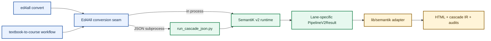
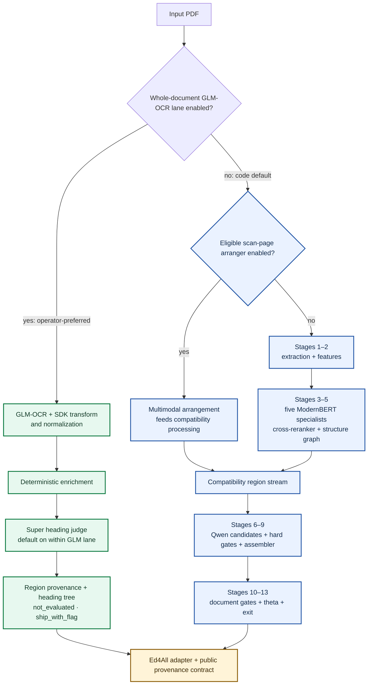
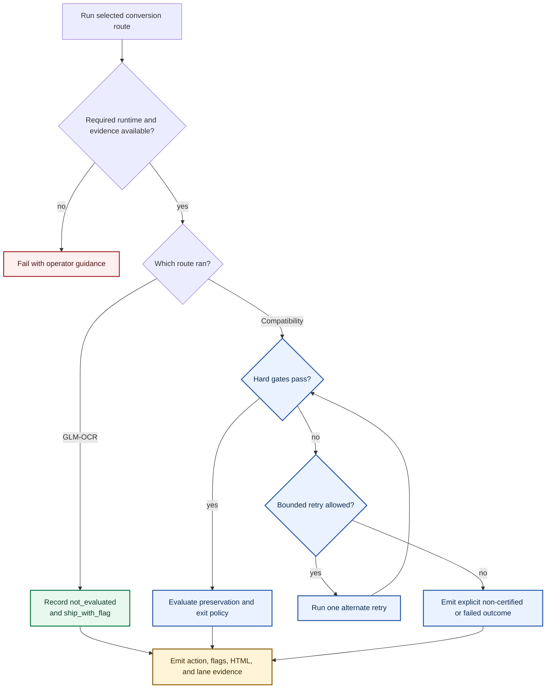

# SemantiK architecture

SemantiK converts source documents into structured HTML and carries source
provenance into Ed4All. This guide describes its two live, non-convergent
conversion routes, the shared Ed4All adapter boundary, and the evidence that
travels with each output.

For an operator-focused introduction, see the [SemantiK README](README.md).
For canonical semantic types, see the [Ed4All ontology](../schemas/ONTOLOGY.md).

## Architectural principles

1. **Learned components have bounded authority.** They propose structure,
   corrections, captions, or HTML candidates. They do not own the final
   document contract.
2. **Deterministic code owns invariants.** Text conservation, ordering,
   hierarchy, provenance, hard validation, assembly, and output normalization
   are implemented as inspectable code.
3. **Hard failures cannot be averaged away.** A candidate that fails an
   eliminating check is removed before soft ranking.
4. **Route selection is explicit.** The operator-preferred GLM-OCR route is
   enabled by flag; flag-off behavior runs the compatibility cascade. Neither
   route silently replaces the other after a runtime failure.
5. **Skipped is not passed.** Audit records preserve skipped checks as missing
   measurements.

SemantiK automates checks relevant to WCAG 2.2 AA, but an automated run is not
proof that every output is fully conformant. The exit action, gate evidence,
skip counts, and review flags must be interpreted together.

## System boundary



In words: both the standalone `ed4all convert` command and the complete
textbook-to-course workflow enter through `MCP/tools/pipeline_tools.py`. The
conversion seam imports the v2 runtime directly when its dependencies are
available, or executes `scripts/run_cascade_json.py` with the configured
SemantiK interpreter. Both paths produce the same logical result. The adapter
under `lib/semantik/` then normalizes provenance, applies deterministic
document transforms, renders the public HTML contract, and persists sidecars.

The subprocess boundary exists because conversion may require a heavier ML and
browser environment than the orchestration process. `SEMANTIK_PYTHON` selects
the dedicated interpreter and `SEMANTIK_RUNTIME_DIR` selects its working
directory. Missing bridge configuration or malformed bridge output fails
loudly; the seam must not invent empty provenance.

## Entry points

| Surface | Live entry | Responsibility |
|---------|------------|----------------|
| CLI | `cli/commands/convert.py` | Validate input type and output directory; invoke the conversion seam |
| Workflow | `config/workflows.yaml` → `extract_and_convert_pdf` | Run SemantiK as the conversion phase of a larger build |
| Ed4All seam | `MCP/tools/pipeline_tools.py::_run_semantik_v2_conversion` | Select in-process or bridge execution and persist artifacts |
| Bridge | `scripts/run_cascade_json.py` | Execute conversion in the SemantiK environment and serialize the result |
| Runtime | `semantik_structure/cascade.py::run_pipeline_v2` | Select a structure lane and own validator lifetime |
| Compatibility cascade | `semantik_structure/cascade.py::run_full_cascade` | Execute the flag-off Stage-1–13 route |
| Adapter | `lib/semantik/cascade_ir.py` and `adapter.py` | Convert region provenance into the downstream HTML contract |

Ed4All's conversion seam targets the v2 runtime through
`semantik_structure/pipeline_v2.py`.

## Runtime routing



The operator-preferred route uses GLM-OCR extraction, SDK transformation and
normalization, deterministic enrichment, and the Super heading judge. The
judge is on by default inside this route, while the route itself remains
explicitly enabled. It builds `region_provenance` and a heading tree, then hands
that evidence to the Ed4All adapter. It does not enter compatibility candidate
generation, accessibility gates, assembly, or theta evaluation. Its current
result accurately records accessibility as `not_evaluated` and the exit action
`ship_with_flag`.

With the GLM-OCR flag off—the code default—SemantiK runs the compatibility
Stage-1–13 route. An eligible, explicitly enabled page arranger may supply its
structure stream inside that route. The two primary routes meet only at the
Ed4All adapter and public provenance contract; they do not share generation,
validation, assembly, or audit semantics.

The compatibility route combines extracted geometry with five ModernBERT
specialists: Structure, Semantic, MergeOrSplit, TableSpecialist, and
MathSpecialist. The shared ModernBERT backbone swaps one resident LoRA adapter
at a time. Contextual reranking and deterministic grouping consume their typed
signals. Separate table- and math-detector members are not part of the live
route. Alternate routes do not silently activate because a
model or dependency is missing; their flags and eligibility checks select them.

## Compatibility Stage-1–13 cascade

This route runs when GLM-OCR is not enabled. Several optional review and repair
seams sit between its numbered stages. The table is a conceptual map, not a
promise that every optional seam runs on every document.

| Stage | Owner | Result |
|------:|-------|--------|
| 1–2 | Extraction and feature code | Text, bounding boxes, images, layout, reading order, and candidate regions |
| 3–5 | Five-specialist compatibility classification, contextual routing, and deterministic grouping | Ordered typed regions |
| 5b–5e | Optional OCR enrichment, figure rendering, review, and repartition | Conserved, enriched regions plus review evidence |
| 6 | Prose, table, and math generators | Multiple HTML candidates per region |
| 6b | Optional figure captioning | Alt text and extended descriptions |
| 7 | Per-region hard gates | Survivors plus complete gate evidence |
| 8 | Per-region quality ranking | One selected candidate per region |
| 9 | Deterministic assembler and bounded repair seams | Normalized document HTML and emitted-region order |
| 10 | Document hard gates | Document-level accessibility and validity evidence |
| 11 | Document quality scoring | Lane and quality signals |
| 12 | Semantic-preservation evaluation | Meaning-preservation report; never an accessibility override |
| 13 | Exit policy | Action, flags, and at most one bounded retry decision |

### Extraction and structure

The extraction stack uses pikepdf, pypdfium2, pdfplumber, and Tesseract as
appropriate to the source. Feature blocks retain raw text and physical-page
context. Structure formation consumes layout, reading order, model signals,
and deterministic rules to emit typed `Region` objects.

Optional structure review and block resegmentation operate on block identities,
not replacement source text. Their conservation checks prevent a reviewer from
silently deleting, inventing, or rewriting content. Figure and table enrichment
are attached to the same regions so their provenance survives assembly.

### Candidate generation and selection

The Stage-6 runtime generates candidates for prose, tables, and math. Local
GGUF specialists are the default authoring route. A configured OpenAI-compatible
endpoint participates only when refinement or endpoint displacement is
explicitly enabled.

Generation is batched by specialist adapter to control device residency. Each
candidate then passes region-specific hard checks such as HTML validity, axe
results, text preservation, heading structure, table structure, or MathML
validity. Soft scoring sees only candidates that survive all applicable hard
checks.

### Assembly and document validation

The assembler maps region roles to HTML, establishes the document shell,
normalizes heading levels, places landmarks, resolves supported references,
and preserves emitted-region order. Bounded second-pass and reasoning-QC seams
may propose corrections, but text-conservation and revalidation still apply.

Document gates inspect the assembled artifact, including language, title,
landmarks, heading contiguity, HTML validity, and document-scope axe results.
Semantic-preservation evaluation happens after those gates and cannot turn a
failed accessibility check into a pass.

## Runtime providers and device boundaries

The local Stage-6 provider is selected when
`SEMANTIK_SPECIALIST_PROVIDER=local` or the variable is unset. A non-local
provider configures an endpoint, but local authoring remains in place until
one of these explicit modes is selected:

- `SEMANTIK_SPECIALIST_REFINE=1`: generate locally, then refine at the endpoint.
- `SEMANTIK_SPECIALIST_ENDPOINT_DISPLACE=1`: use endpoint-only Stage-6 generation.

Other optional reviewers may use the configured endpoint when their own flags
are enabled. Provider credentials, model paths, and deployment-specific device
values must remain outside tracked files. See the
[behavior-flag reference](../docs/operations/behavior-flags-semantik.md) and
[licensing guide](../docs/LICENSING.md).

The runtime releases model and browser resources at explicit stage boundaries.
Small devices may still be unsuitable for a full production cascade. Resource
pressure is an operational failure, not permission to substitute mock output.

## Data contracts

### Runtime result

`PipelineV2Result` carries the source path, HTML, flags, lane identifier,
ordered `region_provenance`, heading data, and route-specific evidence. The
compatibility route also carries gate status, semantic-preservation results,
nested cascade evidence, and its exit decision. The GLM route explicitly marks
accessibility `not_evaluated` and uses `ship_with_flag`. The bridge serializes
the equivalent lane-specific fields as JSON.

Mock runtime output is for tests and harnesses. The production seam inspects
runtime provenance and rejects mock-backed conversion artifacts.

### Region provenance

`cascade.py::_build_region_provenance` emits one record per assembled region in
document order. Depending on region type and enabled features, a record includes:

- `region_index`, `region_kind`, role, confidence, and WCAG status;
- `first_raw_block_index`, physical `pages`, and raw source text;
- heading text and level, figure description, structure metadata, and ordering;
- optional review, resegmentation, OCR-repair, and reasoning-QC evidence.

The list order follows the assembler's emitted-region order. Consumers must not
silently replace it with extraction order or accept an empty list when the
conversion claims success.

### Public HTML provenance

The Ed4All adapter wraps emitted blocks with `data-semantik-*` attributes. The
stable public core includes block identity, source category, physical page span,
confidence, and gate status. Optional attributes are present only when their
feature fired.

Source references use:

```text
semantik:{document-slug}#{block-id}
```

The shape is public; concrete document slugs and source names are private run
data. Emitters mint the `semantik:` form. Readers may accept documented legacy
forms for compatibility, but new documentation and output must not mint them.

By default, stable block IDs derive from source block identity. Content-hash
IDs are an explicit behavior change. Deterministic identity supports citation
deep links and source maps across repeat conversions of the same source.

### Persisted artifacts

For a source stem, the standalone command writes the accessible HTML and
available sidecars below the requested output directory. The conversion seam
may persist:

- `{stem}_accessible.html` — final rendered document;
- `{stem}_accessible.cascade_ir.json` — ordered provenance and document evidence;
- `{stem}_accessible.conformance_audit.json` — conversion and gate audit;
- quality or synthesis sidecars required by the surrounding Ed4All workflow.

Exact sidecars depend on the input route and enabled features. Consumers should
follow the conversion guide rather than infer success from a filename alone.

### Conformance audit

For the compatibility cascade,
`conformance_audit.py::build_conformance_audit` records the runtime mode, exit
decision, per-region and document gates, skipped-check counts, semantic-
preservation evidence, thresholds, heading tree, provenance summary, and
optional feature audits. A skip means that a check had no measurement. The
GLM route does not imply that these compatibility checks ran; its
`not_evaluated`/`ship_with_flag` posture is the evidence consumers must honor.
An audit artifact is evidence for review, not a conformance claim by itself.

## Failure behavior



In words: missing dependencies, invalid bridge JSON, mock-backed production
results, absent required provenance, and invariant violations are errors with
operator-facing diagnostics. On the compatibility route, hard-gate failure can
request only the bounded retry defined by exit policy. Exhaustion remains
explicit in the exit action and audit; it is never relabeled as validated
output. The GLM route preserves its unevaluated, flagged posture instead of
borrowing compatibility-route gate results.

Important failure classes include:

- extraction or OCR failure that prevents a trustworthy region stream;
- runtime/model configuration failure;
- hosted endpoint authentication, timeout, rate, or response-shape failure;
- text-conservation or partition-invariant failure in an optional correction;
- all generated candidates failing an applicable hard gate;
- document hard-gate failure after assembly;
- bridge output missing required provenance or carrying a mock runtime marker;
- stop-sentinel activation at a supported unit boundary.

Optional correction passes may revert to the pre-correction artifact when that
reversion is the documented fail-closed behavior. That is not a silent degraded
substitute: the original deterministic path remains the intended output and the
attempt is represented in audit evidence.

## Trust boundaries and privacy

- Source filenames, course names, course slugs, document slugs, local absolute
  paths, hostnames, credentials, and generated course content are private.
- Tracked examples use placeholders such as `<SOURCE_PATH>`, `<OUTPUT_DIR>`,
  `<COURSE_NAME>`, `{document-slug}`, and `{block-id}`.
- Logs and audit sidecars can contain source text and identifiers. Treat them as
  run data, not public documentation.
- HTML produced from untrusted sources must still pass through sanitization,
  validation, and normal browser-security review before publication.

## Component map

| Component | Boundary |
|-----------|----------|
| `semantik_structure/cascade.py` | Runtime routing, staged conversion, result construction |
| `semantik_structure/extract*.py` and `features.py` | Source extraction and layout features |
| `semantik_structure/structure_graph/` | Deterministic region construction |
| `semantik_structure/qwen_specialists/` | Candidate generation and optional review runtimes |
| `semantik_structure/gates/` | Region- and document-level eliminating checks |
| `semantik_structure/assembler/` | Deterministic document construction and normalization |
| `semantik_structure/theta/` | Post-gate semantic-preservation evaluation and exits |
| `semantik_structure/conformance_audit.py` | Structured audit construction |
| `scripts/run_cascade_json.py` | Cross-environment serialization boundary |
| `lib/semantik/` | Ed4All-facing provenance normalization and HTML rendering |
| `MCP/tools/pipeline_tools.py` | Orchestration integration and artifact persistence |

## Known limitations

- Extraction quality depends on the source PDF, OCR quality, and the selected
  structure lane.
- Automated accessibility testing does not replace expert review, assistive-
  technology testing, or content-owner acceptance.
- Alt text and extended descriptions may require subject-matter review.
- Mathematical and tabular reconstruction can preserve text while still needing
  semantic correction.
- Model-backed structure and generation may vary with weights and configuration;
  deterministic contracts limit their authority but do not remove model error.
- A production-scale cascade may require more device memory than a development
  workstation provides.

Operational details belong in [CLAUDE.md](CLAUDE.md), the
[conversion guide](../docs/operations/convert-verb.md), and the
[SemantiK flag reference](../docs/operations/behavior-flags-semantik.md).
