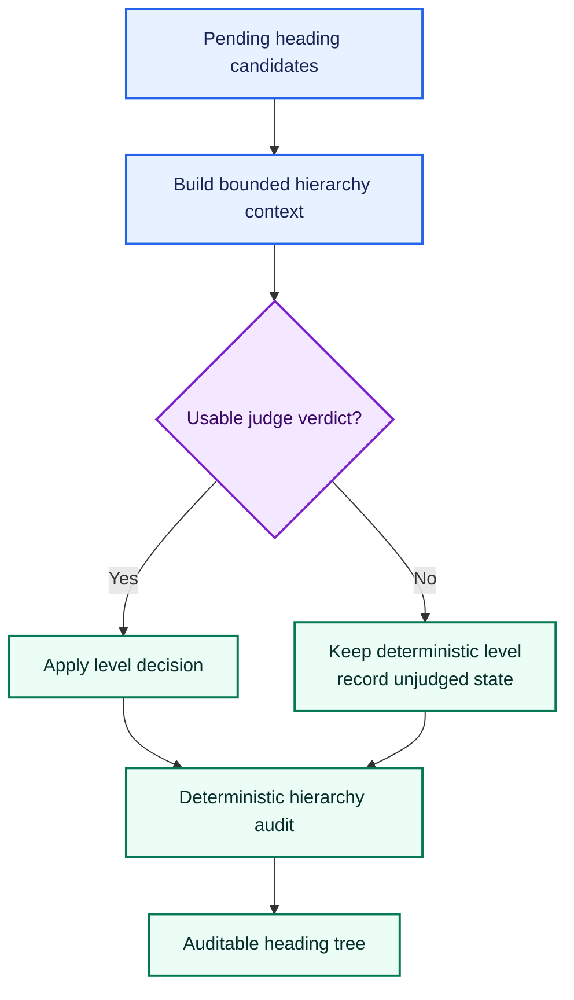
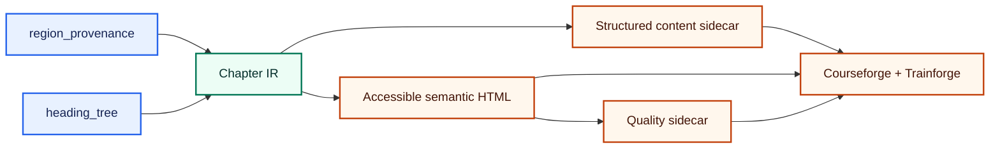
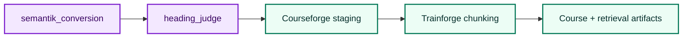

# SemantiK architecture

```text
+----------------------------------+
|      SEMANTIK :: ARCHITECTURE    |
+----------------------------------+
```

> From source pages to structured, accessible HTML—with every downstream
> block still connected to where it came from.

SemantiK is Ed4All's document-conversion subsystem. Its preferred pipeline
renders a source PDF into page images, extracts page regions through the
GLM-OCR SDK, normalizes those regions with deterministic code, enriches the
document, and applies the Super heading judge before publishing the stable
Ed4All provenance contract.

The architectural boundary is deliberate: models recover content and resolve
bounded ambiguities; deterministic code owns normalization, hierarchy,
accessible HTML structure, provenance, and release artifacts.

## Preferred pipeline

Set `SEMANTIK_GLMOCR_LANE=1` to select the preferred converter. The flag is
currently explicit rather than the code default, so deployments can migrate
without silently changing existing output.

```mermaid
flowchart LR
    PDF["Source PDF"] --> RENDER["Page rendering<br/>ordered page images"]
    RENDER --> SDK["GLM-OCR SDK<br/>layout + region OCR"]
    SDK --> NORMALIZE["Deterministic normalization<br/>regions + reading order"]
    NORMALIZE --> ENRICH["Document enrichment<br/>headings, figures, semantics"]
    ENRICH --> JUDGE["Super heading judge<br/>bounded level decisions"]
    JUDGE --> ADAPTER["Ed4All adapter<br/>accessible HTML + provenance"]
    ADAPTER --> ARTIFACTS["Downstream contract<br/>HTML + structured sidecars"]

    classDef source fill:#E8F1FF,stroke:#2563EB,color:#172554,stroke-width:2px;
    classDef model fill:#F3E8FF,stroke:#7E22CE,color:#3B0764,stroke-width:2px;
    classDef deterministic fill:#ECFDF5,stroke:#047857,color:#052E2B,stroke-width:2px;
    classDef output fill:#FFF7ED,stroke:#C2410C,color:#431407,stroke-width:2px;
    class PDF,RENDER source;
    class SDK,JUDGE model;
    class NORMALIZE,ENRICH,ADAPTER deterministic;
    class ARTIFACTS output;
```



The colors reinforce stage ownership but are not required to read the diagram:
every node is labeled, the flow is left to right, and no meaning depends on
color alone.

### 1. Page rendering

`semantik_structure/glmocr/sdk_client.py::render_pdf_to_pngs` renders pages in
source order. Each document gets an isolated render directory, preventing
stale pages from another conversion from entering the page sequence. Missing
rendering dependencies fail loudly; SemantiK does not substitute a lower
fidelity path without an explicit operator decision.

### 2. GLM-OCR SDK extraction

`SdkGlmOcrClient` wraps the self-hosted `glmocr` SDK. The SDK combines page
loading, layout detection, per-region OCR, and result formatting. SemantiK
normalizes SDK results into a compact page-region shape:

- source page number;
- region order and native label;
- bounding box;
- extracted content;
- a typed page error when extraction fails.

Instructional asides, references, and footnotes are retained as content rather
than discarded as page furniture. If every page fails, the lane raises instead
of publishing an empty conversion.

### 3. Deterministic normalization

`semantik_structure/glmocr/transform.py::transform_document` converts SDK
regions into SemantiK's stable intermediate contract. Deterministic rules own:

- canonical region kinds;
- reading and emission order;
- heading candidates and initial levels;
- heading-tree construction;
- escalation records for unresolved structure;
- normalized math and structural metadata.

This stage does not ask a language model to rewrite source prose. The original
region content remains the evidence carried into later rendering and audit.

### 4. Enrichment

Enrichment adds information without replacing the provenance backbone.
Depending on enabled capabilities, the pipeline can attach figure descriptions,
preserve richer region semantics, and derive document-level structure.
Enrichment is additive: the source page, region identity, and extracted
content remain available for inspection.

The Ed4All adapter in `lib/semantik/` also performs deterministic cleanup that
belongs at the publication seam, including front-matter filtering, heading
normalization, accessible table and math emission, and source-block wrapping.

### 5. Super heading judge

The GLM transform can deliberately leave ambiguous heading levels pending. The
default-on Super judge resolves those bounded choices using the surrounding
heading tree and escalation evidence. It changes heading-level metadata, not
source text.



The lane runs this judge before it writes its final structural sidecars. In the
end-to-end Ed4All workflow, `heading_judge` is also a named phase immediately
after `semantik_conversion`. That phase processes the conversion sidecars,
records explicit judged, agreed, changed, and unjudged counts, and audits the
book-level hierarchy. Reprocessing an already judged chapter is designed to be
idempotent; it is an audit and recovery boundary, not a second competing source
of truth.

Transport failure retains the deterministic heading levels and is reported.
The resulting state is distinguishable from a successful judge agreement.

## Adapter and publication boundary

The GLM-OCR lane's primary product is structured provenance, not free-form
HTML. `lib/semantik/cascade_ir.py` builds chapter-oriented intermediate records,
then `lib/semantik/adapter.py::normalize_cascade_to_ed4all` renders the stable
downstream document contract.



The adapter owns the HTML shell and the `data-semantik-*` attributes consumed
downstream. A typical emitted block carries:

- a stable block identifier;
- source provenance;
- physical source-page coverage;
- normalized block role or type;
- confidence and accessibility status when available.

Identifiers are derived from normalized document structure rather than an
operator's course name. Courseforge can therefore map generated course blocks back
to SemantiK blocks, and Trainforge can preserve those references in chunks and
citations without embedding source material in repository code or docs.

## Artifacts and privacy boundary

For a generic input document, the conversion seam produces:

| Artifact | Purpose | Publication posture |
|---|---|---|
| Accessible HTML | Semantic learner-facing document | Generated, private by default |
| GLM-OCR layout sidecar | Page and region provenance backbone | Generated, private by default |
| Escalation sidecar | Unresolved and judged structural decisions | Generated, private by default |
| Structured content sidecar | Chapter and block records for downstream stages | Generated, private by default |
| Quality sidecar | Conversion and accessibility signals | Generated, private by default |

Inputs, rendered pages, OCR text, sidecars, and output HTML are runtime data.
They are never required in the public source tree. Public fixtures must be
synthetic and reviewed independently of operator corpora.

The preferred lane currently records accessibility as `not_evaluated` and its
exit action as `ship_with_flag`. It bypasses the compatibility route's document
gate and theta stack, so consumers must not infer that those checks passed.

## Failure and trust model

SemantiK distinguishes a valid result from a convenient result:

1. A completely unavailable OCR lane fails loudly.
2. Partial page failures remain typed and visible; they are never counted as
   successful page extraction.
3. Heading-judge failures preserve deterministic structure and remain
   distinguishable from judged agreement.
4. Enrichment cannot erase the source-region provenance backbone.
5. The adapter, not a model response, owns the final HTML structure.
6. Accessibility validation reports what was measured; an absent measurement
   is not presented as a pass.

These rules allow narrow model assistance without making model output the
authority for document integrity.

## Execution boundary

SemantiK can run in-process when its conversion dependencies share the Ed4All
environment, or through the JSON subprocess bridge when it uses an isolated
environment. Both routes converge on the same region, heading, adapter, and
artifact contracts. If neither runtime is available, conversion fails with
setup guidance; there is no silent placeholder conversion.

In the standard workflow, the public sequence is:



## Live compatibility route

When `SEMANTIK_GLMOCR_LANE` is not enabled, `run_pipeline_v2` enters the older
multi-stage conversion cascade. That route remains callable for compatibility
with existing deployments and artifacts, but it is not qualified for
production conversion: the previous BERT classifier was unreliable, and the
staged multi-head training configuration still requires retraining and
evaluation. Its retained callability is a code-compatibility fact, not a model-
quality claim. It still converges on the same chapter IR and Ed4All adapter
contract, which keeps downstream consumers independent of the selected
converter.

This public architecture intentionally does not present compatibility-model
internals as the direction of travel. Their implementation remains isolated
behind the converter boundary; new architecture work should target the
GLM-OCR SDK, deterministic transform, enrichment, and Super judge path.

## Change checklist

A change to SemantiK architecture should preserve all of the following:

- page and region order remain deterministic;
- source text is never silently dropped or rewritten;
- every emitted block retains inspectable source provenance;
- heading decisions are bounded, recorded, and auditable;
- model or dependency failure cannot masquerade as successful conversion;
- generated corpus material remains outside the public repository;
- both execution modes produce the same downstream contract;
- documentation and diagrams remain understandable without color alone.

Related public references:

- [SemantiK overview and usage](README.md)
- [Ed4All system architecture](../ARCHITECTURE.md)
- [Decision capture](../docs/architecture/decision-capture.md)
- [Extraction architecture](../docs/architecture/hybrid-vision-extraction.md)
- [Installation and dependencies](../docs/operations/installation.md)
- [Licensing posture](../docs/LICENSING.md)
