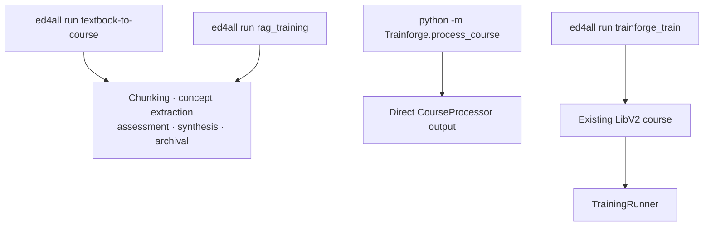
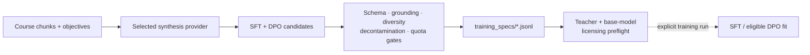

# Trainforge architecture

Trainforge turns packaged course content into validated learning artifacts. It
owns canonical chunking, IMSCC parsing, assessments, concept and pedagogy
artifacts, SFT/DPO synthesis, and the optional post-import adapter workflow.

## System flow

```mermaid
flowchart LR
    imscc["IMSCC package"] --> parse["parsers/<br/>IMSCC + QTI + HTML"]
    parse --> chunks["chunker/<br/>canonical chunk v4"]
    chunks --> process["process_course.py"]
    process --> graph["Concept + pedagogy artifacts"]
    process --> assess["Assessments + quality report"]
    chunks --> synth["synthesis/<br/>SFT + DPO"]
    graph --> archive["LibV2 course archive"]
    assess --> archive
    synth --> archive
    archive -. operator opt-in .-> runner["training/runner.py"]
    runner --> adapter["LoRA adapter + model card + eval"]
    adapter --> archive
```

The solid path is the CPU-oriented course-data path. Adapter fitting is a
separate, GPU-bound LibV2 post-import stage and never runs merely because a
course was parsed or archived.

## Runtime boundaries

| Boundary | Canonical implementation | Contract |
|---|---|---|
| Parse | `parsers/imscc_parser.py`, `qti_parser.py`, `html_content_parser.py` | Extract structured course content and provenance. |
| Chunk | `chunker/` | One chunk-v4 implementation shared by staged HTML and IMSCC paths. |
| Process | `process_course.py::CourseProcessor` | Emit course, assessment, graph, pedagogy, and quality artifacts. |
| Align | `alignment/align_chunks.py` | Add learning-outcome and teaching-role alignment. |
| Synthesize | `synthesis/synthesize_training.py` | Emit validated instruction and preference JSONL plus resume state. |
| Train | `training/runner.py::TrainingRunner` | Read an imported LibV2 course; fit/evaluate an optional adapter. |
| Evaluate | `eval/` | Deterministic metrics, retrieval checks, runners, and promotion gates. |

## Workflow entry points



The workflow registry in `config/workflows.yaml` is authoritative for phase
ordering and validation gates. The direct processor remains useful for bounded
local work, but it is not a substitute for orchestrated phase gates.

## Data contracts

- Chunks conform to `schemas/knowledge/chunk_v4.schema.json` and carry the
  chunker version separately from the extraction-text contract.
- Concept graphs conform to
  `schemas/knowledge/concept_graph_semantic.schema.json`.
- SFT and DPO records conform to the instruction- and preference-pair schemas
  under `schemas/knowledge/`.
- Model cards conform to `schemas/models/model_card.schema.json`.
- Every LLM call site emits decision-capture evidence; the canonical event
  shape is `schemas/events/decision_event.schema.json`.

Artifacts written into a LibV2 course are tied together by manifest hashes.
Readers must use the storage resolvers in `lib/libv2_storage.py`, which preserve
explicit legacy read compatibility without changing the canonical emit paths.

## Synthesis and licensing



`local` is the recommended synthesis posture; `together` is the hosted OSS
route. `mock` is for plumbing tests and cannot produce a promotable corpus.
`anthropic` training-pair synthesis fails closed. The legacy
`claude_session` route remains acknowledgment-gated and is not recommended for
training data. [Licensing and ToS posture](../docs/LICENSING.md) is the
authoritative provider and derivative-work reference.

DPO eligibility at synthesis time is not the same as DPO admission at training
time. The trainer applies its configured preference filter and, by default,
fails when the filtered corpus is below its required floor rather than silently
continuing as SFT-only.

## Failure and lifecycle behavior

- Schema and critical validation failures block publication; thresholds are not
  weakened to make a run pass.
- Long-running synthesis, alignment, evaluation, and training surfaces retain
  resume state and poll the run stop sentinel at unit boundaries.
- Semantic or licensing prerequisites fail loudly. A selected mode does not
  masquerade as a weaker fallback.
- Training never mutates source chunksets or training specifications; model
  directories are additive and promotion is a separate operator action.

## Code map

| Directory | Responsibility |
|---|---|
| `parsers/` | IMSCC, QTI, HTML, metadata, and source-reference extraction |
| `chunker/` | Canonical chunk construction and extraction policy |
| `generators/` | Assessments and provider-backed pair generation |
| `synthesis/` | Synthesis orchestration, eligibility, resume, and mining |
| `rag/` | Typed relationships, graph inference, and quality reporting |
| `training/` | Base registry, configs, compute backend, PEFT, and runner |
| `eval/metrics/` | Deterministic evaluation metrics |
| `eval/retrieval/` | Adapter/RAG callables and grounding checks |
| `eval/runners/` | Evaluation, ablation, verification, and holdout runners |

## Canonical references

- [Trainforge overview](README.md)
- [Trainforge operating contract](CLAUDE.md)
- [Ontology and schemas](../schemas/ONTOLOGY.md)
- [Validation gates](../docs/validation/gates.md)
- [Behavior flags](../docs/operations/behavior-flags-trainforge.md)
- [Training canary runbook](../docs/operations/nemotron-lora-canary.md)
