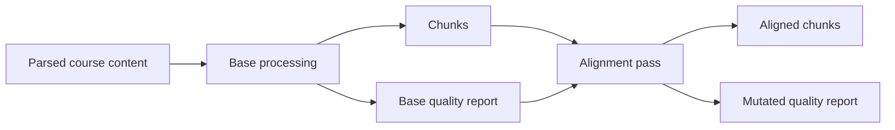

# ADR-001: Separate base and alignment passes

## Status

Proposed. The two-pass architecture is live, but the additive-only report
contract described here is not yet implemented. Consumers must follow the
current-state warning below.

## Context

Trainforge has two independently useful processing stages:

1. `Trainforge.process_course` parses content, emits chunks, and creates the
   base `quality_report.json`.
2. `Trainforge.alignment.align_chunks` enriches existing chunks with prerequisite,
   teaching-role, and learning-outcome relationships. Its standalone command
   lets contributors iterate on alignment without repeating conversion and
   chunking.

Both stages currently write the same quality report. The base stage replaces
the report. The alignment stage loads and mutates it.

The architecture preserves a cheap alignment-only rerun, but shared report
ownership creates two hazards:

- alignment appends its referential-integrity findings to
  `integrity.broken_refs`; and
- alignment replaces `overall_quality_score` with a blend of the base and
  alignment scores without recording the original score or blend components.

Repeating alignment can therefore duplicate findings or blend an already
blended score. The report does not currently expose enough provenance for a
consumer to detect either condition.

## Decision

Keep base processing and alignment as separate stages. Change the alignment
writer to be additive-only under the top-level `alignment` object:

- the base pass owns `metrics_semantic_version`, `metrics`, `methodology`,
  `integrity`, `overall_quality_score`, `validation`, and `recommendations`;
- alignment owns only `alignment`;
- alignment records `base_metrics_semantic_version` and its own
  `alignment_quality_score` inside that object; and
- alignment-specific broken references live inside `alignment` rather than the
  base `integrity` object.

Until that change lands, the current writer behavior remains authoritative.
Code and tests must not claim that the proposed ownership boundary is already
enforced.

## Rationale

The standalone alignment command is a useful public contributor surface. It
can rerun deterministic enrichment over existing chunks without paying the
cost of parsing and chunk creation. Merging the stages would require a new
resume-from-chunks interface and would broaden the refactor without solving a
user-facing need.

Disjoint field ownership retains that workflow and makes repeated alignment
idempotent at the report boundary. Explicit version and score fields also let
readers reject stale or ambiguous alignment results.

## Current and intended ownership

| Report field | Current writer behavior | Intended owner |
|---|---|---|
| `metrics_semantic_version` | Base writes version `5` | Base |
| `metrics` and `methodology` | Base writes | Base |
| `overall_quality_score` | Base writes; alignment overwrites with a weighted blend | Base |
| `integrity.broken_refs` | Base writes; alignment appends | Base |
| `integrity.orphan_week_scoped_refs` | Alignment writes | Move under `alignment` |
| `alignment` coverage and distribution fields | Alignment writes | Alignment |
| `alignment.base_metrics_semantic_version` | Not emitted | Alignment |
| `alignment.alignment_quality_score` | Not emitted | Alignment |

## Version contracts

### Chunk schema

`Trainforge.process_course.CHUNK_SCHEMA_VERSION` is the single chunk-shape
version. The current value is `v4`. It is emitted on each chunk and in the
chunkset manifest. The durable shape is documented in
[Chunk schema v4](chunk-schema-v4.md).

### Quality metrics

`Trainforge.process_course.METRICS_SEMANTIC_VERSION` is owned by the base pass.
The current value is `5`. Alignment must not bump it or write inside `metrics`.
After the decision is implemented, alignment will record the base version it
observed under `alignment.base_metrics_semantic_version`.

### Decision capture

Decision event types are defined by
`schemas/events/decision_event.schema.json`. `lib.decision_capture` loads that
closed set and fails validation on an unknown type. A new decision type must
land with its schema entry, production call site, and regression test. See
[Decision capture](decision-capture.md).

## Compatibility requirements

- Preserve `python -m Trainforge.alignment.align_chunks` as the supported standalone
  interface.
- Preserve the base report's existing fields while adding the alignment-owned
  fields.
- Make repeated alignment idempotent for report findings and scores.
- Add regression coverage proving that alignment does not alter base-owned
  fields.
- Do not silently reinterpret an older report. A missing or unsupported base
  metrics version must produce a clear failure or explicit incompatibility
  result.

## Known adjacent issue

When a source archive lacks a report, the LibV2 importer can create an
OSCQR-oriented `quality_report.json` with a different shape. That filename
collision is outside this decision and remains a separate compatibility issue.
Consumers must validate the report shape rather than relying on its filename.

## Rejected alternative

Merging alignment into the base processor would create one writer, but it would
remove the inexpensive alignment-only iteration path and require a replacement
resume interface. An additive ownership boundary achieves the required report
safety with a smaller compatibility surface.
