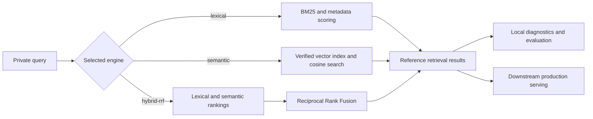

# ADR-002: LibV2 reference-retrieval scope

## Status

Accepted.

## Context

LibV2 stores validated course packages and their chunk, graph, and vector-index
artifacts. Package consumers need a reliable way to demonstrate that these
artifacts can be queried, compare retrieval configurations, and diagnose recall
or ranking problems.

That need does not make LibV2 a hosted retrieval service. Authentication,
multi-tenancy, availability, latency objectives, learner-answer composition,
and deployment-specific ranking policy have different lifecycles from the
course-package format.

The boundary must also be explicit about dense retrieval. LibV2 now ships
lexical, semantic, and hybrid Reciprocal Rank Fusion (RRF) engines. Dense
retrieval is therefore part of the reference surface; production serving is
still outside LibV2.

## Decision

LibV2 provides a local reference-retrieval library and CLI over private course
packages. It demonstrates supported package-reading patterns, exposes
diagnostic rationale, and provides a small evaluation harness. It does not
promise a production retrieval service or production service-level objective.

The public engine selector is:

- `lexical` — BM25 with structured tokenization, optional metadata-aware
  scoring, filters, and rationale;
- `semantic` — exact cosine search over the course's verified vector index;
  and
- `hybrid-rrf` — rank-domain RRF over independently ranked lexical and semantic
  result lists.

The default remains `lexical` for compatibility. Semantic and hybrid retrieval
are single-course operations and require a course identifier. Lexical scoring
presets do not apply to the semantic engine.

Every branch is labeled in text. The diagram distinguishes LibV2's result
contract from downstream serving rather than using color as the distinction.

## Reference-retrieval contract

### Common API

`LibV2.tools.libv2.retriever.retrieve_chunks` is the engine-dispatch surface.
All engines return `RetrievalResult` records. The default lexical call retains
the established result shape when rationale is not requested.

Filters are applied through the shared `ChunkFilter` contract. Lexical
retrieval may search a selected course or an eligible catalog scope. Semantic
and hybrid retrieval require an explicit course because their vector index and
manifest are course-scoped.

### Lexical engine

The lexical engine indexes chunk text or the chunk's `retrieval_text` when
present. It provides structured tokenization, BM25 ranking, character n-gram
support, metadata filters, and optional scoring contributions derived from
course metadata.

When rationale is requested, results can report lexical score components,
matched metadata, applied filters, and boost contributions. Rationale is for
inspection and debugging; it is not a guarantee that a retrieved passage
answers a learner's question.

### Semantic engine

The semantic engine embeds the query with a client compatible with the vector
index manifest, searches the verified local index, and hydrates matching chunk
records from the indexed chunkset. Its scores are cosine similarities and are
not comparable to BM25 or RRF scores.

The vector-index manifest binds the index to its embedding model and source
chunkset. A caller-supplied embedding client must match that identity.

### Hybrid-RRF engine

The hybrid engine runs semantic retrieval and lexical retrieval as separate
arms, then fuses their ranks with RRF. It does not add cosine and BM25 scores;
those values occupy different score domains. Deterministic tie-breaking keeps
the fused ordering reproducible for identical inputs.

## No silent fallback

Engine selection is an operator-visible contract. LibV2 must never make a
semantic or hybrid request appear successful by quietly returning lexical
results.

Semantic-index, chunkset, model-identity, fake-index, and embedding-backend
failures propagate as typed errors. Hybrid retrieval fails when its semantic
arm fails. An operator who wants lexical retrieval selects `lexical`
explicitly after resolving or accepting the semantic limitation.

The same rule applies to invalid combinations: an unknown engine, a semantic
request without a course identifier, or a lexical-only scoring preset supplied
to a semantic engine fails loudly.

## Diagnostics are not a production SLA

LibV2's evaluation harness supports hand-curated relevance judgments and
reports retrieval measures such as mean reciprocal rank and recall at selected
cutoffs. These results answer a local diagnostic question: whether a specific
package, query set, engine, index, and configuration retrieve the passages that
curators marked relevant.

They do not establish cross-course comparability, availability, latency,
throughput, or learner-answer quality. A downstream serving product defines and
tests its own objectives using its deployment, traffic, security model,
reranking policy, refusal behavior, and answer-composition path.

The production grounded-answer architecture is documented separately in
[Retrieval and serving](retrieval-and-serving.md).

## Private gold-query boundary

Gold queries, relevance judgments, evaluation reports, and retrieved course
text are course-derived artifacts. They remain in the private course archive
or another ignored operator-controlled location. The public repository ships
the schema, harness, and synthetic tests, not populated gold queries for a real
course.

A gold record identifies a query and the chunk identifiers that a curator
confirmed as relevant. Curators must read the candidate passages; automatically
expanding learning-objective labels is not equivalent to a human relevance
judgment. Evaluation output is meaningful only with the private query set and
configuration that produced it.

The record shape and local curation workflow are described in
[LibV2 reference retrieval](../reference/reference-retrieval.md).

## Consequences

- Package consumers have an executable example for lexical, semantic, and
  hybrid retrieval without reverse-engineering LibV2 storage.
- Dense-index creation and verification are part of LibV2's package-reading
  surface.
- Retrieval failures remain distinguishable from deliberate lexical engine
  selection.
- Diagnostic rationale and evaluation results help locate package or ranking
  defects without becoming public benchmark claims.
- Production services can evolve their API, reranking, caching, refusal,
  security, and scaling policies without changing the LibV2 package contract.
- Cross-encoder reranking may be used by a downstream answer path, but it is
  not folded into LibV2 reference retrieval.

## Rejected alternatives

### Ship a production retrieval service from LibV2

Rejected. HTTP serving, authentication, tenant isolation, rate limiting,
availability, and latency commitments would couple the package library to a
deployment product. The GUI and grounded-answer path remain downstream
consumers rather than a LibV2 service contract.

### Keep reference retrieval lexical-only

Rejected. Course-scoped vector indexes and semantic retrieval are supported
package artifacts, and hybrid RRF provides an honest way to combine lexical and
semantic rankings without combining incompatible scores.

### Fall back from semantic or hybrid to lexical

Rejected. Silent substitution hides stale or missing indexes and makes results
misrepresent the requested engine. Explicit engine selection and typed failures
are required.

### Ship no retrieval implementation

Rejected. Without an executable reference, every consumer must independently
interpret chunksets, filters, metadata, and index manifests. That weakens the
package contract and makes defects harder to localize.

### Publish populated gold-query sets

Rejected. Real queries and relevance judgments disclose course-derived
material and can reveal private identifiers or content. Only neutral shapes,
synthetic fixtures, and tooling belong in the public repository.

### Add cross-encoder reranking to the reference engine

Rejected. Reranker model selection, latency, candidate depth, and operational
failure policy belong to downstream serving. Keeping reranking separate also
preserves the reference engines as direct demonstrations of package retrieval.
