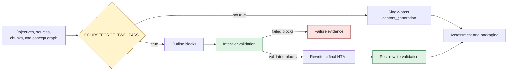

# ADR-003: Two-pass content generation with a validation seam

## Status

Accepted.

This decision applies to the `course_generation` and `textbook_to_course`
workflows in `config/workflows.yaml`.

## Context

Courseforge must decide both the structure of a course and the final HTML for
each content block. A single generation step can do both, but it offers no
persisted boundary at which structural defects can be reviewed before prose is
written. It also makes selective regeneration difficult because structure and
rendered content share one operation.

The workflow therefore needs two compatible execution shapes:

- a single-pass path for existing callers and simpler runs; and
- a two-pass path that persists an outline, validates it, and rewrites only
  validated blocks into final HTML.

## Decision

Keep the two shapes mutually exclusive through `COURSEFORGE_TWO_PASS`.

- `COURSEFORGE_TWO_PASS=true` disables `content_generation` and enables
  `content_generation_outline`, `inter_tier_validation`,
  `content_generation_rewrite`, and `post_rewrite_validation`.
- Any other value, including unset, enables `content_generation` and disables
  the four two-pass phases.

The workflow declarations use exact inverse predicates:
`COURSEFORGE_TWO_PASS=true` and `COURSEFORGE_TWO_PASS!=true`. The phase graph,
resume state, timeouts, and validation results therefore remain visible to the
orchestrator instead of being hidden behind a branch inside one handler.

## Execution shapes

### Single pass

`content_generation` combines block planning and HTML authoring. Downstream
assessment and packaging phases use their normal `depends_on` lists. This is
the compatibility path and remains the default when the flag is unset.

### Two pass

| Phase | Input and responsibility | Persisted output |
|---|---|---|
| `content_generation_outline` | Plans typed blocks, objective bindings, and source citations without final prose HTML. | `blocks_outline.jsonl` plus outline evidence used by later phases. |
| `inter_tier_validation` | Runs validators that can evaluate the outline shape and partitions the result. It performs no content-generation dispatch. | `blocks_validated.jsonl` and `blocks_failed.jsonl`. |
| `content_generation_rewrite` | Consumes validated blocks and authors final HTML while preserving block identity and provenance. | `blocks_final.jsonl`, rendered pages, and synthesis evidence. |
| `post_rewrite_validation` | Validates the final block and page surfaces, including checks that require rendered prose. It performs no content-generation dispatch. | Validation results and validated/failed block evidence. |

The rewrite phase consumes `blocks_validated.jsonl`, never the failed outline
partition. A blocking gate failure remains visible and stops downstream work
according to the workflow gate configuration; it is not converted into a
template, silently repaired, or treated as success.

## Flow diagram



Assessment ordering differs slightly by workflow while preserving the same
content contract:

- In `course_generation`, two-pass assessment waits for
  `post_rewrite_validation`.
- In `textbook_to_course`, assessment waits for rewrite completion and the
  chunk source, then `post_rewrite_validation` waits for assessment. Packaging
  still waits for both assessment and post-rewrite validation.

## Conditional dependency replacement

Some downstream phases depend on different predecessors in the two shapes.
They declare:

- `depends_on`: the single-pass dependency list;
- `depends_on_when_env`: the activation predicate; and
- `depends_on_when_env_value`: the complete two-pass dependency list.

When the predicate matches, `WorkflowRunner._effective_depends_on` **replaces**
the normal list with `depends_on_when_env_value`. It does not merge the lists.
The same resolved list drives topological sorting and dependency checks.

This replacement rule is intentional. A dependency needed in both modes must
appear in both complete lists. Packaging, for example, replaces its
single-pass content dependency with `post_rewrite_validation` while retaining
the assessment dependency in the alternate list.

## Persisted artifacts and compatibility

Two-pass mode creates three generations of block data:

```text
blocks_outline.jsonl
        │
        ▼
blocks_validated.jsonl ──► blocks_final.jsonl
        │
        └───────────────► blocks_failed.jsonl
```

These files have distinct purposes and must not be substituted for one
another. Persisting them makes validation evidence reviewable and gives the
rewrite phase a stable input for resume and selective reruns.

Some downstream `inputs_from` references retain the established
`content_generation` output surface. When that phase is skipped in two-pass
mode, the runner pre-populates compatible project and content outputs so those
references continue to resolve. Stage-specific runs similarly reconstruct
required upstream phase outputs from an existing export. This is a
compatibility contract, not a fallback content generator; missing required
artifacts still fail the selected stage.

## Selective reruns

The public stage commands expose the persisted seam:

```bash
ed4all run courseforge-outline --course-name <course-name>
ed4all run courseforge-validate --course-name <course-name>
ed4all run courseforge-rewrite --course-name <course-name>
ed4all run courseforge --course-name <course-name>
```

The runner activates only the relevant two-pass phases and reconstructs their
required inputs from disk. Rewrite cache reuse is failure-driven by default.
Operators can additively evict cached work by block type (`--blocks`), exact
block identity (`--block-ids`), or page/module identity (`--pages`). `--force`
requests fresh stage execution and clears the rewrite crash-resume sidecar for
that run; it does not weaken validation.

The public [Courseforge getting-started guide](../../Courseforge/docs/guides/getting-started.md#resume-or-inspect-a-run)
shows stage reruns; `ed4all run --help` is authoritative for the current filter
options. Stop and resume behavior is documented in the
[`pipeline invocation guide`](../operations/pipeline-invocation.md#7-graceful-stop-resume-and-checkpoints).

## Failure behavior

- Environment predicates are evaluated before phase dispatch and skipped
  phases are recorded as skipped.
- Validator-only phases route by phase name and run without an agent list.
- Critical blocking gates prevent dependent phases from running. Warning gates
  remain visible without being promoted or suppressed by this ADR.
- Missing stage inputs, unmet effective dependencies, invalid block artifacts,
  and handler failures remain loud.
- Stop requests finish and checkpoint in-flight units according to the shared
  pipeline stop/resume contract.

The phase-name routing mechanism is specified separately in
[`ADR-004`](ADR-004-phase-name-dispatch.md).

## Consequences

Benefits:

- structural validation can reject invalid outlines before final HTML exists;
- outline, validation, and rewrite evidence remain independently inspectable;
- block-level cache reuse and selective reruns become possible;
- the orchestrator can resume and report each tier independently; and
- final-prose checks remain downstream of rewrite and upstream of packaging.

Costs:

- two-pass runs maintain more artifacts and a longer phase graph;
- dependency edits must preserve replace-not-extend semantics; and
- compatibility pre-population is required while downstream consumers retain
  established output references.

## Rejected alternatives

### Repair only after single-pass generation

Rejected because it provides no pre-prose validation boundary and no stable
outline artifact for selective reruns.

### Remove the single-pass path

Rejected because existing callers depend on the unset/default behavior and the
single-pass artifact surface.

### Hide both tiers inside one phase handler

Rejected because the orchestrator would lose independent dependency,
checkpoint, timeout, validation, and stage-rerun visibility.
