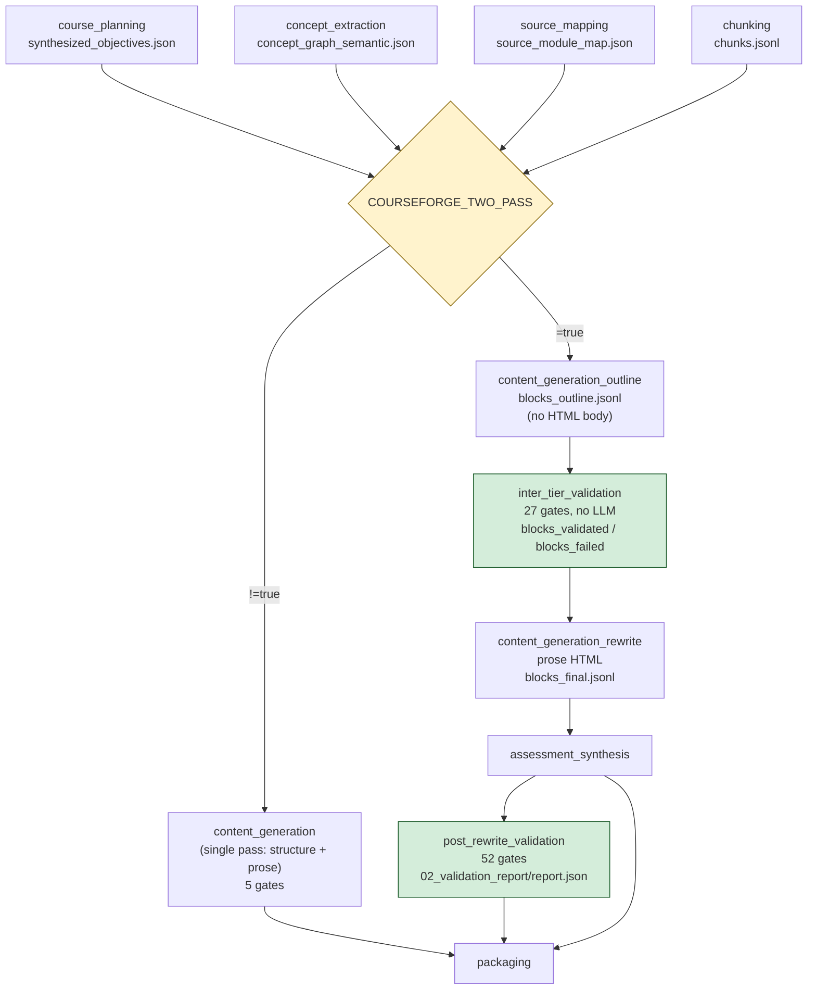

# ADR-003 — Two-pass content generation with a validation seam

## Status

**Accepted — recorded retroactively (2026-07-20).**

The decision was implemented before it was written down; this ADR records it against the shipped code rather
than proposing it. Supersedes nothing. Not superseded.

Scope: the `textbook_to_course` and `course_generation` workflows in `config/workflows.yaml`.

## Context

Course content is authored by an LLM from three upstream artifacts: synthesized learning objectives, a
concept graph, and a retrieval chunkset. The original phase graph did this in one phase,
`content_generation`, which asked a single generation call to decide *what* block belongs on a page and to
write the prose HTML *body* of that block at the same time.

Two properties of that shape caused problems:

1. **Validation could only run after the expensive step.** Structural defects — a block citing a source that
   does not resolve, a missing CURIE anchor, a block type that does not match its declared content type —
   are cheap to detect and are visible in the block's *structure*. But there was nowhere to detect them
   except after prose had already been generated for every block, which is the single most expensive
   operation in the pipeline.
2. **There was no persisted intermediate to re-roll from.** Single-pass emits page HTML directly; it has no
   block-level artifact between "decide the structure" and "write the prose", so there is nothing for a
   targeted re-run to consume or reuse.

Prose generation dominates run cost. On a completed 21-phase production run of a ten-module corpus, the two
generation phases accounted for roughly 3 h of a ~7 h phase-sum total; the two validation phases accounted
for a further ~1 h 51 m, essentially all of it in the post-prose pass.

## Decision

**Split content generation into two tiers separated by a validation seam, and keep the single-pass path
alive behind a mutually exclusive env predicate.**

Under `COURSEFORGE_TWO_PASS=true` the phase graph runs four phases in place of one:

| Phase | Role | Emits |
|---|---|---|
| `content_generation_outline` | Outline tier. Emits `Block` records — type, slug, objective binding, source citations — with **no HTML body**. | `blocks_outline.jsonl` |
| `inter_tier_validation` | Structural validators over the bodiless outline. No LLM dispatch. | `blocks_validated.jsonl`, `blocks_failed.jsonl` |
| `content_generation_rewrite` | Rewrite tier. Consumes validated outlines and generates the prose HTML body. | `blocks_final.jsonl`, page HTML |
| `post_rewrite_validation` | Re-runs the structural validators against the prose-bearing blocks, plus the entailment/grounding family that needs prose to exist. | `02_validation_report/report.json` |

The single-pass `content_generation` phase is retained and declares
`enabled_when_env: "COURSEFORGE_TWO_PASS!=true"`; the four two-pass phases declare
`enabled_when_env: "COURSEFORGE_TWO_PASS=true"`. The predicates are negations of each other, so **exactly one
of the two paths runs** — never both, never neither.

Downstream phases whose dependencies differ between the two shapes rewire declaratively rather than
branching in code: `depends_on_when_env: "COURSEFORGE_TWO_PASS=true"` paired with
`depends_on_when_env_value: [...]`, which **replaces** (not extends) `depends_on` when the predicate holds.
Three phases use it — `assessment_synthesis`, `post_rewrite_validation`, and `packaging`.

## Rationale

1. **The seam is nearly free and the pass it guards is not.** On the observed run, `inter_tier_validation`
   ran 27 gates in 13.3 s, because a bodiless outline has no prose to entail. `post_rewrite_validation` ran
   52 gates in 1 h 51 m against the same block population. Any defect caught at the cheap seam is a defect
   that never costs a prose generation.
2. **Blocks become individually addressable.** Because the rewrite tier consumes a persisted
   `blocks_validated.jsonl` and writes a persisted `blocks_final.jsonl`, it can reuse a prior block
   byte-identically and re-roll only the ones that failed. This is the default behavior (failure-driven
   reuse), with three additive operator eviction scopes layered on top: by block *type* (`--blocks`), by
   exact block *instance id* (`--block-ids`), and by *page or module* (`--pages`).
3. **Validation configuration concentrates at the seams.** The generation phases carry almost no gates of
   their own — the outline tier declares none and the rewrite tier declares one — while the two validator
   phases carry 79 of the workflow's 136 declared gate entries. Adding a structural check means editing a
   validator phase, not a generation phase.
4. **Keeping single-pass costs one YAML predicate.** The negated `enabled_when_env` pair is the entire
   mechanism. There is no runtime branch in the executor and no duplicated generation code path.

## Rejected alternatives

- **Generate prose, then repair in place.** Rejected: a repair pass over prose still pays the full
  generation cost first, and repairing HTML in place is strictly harder than regenerating a block from a
  validated outline.
- **Delete single-pass once two-pass worked.** Rejected: the negated-predicate pair costs nothing to keep,
  and the single-pass path remains the only shape that does not require an outline-tier seat. Deleting it
  would make the two-pass tiers load-bearing for every corpus, including ones small enough not to need them.
- **Branch on the flag inside the content-generation handler.** Rejected: it would hide a phase-graph
  difference inside one tool, so `--resume`, checkpointing, and per-phase timeouts could no longer see the
  tiers as distinct units of work.

## Consequences

### Accepted costs

- **Two LLM tiers instead of one.** Outline generation is real work that single-pass did not pay for
  separately (1 h 43 m on the observed run, against 1 h 16 m for rewrite).
- **A skipped phase must still satisfy its readers.** `content_generation` is referenced by downstream
  `inputs_from` declarations. When it is skipped under two-pass, the runner does not leave a bare skip
  marker: it merges pre-populated `project_id` / `content_dir` / `content_paths` / `page_paths` into the
  skipped phase's outputs so those references resolve. **Removing that pre-population breaks the two-pass
  path, not the single-pass path** — an inversion that is easy to get wrong when reading the code.
- **Two artifact generations of "the blocks" exist on disk** (`blocks_outline.jsonl` →
  `blocks_validated.jsonl` → `blocks_final.jsonl`). Anyone diagnosing content must know which generation
  they are reading.

### Capabilities this enabled

- **Per-tier operator subcommands.** `ed4all run courseforge-outline` / `courseforge-validate` /
  `courseforge-rewrite` / `courseforge` re-run one tier against an existing export. These work because the
  tiers are separate phases with persisted inputs and outputs. The whitelist that scopes them lives in
  `WorkflowRunner._COURSEFORGE_STAGE_ACTIVE_PHASES`, resolved by
  `_resolve_courseforge_stage_active_phases`; phases outside the four-phase Courseforge surface are skipped,
  with pre-Courseforge phases pre-populated from disk by `_synthesize_outline_output`.
- **A place to put a validator that needs structure but not prose.** The 27-gate inter-tier suite exists
  only because there is a point in the graph where structure is final and prose has not been paid for.

### Hazards

- **The predicates must stay exact negations.** If `content_generation`'s predicate and the four tier
  predicates ever disagree, the failure mode is silent: either no content phase runs at all, or both do.
  There is no assertion in code that the two sets partition. `_should_skip_phase` logs each env-predicate
  skip with the resolved variable value, which is the only signal an operator gets.
- **`depends_on_when_env_value` replaces rather than extends.** A phase that needs a dependency in *both*
  shapes must list it in `depends_on` **and** in `depends_on_when_env_value`. Omitting it from the latter
  silently drops the dependency under two-pass.

## Diagram

The diagram depicts `textbook_to_course`, where `assessment_synthesis` sits between the rewrite tier and
`post_rewrite_validation` so the post-rewrite gates observe the emitted assessments. `course_generation`
declares the same four tiers with the same predicates but orders `assessment_synthesis` *after*
`post_rewrite_validation`; the tier split itself is identical.

Note the `depends_on` edges into `packaging`: under two-pass it depends on `post_rewrite_validation` and
`assessment_synthesis` via `depends_on_when_env_value`; under single-pass it depends on `content_generation`
and `assessment_synthesis` via plain `depends_on`. Gate counts on the diagram are the
`textbook_to_course` declarations.

## Relationship to other ADRs

The tier split is the reason `MCP/core/executor.py::_PHASE_TOOL_MAPPING` exists — the two generation tiers
share one agent name (`content-generator`) and must reach different handlers, and the two validator tiers
declare no agent at all. That dispatch mechanism is recorded separately in **ADR-004**, because it also
covers three phases unrelated to two-pass generation.

## Open questions / known issues not addressed

- `FOLLOWUP-ADR003-1` — Nothing asserts that `content_generation`'s `enabled_when_env` and the tier phases'
  predicates partition the space. A meta-schema check in `schemas/config/workflows_meta.schema.json`, or a
  load-time assertion in the runner, would turn a silent misconfiguration into a loud one.
- `FOLLOWUP-ADR003-2` — The pre-population of a skipped `content_generation`'s outputs is load-bearing for
  the two-pass path but reads like defensive padding. It is not covered by a test that fails if the
  pre-population is removed *and* a downstream `inputs_from` reference still points at
  `content_generation`.
- `FOLLOWUP-ADR003-3` — `depends_on_when_env_value`'s replace-not-extend semantics are documented only in a
  YAML comment and in the runner's docstring. A reader editing `depends_on` on a two-pass-aware phase has no
  mechanical warning that they also need to edit the `_value` list.

## Decision log (append-only)

| Date | What |
|---|---|
| 2026-07-20 | Decision recorded retroactively against the shipped implementation. No code change. |
