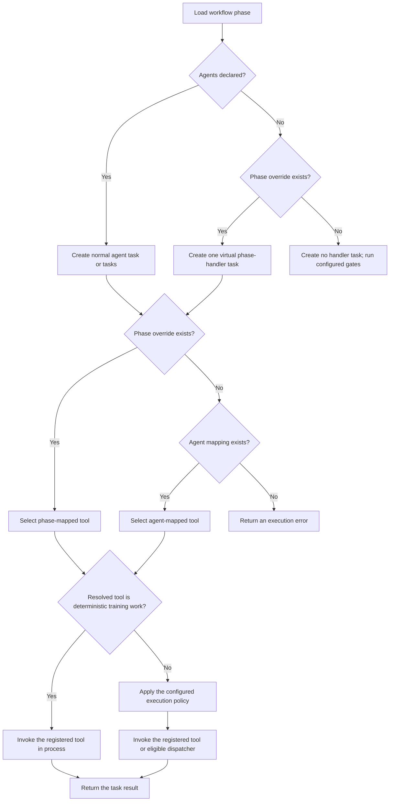

# ADR-004: Phase-name dispatch overrides

## Status

Accepted.

## Context

Most workflow tasks can be routed by agent role: a phase declares an agent in
`config/workflows.yaml`, and `AGENT_TOOL_MAPPING` selects the corresponding
pipeline tool. That model is not sufficient when:

- one agent role performs different operations in different phases; or
- a deterministic phase needs a handler but does not need an agent.

The workflow phase is already the unit used for dependencies, checkpoints,
validation gates, and resume behavior. It is therefore the most precise key for
these exceptions.

## Decision

`TaskExecutor` resolves a task's tool in this order:

1. Look up the phase name in `_PHASE_TOOL_MAPPING`.
2. If the phase is not mapped, look up the agent role in
   `AGENT_TOOL_MAPPING`.
3. If neither lookup succeeds, return an execution error.

A phase mapping always takes precedence, even when the task also names a real
agent. Both maps contain tool-name strings. The executor resolves those strings
against the internal registry built by
`MCP/tools/pipeline_tools.py::_build_tool_registry`.

The phase overrides are:

| Workflow phase | Internal tool |
|---|---|
| `content_generation_outline` | `run_content_generation_outline` |
| `inter_tier_validation` | `run_inter_tier_validation` |
| `content_generation_rewrite` | `run_content_generation_rewrite` |
| `post_rewrite_validation` | `run_post_rewrite_validation` |
| `imscc_chunking` | `run_imscc_chunking` |
| `assessment_synthesis` | `run_assessment_synthesis` |
| `heading_judge` | `run_heading_judge` |
| `training` | `run_training` |
| `evaluation` | `run_evaluation` |

These tools are pipeline-internal. Registration in `_build_tool_registry` makes
them available to workflow execution; it does not expose them as public MCP
tools.

### Phases without agents

`WorkflowRunner._create_phase_tasks` applies a separate task-creation rule:

- a phase with declared agents creates its normal agent tasks;
- a phase with `agents: []` and a phase-name mapping creates one virtual task
  with `agent_type="phase-handler"`; and
- a phase with `agents: []` and no phase-name mapping creates no handler task.

The final case is valid for a gate-only phase. Its validation gates run at the
end of the phase without an executable handler. A phase that needs to produce
or transform an artifact must not rely on that shape.

The virtual `phase-handler` role is only a task placeholder. It is not an agent
registry entry, and the executor never uses it as the tool-selection key because
the phase-name mapping wins first.

### Deterministic training tools

`run_training` and `run_evaluation` must execute in process. They perform
deterministic training and evaluation work that a language-model worker cannot
substitute for. The executor therefore checks the resolved tool name against
`_DETERMINISTIC_TRAINING_TOOLS` before considering subagent dispatch.

Keying this rule on the resolved tool name is important: it protects the
operation even if the workflow task carries an agent role that would normally
be eligible for subagent dispatch.

## Dispatch model

The diagram separates task creation from tool selection. A mapped phase with
declared agents still creates normal agent tasks, but each task resolves to the
phase-specific tool.

## Failure behavior

Routing failures must be visible:

- no phase or agent mapping returns an `ERROR` result;
- a mapped tool absent from the internal registry raises `ValueError`;
- parameter-mapping errors propagate instead of selecting another tool; and
- a deterministic training tool is not allowed to fall through to a subagent.

Removing a mapping from an agent-less handler phase changes it into a phase
with no executable task. That shape can be correct for gate-only validation,
so the runner cannot reject it generically. Workflow-specific tests must prove
that artifact-producing phases remain mapped and reachable.

## Adding or changing an override

Treat the workflow declaration, dispatch mapping, tool registry, and tests as
one change:

1. Confirm that the operation is phase-specific. Use ordinary agent routing
   when the agent always performs the same operation.
2. Implement the async handler and register its exact tool key in
   `_build_tool_registry`.
3. Add or update the phase-to-tool entry in `_PHASE_TOOL_MAPPING`.
4. Declare `agents: []` only when the phase genuinely has no agent. Leave an
   intentional gate-only phase unmapped.
5. Add the resolved tool to an in-process guard only when execution cannot be
   delegated safely. Cover that exception with a dispatch test.
6. Wire the phase's inputs, outputs, dependencies, and validation gates in
   `config/workflows.yaml`.
7. Test mapping precedence, virtual-task creation where applicable, registry
   reachability, parameter routing, and fail-loud behavior.
8. Update the canonical routing documentation in `AGENTS.md` and `CLAUDE.md` if
   the public contract changes.

## Consequences

- Agent names remain capability labels instead of multiplying for each call
  site.
- Deterministic phases can accurately declare that they use no agent.
- Phase-specific behavior is explicit and testable.
- Understanding a task's destination requires reading both dispatch maps, with
  the phase map taking precedence.
- A mapped tool must remain synchronized with its registry entry and workflow
  contract.

## Rejected alternatives

### Create a new agent name for every phase

This would encode routing differences as artificial capabilities and require
duplicate agent-registry entries.

### Infer a handler from gates or output names

Inference would make dispatch sensitive to unrelated configuration and would
make missing routes difficult to diagnose.

### Route by phase-and-agent pairs

No current override needs different tools for different agents within the same
phase. Pair-based routing would add complexity without changing the supported
behavior.

### Put tool names directly in workflow YAML

This could make routing more visible, but it would change the workflow schema
and configuration contract. The explicit mapping keeps that migration separate
from the current decision.
