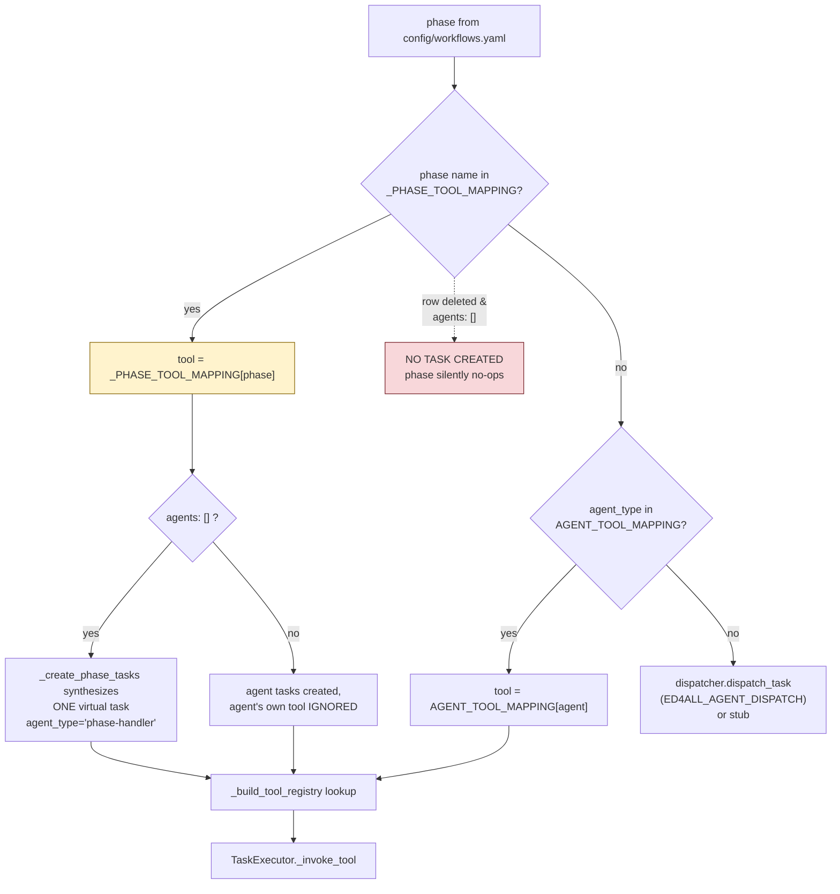

# ADR-004 — Phase name, not agent name, is the dispatch key

## Status

**Accepted — recorded retroactively (2026-07-20).**

The decision was implemented before it was written down; this ADR records it against the shipped code rather
than proposing it. Supersedes nothing. Not superseded.

## Context

The orchestrator's original dispatch model was **agent-keyed**: a phase in `config/workflows.yaml` declares
an `agents:` list, and `MCP/core/executor.py::AGENT_TOOL_MAPPING` maps each agent name to the tool that
implements it. One agent, one tool, everywhere that agent appears.

That model has no answer for two shapes the pipeline grew:

1. **Two phases that share an agent but need different handlers.** The two content-generation tiers
   (ADR-003) both belong to the `content-generator` agent, but the outline tier and the rewrite tier are
   different code. Likewise, the same chunker agent (`semantik-chunker`) runs at two points in the graph:
   once over staged HTML, once over the packaged IMSCC. The two emit different chunkset kinds
   (`chunkset_kind="semantik"` with `source_semantik_html_sha256`, versus `chunkset_kind="imscc"` with
   `source_imscc_sha256`) into different directories. Under agent-keyed dispatch there is exactly one
   destination per agent, so one of the two is always wrong.
2. **Phases with no agent at all.** Validator-only phases run a gate chain and a deterministic handler; there
   is no LLM worker to name. Declaring a fictitious agent purely to satisfy the router would put a lie in
   the config.

The alternative available at the time — forking the agent registry so each call site gets its own agent name
(`semantik-chunker-imscc`, `content-generator-outline`, …) — pushes a routing concern into the vocabulary
the workflow config uses to describe *who does the work*.

## Decision

**Resolve the handler by phase name first, and fall back to agent name.** `_PHASE_TOOL_MAPPING` in
`MCP/core/executor.py` is consulted before `AGENT_TOOL_MAPPING`; a phase present in it reaches its named
tool regardless of what its `agents:` list says.

```
_PHASE_TOOL_MAPPING.get(phase_name)          # checked FIRST
  └─ miss → AGENT_TOOL_MAPPING.get(agent_type)
        └─ miss → dispatcher.dispatch_task (ED4ALL_AGENT_DISPATCH)
                  or a stub (LOCAL_DISPATCHER_ALLOW_STUB)
```

Both mappings resolve to string keys in the registry built by
`MCP/tools/pipeline_tools.py::_build_tool_registry`.

**Corollary decision:** a phase may declare `agents: []`. For such a phase,
`WorkflowRunner._create_phase_tasks` synthesizes a single virtual task with `agent_type="phase-handler"` —
but **only if the phase name appears in `_PHASE_TOOL_MAPPING`** (`workflow_runner.py:4927`). The mapping is
therefore both the route and the existence condition for the task.

Seven phases are routed this way today:

| Phase | Tool | `agents:` in YAML | Why the override exists |
|---|---|---|---|
| `heading_judge` | `run_heading_judge` | `[]` | Validator-only phase; mapping is the **only** route |
| `content_generation_outline` | `run_content_generation_outline` | `["content-generator"]` | Shared agent, tier-specific handler (ADR-003) |
| `inter_tier_validation` | `run_inter_tier_validation` | `[]` | Validator-only phase; **only** route |
| `content_generation_rewrite` | `run_content_generation_rewrite` | `["content-generator"]` | Shared agent, tier-specific handler (ADR-003) |
| `assessment_synthesis` | `run_assessment_synthesis` | `[]` | Validator-only phase; **only** route |
| `post_rewrite_validation` | `run_post_rewrite_validation` | `[]` | Validator-only phase; **only** route |
| `imscc_chunking` | `run_imscc_chunking` | `["semantik-chunker"]` | Same agent, different chunkset kind and output dir |

## Rationale

1. **The phase is the unit of work; the agent is a role label.** Checkpoints, timeouts, `--resume`, gate
   chains, seat schedules, and `inputs_from` are all keyed on the phase. Making dispatch phase-keyed aligns
   routing with every other axis of the orchestrator.
2. **It keeps the agent vocabulary honest.** `semantik-chunker` genuinely is one content-agnostic,
   deterministic chunker used at two points. Splitting it into two agent names to satisfy a lookup table
   would encode a routing detail as a claim about the system's capabilities.
3. **It is additive and reversible per phase.** Adding a row overrides one phase; the other twelve phases
   continue to resolve through `AGENT_TOOL_MAPPING` unchanged. There is no global migration.
4. **`agents: []` becomes expressible.** A validator-only phase can say what is true — that no agent is
   involved — and still run.

## Rejected alternatives

- **Fork the agent registry per call site.** Rejected: pollutes the agent vocabulary with routing artifacts,
  and every fork has to be mirrored into `config/agents.yaml`, workflow YAML, and any doc that enumerates
  agents.
- **Put the tool name directly on the phase in YAML.** This is arguably the cleanest design and was not
  taken. The cost of taking it now is a schema change to `workflows_meta.schema.json` plus a migration of
  every phase; see `FOLLOWUP-ADR004-2`.
- **Dispatch on `(phase, agent)` tuples.** Rejected: more expressive than the problem requires. No phase
  needs to route two different agents to two different tools.

## Consequences

### The dispatch table is load-bearing and looks like configuration

This is the sharpest consequence and it is worth stating bluntly:

- **For the four `agents: []` phases, deleting the `_PHASE_TOOL_MAPPING` row does not fall back to
  anything.** No agent references them, so `AGENT_TOOL_MAPPING` has no entry, and `_create_phase_tasks`
  creates *no task at all*. The phase does not error — it produces nothing and the workflow continues to the
  next phase. A defect introduced this way surfaces far downstream as missing artifacts.
- **For `imscc_chunking`, deleting the row is worse than a no-op: it silently does the wrong thing.** The
  agent falls back to the staged-HTML chunking tool, which emits the staged-HTML chunkset kind into the
  staged-HTML directory. The phase reports success. The `chunkset_drift` gate that compares the two chunksets then
  compares a chunkset against itself.

There is no test that fails on removal of a `_PHASE_TOOL_MAPPING` row (`FOLLOWUP-ADR004-1`).

### Two mappings must be read together

Neither table alone answers "what runs for this phase". `AGENT_TOOL_MAPPING` also carries live read-compat
aliases that exist only to keep older persisted state resumable — legacy agent names from before the
SemantiK rename that point at the current staged-HTML chunking tool and at `extract_and_convert_pdf`. They
are reached by string comparison from a resumed workflow's state file, never by an import, so static
analysis reads them as dead.

### Registry-only tools are invisible to external MCP clients

The tools reached through these mappings are registered in `_build_tool_registry` but deliberately not
decorated with `@mcp.tool()`. They are pipeline-internal: `run_heading_judge`,
`run_content_generation_outline`, `run_content_generation_rewrite`, `run_inter_tier_validation`,
`run_post_rewrite_validation`, `run_assessment_synthesis`, `run_imscc_chunking`, the staged-HTML chunking
tool, `run_concept_extraction`, `run_vector_indexing`, `build_source_module_map`, `extract_textbook_structure`,
`plan_course_structure`. An external MCP client cannot invoke them, and grepping for `@mcp.tool` will not
find them.

### Task ids record which route was taken

The synthesized task id embeds the routing decision, which makes it a reliable diagnostic:
`T-<phase>-phase-handler-<HHMMSS>` means the phase-name route with no agent;
`T-<phase>-<agent-name>-<HHMMSS>` means the agent route. On a completed production run, exactly the four
`agents: []` phases carried `phase-handler` ids.

## Diagram



## Open questions / known issues not addressed

- `FOLLOWUP-ADR004-1` — No regression test pins the seven `_PHASE_TOOL_MAPPING` rows. The minimum viable
  guard is a test asserting that every phase declaring `agents: []` in `config/workflows.yaml` has a
  `_PHASE_TOOL_MAPPING` entry, which converts the silent-no-op failure mode into a test failure.
- `FOLLOWUP-ADR004-2` — The rejected "tool name on the phase in YAML" alternative would make the routing
  visible in the same file as the phase. If `workflows_meta.schema.json` ever gains a `handler:` field,
  `_PHASE_TOOL_MAPPING` becomes a migration target rather than a permanent fixture.
- `FOLLOWUP-ADR004-3` — `AGENT_TOOL_MAPPING`'s read-compat aliases have no recorded retirement condition.
  They can be removed once no resumable persisted workflow state references the old agent names, but nothing
  measures that.

## Decision log (append-only)

| Date | What |
|---|---|
| 2026-07-20 | Decision recorded retroactively against the shipped implementation. No code change. |
