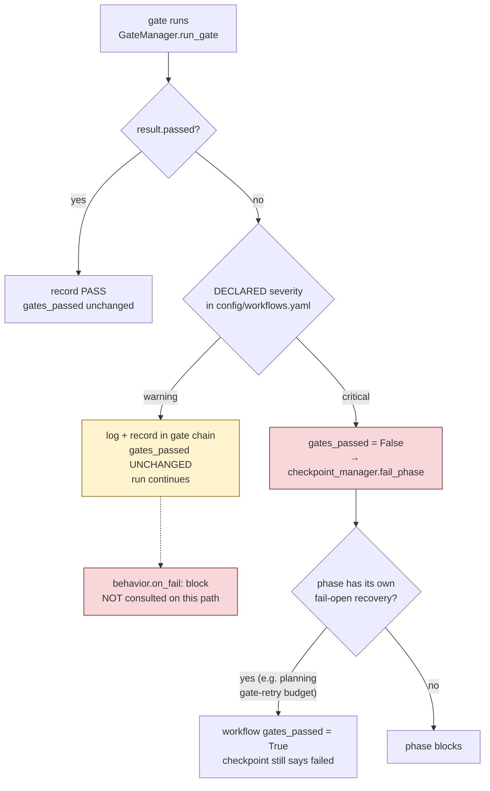

# ADR-005 — Declared gate severity is the only blocking signal

## Status

**Accepted — recorded retroactively (2026-07-20).**

The decision was implemented before it was written down; this ADR records it against the shipped code rather
than proposing it. Supersedes nothing. Not superseded.

## Context

The `textbook_to_course` workflow declares 136 validation-gate entries across its phases — 64 `critical` and
72 `warning`. Each entry can also declare a `behavior` block:

The real declaration below is verbatim from `config/workflows.yaml`
(`textbook_to_course` → `content_generation_rewrite`), and it is the one entry in the workflow that combines
`severity: warning` with `on_fail: block`:

```yaml
- gate_id: content_grounding
  validator: lib.validators.content_grounding.ContentGroundingValidator
  severity: warning
  threshold:
    max_critical_issues: 0
  behavior:
    on_fail: block
    on_error: fail_closed
```

The config surface therefore appears to offer **two** independent controls over what a failure does:
`severity` and `behavior.on_fail`. In practice this ambiguity produced a real diagnostic failure: a phase
whose only failing gates were `severity: warning` was investigated as if it had blocked the workflow. The
regression suite written afterwards (`MCP/tests/test_executor_gate_severity_warning_nonblocking.py`) names
the confusion directly — without a severity stamped on each persisted result, a checkpoint cannot
distinguish a blocking failure from an advisory one, and an all-warning failure set gets misfiled as a
harness anomaly.

A second source of ambiguity is the persisted record itself. `GateResult` carries no `severity` field, so
the executor stamps the declared severity onto each result before writing the checkpoint — but only when the
validator left it unset. A validator that populates its own severity keeps it, so the checkpoint can show a
severity that differs from the one the config declared.

## Decision

**A phase's `gates_passed` is cleared by exactly one condition: a failing gate whose *declared* severity is
`GateSeverity.CRITICAL`.** Nothing else blocks. `config/workflows.yaml` is authoritative for blocking
behavior; the persisted checkpoint is not.

The rule lives in a single place — the executor's gate loop:

```python
if not result.passed:
    if gate.severity == GateSeverity.CRITICAL:
        gates_passed = False
```

Three corollaries follow, and all three are load-bearing:

1. **`behavior.on_fail` does not gate the workflow.** It is read into `GateConfig.behavior_on_fail`, and it
   is consulted in exactly one place: `GateManager.run_gates`, where `on_fail: block` causes an early
   `break` out of the gate loop — and only for gates that are *already* `CRITICAL`. `run_gates` has **no
   non-test caller**. The executor iterates gates itself and calls `run_gate` per gate, so on the production
   phase path `behavior.on_fail` is never consulted at all.
2. **Severity is per-declaration, not per-gate-id.** The same `gate_id` may carry different severities in
   different phases. `content_grounding` is `critical` on the single-pass `content_generation` phase and
   `warning` on `content_generation_rewrite`. There is no global severity for a gate.
3. **A failing warning gate is loud but non-blocking.** It is logged, it lands in the persisted gate chain
   with its score and issues, and it is surfaced by the post-loop aggregators. It does not stop the run and
   does not mark the phase failed.

## Rationale

1. **One blocking signal is diagnosable; two are not.** With `severity` and `behavior.on_fail` both nominally
   live, answering "why did this phase block?" requires holding two tables in your head and knowing which
   code path read which. Collapsing to `severity` makes the question a single lookup in one file.
2. **The severity axis is the one that carries meaning.** `severity` states what a failure *means* — is this
   output unfit to ship, or is it a quality signal? `on_fail` states what the machinery should *do*, which
   is a policy that should be derivable from the meaning rather than set independently.
3. **Warning gates are the calibration surface.** Severity is the flag that expresses "collect this, do not
   enforce it yet" — a check whose threshold is not yet trusted on arbitrary corpora needs to run, record,
   and be reviewable without being able to halt a multi-hour build. That the project treats severity this
   way is visible in `lib/governance/calibration_gate.py::resolve_severity_flip`, which exists specifically
   to promote a gate's severity once its threshold earns enforcement.
4. **Fail-open on a long pipeline must be deliberate, not emergent.** A build that fails at hour six because
   an uncalibrated advisory check tripped is worse than one that completes and reports the trip, provided
   the report is honest. The decision is defensible *only* because failing warning gates are fully recorded.

## Rejected alternatives

- **Make `behavior.on_fail: block` genuinely blocking regardless of severity.** Rejected: it creates a second
  independent blocking axis, which is the confusion this decision exists to remove. It would also
  retroactively make at least one currently-advisory gate blocking.
- **Delete `behavior` from the schema.** Attractive, and not taken, because `behavior.on_error` *is* live and
  meaningful — it distinguishes "a validator crashed, treat as pass" from "a validator crashed, fail closed"
  (`MCP/hardening/validation_gates.py`), and `ED4ALL_VALIDATOR_FAIL_CLOSED_ON_OOM` interacts with it.
  Removing `on_fail` alone while keeping `on_error` is the narrower fix; see `FOLLOWUP-ADR005-1`.
- **Treat any gate failure as blocking.** Rejected: it makes every threshold in the suite a production
  blocker on the day it lands, which is the reason warning severity was introduced.

## Consequences

### `behavior.on_fail: block` is inert and misleading

The config reads as if it means something. On the phase path it does not. Exactly **one** gate entry in
`textbook_to_course` declares the misleading combination `severity: warning` with `on_fail: block`:
`content_grounding` on `content_generation_rewrite`. On a completed production run that gate failed with a
score of 0.9408, and the phase completed with `gates_passed` intact — the correct behavior under this ADR,
and the opposite of what its own config line suggests.

> **Correction to a prior reading.** An earlier analysis cited `wcag_compliance` (packaging) and
> `chunkset_drift` (libv2_archival) as further examples of warning-plus-block. They are not: both declare
> `on_fail: warn`. They are ordinary non-blocking warning gates that failed. The general rule those examples
> were used to illustrate is still correct; only the example set was wrong.

### The persisted checkpoint can disagree with the config

The executor stamps the declared severity onto a result dict **only when the result left it `None`**. A
validator that sets its own severity keeps it. The observed instance: `block_prose_entailment` is declared
`warning` in `config/workflows.yaml` and persists as `"critical"` in the checkpoint. Anyone auditing a run
from checkpoints alone will misread its blocking status.

**Reading rule:** to determine whether a gate could have blocked, read `config/workflows.yaml`. To determine
what a gate *found*, read the checkpoint.

### A critical failure marks the checkpoint failed even when the run continues

`execute_phase` calls `checkpoint_manager.fail_phase` as soon as `gates_passed` is false. Separately, some
phases have their own fail-open recovery — `course_planning` has a bounded gate-retry budget
(`ED4ALL_PLANNING_GATE_RETRIES`) that, on exhaustion, returns `gates_passed = True` at the workflow level
without re-stamping the already-written checkpoint. The result is a phase whose checkpoint says `failed`
while the workflow state says the gates passed and the run proceeds. This is a real, reachable shape, not
corruption.

### There is no phase-level waiver feature

`GateManager` supports waivers at the *gate* level (`GateResult.waiver_info`, `add_waiver`). There is no
mechanism anywhere in the tree for waiving a *phase's* gate verdict. A run state carrying a hand-added
waiver-shaped key is a human annotation on a manually edited state file, not a supported feature, and must
never be documented as one.

## Diagram



## Open questions / known issues not addressed

- `FOLLOWUP-ADR005-1` — `behavior.on_fail` is inert on the production path but still accepted by
  `schemas/config/workflows_meta.schema.json`. Either remove the key (keeping `on_error`, which is live) or
  add a load-time warning when a `warning`-severity gate declares `on_fail: block`, since that combination
  can only mislead. One gate entry would be flagged today.
- `FOLLOWUP-ADR005-2` — `GateManager.run_gates` has no non-test caller. It is either a dead ancestor of the
  executor's own loop or an intended API that nothing adopted. Its early-break-on-block semantics differ
  from the executor's run-every-gate semantics, so leaving both is a trap for a future caller.
- `FOLLOWUP-ADR005-3` — The conditional severity stamp means a checkpoint's `severity` field is
  authoritative for some gates and not others, with no marker distinguishing the two. Stamping the declared
  severity unconditionally under a distinct key (e.g. `declared_severity`) alongside whatever the validator
  reported would make persisted chains self-describing.
- `FOLLOWUP-ADR005-4` — Nothing reconciles a `failed` checkpoint with a passing workflow-level verdict after
  a phase-level fail-open. A run's post-mortem has to know which phases have recovery paths to interpret its
  own checkpoints.

## Decision log (append-only)

| Date | What |
|---|---|
| 2026-07-20 | Decision recorded retroactively against the shipped implementation. No code change. |
