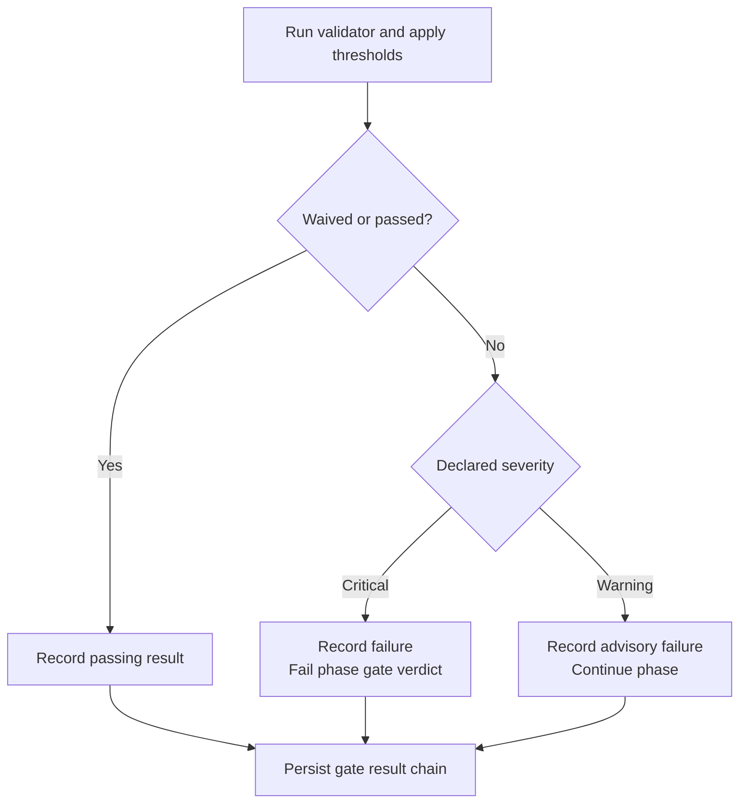

# ADR-005: Gate severity controls phase blocking

## Status

Accepted.

## Context

Each workflow phase can declare validation gates in
[`config/workflows.yaml`](../../config/workflows.yaml). A declaration includes
a severity and may include failure and error behavior:

```yaml
- gate_id: example_quality_gate
  validator: lib.validators.example.ExampleValidator
  severity: warning
  threshold:
    min_score: 0.8
  behavior:
    on_fail: warn
    on_error: fail_closed
```

These settings answer different questions:

- `severity` determines whether a completed gate failure blocks the phase.
- `behavior.on_error` determines how a validator execution error is converted
  into a gate result.
- `behavior.on_fail` can stop further evaluation in the gate manager's batch
  API, but it does not create a second blocking policy for the executor.

Without that separation, a warning-level quality signal could be mistaken for
a release blocker, or a validator error could be mistaken for an ordinary
validation failure.

## Decision

The severity on each gate declaration is authoritative for phase blocking:

- a failed `critical` gate sets the phase gate verdict to failed;
- a failed `warning` gate is recorded but does not fail the phase; and
- an omitted severity defaults to `critical` and emits a warning during gate
  parsing.

Severity belongs to the declaration, not the gate identifier. The same
validator may be critical in one phase and advisory in another.

The executor runs each configured gate through `ValidationGateManager.run_gate`.
That manager applies thresholds, waivers, and error policy before returning a
`GateResult`. The executor then applies the declared severity to any result
that still fails.



The diagram expresses status through labels as well as shape and direction, so
it does not depend on color.

### Validator errors

`behavior.on_error` acts before the severity decision:

- `fail_closed` produces a failed result;
- `warn` may convert an ordinary validator error into a passing result; and
- specialized resource and dependency errors may enforce stricter behavior
  where the validation framework defines it.

If the resulting gate remains failed, its declared severity decides whether it
blocks the phase. Error policy therefore controls the result; it does not
replace severity as the phase-blocking rule.

### Required-input exception

A gate that cannot resolve its required inputs is recorded as a structured
skip rather than treated as if validation ran successfully. Most such skips do
not block. When training synthesis was explicitly requested, however, missing
inputs for its validation gate prove that the required training artifact was
not produced. The executor fails the phase contract directly in that case,
regardless of advisory gate severity.

This is an artifact-availability rule, not a second interpretation of a
completed gate failure.

### Persistence and diagnosis

`GateResult` does not define a declaration-severity field. Before returning or
persisting gate results, the executor adds the configured severity when the
serialized result does not already contain one. Checkpoints therefore retain
the information needed to distinguish blocking failures from advisory ones.

The workflow configuration remains the source of truth for policy. Persisted
results show what happened during a particular run.

## Consequences

- Critical failures stop phase progression through a failed gate verdict.
- Warning failures remain visible without turning calibration signals into
  blockers.
- Missing severity fails closed instead of silently weakening enforcement.
- Error handling and blocking policy remain separate and independently
  testable.
- Gate results preserve their declared severity for later diagnosis.
- A required training-synthesis artifact cannot pass through a structured
  missing-input skip.

## Rejected alternatives

### Let `behavior.on_fail` override severity

This would create two independent blocking controls. A warning gate with
`on_fail: block` could then contradict its own severity and make phase behavior
harder to predict.

### Block on every failed gate

This would make advisory and calibration checks indistinguishable from release
requirements.

### Treat validator errors as ordinary failures

Execution failures and content failures require different diagnostics. The
error policy must first produce an explicit result that severity can evaluate.

### Infer severity from issue contents

Issue severity describes individual findings. Phase blocking is a workflow
policy and must remain attached to the gate declaration.

## Implementation references

- [`MCP/core/executor.py`](../../MCP/core/executor.py) parses gate
  declarations, runs the phase gate loop, applies blocking policy, and stamps
  serialized results.
- [`MCP/hardening/validation_gates.py`](../../MCP/hardening/validation_gates.py)
  defines gate configuration, results, thresholds, waivers, and validator error
  handling.
- [`MCP/tests/test_executor_gate_severity_warning_nonblocking.py`](../../MCP/tests/test_executor_gate_severity_warning_nonblocking.py)
  covers warning, critical, omitted-severity, behavior parsing, and required
  training-input cases.
