# Aggregators

> Long-form home for the per-aggregator detail. Root `CLAUDE.md § Aggregators` carries the summary table (one row per aggregator, with output path and schema); this file carries the canonical paragraph for each. When adding an aggregator, extend both surfaces — a paragraph here with no row there, or vice versa, is a documentation bug.

## What an aggregator is

An aggregator is a **post-loop, read-only rollup**. After every workflow phase has run, `MCP/core/workflow_runner.py::WorkflowRunner.run_workflow` calls a fixed sequence of `_maybe_write_*` helper methods on itself. Each helper lazily imports its aggregator module, resolves an output root, reads artifacts the run already produced (per-phase `_gate_results` chains held in `phase_outputs`, on-disk reports, chunksets, checkpoints), and writes one operator-facing JSON.

Three properties hold for every one of them:

1. **Best-effort.** Each helper wraps its whole body in `try: … except Exception: logger.warning(…); return None`. An aggregator failure logs a warning and **never** changes `final_status`, never fails the workflow, and never perturbs the return payload. The per-phase reports remain authoritative.
2. **Read-only on pipeline state.** Aggregators do not re-run gates or re-dispatch LLM calls. The single exception that *mutates* an artifact is `EdgeConsensusAggregator.apply_to_graph`, which stamps `edge_status` onto the concept graph in place (see below).
3. **Lazy import.** Every helper imports its module inside the method body, to keep `workflow_runner`'s import-time dependency surface flat. A dead-code sweep that follows static imports will not see `lib/aggregators/*` or `lib/governance/*` from the runner — they are reachable, and several are behind default-OFF flags. **Flag-off means "wrote no file", not "dead".**

## Dispatch order

Call sites are contiguous in `run_workflow` (`MCP/core/workflow_runner.py`, lines ~2817–2991; the helper method bodies live further down, ~3514–4560), in this order:

| # | Helper method | Aggregator / exporter | Flag gate |
|---|---|---|---|
| 1 | `_maybe_write_courseforge_validation_report` | `lib/aggregators/courseforge_validation_report.py::CourseforgeValidationReport` | none (unconditional) |
| 2 | `_maybe_write_trainforge_assessment_quality_report` | `lib/aggregators/trainforge_assessment_quality_report.py::TrainforgeAssessmentQualityReport` | none |
| 3 | `_maybe_write_coverage_map` | `lib/aggregators/coverage_map.py::CoverageMapAggregator` | none |
| 4 | `_maybe_write_block_quality_rollup` | `lib/aggregators/block_quality_rollup.py::BlockQualityRollupAggregator` | `ED4ALL_BLOCK_QUALITY_RUBRIC` |
| 5 | `_maybe_write_edge_consensus_reports` | `lib/aggregators/edge_consensus.py::EdgeConsensusAggregator` | none (NLI arm behind `TRAINFORGE_EDGE_NLI`) |
| 6 | `_maybe_write_promotion_chain_report` | `lib/aggregators/promotion_chain_report.py::PromotionChainAggregator` | none |
| 7 | `_maybe_write_procurement_evidence` | `lib/governance/procurement_evidence.py::write_evidence_bundle` | none |
| 8 | `_maybe_write_concept_coverage` | `lib/aggregators/concept_coverage.py::ConceptCoverageAggregator` | `ED4ALL_CONCEPT_COVERAGE` |
| 9 | `_maybe_write_intelligence_level` | `lib/aggregators/intelligence_level.py::IntelligenceLevelAggregator` | `ED4ALL_INTELLIGENCE_RUBRIC` |
| 10 | `_maybe_harvest_bloom_labels` | `lib/bloom_labels/harvester.py::harvest_bloom_labels` | `ED4ALL_HARVEST_BLOOM_LABELS` |
| 11 | `_maybe_write_accessibility_conformance` | `lib/aggregators/accessibility_conformance.py::AccessibilityConformanceAggregator` | none |
| 12 | `_maybe_write_build_cost_report` | `lib/aggregators/build_cost.py::BuildCostAggregator` | none |
| 13 | `_maybe_write_provenance_resolution_report` | `lib/aggregators/provenance_resolution.py::ProvenanceResolutionAggregator` | none |

**Order matters in exactly one place:** #6 runs before #7, because `_maybe_write_procurement_evidence` receives `promotion_chain_path` as a parameter and keys its bundle to the chain report's `chain_hash`.

```mermaid
flowchart LR
    L["phase loop ends<br/>(final_status set)"] --> A1["1 courseforge_validation_report"]
    A1 --> A2["2 trainforge_assessment_quality"]
    A2 --> A3["3 coverage_map"]
    A3 --> A4["4 block_quality_rollup<br/><i>flag-gated</i>"]
    A4 --> A5["5 edge_consensus<br/><i>stamps the graph</i>"]
    A5 --> A6["6 promotion_chain<br/>→ chain_hash + course_status"]
    A6 --> A7["7 procurement_evidence<br/><i>keyed to chain_hash</i>"]
    A7 --> A8["8 concept_coverage<br/><i>flag-gated</i>"]
    A8 --> A9["9 intelligence_level<br/><i>flag-gated</i>"]
    A9 --> A10["10 harvest_bloom_labels<br/><i>flag-gated</i>"]
    A10 --> A11["11 accessibility_conformance"]
    A11 --> A12["12 build_cost"]
    A12 --> A13["13 provenance_resolution"]
    A13 --> R["return payload<br/><b>final_status unchanged</b>"]
```

## Output-root resolution

Most aggregators resolve their output root from `phase_outputs["libv2_archival"]["course_dir"]` and fall back to a second location when archival did not run. The fallbacks are per-aggregator and are named in each paragraph below. A run stopped before `libv2_archival` therefore still produces most reports, just under the Courseforge project export or the Trainforge dir instead of the LibV2 course dir.

---

## Per-aggregator detail

### `CourseforgeValidationReport` — `<project_path>/courseforge_validation_report.json`

`SCHEMA_VERSION = "1.1"`. Walks every per-phase `02_validation_report/report.json` plus the in-memory `_gate_results` chains stashed on `phase_outputs`, and writes a single report at the Courseforge project path. Carries `per_block_results[]`, `source_grounding_results`, `accessibility_results`, `statistical_semantic_results`, `manifest_hash_results`, and a `final_promotion_decision` enum. Emits one `courseforge_validation_aggregated` decision per build. Unconditional (no flag). Its `final_promotion_decision` is superseded for governance purposes by `PromotionChainAggregator` + `derive_course_status`; it survives as the per-phase-gate rollup.

Downstream: `AccessibilityConformanceAggregator` reads this file's `accessibility_results` as one of its two input sources, so aggregator #1 feeding #11 is a real (if indirect) dependency.

### `TrainforgeAssessmentQualityReport` — `<libv2_course>/quality/trainforge_assessment_quality_report.json`

`SCHEMA_VERSION = "1.0"`; schema `schemas/aggregators/trainforge_assessment_quality_report.schema.json`. Aggregates the `training_synthesis` / `trainforge_assessment` / `libv2_archival` `_gate_results` chains, the `<trainforge_dir>/quality/quality_report.json::assessments` dimension, and — when an adapter has been imported — the per-model `eval/eval_report.json` under the LibV2 course's `models/` tree. Falls back to `<trainforge_dir>/trainforge_assessment_quality_report.json` when archival hasn't run. Carries `summary`, `synthesis_quality`, `kg_quality`, `eval_summary`, `per_question_issues`, and a 3-way `promotion_decision`. Emits one `trainforge_quality_aggregated` decision per build.

### `CoverageMapAggregator` — `<libv2_course>/coverage_map.json`

`SCHEMA_VERSION = "1.0"`; schema `schemas/aggregators/coverage_map.schema.json`. Builds an objective-keyed table linking objectives → chunks → questions → training_pairs, from the `course_planning` synthesized objectives, `imscc_chunks/chunks.jsonl::learning_outcome_refs[]`, `assessments.json::questions[]` (`objective_id` / `source_chunks[]`), and `training_specs/{instruction,preference}_pairs.jsonl::lo_refs[]`. Falls back to `<trainforge_dir>/coverage_map.json`.

Its operator value is the three orphan classes it surfaces: `summary.orphan_objectives` (an objective with no chunks *and* no questions *and* no training pairs), `summary.orphan_chunks` (a chunk with empty or non-extant `learning_outcome_refs[]`), and `summary.orphan_questions` (a question with empty or non-extant `objective_id` / `objective_ids[]`). Per-objective `answers_grounded_in_chunks[]` records questions whose `source_chunks[]` intersect that objective's collated chunk list. Emits one `coverage_map_aggregated` decision per build.

### `BlockQualityRollupAggregator` — `<libv2_course>/block_quality_rollup_report.json`

`SCHEMA_VERSION = "1.0"`; schema `schemas/aggregators/block_quality_rollup.schema.json`. **Flag-gated**, and note the gate is not a direct env read: the helper calls `lib/validators/_block_rubric_helpers.py::block_quality_rubric_enabled()`, the same resolver the `ED4ALL_BLOCK_QUALITY_RUBRIC` validators use, so the aggregator and the gate that produces its input can never disagree about whether the rubric is on. Off → returns `None` before importing the aggregator.

Reads per-block 8-dimension 0–3 scores out of the `block_quality_rubric` `GateResult` metadata in the `post_rewrite_validation` / `inter_tier_validation` `_gate_results` chain (it also accepts scored `Block`s directly, which is how its tests drive it). A second early return fires when `aggregator.blocks` is empty — the rubric gate can be on without having produced scores, and that is a skip, not a zero-filled report. Falls back to `<project_path>/block_quality_rollup_report.json`.

Rolls three tiers with **both** a mean path and a per-dimension minimum-floor path, so a weak block cannot hide inside a strong average. The floor is `_MEAN_FLOOR = 2.0` at every tier:

- **Block** — `mean(applicable_dims) >= 2.0` *and* every core dimension (alignment / cognitive_load / accessibility / coherence) `>= 2.0` *and* no accessibility-gate failure. All three conjuncts are required; the a11y veto is separate from the accessibility *dimension* score.
- **Module** — module mean `>= 2.0` *and* every required (core) dimension **minimum** `>= 2.0`. A missing core-dim minimum fails the floor rather than being skipped.
- **Course** — zero accessibility-gate failures and zero `Alignment == 0` orphan blocks. Emits one `block_quality_rollup_aggregated` decision per build.

### `EdgeConsensusAggregator` — `<graph_dir>/edge_consensus_report.json` (sibling of the graph)

`SCHEMA_VERSION = "1.0"`, `MATRIX_VERSION = "2026-06-09.v2"`. The one aggregator that **mutates** an artifact.

Its post-loop helper is a *reconciliation* pass, not the primary write. The `concept_extraction` phase already stamps edges at authoring time (`MCP/tools/pipeline_tools.py::_run_concept_extraction`). The post-loop helper exists because semantic graphs also land via other routes, and LibV2 courses carry the graph under **two** layouts — `<course_dir>/graph/concept_graph_semantic.json` and `<course_dir>/concept_graph/concept_graph_semantic.json`. The helper probes both subdirectories plus `phase_outputs.concept_extraction.concept_graph_path`, and handles every candidate that exists.

Per-graph behavior, each failing soft and independently:

- Any dict edge missing a non-`None` `edge_status` → `apply_to_graph` stamps in place, the graph is re-serialized, and the sibling report is written.
- Fully stamped **and** a sibling report already exists → skipped untouched. This is the idempotency contract with the authoring-time wiring: without it, `generated_at` would drift on every re-run.
- Fully stamped but report missing → only the report is written; the graph file is not rewritten.

**Status tiers**, strongest verdict winning: `contradicted` > `retracted` > `confirmed` > `supported` > `pending`. `consensus_rate = confirmed / total`; `supported_rate` is reported **separately** so the soft tier never inflates the headline number.

**Why triangulation rather than same-pair co-fire.** The v1 design asked whether a *different* rule fired over the same `(source, target)` pair. `typed_edge_inference._apply_precedence` collapses colliding-pair edges upstream, which deletes exactly that evidence. The v2 design triangulates across *persisted provenance endpoints*, which survive precedence because they live on edges of non-colliding types. Four detectors run in fixed order under deterministic `sorted()` iteration (`_compute_triangulation_signals`):

- **T1** — `prerequisite_from_lo_order` × first-mention text order. Edge `B→A` means `A` is `B`'s prerequisite and should appear first in the text. Earlier → `confirmed`; later → `contradicted` (`lo_order_vs_text_order_conflict`); tie or unparseable ordinal → no signal. The conflict string is deliberately distinct from the hard-cycle `circular_prerequisite` / `type_hierarchy_cycle` codes so operators can tell a soft ordering conflict from a cycle.
- **T2** — `assesses_from_question_lo` × `derived_from_lo_ref` closing a `(chunk, LO)` triangle, case-insensitive LO match, symmetric stamp on the derived edge.
- **T3** — `targets_concept_from_lo` × `derived_from_lo_ref` × `defined_by_from_first_mention` closing an LO–chunk–concept triangle, symmetric on the derived edge.
- **T4** — `related_from_cooccurrence` co-location: two co-occurring concepts whose first-mention chunks overlap → `supported`. `intra_chunk_link` is explicitly **excluded**, because its edges *are* co-location edges and a co-location signal over them would be tautological.

An `evidence_diversity` block reports `multi_rule_pair_count`, `multi_rule_pair_rate`, and `triangulated_edge_count`. T1 conflicts flow into `contradictions[]`. One `edge_consensus_resolution` decision per build. `KGQualityValidator.validate` attenuates `kg_quality.consistency` by `(1 - contradiction_rate)`.

**NLI extension** (`TRAINFORGE_EDGE_NLI`, default off). Implemented in `_nli_extension_signal`. For chunk-anchored edges (`defined_by` / `exemplifies` only) it renders the predicate to a hypothesis and runs `lib/classifiers/nli_classifier.py::NliClassifier` against the cited chunk text. It emits a `disagree` signal **only** on `contradiction >= 0.5` (→ `retracted`); entailment and neutral add nothing, so the arm can only retract, never confirm. It **requires** a chunk-text lookup threaded from the call site — edges carry chunk IDs, not text — supplied by `load_chunk_text_lookup(course_dir)` / `chunk_text_lookup_from_chunks(chunks)`. Absent that lookup (or absent NLI deps) the extension no-ops even with the flag on. `TRAINFORGE_EDGE_NLI_MAX_EDGES` (default 500) bounds the forward passes.

**Contradicted-edge policy** (`TRAINFORGE_CONTRADICTED_EDGE_POLICY`, default unset → stamp-only, byte-identical). Applied **only** on `apply_to_graph`, per-edge after the verdict:

- `decay` — multiply the edge's `confidence` by `_DECAY_FACTOR` (0.5) in place; `edge_status` stays `contradicted`. Idempotent via an additive `consensus_confidence_predecay` snapshot plus a `consensus_confidence_decayed` sentinel, so a second `apply_to_graph` is byte-identical.
- `retract` — re-status to `edge_status: retracted`. The edge is **not** deleted (deletion breaks provenance and replay); it stays in `graph['edges']` clearly statused. No in-tree consumer filters on `edge_status` today, so the status is the contract and physical removal is out of scope.
- Any other value raises `ContradictedEdgePolicyError` **before** any edge is mutated — a typo never half-writes the graph nor silently degrades to stamp-only.

**Coherence with the attenuation contract:** `contradiction_rate` is computed in `build()`, which does not apply the policy. A decayed or retracted edge still counts toward it. Attenuating a contradiction is not erasing the signal, so the consistency hit stays intact regardless of policy.

### `PromotionChainAggregator` — `<libv2_course>/courseforge_promotion_chain_report.json`

`SCHEMA_VERSION = "1.0"`; schema `schemas/governance/promotion_chain.schema.json`. The master governance rollup. Walks the arrows of the conversion → eval-report chain (source PDF → accessible HTML → Courseforge blocks → rewritten HTML → IMSCC → IMSCC chunks → assessment items → training pairs → adapter → eval report), reads each per-stage report best-effort, and writes one canonical report. Falls back to `<trainforge_dir>/courseforge_promotion_chain_report.json`.

Per-arrow rows carry `{arrow_id, name, input_hash, output_hash, validator_set[], passed, warnings_count, source_coverage, promotion_decision}`. Top-level `chain_hash` is a deterministic SHA-256 over the canonicalised arrow rows in chain order. `course_status` is composed by `lib/governance/course_status.py::derive_course_status`.

**Anti-silent-degradation contract:** a missing per-stage report MUST surface as `promotion_decision: "fail"` on that arrow with `validator_set: ["missing_stage_report"]`, and `course_status: "failed"`. A stage that never ran must never read as a stage that passed. Emits one `promotion_chain_aggregated` decision per build.

### `derive_course_status` — composes `course_status` (helper, no file)

`lib/governance/course_status.py`. Walks the per-arrow rows and returns the canonical 5-value enum: `failed | non_certified_archive | certified_accessible | certified_instructional | certified_trainable`. Three gate cohorts drive it — `ACCESSIBILITY_GATE_IDS` gates `certified_accessible`, `INSTRUCTIONAL_GATE_IDS` gates `certified_instructional`, `TRAINABLE_GATE_IDS` gates `certified_trainable`.

Anti-silent-degradation, again: a **missing** cohort gate disqualifies the cohort. Silently crediting an absent gate is precisely the failure class this helper exists to close. A hard-fail arrow attached to any critical-cohort gate — or an unattributed `missing_stage_report` — shorts the whole thing to `failed`.

### `procurement_evidence` exporter — `<libv2_course>/retrieval_eval/procurement_evidence_bundle.json`

`lib/governance/procurement_evidence.py::write_evidence_bundle`, `EVIDENCE_SCHEMA_VERSION = "1.0"`. Not an aggregator class; a function the helper calls with the course dir, course code/slug, run id, and the `promotion_chain_path` returned by #6. Returns `None` when no `libv2_archival.course_dir` is resolvable.

Rolls the newest `retrieval_eval/grounded_answer_eval_<ts>.json` into a versioned, self-contained bundle carrying the pinned headline plus phrasing / abstention / refusal breakdowns and a flag-config stamp. Four design contracts:

- **Advisory only.** The bundle never mutates the promotion-chain report (whose schema is closed, `additionalProperties: false`) nor `course_status`. It sits *beside* the chain report, keyed to it by `chain_hash`, and records a computed `readiness` field encoding the blocking-flip criterion. Flipping the gate to blocking is an explicit operator config change, never a side effect of this exporter.
- **Anti-silent-degradation.** A course with no stored grounded-eval report yields an explicit `evaluation_status: "not_evaluated"` bundle, never a fabricated all-zero headline — mirroring the `missing_stage_report` sentinel above.
- **No LLM call site.** The module only reads a report the harness already wrote, so it wires no `DecisionCapture`. The LLM call-site instrumentation law applies to new model calls, not to readers.
- **Interval discipline.** When an operator-labeled anchor slice (`retrieval_eval/operator_labels.json`) is present, headline confidence intervals use prediction-powered inference; absent that file, classical 95% Wilson intervals only.

### `ConceptCoverageAggregator` — `<libv2_course>/concept_coverage.json`

`SCHEMA_VERSION = "1.0"`; schema `schemas/aggregators/concept_coverage.schema.json`. **Flag-gated** on `ED4ALL_CONCEPT_COVERAGE` via `resolve_concept_coverage()`; default OFF → the helper returns `None` before doing any path resolution, so a default run writes nothing and is byte-identical. Falls back to `<concept_graph_dir>/concept_coverage.json`. The concept-graph analogue of `coverage_map`: per concept node, which pedagogical surfaces (objectives, chunks, blocks, assessments) touch it. Emits one `concept_coverage_aggregated` decision per build.

### `IntelligenceLevelAggregator` — `<libv2_course>/intelligence_level_report.json`

`SCHEMA_VERSION = "1.0"`; schema `schemas/aggregators/intelligence_level.schema.json`. **Flag-gated** on `ED4ALL_INTELLIGENCE_RUBRIC` via `resolve_intelligence_rubric()`; default OFF → no file. Falls back to `<trainforge_dir>/intelligence_level_report.json`. Scores a built course on a deterministic (no-model) 0–5 capability rubric by tallying which capability artifacts are actually present. Emits one `intelligence_level_scored` decision per build.

### `harvest_bloom_labels` — `state/bloom_labels/labels.jsonl`

`lib/bloom_labels/harvester.py::harvest_bloom_labels` (re-exported from the package `__init__`), called from `_maybe_harvest_bloom_labels`. Not a report writer — an **appender** to a shared, cross-run store whose default location is `DEFAULT_STORE_PATH = STATE_PATH / "bloom_labels" / "labels.jsonl"`. **Flag-gated** on `ED4ALL_HARVEST_BLOOM_LABELS`, read directly from the environment in the helper; off → short-circuits before any path resolution.

Deterministic and LLM-free: walks the resolved Courseforge export (plus the LibV2 course dir when archival ran) and appends every de-duplicated artifact-asserted Bloom claim from objectives, outline and rewrite blocks, and assessment items. This store is the corpus behind the re-founded `bloom_classifier_disagreement` voter 1 (`ED4ALL_BLOOM_TRIVOTE`). Also drivable standalone via `ed4all harvest-bloom-labels`.

### `AccessibilityConformanceAggregator` — `<libv2_course>/quality/accessibility_conformance.json`

`SCHEMA_VERSION = "1.0"`; schema `schemas/aggregators/accessibility_conformance.schema.json` (Draft 2020-12, `additionalProperties: false`). Falls back to `<trainforge_dir>/quality/accessibility_conformance.json`.

**Inverts** the gate-level WCAG issue stream into a per-success-criterion table, VPAT / WCAG-EM style. Every WCAG 2.2 Level A + AA success criterion gets exactly one row carrying `criterion`, `level`, `title`, `status`, and an `evidence_counts` tally. Status derivation is deterministic:

| Condition | Status |
|---|---|
| any CRITICAL-severity issue coded to the criterion | `does_not_support` |
| WARNING-severity issues only | `partially_supports` |
| no issues **and** criterion is in the automated-evaluable set | `supports` |
| no issues **and** criterion is **outside** that set | `not_evaluated` (with a `reason` category) |

That last branch is what makes the report honest. A static-HTML checker cannot verify contrast *computation*, time-based-media alternatives, or cognitive/human-judgement criteria — so the report emits an explicit `not_evaluated` row rather than silently claiming `supports` for a criterion it never looked at.

Two input sources are read best-effort and unioned: the in-memory `phase_outputs[*]._gate_results[*]` chain (WCAG gates carry `issues[]` with a machine-readable `code`, a `severity`, and a `location`) and the on-disk `courseforge_validation_report.json::accessibility_results` rollup, which covers partial runs where only the report survived.

### `BuildCostAggregator` — `<libv2_course>/build_cost_report.json`

`SCHEMA_VERSION = "1.0"`; schema `schemas/aggregators/build_cost.schema.json` (Draft 2020-12, `additionalProperties: false`). Falls back to `<trainforge_dir>/build_cost_report.json`. Pure **metering** — it makes no model call, so it correctly has **no decision-capture surface**.

Three independently degradable sections, sourced from artifacts the run already drops under `state/runs/<run_id>/`:

1. **Per-phase wall-clock** from `checkpoints/*.json` (`started_at` / `completed_at`). Always emitted — a run that got far enough to aggregate has checkpoints.
2. **GPU residency** from `vram_trajectory.jsonl` (rows carry `ts`, `phase`, `resident_models`), joined to the phase wall-clock windows for per-phase residency span and peak resident VRAM. **An absent file omits the section entirely** rather than emitting zeros — a run without `ED4ALL_VRAM_DOCTOR` writes no trajectory, and zeros would be a lie.
3. **LLM calls / tokens** from `llm_usage.jsonl` (one row per chat-completion call, written by the usage tap in `Trainforge/generators/_openai_compatible_client.py` when `ED4ALL_RUN_ID` is set), tallied globally, per-provider, and per-model. Again **omitted when absent**, which is the honest reading for a run whose calls bypassed the shared client.

When `ED4ALL_LLM_TTFT_METER` is on, usage rows additionally carry `ttft_ms` and the aggregator surfaces p50 / p95 time-to-first-token (additive; no schema bump).

### `ProvenanceResolutionAggregator` — `<libv2_course>/quality/provenance_resolution_report.json`

`SCHEMA_VERSION = "1.0"`; schema `schemas/aggregators/provenance_resolution.schema.json`. Unconditional (no flag). Falls back to `<project_path>/provenance_resolution_report.json`. Returns `None` (skip, no file) when the IMSCC chunkset cannot be located. Pure regex/JSON — no LLM, no embedding, no decision surface.

Answers the evaluation question "do course-page citations actually resolve back to the book?". Walks `<libv2_course>/imscc_chunks/chunks.jsonl` and extracts the comma-separated source-id tokens from the `data-cf-source-ids="…"` attributes in each chunk's `html`. An empty-string attribute is the sanctioned boilerplate contract — a fail-closed re-rolled block legitimately emits no provenance — and counts as *no provenance*, never as a resolution failure.

Three ratios, each with its raw counts:

1. `chunks_with_provenance` — chunks carrying ≥1 non-empty token, over total chunks.
2. `source_ids_anchor_resolved` — distinct tokens whose anchor exists as a block-id attribute in the staged accessible HTML, over distinct tokens. The staged-HTML root resolves from `phase_outputs.staging.staging_dir`; when that is absent the metric is **skipped** (the field becomes `{"skipped": "no_staging_dir"}`) rather than fabricated as zeros.
3. `source_ids_book_chunk_resolved` — distinct tokens carried by ≥1 book-side chunk's `source.source_references[].sourceId`, over distinct tokens. The book-side chunkset dir is resolved through `lib/libv2_storage.py::resolve_staged_chunks_path`, which dual-reads `semantik_chunks/` → `dart_chunks/` → `corpus/` so provenance resolves on both current and un-migrated archives.

Also emits capped (≤25) `unresolved[]` token samples per ratio, a per-`module_id` `provenance_free_by_module` counter, `distinct_source_id_count`, and run/slug/timestamp metadata.
