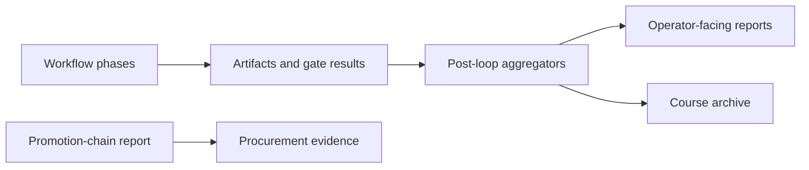

# Aggregators

Aggregators turn the evidence produced by an Ed4All workflow into reports that
are easier to review, compare, and archive. They run after phase execution and
combine persisted artifacts with the in-memory validation results for the
current run.

They are reporting infrastructure, not validation gates. A report can explain
why a build passed or failed, but it does not replace the gate results that made
that decision.

## Where aggregation fits

The accessible text equivalent is: workflow phases produce artifacts and gate
results; post-loop aggregators read that evidence and write review reports.
Reports may be archived with the course. Procurement evidence is written after
the promotion-chain report because it links to that report.

The authoritative execution order is the post-loop call sequence in
[`WorkflowRunner.run_workflow`](../../MCP/core/workflow_runner.py). Aggregator
implementations live in [`lib/aggregators`](../../lib/aggregators). Those live
surfaces are the registry: documentation should not duplicate a count or a
fixed inventory that can drift from them.

## Inputs and results

Depending on its purpose, an aggregator may read:

- phase outputs and their attached validation-gate results;
- generated course, assessment, graph, training, or evaluation artifacts;
- run telemetry and checkpoints; or
- reports written earlier in the post-loop sequence.

Most results are versioned JSON documents written beside the course or stage
artifacts they describe. Where a formal output contract exists, it is under
[`schemas/aggregators`](../../schemas/aggregators) or
[`schemas/governance`](../../schemas/governance). The implementation owns input
discovery and output-path resolution; callers should use paths returned by the
workflow rather than reconstructing them.

Some reports are optional because their source feature is optional or their
required evidence was not produced. A missing optional report means “not
available for this run,” not “passed.” Governance reports preserve missing
required evidence explicitly rather than converting absence into success.

## Ordering and dependencies

Most aggregators are independent readers, but order is still part of the
workflow contract:

- the promotion-chain report is produced before procurement evidence, which
  binds its evidence bundle to the promotion result;
- accessibility conformance may consume the Courseforge validation rollup;
- reports that need archived course paths run only after those paths can be
  resolved; and
- feature-gated reports run only when their corresponding evidence-producing
  feature is enabled.

Do not infer execution order from module names or filesystem order. Consult the
runner call sequence and its focused tests. Runtime switches and their defaults
are documented in [Behavior flags](../operations/behavior-flags.md), while the
public execution overview is maintained in [Pipeline flow](pipeline-flow.md).

## Reporting boundary

Post-loop report generation is best-effort. An aggregator error is logged and
does not rewrite the workflow’s final status. This keeps a presentation or
telemetry failure from disguising the authoritative outcome of completed
validation gates.

Best-effort reporting does not permit invented results. Aggregators should
distinguish missing, skipped, unavailable, and failed evidence in their output.
They must not rerun model calls or validation gates to fill a gap.

Aggregators normally read pipeline state without changing it. Edge-consensus
reconciliation is the deliberate exception: it can annotate a concept graph
with consensus status before writing its report. That mutation is part of the
graph contract and must remain deterministic and idempotent.

## Privacy

Aggregated reports can contain course identifiers, artifact paths, excerpts,
model provenance, validation findings, and run metadata. Treat them as private
run artifacts:

- keep generated reports and capture trees out of source control;
- do not place course names, corpus text, local absolute paths, hostnames, or
  network addresses in fixtures or public examples;
- prefer stable synthetic identifiers, bounded statistics, and hashes in
  diagnostics; and
- sanitize any report excerpt before sharing it outside the private runtime.

Source material and generated course data remain private regardless of whether
an aggregator emits only a summary.

## Adding or changing an aggregator

1. Define one clear reporting question and identify the authoritative evidence
   that answers it.
2. Implement the reader and writer under `lib/aggregators/`. Keep aggregation
   deterministic and avoid model calls.
3. Add or update the output schema when the report has a public machine-readable
   contract.
4. Wire a lazy post-loop helper into `WorkflowRunner`, placing it after every
   report or artifact it consumes.
5. Return the written path to the workflow when downstream code needs it. Make
   missing-input behavior explicit and preserve the best-effort boundary.
6. If behavior is configurable, document the canonical switch in
   [Behavior flags](../operations/behavior-flags.md) instead of duplicating its
   default here.
7. Add focused tests under
   [`lib/aggregators/tests`](../../lib/aggregators/tests) and runner-level tests
   for wiring, ordering, path propagation, and failure isolation.

Tests should cover deterministic output, schema validity, missing-input
semantics, privacy-safe fixtures, and idempotence for any writer that can update
an existing artifact. A workflow-level failure-isolation test should confirm
that an aggregator exception is visible in logs without changing the already
computed workflow result.

For the relationship between gates, reports, and promotion decisions, see
[Validation architecture](validation-architecture.md). For the wider execution
sequence, see [Pipeline flow](pipeline-flow.md).
