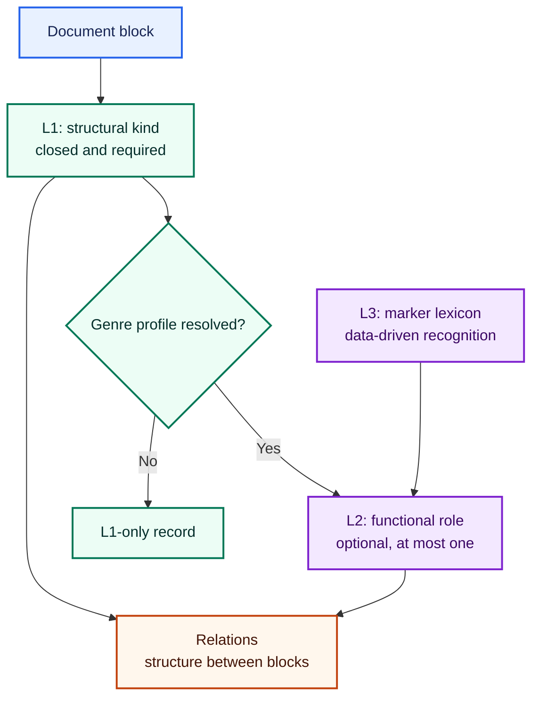

# Block ontology contract

Ed4All separates a block's structural identity from its genre-specific
function and from the vocabulary used to recognize that function. The
canonical data lives under `schemas/taxonomies/`; consumers load taxonomy JSON
through `lib/ontology/taxonomy.py::load_taxonomy` where integration permits.

This ontology is a public contract, but adoption is partial. Read
[Adoption status](#adoption-status) before treating a vocabulary as emitted by
the current converter.

## Layers and semantics



The labels and arrows carry the meaning; color only reinforces each layer.

### L1: closed structural kinds

L1 describes what a block *is*. For ontology-conforming records, every block
has exactly one L1 kind. The closed vocabulary is defined by
[`block_kinds.json`](../../schemas/taxonomies/block_kinds.json):

```text
heading      paragraph    list_item    table        figure       chart
caption      math_block   code_block   blockquote   aside        footnote
form_field   title_block  separator    furniture
```

The canonical file contains 16 detailed entries and an enum with the same 16
values. Each entry declares a DocLayNet mapping key; an explicit `null` records
that no direct parent exists. The mapping is useful for interoperability and
weak supervision, but it is not a claim that every Ed4All kind has a distinct
DocLayNet class.

Changing L1 is a schema change. It affects validators, renderers, mappings,
stored data, and any component that assumes exhaustive kinds.

### L2: optional genre roles

L2 describes what a block *does* within one resolved genre. A conforming block
has at most one role, and the role's `attaches_to` list limits the valid L1
kinds. No resolved profile means honest L1-only output; there is no fabricated
`unknown` role.

The eight canonical profiles are:

| Profile | Roles |
|---|---:|
| `encyclopedic` | 3 |
| `forms` | 4 |
| `instructional` | 10 |
| `legal_regulatory` | 7 |
| `literary` | 7 |
| `scholarly` | 7 |
| `statistical` | 5 |
| `technical_manual` | 5 |

Exact role names, attachment rules, and optional mappings are authoritative in
the matching `schemas/taxonomies/genre_profile_*.json` file.

### L3: data-driven recognition

L3 lexicons map marker text to an L2 role. Marker vocabulary belongs in data,
not general-purpose Python branches. The ontology test inventory contains:

| Lexicon | Profile | Markers |
|---|---|---:|
| `ansi_z535_lexicon.json` | `technical_manual` | 9 |
| `federal_register_lexicon.json` | `legal_regulatory` | 4 |
| `generic_instructional_lexicon.json` | `instructional` | 10 |
| `openstax_lexicon.json` | `instructional` | 6 |

Every marker row may contain only `marker`, `role`, and `notes`; its role must
exist in the declared profile.

## Relations

[`block_relations.json`](../../schemas/taxonomies/block_relations.json) defines
14 relations. Structural relations do not require a genre role:

```text
same_unit  continues  caption_of  adjacent  same_section  footnote_of
refers_to  same_story
```

Profile relations require an L2 role on at least one endpoint:

```text
solution_of  practice_of  answers  cites  defines  references
```

A relation expresses structure between blocks; it is not a second block kind.
For example, a caption remains a `caption` block connected to its target by
`caption_of`. Direction, endpoint shape, derivation, and current implementation
status are defined per relation in the canonical JSON.

## Governance

| Change | Required review |
|---|---|
| Add, remove, or rename an L1 kind | Maintainer-approved schema change and downstream impact review |
| Add or change an L2 role/profile | Maintainer review; every role must attach to at least one valid L1 kind |
| Add or change an L3 marker | Maintainer data review; marker must resolve to a role in its profile |
| Add or rename a relation | Maintainer review; schema-change review when consumers or trained contracts are affected |

Model or rule output does not gain authority merely by using an ontology label.
Consumers must still enforce conservation, provenance, and validation at their
own boundary.

## Invariants any change must preserve

`schemas/tests/test_block_ontology.py` mechanically enforces:

1. every inventoried taxonomy file loads successfully;
2. the L1 enum equals the detailed-entry set and the closed 16-kind snapshot;
3. every L1 entry declares a DocLayNet key, including explicit gaps;
4. every L2 role attaches to one or more valid L1 kinds;
5. L3 entries contain only marker-to-role data and target real profile roles;
6. every profile relation names at least one declared L2 role endpoint; and
7. relation enums exactly match relation entries within each family.

The “one kind, at most one role” rule applies to records claiming conformance
with this ontology. Legacy converter records use separate vocabularies and must
not be described as violating a contract they do not yet implement.

Validate ontology changes with:

```bash
pytest schemas/tests/test_block_ontology.py
```

## Adoption status

| Surface | Current adoption |
|---|---|
| L1 `block_kinds.json` | Canonical and test-enforced; not yet read by a production converter |
| L2 genre profiles | Canonical and test-enforced; not yet read by a production converter |
| L3 `openstax_lexicon.json` | Read by the GLM region mapper for apparatus recognition, with an internal fallback for isolated SemantiK environments |
| Other three L3 lexicons | Canonical and test-enforced; no production reader currently found |
| `block_relations.json` | Canonical and test-enforced; not a single production emission contract |

Schema presence does not prove runtime emission. New consumers should use the
canonical data rather than copying enums into another module.

## Extraction vocabulary gaps

The preferred GLM-OCR route currently emits its own `region_kind` vocabulary
from `SemantiK/semantik_structure/glmocr/region_map.py`. It includes shapes such
as `heading`, `paragraph`, `figure`, `table`, `math`, `list`, and
`metadata_drop`; these are not yet a direct L1 projection. In particular,
`math`/`list` naming and dropped metadata need an explicit contract mapping
before GLM output can claim L1 conformance.

The optional page arranger also retains a versioned nine-value `TYPE_ENUM` in
`SemantiK/semantik_structure/page_arranger_contract.py`. Some values combine
structure and instructional function, while this ontology separates L1 kind
from L2 role. That arranger contract remains valid for its own version; it is
not the canonical L1 inventory.

These mismatches are adapter boundaries, not permission to guess. Until an
implemented, tested projection exists, preserve the source vocabulary and state
its adoption level explicitly.

## Related contracts

- [SemantiK architecture](../../SemantiK/architecture.md)
- [Vision extraction architecture](hybrid-vision-extraction.md)
- [Canonical Ed4All ontology](../../schemas/ONTOLOGY.md)
- [L1 block kinds](../../schemas/taxonomies/block_kinds.json)
- [Block relations](../../schemas/taxonomies/block_relations.json)
