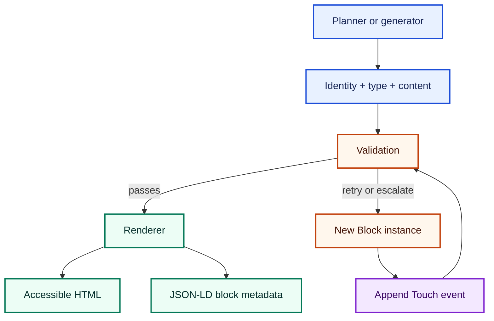

# Block ontology and authored-block contract

Ed4All uses blocks at two connected boundaries:

- **Extraction labels** describe structure found in source material.
- **Authored blocks** describe the learning components Courseforge plans,
  validates, renders, and hands to Trainforge.

They are related, but they are not interchangeable vocabularies. A converter
label must pass through an explicit, tested projection before it becomes an
authored block type. This separation keeps source structure honest while
allowing Courseforge to add pedagogical meaning.

```mermaid
flowchart LR
    A["Source document"] --> B["SemantiK extraction block"]
    B --> C["Explicit projection"]
    C --> D["Courseforge authored Block"]
    D --> E["Accessible HTML + JSON-LD"]
    E --> F["Trainforge consumption"]

    B -. "structure and source provenance" .-> C
    D -. "learning purpose and audit history" .-> E

    classDef source fill:#E8F1FF,stroke:#1D4ED8,color:#172554,stroke-width:2px;
    classDef boundary fill:#FFF7ED,stroke:#C2410C,color:#431407,stroke-width:2px;
    classDef product fill:#ECFDF5,stroke:#047857,color:#052E2B,stroke-width:2px;
    class A,B source;
    class C boundary;
    class D,E,F product;
```



The labels and arrows convey the flow; color is supplementary.

## Extraction-label ontology

The public extraction vocabulary lives under
[`schemas/taxonomies/`](../../schemas/taxonomies/). Consumers load these JSON
documents through
[`lib/ontology/taxonomy.py`](../../lib/ontology/taxonomy.py) instead of copying
their values into application code.

The ontology has three layers:

1. **Structural kind (L1)** — what a source block is, such as a heading,
   paragraph, table, figure, caption, or code block. The closed vocabulary and
   its DocLayNet mappings are defined by
   [`block_kinds.json`](../../schemas/taxonomies/block_kinds.json).
2. **Genre role (L2)** — what that structure does in a resolved document
   profile. A block has at most one role, and each role declares the structural
   kinds to which it may attach. The authoritative profiles are the
   `genre_profile_*.json` files.
3. **Recognition lexicon (L3)** — marker text that helps resolve a role for a
   profile. Lexicons contain marker-to-role data; they do not create new block
   kinds or embed corpus-specific branching in Python.

[`block_relations.json`](../../schemas/taxonomies/block_relations.json)
describes connections between source blocks. A relation does not change either
endpoint's kind. For example, a caption remains a caption when connected to a
figure.

Not every extraction path emits this vocabulary directly. Converter-specific
labels remain valid within their own contracts until a tested projection is
implemented. Consumers must preserve the source label and provenance rather
than guessing a canonical kind or role.

## Authored blocks

Courseforge's canonical intermediate record is the frozen `Block` dataclass in
[`Courseforge/scripts/blocks.py`](../../Courseforge/scripts/blocks.py). It is
the boundary between planning or generation and the HTML/JSON-LD renderers.
Changes produce a new instance; they do not mutate a block in place.



### Identity

A block is anchored by `block_id`, `page_id`, and a non-negative `sequence`.
`Block.stable_id()` constructs the supported position-based identifier from
the page, block type, stable slug, and position. Identity and ordering are
separate from content hashing: moving a block can change its sequence without
changing the hash of its learning content.

### Type and catalog

`BLOCK_TYPES` in `Courseforge/scripts/blocks.py` is the closed authored-block
type set. The matching entry in
[`Courseforge/config/block_catalog.yaml`](../../Courseforge/config/block_catalog.yaml)
explains when the type is appropriate, what it conveys, its expected render
shape, and its planning metadata. Tests require the catalog and the type set
to cover each other exactly.

The catalog guides selection; it is not the renderer and does not override
the dataclass. Optional planning fields remain authoritative only for the
features that consume them.

### Content and content hash

`content` is the canonical body and may be text or a structured mapping. There
is no second `body` field. Supporting metadata can connect the body to learning
objectives, Bloom information, key terms, source references, accessibility
features, and block-specific interaction data.

`compute_content_hash()` hashes an explicit payload consisting of the content,
block type, key terms, declared Bloom level, and objective identifiers. Audit,
ordering, retry, escalation, and derived metadata are excluded. This makes the
hash useful for detecting a change in the authored learning payload without
treating later validation or provenance annotations as new content.

### Source provenance and touch history

Source provenance answers **which source material supports the block**:
`source_ids`, `source_primary`, and structured `source_references` carry those
links into supported HTML attributes and JSON-LD shapes.

Touch history answers **which authoring or validation step changed the
block**. Each immutable `Touch` records a model, provider provenance value,
tier, timestamp, decision-capture reference, and purpose. `with_touch()`
returns a new block with the event appended. Provider values come from the
shared endpoint registry; the JSON-LD and SHACL copies are kept synchronized
by the provenance code-generation contract.

These histories solve different audit questions and must not substitute for
one another. A model touch is not a source citation, and a source citation is
not evidence that a particular validator or authoring tier ran.

### Validation and escalation

`validation_attempts` records failed validation attempts. An
`escalation_marker` records a recognized reason that ordinary regeneration
could not finish the block safely. Both are audit state, not authored content,
and neither changes the content hash.

Escalation must remain visible. A failed or undispatchable block is marked and
handled by downstream gates; it must not disappear silently from a course
package. The authoritative marker vocabulary and routing behavior live beside
the `Block` implementation and Courseforge router tests.

## Rendering and consumption

Courseforge projects blocks into accessible HTML attributes and page JSON-LD.
The wire shape varies where older objective, section, and misconception shapes
must remain compatible; other authored types use the common block metadata
shape. Consumers should validate the emitted shape rather than infer it from a
catalog description.

Trainforge parses the rendered page and its metadata. Round-trip and consumer
tests protect stable emission, provenance, and the fields Trainforge relies
on. A new field is not part of the public wire contract merely because it was
added to the Python dataclass; it becomes a wire field only when its renderer,
schema, and consumer behavior are defined and tested.

## Extending the system

Choose the boundary being changed before editing anything.

### Add an extraction kind, role, marker, or relation

1. Update the appropriate JSON file under `schemas/taxonomies/`.
2. Keep kinds closed, role attachments valid, lexicons marker-only, and
   relation endpoints resolvable.
3. Add or update an explicit converter projection if runtime output should use
   the new value.
4. Run the ontology consistency tests and the affected converter tests.

### Add an authored block type

1. Add the token to `BLOCK_TYPES` and a matching catalog entry.
2. Define its accessible HTML semantics and JSON-LD projection.
3. Update the applicable schemas and Trainforge consumer behavior.
4. Add focused renderer, accessibility, provenance, round-trip, and catalog
   coverage tests.
5. Add validation or routing behavior only where the new type requires it;
   keep policy in its owning validator or catalog rather than duplicating it
   here.

### Add provenance or escalation vocabulary

Change the owning registry or block contract, then update generated schema
copies and focused audit tests. Do not add a provider, tier, or marker only to
documentation: runtime validation is the authority.

## Verification

The focused contract suites are:

```bash
pytest schemas/tests/test_block_ontology.py
pytest Courseforge/scripts/tests/block_contracts
pytest Courseforge/generators/tests/test_block_library_additions.py
pytest lib/generation/tests/test_framework_block_map_consistency.py
pytest schemas/tests/test_touch_provider_enum_sync.py
```

Additional renderer, validator, and Trainforge tests should be selected for
the fields or block types changed. Repository-wide validation remains the
final gate for a cross-boundary change.

## Related architecture

- [SemantiK architecture](../../SemantiK/architecture.md)
- [Courseforge architecture](../../Courseforge/architecture.md)
- [Trainforge architecture](../../Trainforge/architecture.md)
- [Hybrid vision extraction](hybrid-vision-extraction.md)
- [Canonical Ed4All ontology](../../schemas/ONTOLOGY.md)
- [Decision capture](decision-capture.md)
