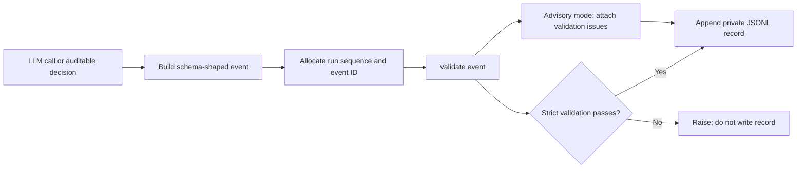

# Decision capture

Decision capture records why the pipeline selected an action, not just what it
produced. The canonical event shape is
[`schemas/events/decision_event.schema.json`](../../schemas/events/decision_event.schema.json),
and the writer is
[`lib/decision_capture.py`](../../lib/decision_capture.py).

## Required instrumentation

Every LLM call site must receive a `DecisionCapture` and emit at least one
event for each call. A batched call may emit one event for the batch when the
event identifies the batch and summarizes its dynamic outcomes.

The rationale must:

- contain at least 20 characters;
- explain why the recorded choice followed from that call's evidence; and
- include dynamic signals such as artifact identifiers, model settings,
  token limits, completion status, scores, counts, or confidence
  distributions.

Static boilerplate does not satisfy the contract, even when it meets the
length minimum. New call sites require regression coverage proving that the
event fires on success and on any separately meaningful failure path.

## Event identity and order

Each emitted record carries three complementary identity fields:

- `run_id` groups events into one pipeline run. An active run context is
  authoritative; standalone captures use the configured run identifier or a
  generated session-scoped fallback.
- `seq` is allocated per run identifier and increases monotonically within the
  current process. Allocation is thread-safe.
- `event_id` is a collision-resistant identifier in the schema's
  `EVT_<hex>` form.

Use `(run_id, seq)` to replay in-process event order and `event_id` to refer to
one event. Do not infer a distributed global order from timestamps or from
sequence values allocated by separate processes.



The labels describe every state; color is not required to understand the
diagram.

## Canonical event shape

The schema requires:

| Field | Contract |
|---|---|
| `run_id` | Run or fallback session identity. |
| `timestamp` | ISO 8601 event time. |
| `operation` | The action being performed; inferred from `decision_type` when omitted by the caller. |
| `decision_type` | A value from the schema enum. |
| `decision` | The selected action or outcome; must not be empty. |
| `rationale` | Dynamic explanation with a minimum length of 20 characters. |

The writer adds the event and sequence identifiers plus contextual fields such
as tool, phase, course, module, artifact, and task identifiers. Optional
evidence fields include confidence, input references, output pointers, model
features, outcome signals, and metadata.

`confidence`, when present, is between zero and one. `inputs_ref` and `outputs`
are pointers with provenance metadata; they are not a place to duplicate full
source or generated artifacts.

### Alternatives

`alternatives_considered` is an array of objects. Each object may carry:

```json
{
  "option": "candidate strategy",
  "score": 0.72,
  "reason_rejected": "Lower groundedness than the selected candidate"
}
```

Use an empty array when no meaningful alternative existed. Do not pass a list
of bare strings: it does not satisfy the canonical schema. Scores are optional
and must remain numeric when supplied.

### Input and output references

An input reference requires `source_type` and `path_or_id`; it may also include
a content hash, hash algorithm, excerpt or byte range, and size. An output
pointer requires `artifact_type` and a run-relative `path`; hashes, size, and
metadata are optional.

Prefer stable identifiers and hashes over copied content. References must not
introduce credentials, private corpus text, machine hostnames, or absolute
operator paths into tracked fixtures or documentation.

## Validation and quality behavior

The decision type registry is loaded from the schema. Add a new type to the
schema in the same change that adds its first emitter; do not create an
unregistered free-form type.

Decision validation has three modes:

- when `VALIDATE_DECISIONS` is disabled, schema validation is skipped;
- with validation enabled and strict mode off, issues are attached to
  `metadata.validation_issues` and the record is still written; and
- with `DECISION_VALIDATION_STRICT=true`, an invalid event raises `ValueError`
  and is not appended or written.

Validation is enabled by default. The setting is resolved when the constants
module is imported, so tests that change it after import must reload the
owning modules or isolate the process.

Quality assessment is separate from schema validity. The writer assigns a
quality level from rationale depth and the presence of input references and
alternatives. A below-target record is retained for audit but marked
`metadata.quality_gate_passed=false`, allowing downstream corpus construction
to exclude it without erasing operational evidence.

Capture failure must not be mistaken for model success. A call site may keep
capture writing best-effort only when its owning operation explicitly permits
that behavior; tests must prove the primary result and the missing telemetry
remain distinguishable.

## Storage and privacy

Streaming capture writes JSONL records to the canonical LibV2 training-capture
area and to the compatibility mirror under `runtime/training-captures/`. When
an active run context exists, it also writes a run-scoped decision stream under
that run's state directory. Phase names are normalized for directory names;
an absent phase uses the `unknown` bucket.

These locations contain operator-private telemetry. They may reveal corpus
identifiers, artifact paths, prompts, outputs, model choices, and operational
timing. Keep all capture trees ignored, never add their contents to source
control, and sanitize any derived example before publication. Source corpora
and generated artifacts remain private regardless of whether a capture stores
only a reference to them.

`ED4ALL_TRAINING_CAPTURES_DIR` relocates the compatibility mirror. The LibV2
root and compatibility-mirror root are separate settings; changing one does
not implicitly redirect the other.

Streaming writes are synchronized for threads sharing a capture. Optional
buffering reduces write frequency and drains on flush, close, and clean process
exit. A hard termination can lose the final unflushed telemetry batch, so
buffered capture is not a checkpoint or gate-verdict store.

## Adding a capture call site

1. Identify the exact LLM call or auditable decision boundary. For batching,
   define what one event represents.
2. Reuse an existing `decision_type` when its semantics match. Otherwise add a
   narrowly named schema enum value in the same change.
3. Thread the existing run-scoped capture into the call site. Do not construct
   an unrelated run identity inside a nested helper.
4. Emit a decision and dynamic rationale derived from the actual request and
   response. Include input references, output pointers, alternatives, outcome,
   and confidence when they improve replayability.
5. Avoid raw private content when a stable identifier, bounded statistic, or
   hash provides sufficient evidence.
6. Add tests that assert the event count, registered type, selected decision,
   dynamic rationale, relevant identifiers, and failure-path behavior.
7. Validate the emitted record against the schema with strict mode enabled.
8. For concurrent code, test unique event IDs, unique run-scoped sequences,
   and intact JSONL rows.

Focused regression coverage lives alongside the writer in
[`lib/tests/`](../../lib/tests/) and in
[`tests/decision_capture/`](../../tests/decision_capture/). The boilerplate
rationale detector is
[`tests/decision_capture/test_boilerplate_rationale_detector.py`](../../tests/decision_capture/test_boilerplate_rationale_detector.py).

## Related contracts

- [Agent invariants](../../AGENTS.md) define the repository-wide per-call and
  dynamic-rationale requirement.
- [Validation architecture](validation-architecture.md) explains how gate
  results and their decision events flow through workflow execution.
- [Licensing](../LICENSING.md) separates development telemetry from provider
  outputs that may become training data.
