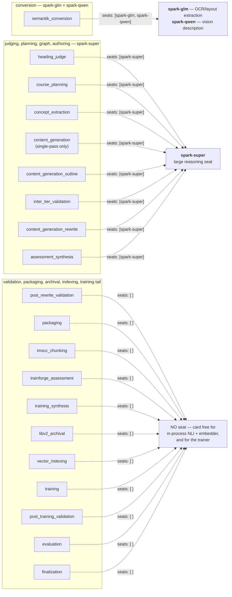
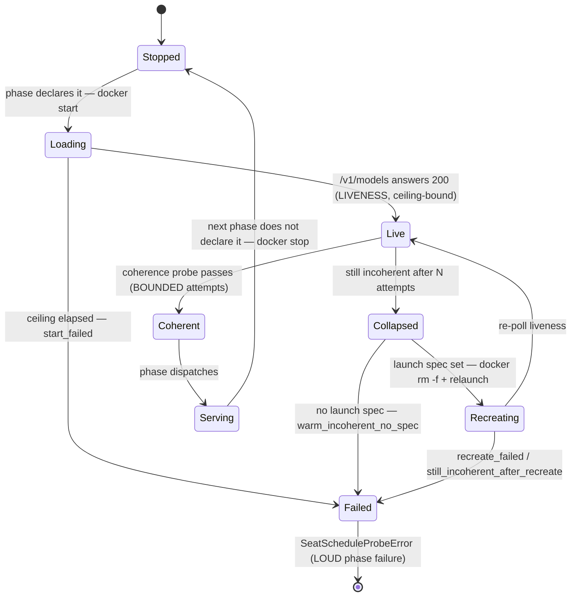
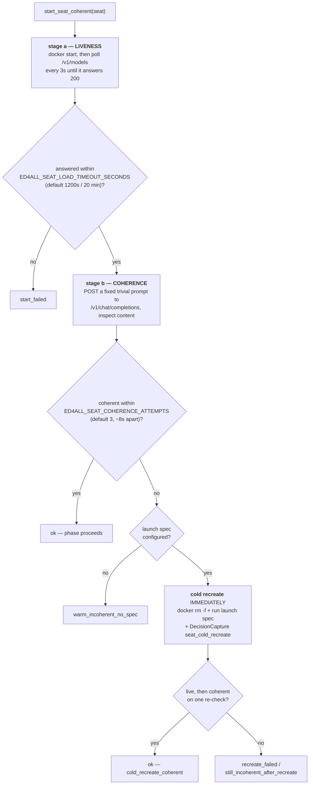

# GPU residency and the seat lease model

**Code:** `lib/gpu_lifecycle.py`, `lib/vllm_container_lifecycle.py`,
`MCP/core/workflow_runner.py` (`_gpu_lifecycle_sweep`, `_apply_seat_schedule`,
`_maybe_report_seat_schedule`, `_phase_seats`, `SeatScheduleProbeError`),
`SemantiK/semantik_structure/cascade.py` (`_gpu_lifecycle_release`).
**Config:** the `seats:` annotation on each phase in `config/workflows.yaml`,
validated by `schemas/config/workflows_meta.schema.json`.
**Relates to:** `docs/operations/behavior-flags.md` (per-flag detail),
`docs/operations/pipeline-invocation.md`,
`docs/architecture/retrieval-and-serving.md`.

A full `textbook_to_course` build runs more distinct models than fit on one card
at once: an OCR/layout stack, a vision captioner, a large reasoning seat, a
smaller authoring seat, a DeBERTa NLI classifier, a sentence-transformer
embedder, and a Bloom classifier. This document describes how the pipeline
decides which of them may hold VRAM at any moment.

The governing idea is a **lease**, not a pool: a model borrows the card for a
bounded span, then hands it back. Nothing negotiates for memory, waits on a lock,
or falls back to CPU when the card is busy. Two independent mechanisms implement
this at two different granularities.

---

## 1. Why not a scheduler or a lock

Both alternatives are the obvious first instinct, and both were rejected:

- **A VRAM lock / semaphore.** Workers would contend for a shared resource, so
  throughput is set by the slowest lease-holder and deadlock becomes possible. It
  also makes residency a runtime race rather than a property you can read off the
  config.
- **CPU fallback under pressure.** A stage that quietly runs a classifier on CPU
  because the card was busy produces the same artifact, hours later, with no
  signal that anything went wrong. Misconfiguration should be loud.

The lease model instead makes residency **declarative and deterministic**: the
phase sequence in `config/workflows.yaml` determines the residency sequence, and
every hand-off happens at a stage or phase boundary where it is observable.

---

## 2. Seat topology — which seat backs which phase

A **seat** is a logical name for a vLLM server. Three of them are declared in
tracked repo config today: **`spark-glm`**, **`spark-qwen`**, and
**`spark-super`**. These are the literal tokens in the `seats:` annotations of
`config/workflows.yaml`, in the seat-registry docstring of
`lib/vllm_container_lifecycle.py`, and in
`MCP/core/tests/test_workflow_runner_seat_schedule.py`. `spark-super` is
additionally an endpoint-registry key in `config/endpoints.yaml`.

### Logical seat name vs. site-local endpoint — the distinction that matters

| Layer | Example | Where it lives | In this doc? |
|---|---|---|---|
| **Logical seat name** | `spark-super`, `spark-glm`, `spark-qwen` | Tracked repo config (`config/workflows.yaml` `seats:`) | **Yes** — name them |
| **Base URL** | *(site-local)* | `ED4ALL_SEAT_BASE_URLS` env registry | **No** — placeholders only |
| **Container name** | *(site-local)* | `ED4ALL_VLLM_CONTAINERS` env registry | **No** — placeholders only |

The logical name is the *only* layer the repo commits to. A logical name is
resolved at runtime — never at author time — through the env registries:
`resolve_seat_base_url(seat)` reads `ED4ALL_SEAT_BASE_URLS` to get a base URL,
then `_lookup_container(base_url)` reads `ED4ALL_VLLM_CONTAINERS` to get a docker
container. Both lookups return `None` on a miss, and a miss is treated as a
config gap (warn + skip), never as a code defect. Hardcoding a base URL or a
container name anywhere in the repo would break that indirection.

### Phase → seat, derived from `config/workflows.yaml`

`textbook_to_course` is the only workflow that carries `seats:` annotations at
all; `course_generation`, `rag_training`, and `trainforge_train` declare none on
any phase.

| Phase (dispatch order) | `seats:` |
|---|---|
| `semantik_conversion` | `[spark-glm, spark-qwen]` |
| `heading_judge` | `[spark-super]` |
| `staging` | *(key absent)* |
| `chunking` | *(key absent)* |
| `objective_extraction` | *(key absent)* |
| `source_mapping` | *(key absent)* |
| `course_planning` | `[spark-super]` |
| `concept_extraction` | `[spark-super]` |
| `content_generation` | `[spark-super]` |
| `content_generation_outline` | `[spark-super]` |
| `inter_tier_validation` | `[spark-super]` |
| `content_generation_rewrite` | `[spark-super]` |
| `assessment_synthesis` | `[spark-super]` |
| `post_rewrite_validation` | `[]` |
| `packaging` | `[]` |
| `imscc_chunking` | `[]` |
| `trainforge_assessment` | `[]` |
| `training_synthesis` | `[]` |
| `libv2_archival` | `[]` |
| `vector_indexing` | `[]` |
| `training` | `[]` |
| `post_training_validation` | `[]` |
| `evaluation` | `[]` |
| `finalization` | `[]` |

The last three are the opt-in `--with-training` tail. `training` annotates
`seats: []` for a stronger reason than the phases above it: the trainer wants
the WHOLE card, so every vLLM seat must be down before it loads (the campaign
harness enforces the same invariant by `docker stop`-ing every registered seat
first). An empty list is the explicit "this phase needs NO seat" annotation —
distinct from an absent key.

That reads as three regimes: the conversion pair on `semantik_conversion`, the
single large reasoning seat `spark-super` across judging, planning, graph, and
the whole authoring span, and no seat at all from `post_rewrite_validation`
onward. The YAML comment on the conversion phase states the division of labour
within the pair — the cascade "extracts on the GLM-OCR seat and describes on the
Qwe3-VL seat" [*sic*, as spelled in config] — and notes that the cascade's own
internal Super judge is managed inside the cascade, not by the seat schedule.



Four phases — `staging`, `chunking`, `objective_extraction`, `source_mapping` —
carry **no** `seats:` key at all. They are deterministic, LLM-free transforms
with no opinion about residency, so seat state simply carries forward across
them.

`content_generation` and the four two-pass phases (`content_generation_outline`
through `post_rewrite_validation`) are mutually exclusive paths: `COURSEFORGE_TWO_PASS`
selects one, so only one branch's seat needs are ever exercised in a given run.

From `post_rewrite_validation` onward every phase declares `seats: []`, because
validation, packaging, chunking, archival, and indexing want the card free for
the in-process NLI and embedding work rather than held by an idle `spark-super`.
The YAML comments on those lines say exactly that: *"seat-free range — GPU
belongs to NLI/embedding, Super retired."*

### The lifecycle of one seat



---

## 3. Mechanism 1 — the lifecycle sweep (in-process + ollama)

`ED4ALL_GPU_LIFECYCLE`, default **ON**. This is one of very few default-on flags
in the tree; it earns that because it touches residency and timing only, never an
output byte.

Resolution is parse-with-fallback biased toward the default: only the explicit
falsey tokens (`0` / `false` / `no` / `off`, case-insensitive) disable it. Unset,
blank, garbage, or truthy all keep the lease behavior. Opt out with
`ED4ALL_GPU_LIFECYCLE=0` only when deliberately trading residency churn for speed
on a card with headroom.

### Two arms

`lib/gpu_lifecycle.py` exposes two independent release arms:

- **`release_ollama_models(base_url=None, stage=None)`** — enumerates resident
  models via `GET {root}/api/ps` and unloads each with a `keep_alive:0` generate
  request, returning the names it successfully asked to unload. It delegates to
  the existing `lib/llm/vram_reclaim` primitives rather than forking that parser.
  Evicted models lazy-reload on the next generation request, so a release is a
  card **hand-off**, not a teardown — eviction costs a reload, never correctness.
- **`release_torch(stage=None)`** — runs every unloader registered through
  `register_releaser`, then `gc.collect()` + `torch.cuda.empty_cache()`.

The honest limit on the second arm, stated in the module itself: `empty_cache`
frees the allocator **cache**, not weights held by a live in-process singleton.
Only a registered unloader genuinely evicts such a singleton. **The registry is
currently empty** — no production module calls `register_releaser` today, so the
torch arm reclaims cached allocator memory but does not itself unload the NLI
classifier or the sentence embedder. Wiring those unloaders is a listed
follow-up in the module docstring, not shipped behavior. In practice the seat
schedule (§4) covers the hand-off that matters, because it stops the *server*
rather than trying to evict from inside the process.

Both arms are **best-effort and never raise**. A missing `httpx`, a down ollama
server, a malformed `/api/ps` response, or a failed unload all degrade to an
empty or partial result. A hand-off that fails leaves a model resident —
recoverable — whereas a hand-off that raises would convert a working build into a
failed one.

### Where it fires

- **Phase boundaries.** `WorkflowRunner._gpu_lifecycle_sweep(phase_name)` runs
  the blocking sweep off the event loop via `asyncio.to_thread`. It is called at
  three sites in `run_workflow` — after a phase completes successfully, and on
  each of the two graceful-stop breaks — and is wrapped so a sweep failure logs a
  warning and never alters `final_status`. It never fires between tasks inside a
  phase, after a failed phase (those break out first), or on a resume-skipped
  phase.
- **SemantiK cascade stage seams.** `cascade.py::_gpu_lifecycle_release` fires at
  five named intra-conversion seams: after the Stage-6b captioner, between
  Stage-5e and Stage-6, after Stage-6, after the Stage-12 theta pass, and after
  the second-pass/OCR-repair stage. Conversion loads several models in sequence
  inside a single pipeline phase, so phase-boundary sweeps alone would be too
  coarse.

Ordering at a phase boundary: the VRAM doctor's `"after"` snapshot runs **first**
(recording true end-of-phase residency), then the sweep — so a trajectory reads
as end-of-phase residency, then the hand-off.

### `stage_lease` — the context-manager form

```python
with stage_lease("vlm-extract", ollama=True, torch=True):
    ...  # stage body
```

Yields immediately; releases the selected arms on exit **including when the body
raises**. The body's own exception still propagates afterward — the lease never
substitutes its own failure for the stage's. When the lifecycle mode is off this
is a pure no-op: the body runs and no release fires, so the flag-off path is
byte-identical control flow. The `ollama` / `torch` selectors let a stage skip a
pointless probe (a captioner that only touched torch weights passes
`ollama=False`).

---

## 4. Mechanism 2 — the seat schedule (containerized vLLM seats)

`ED4ALL_SEAT_SCHEDULE`, default **off**. Where mechanism 1 evicts models from a
running server, this one starts and stops the servers themselves.

Three registries, all env-driven so a new seat is a config entry and never a code
change:

| Registry | Env var | Token shape | Purpose |
|---|---|---|---|
| Seat → base URL | `ED4ALL_SEAT_BASE_URLS` | `seat=url,seat=url` | Resolves a logical name to an endpoint |
| Base URL → container | `ED4ALL_VLLM_CONTAINERS` | `url=container,url=container` | Resolves an endpoint to a docker container |
| Seat → launch spec | `ED4ALL_SEAT_LAUNCH_SPECS` | `seat=<script path or command>` | Enables cold recreate (self-heal) |

The left-hand side of the first and third registries is the tracked logical seat
name; everything on the right-hand side is site-local and is deliberately shown
here as placeholders only:

```sh
# Logical names are repo config. URLs, ports, container names, and script
# paths below are PLACEHOLDERS — substitute your own deployment's values.
ED4ALL_SEAT_BASE_URLS="spark-super=<SUPER_URL>,spark-glm=<GLM_URL>,spark-qwen=<QWEN_URL>"
ED4ALL_VLLM_CONTAINERS="<SUPER_URL>=<super-container>,<GLM_URL>=<glm-container>,<QWEN_URL>=<qwen-container>"
ED4ALL_SEAT_LAUNCH_SPECS="spark-super=<path/to/launch-super.sh>;spark-glm=<path/to/launch-glm.sh>"
```

Base URLs are stored **root-relative** — `_probe_ready` appends `/v1/models`
itself and `parse_seat_registry` strips a trailing `/`, so the registry value
must not already carry a `/v1` suffix. The `ED4ALL_VLLM_CONTAINERS` keys must
match those normalized base URLs exactly, since `_lookup_container` is a plain
dict lookup on the `rstrip("/")`-normalized string.

Every parser is fail-soft: a malformed token is skipped with a one-time warning,
so a partly-garbage registry still yields its valid pairs. The launch-spec parser
splits on `;` when present (a launch command may contain `,`) and splits each
token on its **first** `=` only, so a spec may itself contain `=`.

Docker is invoked directly; on a permission-shaped failure the call is retried
once through `sg docker -c "docker ..."`, so a box that needs docker-group
wrapping still works.

### Declaring residency in `config/workflows.yaml`

Three states, and the distinction between the last two is the one people get
wrong:

| Annotation | Meaning |
|---|---|
| `seats: [spark-super]` | This phase needs exactly these seats resident |
| `seats: []` | This phase explicitly needs **no** seat — free the card |
| *(key absent)* | **No opinion.** Seat state carries over from the prior phase unchanged |

`_phase_seats(workflow_type, phase_name)` returns `None` for the absent case and
a list otherwise. It is deliberately **workflow-scoped**, unlike the older
`_phase_yaml_block` helper, which returns the first phase matching a name across
all workflows and therefore collides on names shared between `course_generation`
and `textbook_to_course` — `assessment_synthesis` exists in both.

### Reconciliation at the phase boundary

`_apply_seat_schedule` runs at each phase **start**, after the skip / optional /
dependency guards (so a skipped phase never spins a seat up) and before the phase
dispatches. Blocking docker and HTTP work is offloaded via `asyncio.to_thread`.

`_apply_seat_schedule_blocking(phase_name, desired, current_seats, run_dir)`
computes the transition:

1. **First scheduled phase.** When `current_seats` is `None`, seat state is
   unknown, so *every registered seat* not in `desired` becomes a stop candidate.
   The run begins from a clean, known state rather than trusting whatever a
   previous run left resident.
2. **Stop** `known - desired`, best-effort. A stop failure logs and continues —
   the worst case is a seat holding VRAM it should have freed, a performance
   problem rather than a correctness one.
3. **Start** `desired - current`, via `start_seat_coherent`. A seat name absent
   from `ED4ALL_SEAT_BASE_URLS` is a config gap: warn and skip, never a
   run-failing error. If the seat is genuinely required, the pipeline's own
   provider call surfaces a hard error later.

Concretely, at the first phase that declares `spark-super` — `heading_judge` when
that optional phase is enabled, otherwise `course_planning`, since reconciliation
runs *after* the skip guards — the desired set goes from `{spark-glm,
spark-qwen}` to `{spark-super}`, so both extraction seats are stopped and
`spark-super` is started. `spark-super` then stays resident through
`assessment_synthesis` — every intervening seat-declaring phase names it, so those
phases all declare it, so it is in `desired` each time and is never a start or a
stop candidate. It is stopped once, at the `post_rewrite_validation` boundary,
where `desired` becomes empty.

Note the flag split: `start_seat` / `stop_seat` / `recreate_seat` are **not**
gated by `ED4ALL_VLLM_CONTAINER_LIFECYCLE` — the seat-schedule caller owns the
on/off decision, so the schedule can drive docker even when the standalone
workflow-end container lease is off. Only `ensure_serving` / `release` /
`release_all` are gated by that separate flag.

### The two-phase health check

This is the part that exists because **`/v1/models` answering 200 is not evidence
a seat works.** A vLLM seat warm-started via `docker start` can come up live and
still emit null or degenerate content — mode collapse. A liveness-only check
hands that seat a whole phase of work and produces garbage that passes structural
gates while being semantically empty.

So a start is two checks with **different budgets**, and the difference is the
whole point:



**Liveness is ceiling-bound.** The poll runs every 3s and returns the instant the
seat answers; the 1200s default (`_DEFAULT_SEAT_LOAD_TIMEOUT_SECONDS`) is a
ceiling, not a sleep, sized so the largest declared seat — `spark-super`, an
NVFP4 120B-class MoE per its `config/endpoints.yaml` entry — has room for a cold
load. A progress line is logged every 30s so a long wait is visibly advancing
rather than hung.

**Coherence is deliberately NOT ceiling-bound.** It is bounded by a *count* of
attempts (`_DEFAULT_SEAT_COHERENCE_ATTEMPTS = 3`, ~8s apart), not by the liveness
timeout. That asymmetry is the design: a genuinely slow `spark-super` load
legitimately needs the full 20 minutes, but a mode-collapsed seat is
live-but-incoherent and detectable in **seconds**. Letting coherence ride out the
liveness ceiling would turn a 30-second recovery into a 20-minute stall. So after
three failed probes the schedule cold-recreates immediately.

`_looks_coherent` is intentionally permissive about *what* the model said and
strict only about whether it said anything at all. It rejects `None`, empty or
whitespace-only content, content with no alphanumeric character, and single-glyph
repetition soup. It is a null/soup detector, not a quality judgment — a bad
answer to the probe passes, and should, because judging answer quality is not
this check's job.

The probe itself is a fixed trivial prompt at `temperature 0` with a small token
cap. Any coherent seat can satisfy it.

### Self-heal, then fail loudly

A warm seat that comes up live but incoherent is **automatically cold-recreated**
— `docker rm -f` plus a relaunch through its `ED4ALL_SEAT_LAUNCH_SPECS` entry —
and re-checked once, emitting a `seat_cold_recreate` decision capture whose
rationale interpolates the seat, endpoint, container, reason, reload seconds, and
whether the relaunch command returned zero. This turns a manual cold-restart into
pipeline behavior.

If the seat still cannot come up coherently, or has no launch spec to recreate
from, `SeatScheduleProbeError` fails the phase **loudly**. The error messages name
the reason explicitly — `start_failed`, `recreate_failed`,
`warm_incoherent_no_spec`, `still_incoherent_after_recreate` — and say why
failing beats continuing: *"Failing the phase LOUDLY rather than running it
seat-starved."*

This is the one place in the residency machinery that is allowed to change
`final_status`. Every other hook here is best-effort by contract. The asymmetry
is intentional: a failed *release* wastes memory, while a failed *acquisition*
would silently produce a phase's worth of empty artifacts.

### Observability

`_maybe_report_seat_schedule` logs the full phase → seat plan once at workflow
start: every phase in dispatch order with its declared seats, `[]` rendered as
`NO seat — GPU free`, and an absent annotation rendered as
`(no opinion → <carried seats>)` so the carry-forward is visible rather than
inferred. It also lists any declared seat name unmapped in
`ED4ALL_SEAT_BASE_URLS`, surfacing a config gap before the run reaches the phase
that needs it. Pure observability — no docker, no network — and a no-op unless
the flag is on.

---

## 5. How the two mechanisms compose

They operate at different layers and do not coordinate:

- The **seat schedule** decides which vLLM *servers* exist during a phase.
- The **lifecycle sweep** evicts models from *within* a running ollama server and
  releases the torch allocator cache.

In practice the seat schedule makes much of the in-phase contention handling
moot. `ED4ALL_NLI_EVICT_FOR_CUDA` (default on) exists to evict a resident ollama
model so NLI can take the card; with the seat schedule enforcing the hand-off at
the phase boundary, the card is usually already free before NLI loads. That flag
is retained as the in-phase fallback for the case where generation and NLI share
one phase, or where the lifecycle sweep is opted off.

A third, coarser lease also exists: `ED4ALL_VLLM_CONTAINER_LIFECYCLE` (default
off) calls `release_all` at workflow end — the one unambiguous "done serving"
boundary — stopping every registered container so no seat holds VRAM after the
run.

---

## 6. Metering

Residency is measured, not assumed:

- `ED4ALL_VRAM_DOCTOR` writes `state/runs/<RUN_ID>/vram_trajectory.jsonl`, one
  row per sample carrying `run_id`, `phase`, `when` (`before` / `after`), `ts`,
  `event`, `free_mib`, `total_mib`, `probe_source`, `resident_models`, and
  `cuda_available`. The aggregator below reads `ts`, `phase`, and
  `resident_models`. The lifecycle
  sweep contributes a `lifecycle_sweep` row at each hand-off carrying the evicted
  model names — but only when the doctor flag is also on. The trajectory write is
  best-effort.
- Seat load timings are appended to `<run_dir>/model_load_events.jsonl` by
  `record_load_event`, one row per measured load
  (`{ts, base_url, container, load_seconds}`). Written from `start_seat`,
  `recreate_seat`, and `ensure_serving` when a run dir is known.
- `BuildCostAggregator` (`lib/aggregators/build_cost.py`) joins the trajectory
  samples to the per-phase wall-clock windows from
  `state/runs/<RUN_ID>/checkpoints/*.json` and reports a per-phase residency span
  and peak resident VRAM. **An absent trajectory file omits the GPU section
  entirely** rather than reporting zeros — a run without `ED4ALL_VRAM_DOCTOR`
  produced no measurement, and saying so is honest where reporting 0 MiB would
  not be.
- `ed4all doctor`'s `gpu_profile` group treats a box above
  `ED4ALL_BIG_MEMORY_MIN_MIB` (default 49152, 48 GiB) as a concurrent-serving
  host and emits **advisory** warnings for small-box defaults left on — including
  `ED4ALL_GPU_LIFECYCLE` and `ED4ALL_NLI_EVICT_FOR_CUDA`. On a card with room for
  several resident seats, the lease's eviction churn costs reload time and buys
  nothing. Below the threshold, or when the GPU cannot be probed, the group is a
  silent no-op.

---

## 7. Invariants a change here must preserve

1. **Residency never changes an output byte.** Every mechanism here is timing and
   memory only. This is what justifies `ED4ALL_GPU_LIFECYCLE` defaulting on, and
   what any new arm must also satisfy.
2. **Flag-off is byte-identical control flow.** Not merely equivalent output —
   the release path must not run at all.
3. **Hand-off failures degrade; starvation fails loudly.** A failed *release*
   logs and continues. A failed seat *acquisition* raises.
4. **Liveness is never taken as health.** Any new seat type needs a content
   probe, not just an endpoint check — and that probe must be bounded by attempt
   count, not by the load ceiling.
5. **Seats are registry data, never subclasses.** Adding a seat is an entry in
   `ED4ALL_SEAT_BASE_URLS`, `ED4ALL_VLLM_CONTAINERS`, and
   `ED4ALL_SEAT_LAUNCH_SPECS` plus a `seats:` annotation — never a new class.
   This mirrors the OpenAI-compatible provider-registry rule.
6. **Only the logical name is tracked.** `spark-super`, `spark-glm`, and
   `spark-qwen` belong in repo config and in docs, because they are what
   `config/workflows.yaml` declares and what a reader will actually see. Base
   URLs and container names are site-local env-registry values and must never be
   committed — hardcoding either one defeats the indirection that makes a seat
   portable across deployments.
7. **A seat with no launch spec cannot self-heal.** That is a config choice with
   a consequence: such a seat's mode collapse fails the phase instead of
   recovering.
