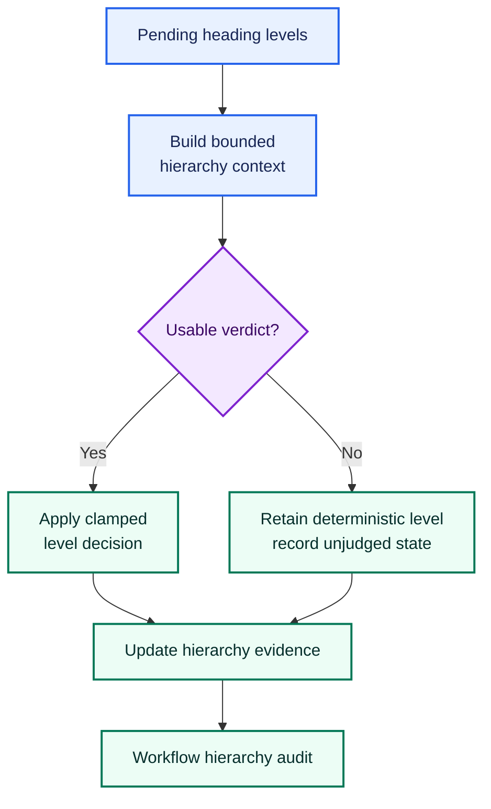
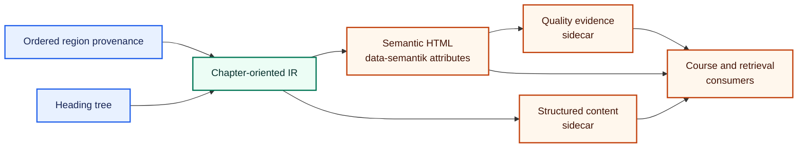
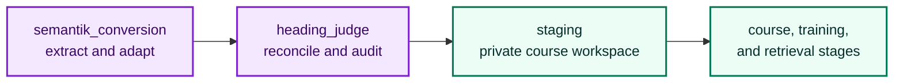

# GLM-OCR extraction architecture

SemantiK's preferred PDF converter uses the GLM-OCR SDK to recover page
regions, then hands those regions to deterministic code for normalization,
enrichment, provenance, and HTML publication. Model-backed components have
bounded jobs; they do not own the final document contract.

This document describes the extraction boundary. See the
[SemantiK architecture](../../SemantiK/architecture.md) for the complete
subsystem and the [block ontology](block-ontology.md) for downstream semantic
types.

## Route selection

The GLM-OCR lane is the preferred route for new PDF conversions, but it is
currently explicit and default-off:

```bash
export SEMANTIK_GLMOCR_LANE=1
export SEMANTIK_GLMOCR_BASE_URL="<OPENAI_COMPATIBLE_OCR_ENDPOINT>"
export SEMANTIK_GLMOCR_MODEL="<GLM_OCR_MODEL_ID>"

ed4all convert "<PRIVATE_INPUT_PATH>" --output "<PRIVATE_OUTPUT_DIR>"
```

Inputs, output paths, endpoint details, model identifiers, and generated
artifacts are deployment data. Keep them outside the public repository. The
example uses placeholders intentionally.

When `SEMANTIK_GLMOCR_LANE` is unset or false, `run_pipeline_v2` enters the
reachable compatibility converter. It is retained for existing deployments
and artifacts, but is not the preferred architecture for new conversions.
Both routes converge on the same Ed4All adapter contract.

## Preferred extraction flow

```mermaid
flowchart LR
    PDF["Private source PDF"] --> RENDER["Render ordered<br/>page images"]
    RENDER --> SDK["GLM-OCR SDK<br/>layout and region OCR"]
    SDK --> NORMALIZE["Normalize SDK results<br/>into page regions"]
    NORMALIZE --> TRANSFORM["Deterministic transform<br/>structure and enrichment"]
    TRANSFORM --> INLINE["Inline heading judgment<br/>bounded level decisions"]
    INLINE --> SIDECARS["Layout and escalation<br/>sidecars"]
    SIDECARS --> ADAPTER["Ed4All adapter<br/>HTML and provenance"]

    classDef input fill:#E8F1FF,stroke:#2563EB,color:#172554,stroke-width:2px;
    classDef model fill:#F3E8FF,stroke:#7E22CE,color:#3B0764,stroke-width:2px;
    classDef deterministic fill:#ECFDF5,stroke:#047857,color:#052E2B,stroke-width:2px;
    classDef artifact fill:#FFF7ED,stroke:#C2410C,color:#431407,stroke-width:2px;
    class PDF,RENDER input;
    class SDK,INLINE model;
    class NORMALIZE,TRANSFORM,ADAPTER deterministic;
    class SIDECARS artifact;
```



Color reinforces component ownership, but each node is independently labeled
and the diagram does not rely on color to convey meaning.

### 1. Page rendering

`SemantiK/semantik_structure/glmocr/sdk_client.py::render_pdf_to_pngs`
renders every PDF page to an isolated directory in source order. The rendered
images preserve the page geometry needed for layout recovery. A missing
renderer or failed render is an error; SemantiK does not silently substitute a
lower-fidelity extractor.

### 2. SDK extraction

`SdkGlmOcrClient` invokes the self-hosted `glmocr` SDK. The SDK performs layout
detection and region OCR, returning ordered page results with native labels,
bounding boxes, and extracted content. SemantiK retains instructional asides,
references, and footnotes that the SDK could otherwise treat as furniture.

The client then normalizes the SDK response into `GlmPage` records. This is a
shape conversion, not an authoring pass: it preserves the page number, region
order, native label, geometry, extracted content, image path, and any page
error.

### 3. Deterministic transform and enrichment

`SemantiK/semantik_structure/glmocr/transform.py::transform_document` maps
normalized SDK regions into the stable SemantiK wire contract. It owns:

- canonical region kinds and emission order;
- initial heading levels and the heading tree;
- apparatus, caption, figure, table, math, and exercise structure;
- source-page and region identity;
- cross-page continuation handling; and
- escalation records for unresolved structure.

This transform is deterministic and does not ask a language model to rewrite
source prose. Enrichment is additive: it can attach structure or descriptions,
but the extracted content and its provenance remain inspectable.

Optional figure description generation is separately selected with
`SEMANTIK_ALTTEXT_PROVIDER`; it is off by default. Documentation must not imply
that every GLM-OCR conversion includes generated alt text.

## Heading judgment at two boundaries

Ambiguous heading candidates can retain a deterministic provisional level.
The Super heading judge resolves only that bounded metadata; it does not own
source text or general document rewriting.



Judgment occurs in two places:

1. **Inline lane pass.** The default-on judge runs after deterministic
   transformation and before GLM sidecars are written. It resolves pending
   levels so the first published structure contains judgment evidence.
2. **Workflow phase.** In `textbook_to_course`, the named `heading_judge`
   phase runs after `semantik_conversion` and before staging. It processes the
   immutable GLM layout sidecars, writes judged HTML and corrected escalation
   evidence, and audits the resulting book hierarchy. Its normal scan is
   restricted to document stems owned by the current run; an unscoped scan is
   an explicit warned recovery condition.

`SEMANTIK_HEADING_JUDGE` is default-on; an explicit false value disables it.
Both judgment boundaries are fail-open by design: transport, timeout, or
response failure retains the deterministic heading levels and records the
unjudged outcome. That exception is deliberate and must not be generalized to
OCR extraction or adapter failures.

## Adapter and provenance contract

The lane's primary result is structured evidence:
`region_provenance`, `heading_tree`, and escalations. The adapter under
`lib/semantik/` turns that evidence into the shared downstream contract.



Each emitted block can retain a stable identifier, source category, physical
page coverage, normalized role, confidence, and measured accessibility status.
Source references use the public shape
`semantik:{document-slug}#{block-id}`; concrete slugs and identifiers remain
private run data.

The adapter—not an OCR or heading-judge response—owns the HTML shell,
deterministic cleanup, accessible table and math emission, and
`data-semantik-*` provenance attributes.

## Artifacts and privacy

A GLM-OCR conversion can produce:

| Artifact | Responsibility |
|---|---|
| `{stem}.glmocr_layout.json` | Immutable page-region layout and OCR backbone |
| `{stem}.glmocr_escalations.jsonl` | Pending, judged, and unresolved structure evidence |
| `{stem}_accessible.html` | Adapter-rendered semantic HTML |
| `{stem}_accessible_synthesized.json` | Structured downstream content |
| `{stem}_accessible.quality.json` | Conversion and quality signals |
| `{stem}_accessible.cascade_ir.json` | Best-effort rerenderable provenance and document evidence |

Rendered page images, optional figure assets, logs, and heading-judge backups
may also be present. Every item in this section is generated runtime data and
private by default. An artifact's existence does not establish that a check
ran or passed; consumers must inspect its recorded status.

## Accessibility posture

The preferred GLM-OCR lane currently records:

- accessibility status: `not_evaluated`;
- exit action: `ship_with_flag`.

The lane does not run the compatibility converter's candidate-generation,
document-gate, or semantic-preservation stack. Its HTML is structured for
accessibility, but the current result must not be marketed as certified WCAG
conformance. Automated evidence also never replaces expert or assistive-
technology review.

## Failure model

The architecture distinguishes extraction failure from optional judgment:

- missing rendering or runtime dependencies fail loudly;
- a document on which every OCR page fails is rejected;
- partial page failures remain typed in page and escalation evidence;
- malformed or mock-backed production results fail closed at the Ed4All seam;
- missing required provenance cannot be replaced with fabricated empty data;
- heading-judge failure retains deterministic levels and is explicitly
  reported; and
- generated output never becomes repository source merely because conversion
  succeeded.

This preserves the central trust boundary: models recover content or make
bounded proposals, while deterministic code owns identity, ordering,
publication structure, and evidence.

## Workflow position



The standalone `ed4all convert` command ends at the conversion artifacts. The
full workflow continues through the named judgment phase and downstream
private workspaces.

## Compatibility boundary

The flag-off converter remains reachable and supported for compatibility. It
has its own extraction, generation, validation, and exit machinery, but those
internals are intentionally outside this preferred-lane document. It must not
activate as an implicit fallback after a GLM-OCR failure. Route selection is an
operator decision made before conversion.

Changes on either route must preserve the adapter's public contract so
downstream course, training, citation, and retrieval components do not need to
know which converter produced a block.

## Related documentation

- [SemantiK architecture](../../SemantiK/architecture.md)
- [SemantiK overview](../../SemantiK/README.md)
- [Block ontology](block-ontology.md)
- [Decision capture](decision-capture.md)
- [Installation and dependencies](../operations/installation.md)
- [SemantiK behavior flags](../operations/behavior-flags-semantik.md)
- [Licensing posture](../LICENSING.md)
