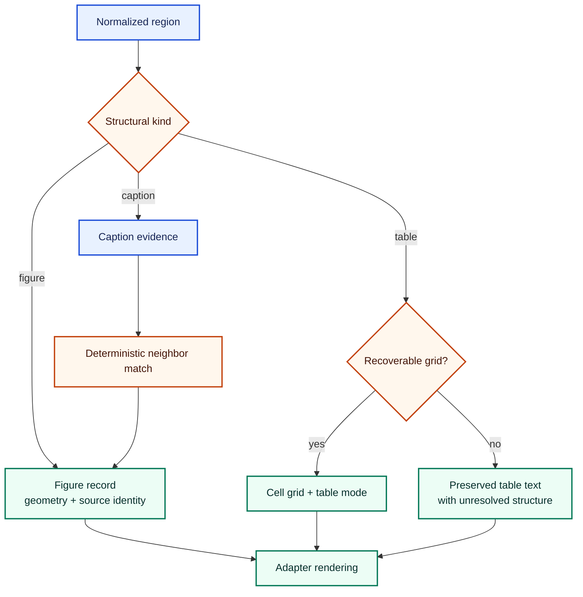
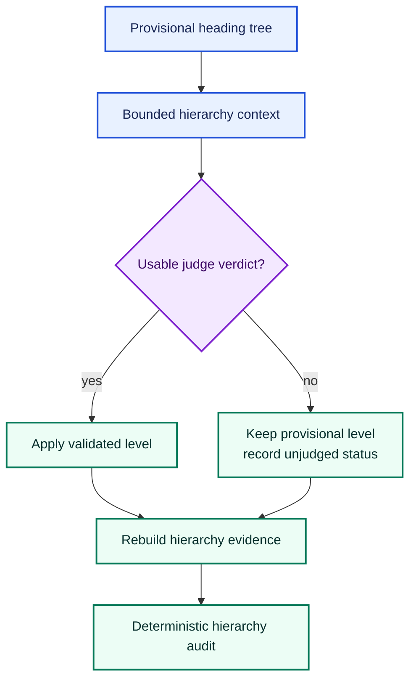

# SemantiK document-extraction architecture

SemantiK's preferred PDF design combines GLM-OCR region extraction with
deterministic normalization, structural enrichment, provenance, and accessible
HTML publication. Model-backed stages recover evidence or make bounded
proposals; deterministic code owns document identity, reading order, structure,
and the published contract.

The preferred lane is explicit rather than an automatic fallback. Existing
compatibility conversion remains reachable for deployments that have not
selected GLM-OCR, but a failed GLM-OCR run must not silently switch routes.
Operational configuration belongs in the
[SemantiK behavior reference](../operations/behavior-flags-semantik.md), not in
this architecture page.

## Current flow

```mermaid
flowchart LR
    PDF["Private source PDF"] --> PAGE["Ordered page images"]
    PAGE --> SDK["GLM-OCR SDK<br/>layout + region OCR"]
    SDK --> NORMAL["SDK result normalization"]
    NORMAL --> ENRICH["Deterministic structure<br/>and enrichment"]
    ENRICH --> JUDGE["Super heading judge<br/>bounded metadata"]
    JUDGE --> EVIDENCE["Region provenance<br/>heading tree + escalations"]
    EVIDENCE --> ADAPTER["Ed4All SemantiK adapter"]
    ADAPTER --> HTML["Accessible HTML<br/>and structured sidecars"]

    classDef input fill:#E8F1FF,stroke:#1D4ED8,color:#172554,stroke-width:2px;
    classDef model fill:#F3E8FF,stroke:#7E22CE,color:#3B0764,stroke-width:2px;
    classDef deterministic fill:#ECFDF5,stroke:#047857,color:#052E2B,stroke-width:2px;
    classDef artifact fill:#FFF7ED,stroke:#C2410C,color:#431407,stroke-width:2px;
    class PDF,PAGE input;
    class SDK,JUDGE model;
    class NORMAL,ENRICH,ADAPTER deterministic;
    class EVIDENCE,HTML artifact;
```

The sequence and labels carry the meaning; color only groups responsibilities.

### Page rendering and SDK extraction

[`sdk_client.py`](../../SemantiK/semantik_structure/glmocr/sdk_client.py)
renders pages in source order and passes them to the self-hosted GLM-OCR SDK.
The SDK combines layout detection with per-region OCR and returns native
labels, bounding boxes, extracted content, and region ordering.

SemantiK normalizes the SDK response into `GlmPage` records. Normalization is
a loss-aware shape conversion: it retains the page number, source image,
native label, geometry, region order, content, and typed page errors. It does
not rewrite the source or infer a course structure.

Rendering failures are loud. A document for which every page fails OCR is
rejected rather than published as an empty conversion. Partial page failures
remain visible in the evidence passed to later stages.

### Deterministic transformation and enrichment

[`transform.py`](../../SemantiK/semantik_structure/glmocr/transform.py) converts
normalized pages into the SemantiK wire contract:

- ordered `region_provenance` records with stable source-block identity;
- a provisional heading tree;
- structural escalation records; and
- normalized representations of prose, apparatus, figures, tables, captions,
  formulas, exercises, and document furniture.

The transform applies data-driven recognition and structural rules without
asking a language model to paraphrase source text. It may join continuations,
associate neighboring regions, or attach metadata only when the source
evidence supports that operation. Unresolved cases stay explicit rather than
being filled with invented content.

The region-enrichment utilities under
[`glmocr/region_enrichment/`](../../SemantiK/semantik_structure/glmocr/region_enrichment/)
support targeted OCR of detected regions and dataset preparation. They are not
an additional always-on stage in the preferred whole-document lane. A future
integration must declare its call site, conservation rules, and tests before
this page describes it as part of production conversion.

## Figures, captions, and tables

Figures and tables preserve both structure and source location.

For figures, the transform retains geometry and associates extracted caption
evidence without treating a numbered figure label as a section heading.
Generated descriptions are a separate optional enrichment. When no supported
description exists, SemantiK must preserve an honest unresolved state rather
than fabricate alt text.

For tables, the transform can recover a cell grid from supported markdown or
HTML-shaped OCR output. When topology is not recoverable, it preserves the
extracted text and records the limitation. It does not invent spans, headers,
or missing cells. The adapter remains responsible for accessible table markup
when structured cells are available.

## Super heading judge

Deterministic rules assign headings that are directly anchored by document
evidence and mark ambiguous levels as pending. The Super heading judge receives
only bounded hierarchy context and proposes level decisions for those
candidates. It does not rewrite headings or body prose.

The judge is wired at two boundaries:

- The in-lane pass resolves pending levels before conversion sidecars are
  written.
- The named workflow phase can replay the immutable layout sidecar, reconcile
  judged output, preserve prior figure enrichment, and audit the resulting
  hierarchy before staging.

The second boundary is intentionally idempotent when conversion already
applied the same decisions. Judge transport or response failure keeps the
deterministic provisional structure and records the unjudged condition. That
bounded fail-open rule applies only to heading-level advice; it does not permit
OCR, provenance, adapter, or required-validation failures to disappear.

## Publication and provenance

The lane's primary result is evidence, not model-authored HTML:
`region_provenance`, `heading_tree`, page layout, and escalations. The adapter
under [`lib/semantik/`](../../lib/semantik/) projects that evidence into the
shared Ed4All contract.

The adapter owns:

- the semantic document shell and reading order;
- accessible figure, table, and math rendering;
- stable `data-semantik-*` identifiers and source references;
- deterministic cleanup and structured sidecars; and
- the status consumed by Courseforge, Trainforge, citation, and retrieval
  components.

Source identifiers in published metadata use a generic SemantiK reference
shape. Concrete source names, identifiers, rendered pages, logs, caches, and
generated artifacts remain operator-private runtime data and do not belong in
the public repository.

## Capability status

| Capability | Status |
|---|---|
| GLM-OCR SDK extraction and normalization | Preferred explicit conversion lane; not an implicit fallback |
| Deterministic transform and adapter publication | Current required path after successful GLM-OCR extraction |
| Super heading-level judgment | Current bounded metadata pass; failures retain and report provisional levels |
| Generated figure descriptions | Optional enrichment; not present on every conversion |
| Region-specific OCR enrichment utilities | Available supporting utilities; not an always-on stage of the preferred lane |
| Compatibility converter | Reachable for existing deployments; selected before conversion, never after a GLM-OCR failure |
| Additional staged or learned enrichers | Future until a production call site and conservation tests prove activation |

This table describes wiring, not quality certification. Structured HTML and
automated evidence do not by themselves establish WCAG conformance. Expert and
assistive-technology review remain necessary for release claims.

## Failure and trust boundaries

The architecture preserves these boundaries:

- required rendering, OCR, adapter, and provenance failures surface loudly;
- partial OCR failures remain typed and traceable;
- optional enrichment never overwrites stronger extracted evidence silently;
- model proposals cannot mint source provenance;
- heading-judge failures retain provisional levels with explicit audit state;
- generated conversion artifacts stay private; and
- downstream consumers inspect recorded status rather than inferring success
  from a file's existence.

## Related architecture

- [SemantiK architecture](../../SemantiK/architecture.md)
- [SemantiK overview](../../SemantiK/README.md)
- [Block ontology](block-ontology.md)
- [Decision capture](decision-capture.md)
- [Installation and dependencies](../operations/installation.md)
- [SemantiK behavior reference](../operations/behavior-flags-semantik.md)
- [Licensing posture](../LICENSING.md)
