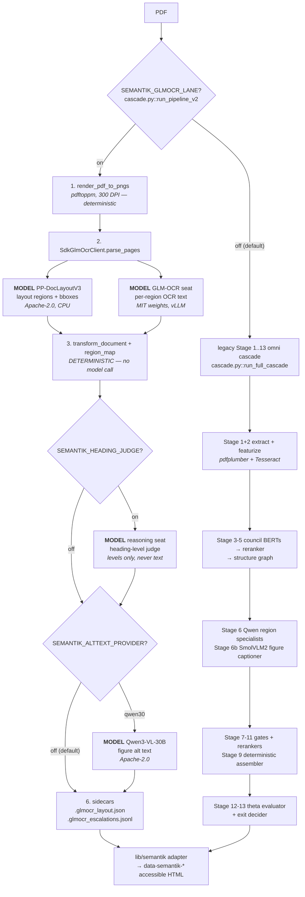

# Extraction architecture: the GLM-OCR lane

**Scope:** how a PDF becomes accessible HTML today, which model is invoked where, and why the
extractor is a dedicated OCR stack rather than OCR-plus-corrections.
**Primary code:** `SemantiK/semantik_structure/glmocr/` (`lane.py`, `sdk_client.py`, `transform.py`,
`region_map.py`, `heading_judge.py`, `heading_judge_standalone.py`, `alttext.py`, `math_normalize.py`,
`escalation.py`), reached from `SemantiK/semantik_structure/cascade.py::run_pipeline_v2`.
**Relates to:** `docs/LICENSING.md`, `docs/architecture/block-ontology.md`,
`docs/architecture/decision-capture.md`.

> § 1 states the problem that drove this design and remains accurate. §§ 2–4 describe what runs.
> § 5 records the design that was **rejected** — it is preserved because its contract analysis is still
> the clearest statement of what any replacement extractor has to satisfy, and because parts of the
> repository still carry the older assumptions. Read § 5 as history, not as instructions.

---

## 1. Why extraction is the quality ceiling

For **image-only scanned** corpora, OCR at stage 1 is the *sole* source of text. Every downstream
stage — structural typing, chunking, objective synthesis, assessment generation — operates on that
text. Whatever extraction loses is lost for the entire pipeline. A downstream authoring model cannot
reconstruct a table whose structure extraction already shredded, and cannot recover a superscript that
extraction turned into a digit.

### 1.1 The two damage classes

**A. Reading-order collapse (multi-column salad).** On a three-column exercise page, a column can
detach entirely — exercise *numbers* landing in one block and their *content* in a separate block
dozens of lines later. The number↔content binding is destroyed *before any structure decision runs*,
so no downstream stage can restore it: the information needed to re-pair them (spatial adjacency on
the page) is gone from the text stream.

**B. Math corruption that silently yields wrong answers.** Superscripts destroyed, absolute-value bars
read as letters, negative signs dropped. An answer key synthesized from `6² − 7²` mis-extracted as
`67-77` is wrong by construction. **The defect is in extraction, not generation**, so no amount of
generation-side fixing closes it.

Both classes were confirmed present in shipped downstream artifacts of previously-built scanned
courses — symbol-injected math inside factor-pair tables, and rule glyphs misread as letters in running
text — not merely on raw pages.

### 1.2 Why it went undetected: the gates are fidelity-blind

Every quality gate — text preservation, NLI groundedness, sympy math-validity, citation anchoring —
compares downstream artifacts against the **extracted text**, never against the page pixels.

```
pixels ──OCR──▶ "67-77" ──▶ chunk ──▶ objective ──▶ assessment ──▶ answer
           ▲
     corruption      text_preserve ✓  groundedness ✓  sympy-valid ✓  anchor ✓
     enters here     (every gate treats "67-77" as ground truth → PASS)
```

`67-77` is valid arithmetic, faithfully preserved, grounded, and citable — so **every gate passes** and
the corruption is laundered into "validated" output. The corollary drove the whole redesign: the
highest-leverage quality investment is **faithful extraction**, not another downstream gate.

### 1.3 Scope — do not over-attribute

This is **scan-specific**. Born-digital PDFs and vendor-HTML corpora carry a text layer and bypass OCR
entirely. Some downstream problems have unrelated roots — limited block-type variety, for instance, is
a Courseforge planning issue, generation-side. Attribute to this root cause only: math corruption,
multi-column reading-order collapse, source fragmentation, and the objective over-segmentation that
follows from fragmentation.

---

## 2. What runs today

Vision does not *correct* the OCR extractor; it **is** the extractor. The GLM-OCR lane is a
whole-document converter that owns structure end to end.

`run_pipeline_v2` branches on `resolve_glmocr_lane_mode()` (`SEMANTIK_GLMOCR_LANE`, **default off**)
before anything else. When on, it calls `_run_glmocr_lane_v2` and returns; the legacy Stage 1..13
cascade — including the `HtmlValidator`/Chromium context — is never constructed. When off, the branch
never imports the lane, so the legacy path is byte-identical.

The lane bypasses the council BERTs, the cross-reranker, `structure_graph`, the Stage-5d/5e reviewer
passes, and the theta evaluator. A layout model supplies regions and bboxes; deterministic code
supplies typing.

The reason for bypassing the learned structure heads is recorded in
`SemantiK/semantik_structure/structure_router.py`'s own module docstring: an oracle A/B against a
born-digital PDF's ToC bookmarks established that section-structure authority is **domain-conditional**.
On the tuning domain the council BERTs win section recall and chapter-title recovery; on an image-only
scan of a *new genre* they collapse (recall ~0.25, a couple of real sections buried under ~20
false-positive apparatus/pedagogical-label headings) while VLM-derived structure holds (recall ~0.875,
section order 1.0, chapter title exact). That router is the deterministic switch built to detect
off-domain and flip authority; it is gated `SEMANTIK_STRUCTURE_ROUTER`, **default OFF**, its thresholds
are explicitly marked calibration constants pending oracle validation, and the lane does not consult it.
The lane's answer to the same problem is different: replace the extractor rather than arbitrate between
two authorities. Auditable deterministic code beat learned heads on the structural decisions.

### 2.1 Lane sequence

`SemantiK/semantik_structure/glmocr/lane.py::run_glmocr_lane`, in order:

1. **Render** — `sdk_client.render_pdf_to_pngs` shells out to `pdftoppm` (poppler) at
   `SEMANTIK_GLMOCR_RENDER_DPI` (default 300). Absent `pdftoppm` raises `FileNotFoundError` — fail-loud,
   no silent degrade.
2. **Extract** — `SdkGlmOcrClient.parse_pages` drives the `glmocr` SDK (PP-DocLayoutV3 layout model,
   then per-region OCR against the GLM-OCR seat at `SEMANTIK_GLMOCR_BASE_URL`, model
   `SEMANTIK_GLMOCR_MODEL`). A document where **every** page errored raises rather than flowing an
   "empty but real" conversion into the transform.
3. **Transform** — `transform.transform_document` is deterministic and makes no model call. It
   produces `region_provenance`, `heading_tree`, and `escalations`. `region_map.classify_native_label`
   maps the layout model's 25-class `native_label` onto the SemantiK `region_kind` vocabulary; the
   transform then refines with apparatus / box-title / caption / ordinal rules.
4. **Heading judge** (optional, `SEMANTIK_HEADING_JUDGE`) — re-levels headings the transform left
   pending. Flag off → the module is never imported. (`lane.py` labels this step `3b` in-code, because
   it refines the transform's output rather than opening a new stage; § 2.3 uses the code's label.)
5. **Alt text** (optional, `SEMANTIK_ALTTEXT_PROVIDER`, default `off`) — `alttext.apply_alt_text` sends
   figure bbox crops to a Qwen3-VL seat.
6. **Sidecars** — `{stem}.glmocr_layout.json` (per-page region layout; the provenance backbone) and
   `{stem}.glmocr_escalations.jsonl`.
7. **HTML** (optional here) — the accessible HTML is normally rendered by the Ed4All conversion seam
   from `region_provenance` via the `lib/semantik` adapter; the lane can render it itself when
   `render_html=True`, which the standalone smoke uses.

### 2.2 Diagram — cascade stages and model invocation



### 2.3 Pipeline position of the heading judge

The judge runs in **two** places, and they are not redundant:

- **In-lane** (`lane.py` step 3b) — resolves pending heading levels *before* the sidecars are written,
  so the escalations sidecar records judged rows rather than unresolved pending rows.
- **As a workflow phase** — `heading_judge` is a permanent `textbook_to_course` phase sitting between
  `semantik_conversion` and `staging`, implemented at `MCP/tools/pipeline_tools.py::_run_heading_judge`
  and routed **by phase name** through `_PHASE_TOOL_MAPPING` (it declares `agents: []`, so the phase-name
  mapping is its only dispatch route). It globs `*.glmocr_layout.json` sidecars under the corpus dirs
  and shells out per chapter to `python -m semantik_structure.glmocr.heading_judge_standalone --apply`,
  then copies judged HTML and corrected escalations back over the conversion output. `.prejudge.bak` /
  `.bak` are kept; the layout sidecar is never overwritten.

Both arms **fail open**. In-lane, a judge exception is caught and logged, keeping pending levels. In the
phase, a nonzero exit or timeout increments `chapters_failed` and the build continues. With the flag off
the phase returns `skipped: true, reason: "flag_off"`; with no layout sidecars (a born-digital corpus) it
returns `reason: "no_sidecars"`. Neither is a failure.

The judge only ever changes heading **levels**, under a deterministic clamp, over a chapter's ordered
heading skeleton. It never touches text.

---

## 3. Contract dispositions

### 3.1 Provenance — honored

The lane writes `{stem}.glmocr_layout.json` and `{stem}.glmocr_escalations.jsonl`. The existing
`lib/semantik/adapter.py` renders the wire contract unchanged: `data-semantik-*` HTML attributes
(`data-semantik-block-id`, `data-semantik-source`, `data-semantik-pages`, `data-semantik-page-kind`, …).
The **CURIE** source-id form is still minted as `dart:{slug}#{block_id}`; `lib/validators/source_refs.py`
deliberately accepts both `dart:` and `semantik:` prefixes so current and legacy corpora both resolve.

### 3.2 Decision capture — partially honored

`heading_judge.py` emits one `structure_review` capture per chapter carrying a `heading_level_judge`
discriminator and a dynamic rationale (model, pending count, applied/clamped/dropped/kept tallies,
`max_tokens`, `finish_reason`, cache hit/miss, transport and parse failure counts), with regression
coverage in `SemantiK/semantik_structure/tests/test_heading_judge.py`. The deterministic transform makes
no model call and correctly wires no capture.

**Gap:** `alttext.py` is an LLM call site with **no** `DecisionCapture` — `heading_judge.py` is the only
module under `glmocr/` that references one. The equivalent legacy call site
(`SemantiK/semantik_structure/figure_captioner.py`, the omni cascade's SmolVLM2 captioner) *is*
instrumented and tested. See `docs/architecture/decision-capture.md § Known instrumentation gap`.

### 3.3 Licensing — honored, and better than the rejected design feared

The rejected design worried that model-derived extraction makes the corpus a model derivative. The
adopted stack is permissively licensed throughout: GLM-OCR weights **MIT**, the `glmocr` SDK
**Apache-2.0**, PP-DocLayoutV3 **Apache-2.0**, and the alt-text seat (Qwen3-VL-30B-A3B-Instruct)
**Apache-2.0**. Each model-selecting flag carries its row in `docs/LICENSING.md` per the maintenance
contract, and the default seats are loopback-local. The lane remains opt-in and default off.

### 3.4 Faithfulness — an accepted residual risk

The lane has **no independent second witness** on extracted text. There is no parallel deterministic
extraction to corroborate against. The posture rests on two things instead:

- the extractor is a purpose-built OCR stack, not a general VLM asked to transcribe;
- failures are recorded, not fabricated. An unreachable alt-text seat leaves a placeholder and writes a
  loud escalation row. A document where every page errored raises.

That is a mitigation, not a solution. **§ 1.2's fidelity-blind-gates critique still applies to the
lane** — no downstream gate compares lane output against page pixels.

---

## 4. Still open

- **No pixel-level fidelity gate.** A gate that samples extracted text, diffs it against the page
  image, and reports a per-corpus corruption rate was never built. It remains the only design that
  would make § 1.2's laundering visible, and it is independent of which extractor wins.
- **`region_kind` vs. the L1 block ontology.** `region_map.py` maps the layout model's 25-class
  `native_label` onto its own `region_kind` set (`heading`, `paragraph`, `figure`, `table`, `math`,
  `caption`, `footnote`, `aside`, `metadata_drop`), unreconciled with
  `schemas/taxonomies/block_kinds.json`. See `docs/architecture/block-ontology.md § Adoption status`.
- **Alt-text instrumentation** (§ 3.2).

---

## 5. History — the rejected hybrid design

A P0 measurement pass (`scripts/integration/vision_ocr_probe.py`) confirmed § 1's conclusion. The
design it fed, however, was **not** what shipped. It proposed keeping Tesseract authoritative and
bolting vision on as a corrector. It is recorded here because its contract analysis is still the
sharpest statement of what an extractor replacement must satisfy.

### 5.1 The three contracts that assumed deterministic extraction

1. **Text-preservation gate** (`SemantiK/semantik_structure/gates/text_preserve.py`) — verifies authored
   HTML text matches the *extracted source text*. This is what backed the claim that the authoring model
   only reformats, never invents. It presupposes one authoritative source text.
2. **Council geometric features** — the BERT heads consume per-block font/geometry/bbox/column features.
   A raw VLM page transcription has no per-block bboxes, so it could not replace the geometric extractor
   wholesale.
3. **License-clean-by-construction** — the legacy extraction stack (pypdfium2 + pdfplumber + pikepdf +
   Tesseract) is permissively licensed and its extracted text is not a model derivative.

### 5.2 What was proposed vs. what shipped

| Contract | Proposed | Shipped |
|---|---|---|
| Council needs deterministic geometry | Retain Tesseract for bboxes; vision supplies text only | **Council bypassed entirely.** The layout model supplies regions + bboxes; the deterministic transform supplies typing. |
| Cheap first win: image-grounded structure reviewer | Feed the page image to the existing Stage-5d reviewer | **Not built as such** — the lane bypasses that reviewer. The reasoning-model role landed instead as the heading-level judge (§ 2.3). |
| Hybrid extraction lane | Stage-1.5 per-region vision correction over retained Tesseract text | **Rejected.** Single-source extraction from a purpose-built OCR stack; no Tesseract in the lane at all. |
| Second witness | Tesseract text as an independent corroborator against hallucination | **Moot in the lane** — there is no Tesseract text to corroborate against. See § 3.4. |

### 5.3 Where the legacy path still lives

The omni Stage 1..13 cascade is not deleted — it is the default when `SEMANTIK_GLMOCR_LANE` is off, and
it is the path a born-digital or vendor-HTML corpus can still take. Its stage map is documented at the
top of `SemantiK/semantik_structure/cascade.py`, and `run_full_cascade` is its entry point. The council
package (`SemantiK/semantik_structure/council/`), the gate package
(`SemantiK/semantik_structure/gates/`), the figure captioner, and the Tesseract-backed extractors
(`extract.py`, `extract_shared.py`, `features.py`, `region_detection.py`) are all reachable on that path.
Do not treat them as dead code on the strength of the lane existing.
