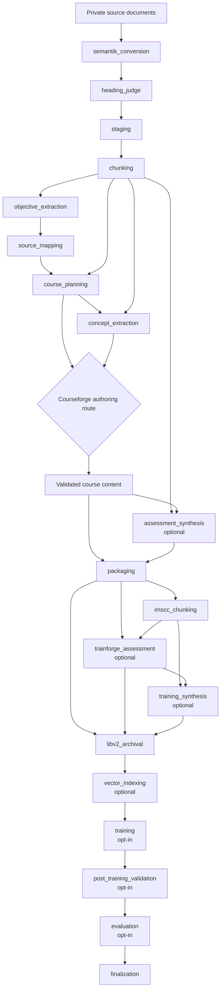
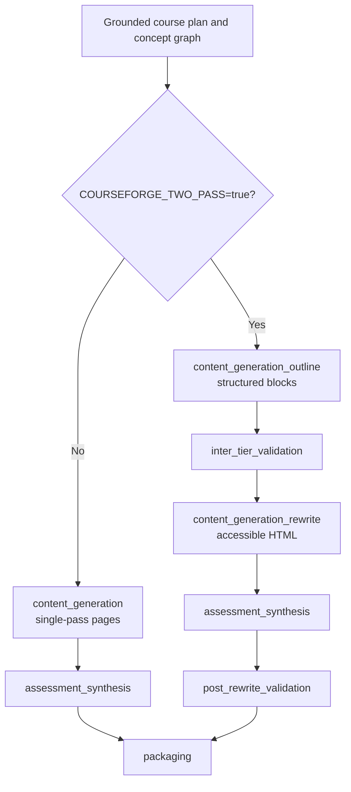

# Pipeline flow

Ed4All turns private source material into accessible courseware, retrieval
artifacts, training pairs, and—when explicitly requested—a course-pinned model
adapter. This page describes the architectural flow. The executable topology
lives in [`config/workflows.yaml`](../../config/workflows.yaml).

For operating commands, checkpoints, and recovery, use the
[pipeline invocation runbook](../operations/pipeline-invocation.md). For gate
configuration, use [validation gates](../validation/gates.md).

## Product boundaries

The labels express the flow without relying on color. Source corpora,
intermediate artifacts, course exports, training pairs, indexes, and model
outputs remain operator-private and are not repository content.

### SemantiK

SemantiK converts source documents to accessible HTML, reviews heading
structure, stages the normalized output, and emits source-aligned chunks. The
chunkset is the provenance base for planning, generation, retrieval, and later
training artifacts.

### Courseforge

Courseforge extracts source structure, maps source material to course modules,
authors grounded objectives, builds the concept graph, and produces accessible
course pages and assessments. It supports mutually exclusive single-pass and
two-pass authoring routes.

### Trainforge

Trainforge reads the packaged course and its derived chunkset, generates or
validates assessments, and produces instruction and preference pairs. Pair
synthesis is distinct from model training: skipping training synthesis prevents
pair creation, while enabling the training tail consumes an already validated
course archive and pair corpus.

### LibV2

LibV2 archives the package, chunks, graph, assessments, training specifications,
and provenance needed for retrieval and reproducible downstream work. Vector
indexing makes an archived course queryable when embedding support is
available. Optional training and evaluation attach model artifacts to this
private course record.

## End-to-end build topology

The `textbook_to_course` workflow follows dependency edges rather than assuming
that YAML list order alone is sufficient. The runner topologically sorts the
phases and applies environment-dependent dependency replacements before it
checks readiness.

Optional phases record an explicit skipped completion when their controlling
condition is not met. That keeps downstream dependency accounting honest while
preserving the fact that the phase did not produce its normal artifact.

## Conditional authoring routes

`COURSEFORGE_TWO_PASS` selects one authoring branch. The branches are mutually
exclusive.

In single-pass mode, assessment synthesis depends on generated content and the
source chunkset, and packaging depends on content plus the assessment phase. In
two-pass mode, assessment synthesis depends on rewritten content and chunks;
post-rewrite validation waits for both rewrite and assessment synthesis; and
packaging waits for that validation boundary.

The two-pass data contract is documented in
[ADR-003](ADR-003-two-pass-content-generation.md). Phase-specific dispatch is
documented in [ADR-004](ADR-004-phase-name-dispatch.md).

## Optional branches

### Assessments

Disabling assessment generation skips both the pre-package assessment synthesis
surface and the post-package Trainforge assessment phase. Their skipped state is
recorded explicitly; it is not presented as generated assessment output.

### Training pairs

`training_synthesis` normally follows the packaged-course assessment and chunk
stages. An explicit skip prevents generation of instruction and preference
pairs. Provider and model licensing rules are defined in
[Licensing](../LICENSING.md).

### Retrieval index

`vector_indexing` follows LibV2 archival. A slim installation without embedding
support may skip this optional phase with a logged reason. Strict embedding mode
runs the phase and fails closed if its backend is unavailable. The read path is
described in [Retrieval and serving](retrieval-and-serving.md).

### Adapter training tail

The in-build sequence `training` → `post_training_validation` → `evaluation` is
opt-in. It never attaches to an ordinary build implicitly. An explicit training
skip wins over the opt-in request. When the tail is skipped, each phase records
completion-as-skipped so `finalization` remains the last dependency boundary.

The standalone `trainforge_train` workflow provides training followed by its
post-training validation gate against an already archived course. Training is
operator-directed; evaluation output supports, but does not replace, the model
promotion decision.

## Other workflows

The repository also defines narrower workflows:

- `course_generation` starts from supplied objectives and produces a validated
  course package. It uses the same conditional Courseforge authoring routes.
- `rag_training` extracts a package, builds its index, generates assessments,
  and validates the result.
- `trainforge_train` trains and validates a course-pinned adapter from an
  existing LibV2 course.

These workflows share agents and internal tools with the end-to-end build, but
their phase graphs and required inputs remain independently declared in the
workflow configuration.

## Artifact and state flow

Phase outputs are named references to artifacts, not an implicit shared working
directory. The runner routes workflow parameters and earlier phase outputs into
the next tool's declared inputs. Current-phase outputs are extracted before its
validation gates run so those gates inspect the artifact they guard.

Mutable workflow state, checkpoints, logs, resume sidecars, and generated
artifacts live in ignored runtime or operator-selected data roots. Tracked code
and documentation contain schemas, configuration, and examples only. See
[Repository organization](repo-organization.md) for the publication boundary.

## Failure and validation behavior

Each phase runs its declared validation gates after task execution. A failed
critical gate fails the phase; warning gates remain visible without blocking.
Missing required inputs become structured skips rather than silent passes, and
required training-synthesis artifacts use a stricter fail-closed input rule.
Validator errors retain their configured error policy and distinct issue codes.

The runner does not substitute a different tool, weaken a gate, or invent an
artifact when a required phase fails. Missing dispatch mappings, unavailable
required backends, dependency cycles, and unresolved required artifacts surface
as explicit failures.

Detailed contracts:

- [Validation architecture](validation-architecture.md)
- [Validator contributor guide](../validation/validators.md)
- [Gate severity decision](ADR-005-gate-severity-blocking.md)

## Stop and resume

Workflow and phase checkpoints preserve completed work. Long-running tools poll
a run-scoped stop sentinel at unit boundaries, persist their unit-level resume
state, and return a paused result. The runner records `PAUSED`, does not execute
downstream phases, and leaves unfinished work pending for resume.

A resume restores durable phase outputs, skips only phases whose completion and
gate state are valid, and re-enters interrupted work through its owning resume
sidecar. Force reruns intentionally invalidate selected reuse paths. Operational
commands, sentinel handling, and recovery checks belong to the
[pipeline invocation runbook](../operations/pipeline-invocation.md).

## Completion and reporting

`finalization` is the terminal build boundary after the optional index and
training tail. Post-loop aggregators build operator-facing reports from the
persisted gate chains and artifacts. Aggregators are reporting surfaces; their
best-effort failures do not rewrite the workflow verdict. See
[Aggregators](aggregators.md) for their architecture.

## Sources of truth

- [`config/workflows.yaml`](../../config/workflows.yaml): workflow phases,
  dependencies, conditional edges, inputs, outputs, gates, and optionality.
- [`MCP/core/workflow_runner.py`](../../MCP/core/workflow_runner.py): topology,
  phase selection, parameter routing, state, stop, and resume behavior.
- [`MCP/core/executor.py`](../../MCP/core/executor.py): task dispatch,
  checkpointing, timeouts, and phase-gate execution.
- [Pipeline invocation](../operations/pipeline-invocation.md): operator-facing
  commands and recovery procedures.
