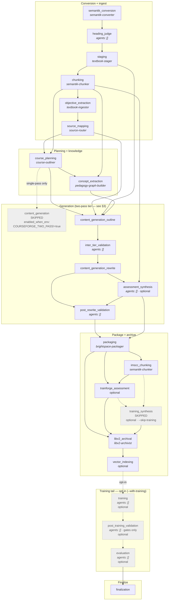
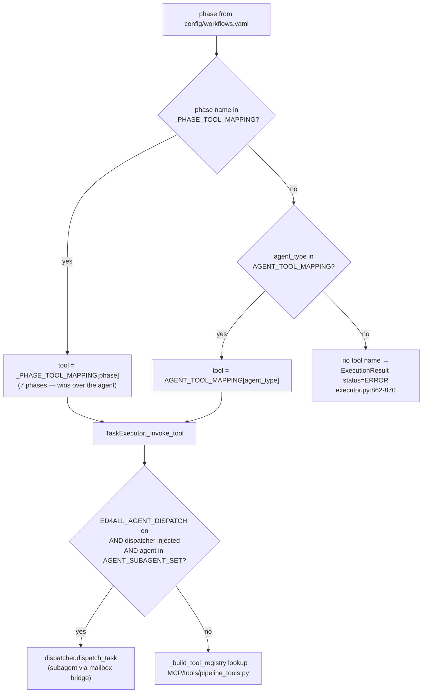
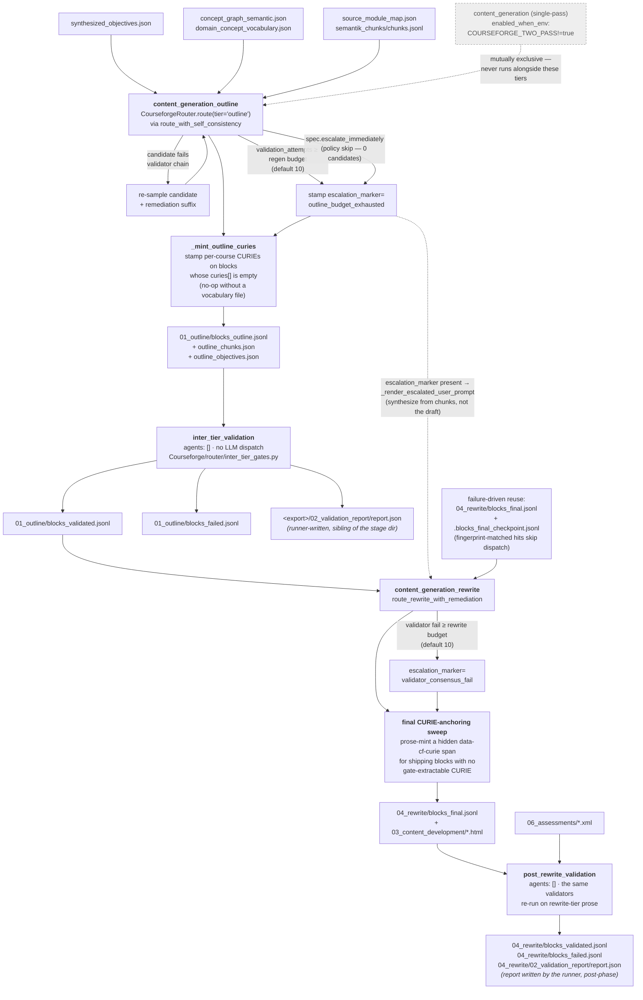
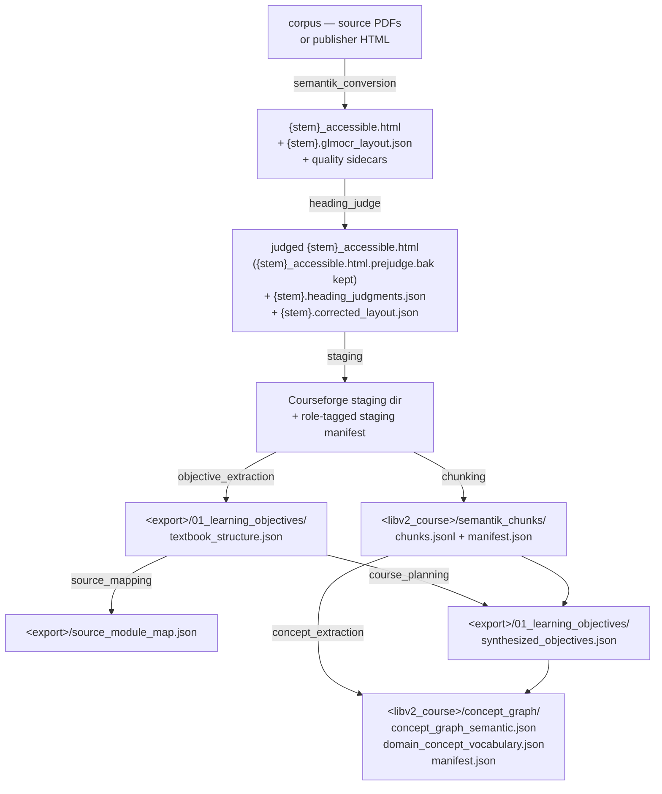
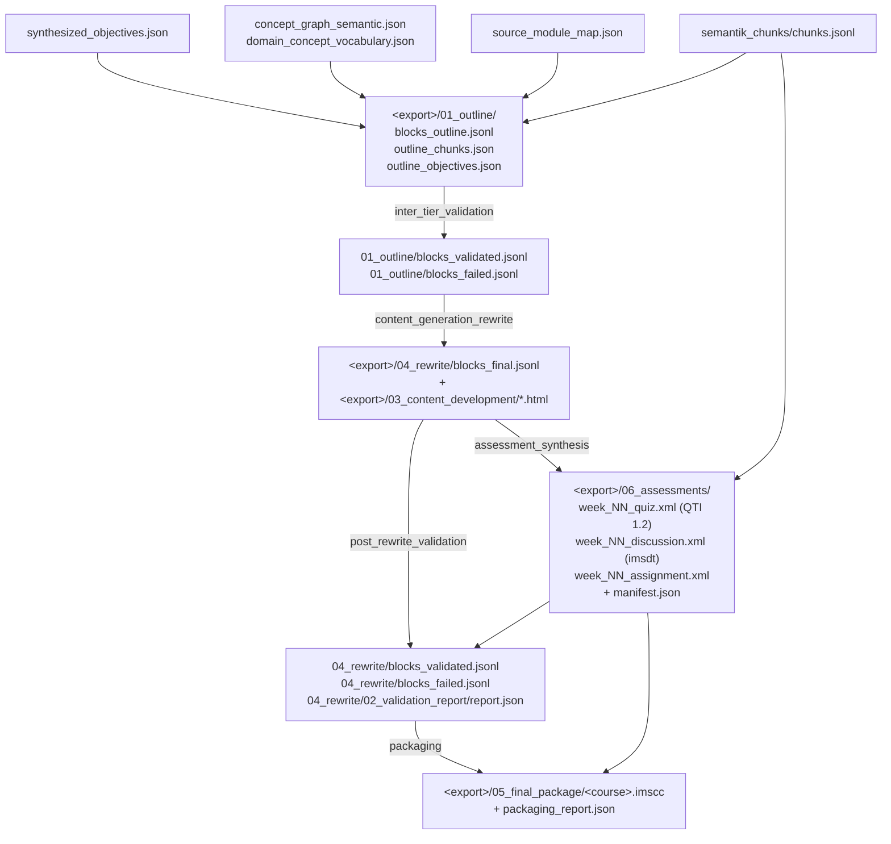
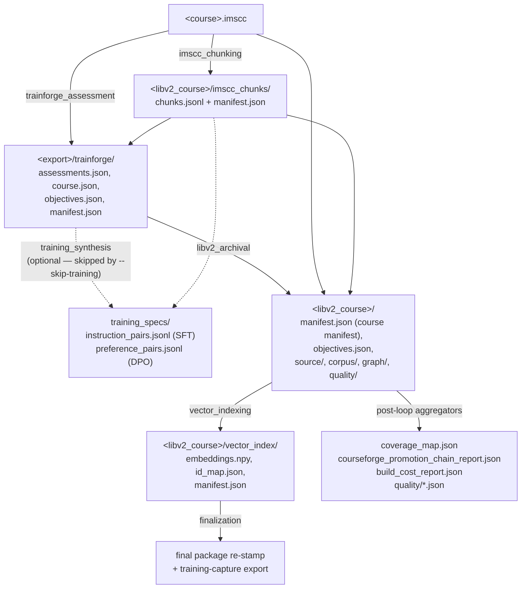

# Pipeline Flow — how `textbook_to_course` actually executes

This document describes the pipeline as it *runs*, not as the phase list reads.
Every phase name, dependency edge, and filename below was verified against
`config/workflows.yaml`, the dispatch and runner code, and the per-phase
checkpoint/state records of a completed 21-phase production run.

Line references are to the code as of the commit that added this file; treat
them as pointers to the right function, not as exact addresses.

Related: [`ADR-001-pipeline-shape.md`](ADR-001-pipeline-shape.md) (why the shape
is what it is), [`aggregators.md`](aggregators.md) (the post-loop rollups),
[`../validation/gates.md`](../validation/gates.md) (the gate table).

---

## 1. End-to-end phase flow

`config/workflows.yaml::workflows.textbook_to_course.phases` declares **21
phases**. The runner does not walk them in list order — it topologically sorts
them on their *effective* `depends_on`
(`MCP/core/workflow_runner.py::_topological_sort` → `_effective_depends_on`),
and several of those dependency lists change shape based on the environment.

The diagram below shows the graph as it resolves under `COURSEFORGE_TWO_PASS=true`,
which is the configuration a real production run uses.

`finalization` depends on `evaluation`, not `vector_indexing`, so it is
genuinely last. A default build still reaches it: a skipped phase stamps
`_completed` in `phase_outputs`, and `_dependencies_met` reads only that.

### 1.1 Non-obvious facts about the current shape

* **`semantik_conversion`** is the conversion phase name. A run paused under an
  older persisted phase key still resumes: `MCP/hardening/checkpoint.py` carries
  a bidirectional `_PHASE_NAME_ALIASES` map so a checkpoint written under either
  key is found under the other, and `MCP/core/workflow_runner.py` normalizes the
  legacy key in persisted `phase_outputs` (`_LEGACY_CONVERSION_PHASE`,
  `workflow_runner.py:372`). Nothing *writes* the legacy name — it is a
  read-only resume-compat alias.

* **`heading_judge`** is a real phase between conversion and staging, not an
  optional add-on. It is declared non-optional with `agents: []`, so the runner
  always dispatches it; the *skip* happens inside the handler
  (`_run_heading_judge`, `MCP/tools/pipeline_tools.py:20275`), which
  short-circuits with `success: true, skipped: true` when
  `SEMANTIK_HEADING_JUDGE` is off, and again when the corpus has no
  `*.glmocr_layout.json` sidecars (a born-digital corpus). This is
  skip-with-pass, not phase-skip: a checkpoint is still written.

* **`assessment_synthesis` runs BEFORE `post_rewrite_validation`** in
  `textbook_to_course` — but only under two-pass, and the ordering is inverted
  in `course_generation`. See §1.2.

### 1.2 The `assessment_synthesis` / `post_rewrite_validation` ordering inversion

Three phases carry a `depends_on_when_env` / `depends_on_when_env_value` pair.
When the predicate holds, the alt list **replaces** `depends_on` for both the
dependency check and the topological sort (`_effective_depends_on`,
`workflow_runner.py:7379-7396`).

In `textbook_to_course`:

| phase | static `depends_on` | under `COURSEFORGE_TWO_PASS=true` |
|---|---|---|
| `assessment_synthesis` | `content_generation`, `chunking` | `content_generation_rewrite`, `chunking` |
| `post_rewrite_validation` | `content_generation_rewrite` | `content_generation_rewrite`, **`assessment_synthesis`** |
| `packaging` | `content_generation`, `assessment_synthesis` | `post_rewrite_validation`, `assessment_synthesis` |

So in `textbook_to_course` the assessments are emitted **before** the final
validation pass, and `post_rewrite_validation` therefore observes them.

In `course_generation` the edge points the other way:

| phase | static `depends_on` | under `COURSEFORGE_TWO_PASS=true` |
|---|---|---|
| `assessment_synthesis` | `content_generation` | **`post_rewrite_validation`** |

`course_generation` also has no `depends_on_when_env` on
`post_rewrite_validation` at all. Its validation runs first; assessments follow.
The two workflows genuinely disagree on this ordering — do not port a diagram
from one to the other.

### 1.3 Optional and env-gated phases

Three mechanisms skip a phase entirely, all in
`workflow_runner.py::_should_skip_phase` (`:4997`):

**`enabled_when_env`** — a `"VAR=value"` / `"VAR!=value"` predicate evaluated
against the live environment (`_eval_enabled_when_env`, `:5227`). The literal
`true` matches any of `1` / `true` / `yes` / `on`, case-insensitively. A
*malformed* predicate returns `True` (enabled), so a typo surfaces as an
unexpected run rather than a silent no-op. Five phases carry one:

| phase | predicate |
|---|---|
| `content_generation` | `COURSEFORGE_TWO_PASS!=true` |
| `content_generation_outline` | `COURSEFORGE_TWO_PASS=true` |
| `inter_tier_validation` | `COURSEFORGE_TWO_PASS=true` |
| `content_generation_rewrite` | `COURSEFORGE_TWO_PASS=true` |
| `post_rewrite_validation` | `COURSEFORGE_TWO_PASS=true` |

`content_generation` and the four two-pass phases are mutually exclusive by
construction: exactly one of the two paths can satisfy its predicate.

**`optional: true` + a workflow param** — checked only for phases marked
optional:

| phase | skipped when |
|---|---|
| `assessment_synthesis` | `generate_assessments` is false (`--no-assessments`) |
| `trainforge_assessment` | `generate_assessments` is false |
| `training_synthesis` | `skip_training` is true (`--skip-training`) |
| `vector_indexing` | embedding stack unavailable, unless `TRAINFORGE_REQUIRE_EMBEDDINGS` |
| `training` | `with_training` is not true, or `skip_training` is true (`--skip-training` wins) |
| `post_training_validation` | same as `training` |
| `evaluation` | same as `training` |

The training-tail branch sits **after** the `not phase.optional` guard, and
`trainforge_train`'s same-named phases are not optional — so the standalone
training workflow is structurally immune to it, with no name-based
special-casing.

**The `courseforge_stage` whitelist** (`_should_skip_for_courseforge_stage`,
`:5198`) skips everything outside the named tier for the
`ed4all run courseforge-*` stage subcommands. It runs before the optional-phase
check, so it can skip non-optional phases too.

**Skips are not bare stubs.** When a phase skips, the runner *merges* the skip
markers into whatever was already in `phase_outputs[phase]` rather than
overwriting it (`workflow_runner.py:2273-2278`). That is why downstream
`inputs_from` references to a skipped `content_generation` still resolve —
pre-populated `project_id` / `content_dir` / `content_paths` survive alongside
`_skipped: true, _completed: true`.

### 1.4 How a phase can fail and the run continue

There are four distinct outcomes, and they are easy to confuse.

1. **A `warning`-severity gate fails.** Nothing happens to the run. The
   executor clears `gates_passed` **only** for a gate whose declared severity is
   `CRITICAL` (`MCP/core/executor.py:2377-2380`). A `severity: warning` gate
   that also declares `behavior.on_fail: block` still does not block —
   `on_fail: block` is not consulted at this seam. In the reference run,
   `content_grounding`, `wcag_compliance`, and `chunkset_drift` all failed this
   way and the run continued.

2. **A `critical` gate fails.** `gates_passed` goes false. The executor
   immediately stamps the phase checkpoint `status: "failed"` via
   `checkpoint_manager.fail_phase` (`executor.py:2414-2429`) — *regardless of
   what the runner decides next*. The runner then stops the workflow
   (`final_status = "FAILED"`) **unless** the phase is `optional: true`
   (`workflow_runner.py:2693`, `if not gates_passed and not getattr(phase, "optional", False)`).
   So an optional phase can fail a critical gate and the run marches on with a
   `failed` checkpoint on disk.

3. **`course_planning` specifically has a retry/fail-open path.** When
   `ED4ALL_PLANNING_GATE_RETRIES > 0` (default `0`), a gate failure routes into
   `_retry_course_planning_gates` (`workflow_runner.py:2711`), which re-rolls
   the nondeterministic objective synthesis with a per-attempt salt. On budget
   exhaustion it stamps `_planning_gate_retries_exhausted` and lets the run
   continue. It does **not** re-stamp the phase checkpoint, so the checkpoint
   can read `failed` while the workflow state reads `_gates_passed: true`.

4. **A task errors, times out, or returns `success=false`.** The runner stops
   the workflow unless the phase is optional (`workflow_runner.py:2680-2691`).

**Reading a completed run's state:** a checkpoint stamped `failed` does not mean
the run failed, and `config/workflows.yaml` — not the persisted checkpoint — is
authoritative for whether a gate blocks. The `severity` recorded on a persisted
gate result is back-filled from the YAML **only when the `GateResult` left it
`None`** (`executor.py:2394-2397`); validators that set their own severity
persist a value that can disagree with the config.

There is **no operator waiver feature for phase gates**. `GateManager` has a
`GateResult.waiver_info` surface, but nothing in the runner lets an operator
wave a failed phase through — a hand-edited state file is a hand-edited state
file, not a supported path.

---

## 2. Dispatch routing: phase name vs agent name

A phase declares `agents: [...]` in YAML, but the agent name is not always what
selects the handler. `MCP/core/executor.py:858-860` resolves in this order:

Note the ordering: `ED4ALL_AGENT_DISPATCH` is **not** a fallback for a mapping
miss. A miss on both maps returns an `ExecutionResult` with `status="ERROR"`
(`executor.py:862-870`). The subagent fork happens *after* a tool name is
already resolved, inside `_invoke_tool` (`executor.py:1329-1338`), and only for
agents classified in `AGENT_SUBAGENT_SET`; several provider-set overrides
(`COURSEFORGE_PROVIDER`, the course-planner, Trainforge assessment/synthesis)
force the in-process path even when the flag is on.

`_PHASE_TOOL_MAPPING` (`executor.py:263`) has seven entries, all in
`textbook_to_course`:

| phase | tool | `agents:` in YAML | why the override exists |
|---|---|---|---|
| `heading_judge` | `run_heading_judge` | `[]` | only route |
| `content_generation_outline` | `run_content_generation_outline` | `["content-generator"]` | that agent otherwise maps to the single-pass `generate_course_content` |
| `inter_tier_validation` | `run_inter_tier_validation` | `[]` | only route |
| `content_generation_rewrite` | `run_content_generation_rewrite` | `["content-generator"]` | same agent, different tier |
| `assessment_synthesis` | `run_assessment_synthesis` | `[]` | only route |
| `post_rewrite_validation` | `run_post_rewrite_validation` | `[]` | only route |
| `imscc_chunking` | `run_imscc_chunking` | `["semantik-chunker"]` | that agent otherwise maps to the staged-HTML chunking tool; the override is what selects the IMSCC-side chunker |

Two consequences that are not obvious from the YAML:

* **The four `agents: []` phases have no fallback.**
  `workflow_runner._create_phase_tasks` synthesizes a virtual `phase-handler`
  task *only* for phases present in `_PHASE_TOOL_MAPPING`. Remove the mapping
  row and no task is created at all — the phase silently produces nothing
  rather than erroring.

* **`chunking` and `imscc_chunking` share one agent** (`semantik-chunker`) and
  differ only by the phase-name override. `chunking` falls through to the
  staged-HTML chunking tool and emits the staged-HTML chunkset with
  `chunkset_kind="semantik"`; `imscc_chunking` is overridden to
  `run_imscc_chunking` and emits the packaged-IMSCC chunkset with
  `chunkset_kind="imscc"`. The two chunksets are later compared by the
  `chunkset_drift` gate at `libv2_archival`.

The remaining phases route by agent name through `AGENT_TOOL_MAPPING`. That map
also carries a few live read-compat aliases — legacy agent names from before the
SemantiK rename that point at the current conversion and chunking tools — reached
by string from older persisted state, with no import edge to them.

---

## 3. The two-pass generation tier

Under `COURSEFORGE_TWO_PASS=true`, content authoring splits into an outline tier
(structure, no HTML body) and a rewrite tier (final HTML), with a validator-only
phase on each side.

### 3.1 Regeneration and escalation

Escalation is bounded, not open-ended. Inside
`CourseforgeRouter.route_with_self_consistency`, a cumulative
`validation_attempts` counter increments on every failed validator pass; when it
meets the resolved regeneration budget the loop breaks and the last candidate is
rebound with `escalation_marker="outline_budget_exhausted"`
(`CourseforgeRouter.route_with_self_consistency`, `router.py:1559`; the rebinding
`dataclasses.replace` calls at `router.py:1966` and `:1995`). Budget resolution
order, highest first:
per-call kwarg → `policy.regen_budget_by_block_type` →
`COURSEFORGE_OUTLINE_REGEN_BUDGET` → constructor attribute → module default
`_DEFAULT_OUTLINE_REGEN_BUDGET = 10` (`router.py:244`). The rewrite tier has a
symmetric `_DEFAULT_REWRITE_REGEN_BUDGET = 10` and stamps
`validator_consensus_fail` on exhaustion.

A second path reaches the same marker without generating anything: when the
routing policy sets `escalate_immediately` for a block type, the outline
dispatch is skipped entirely and the return block is stamped
`outline_budget_exhausted` (`router.py:1246`, `short_circuit_marker`). The two
paths are indistinguishable by marker — `_ESCALATION_MARKERS`
(`Courseforge/scripts/blocks.py:368`) is a closed frozenset that does not admit
a separate policy-skip value. The discriminator is a
`Touch(purpose="escalate_immediately")` audit record on the block.

The closed set has **ten** members:

| marker | fires when |
|---|---|
| `outline_budget_exhausted` | outline regen budget exhausted, **or** a policy `escalate_immediately` short-circuit |
| `validator_consensus_fail` | rewrite regen budget exhausted |
| `structural_unfixable` | a structural miss the regen loop cannot repair |
| `outline_dispatch_error` / `rewrite_dispatch_error` | a per-block provider failure inside `CourseforgeRouter.route_all` |
| `per_claim_attribution_unfixable` | outline budget exhausted purely on per-claim source-attribution misses |
| `block_objective_undelivered` | rewrite budget exhausted purely on block-objective delivery misses |
| `best_of_n_no_clean_candidate` | no best-of-N candidate cleared the verifier |
| `input_prompt_truncated` | the composed prompt exceeded the serving window |
| `rewrite_scaffold_overflow` | the rewrite scaffold exceeded its budget |

The two `*_dispatch_error` markers exist so a per-block provider failure
surfaces as an escalated block rather than a silently dropped one — before they
existed the packager-side `escalation_marker is not None` filter never saw the
block and the cartridge shipped without it.

The authoritative list is `_ESCALATION_MARKERS` in
`Courseforge/scripts/blocks.py:368`; `Block.__post_init__` (`blocks.py:1269`)
rejects any marker outside it, so this set is closed by construction.

Either way, the rewrite tier reads the marker and switches from
`RewriteProvider._render_user_prompt` to `_render_escalated_user_prompt`, which
synthesizes from source chunks and objectives directly rather than refining an
outline draft it does not trust.

### 3.2 Where cache reuse happens

The rewrite tier is the expensive phase, and it reuses aggressively
(`MCP/tools/pipeline_tools.py:18346-18420`):

* An existing `04_rewrite/blocks_final.jsonl` is read into a per-`block_id`
  cache. Only entries with real string content **and no escalation marker** are
  cached — a degraded block is deliberately left uncached so it gets another
  attempt.
* `blocks_final.jsonl` is written once at the very end, so a mid-loop kill
  leaves nothing there. The append-as-you-go
  `04_rewrite/.blocks_final_checkpoint.jsonl` sidecar covers that gap; its
  entries merge into the same cache.
* A sidecar entry is only honoured when its stamped **input fingerprint** matches
  the recomputed one for that `block_id`, so a model/provider swap or changed
  source chunks re-authors instead of silently reusing a stale rewrite. Entries
  with no stamp keep legacy `block_id`-only reuse.

Three additive eviction scopes let an operator force specific blocks to
re-author while every out-of-scope block keeps byte-identical reuse:
`--blocks` (per block *type*, wired as `target_block_ids`), `--block-ids`
(exact instances, `target_block_instance_ids`), and `--pages` (a `page_id` or a
module prefix, `target_page_ids`). All three unset means pure failure-driven
reuse. `--force` clears the crash sidecar but deliberately leaves the
`blocks_final.jsonl` cache intact, because the `--blocks` byte-identity
contract depends on it.

### 3.3 Where the CURIE mint and the anchor sweep sit

Two separate deterministic passes, at opposite ends of the tier:

* **Outline mint** — `_mint_outline_curies` (`pipeline_tools.py:16892`) runs at
  the *end* of the outline phase, after objective-ref repair and before
  `blocks_outline.jsonl` is written. A prose corpus carries no RDF CURIEs in its
  text, so every outline block would otherwise land with an empty
  `content["curies"]` and fail the anchoring gate outright. When a
  `domain_concept_vocabulary.json` exists for the course, this pass mints a
  per-course CURIE per vocabulary concept and stamps matches onto every block
  that *needs* a domain CURIE — which is broader than "empty": a block
  qualifies when `content["curies"]` is empty **or** when it carries only
  generic / non-domain CURIEs (none of them a key in the per-course minted
  map, e.g. the placeholder CURIEs a small model emits). In that second case
  the minted domain CURIE is **appended**; existing CURIEs are never deleted,
  and a block already carrying a real minted domain CURIE is left untouched.
  Matching runs over the block's `key_claims` text and, when that misses, over
  the block's grounded source-chunk text; a block with neither mints nothing
  and fails closed downstream. No vocabulary file means a complete no-op — the absence of
  the file is the gate, no behavior flag involved. The minter must only assign
  CURIEs that the gate's own anchoring rule would accept; a minter that stamps
  a CURIE the gate cannot anchor launders the wrong concept forward, because
  the rewrite tier force-injects the declared CURIE as a literal hidden span
  that then passes `post_rewrite_validation` by construction.

* **Final anchor sweep** — in `_run_content_generation_rewrite`
  (`pipeline_tools.py:19483-19540`), after rewrite and before the HTML
  tag-balance repair. For each shipping block with no gate-extractable CURIE in
  its body, it strips any junk `data-cf-curie` span, mints a CURIE from the
  block's **own prose** (surface-form match only — anti-fabrication), and
  appends it as a hidden ``. It mirrors the
  gate's audit universe exactly, skipping unshipped escalation tombstones and
  deterministic template blocks. Idempotent, no LLM, no GPU.

---

## 4. Artifact flow

Filenames below are the ones the code writes. `<export>` is the Courseforge
project export dir; `<libv2_course>` is the LibV2 course dir.

Notes on the chain:

* **The chunkset is produced twice.** `semantik_chunks/` comes from the staged
  HTML at `chunking`; `imscc_chunks/` comes from the packaged cartridge at
  `imscc_chunking`. The `chunkset_drift` gate at `libv2_archival` compares them.
  Both dir names are constants in `lib/libv2_storage.py` (`SEMANTIK_CHUNKS_DIRNAME`,
  `IMSCC_CHUNKS_DIRNAME`).
* **`project_id`** (emitted by `objective_extraction`) is the most fanned-out
  single output — it is threaded by `inputs_from` into course planning, concept
  extraction, both generation tiers, both validator phases, assessment
  synthesis, packaging, and finalization.
* `vector_index/` is byte-reproducible: the stated determinism contract is same
  machine + venv + provider + model + `device=cpu` + batch size ⇒
  `embeddings.npy` and `id_map.json` are byte-identical across rebuilds, and
  `manifest.json` is identical modulo the single optional `generated_at` field,
  which is excluded from every content hash
  (`LibV2/tools/libv2/vector_index.py:18-25`).
* The post-loop aggregators are best-effort: an aggregator failure logs a
  warning and never changes `final_status`. Several write nothing at all when
  their env flag is off — see [`aggregators.md`](aggregators.md).

---

## 5. Checkpoints, resume, and stop

### 5.1 Two state surfaces, and only one of them drives resume

| surface | written by | what it is |
|---|---|---|
| `state/runs/<RUN_ID>/checkpoints/<phase>_checkpoint.json` | `MCP/hardening/checkpoint.py::CheckpointManager` (`checkpoints_dir`, `checkpoint.py:103`), called from `executor.py::execute_phase` | per-phase execution record + the full gate chain |
| `state/workflows/<WORKFLOW_ID>.json` → `phase_outputs[<phase>]` | `workflow_runner.py::_save_workflow_state` | **what `--resume` actually reads** |

`--resume` skips a phase only when its recorded output has `_completed` **and**
`_gates_passed` is not `False` (`workflow_runner.py:2253-2257`). An absent
`_gates_passed` defaults to skip, for backward compatibility with older state
and with optional-phase skip markers. A phase whose gates failed is therefore
re-run on resume rather than marched past.

### 5.2 Per-unit resume sidecars

Phase checkpoints are coarse — they resume you to a phase boundary. The
expensive LLM phases additionally write fingerprinted per-unit sidecars, so a
kill mid-phase costs at most one in-flight call. All are dot-prefixed JSONL
next to the artifact they rebuild, and all are governed by the
`ED4ALL_GENERATION_CHECKPOINT` family with per-site overrides:

| phase | sidecar | site flag |
|---|---|---|
| `course_planning` | `01_learning_objectives/.stage2_windows_checkpoint.jsonl`, `.stage2_clusters_checkpoint.jsonl` | `ED4ALL_OBJECTIVE_SYNTHESIS_CHECKPOINT` |
| `concept_extraction` | `concept_graph/.concept_extraction_checkpoint.jsonl` | `ED4ALL_CONCEPT_EXTRACTION_CHECKPOINT` |
| `content_generation_outline` | `01_outline/.blocks_outline_checkpoint.jsonl`, `.block_planner_weeks_checkpoint.jsonl` | `COURSEFORGE_OUTLINE_CHECKPOINT` |
| `content_generation_rewrite` | `04_rewrite/.blocks_final_checkpoint.jsonl` | `COURSEFORGE_REWRITE_CHECKPOINT` |
| `assessment_synthesis` | `06_assessments/.assessments_checkpoint.jsonl` | (`ED4ALL_GENERATION_CHECKPOINT` family) |
| `post_rewrite_validation` | `.prose_entailment_cache/` beside `blocks_final.jsonl` | `ED4ALL_VALIDATION_CHECKPOINT` |

Sidecar entries are content-addressed. The rewrite sidecar keys on a per-block
input fingerprint; the prose-entailment cache keys on a hash of the prose plus
sorted cited chunk ids/texts, the floors, the scorer version, the NLI model
revision, and the device class. Change any of those and the entry misses and
re-computes rather than serving a stale verdict.

### 5.3 Stop sentinels

`ed4all stop` writes a filesystem sentinel that long-running stages poll at
their unit boundaries (`lib/generation/stop_control.py`):

* run-scoped: `state/runs/<RUN_ID>/control/` (`_run_sentinel_path`, `:123`)
* global: `state/runs/STOP_ALL` (`_global_sentinel_path`, `:119`), operator-owned
  — it both pauses running work and blocks new/resumed runs until
  `ed4all stop --clear-all`

The in-flight unit finishes, checkpoints to its sidecar, and the phase pauses
(exit code 3). Resume with a **plain** `--resume`; `--force` clears the resume
sidecars, which is the opposite of what you want after a deliberate stop.

### 5.4 GPU lease hand-off

`_gpu_lifecycle_sweep` has three call sites, and which one fires tells you how
the phase ended:

* **`workflow_runner.py:2772`** — the normal boundary. Runs after task results
  are in, gates passed, and outputs are persisted, and before the next phase
  dispatches.
* **`:2229`** — a graceful stop observed *before* a phase started.
* **`:2486`** — a graceful stop that paused a phase mid-flight.

The two stop paths sweep deliberately, so a paused run leaves a clean card for
the resume. Nothing sweeps on a **failed** or **partial** phase — those `break`
out above the call — and nothing sweeps for a resume-skipped phase, which
`continue`s earlier still. The sweep is best-effort by construction, so a sweep
failure cannot change `final_status`.
Phases declare their vLLM seats via a `seats:` annotation in
`config/workflows.yaml`; see [`gpu-seat-residency.md`](gpu-seat-residency.md).
