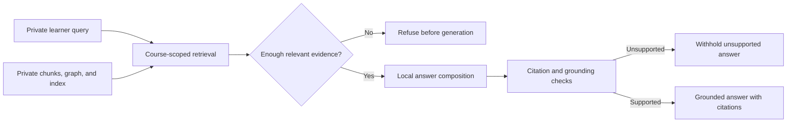
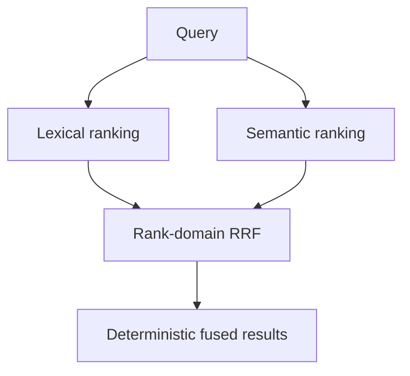
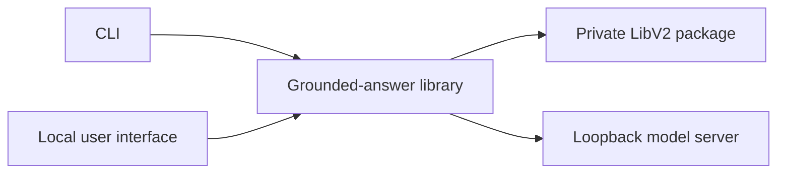

# Retrieval and serving

Ed4All turns a private course archive into a queryable learning system without
turning that archive into a public service. Its read path combines lexical and
semantic retrieval, custom Reciprocal Rank Fusion (RRF), local answer
composition, and citation verification so a fluent answer is never mistaken
for a grounded one.

The per-course entry point is
[`answer_course_question`](../../lib/retrieval/grounded_answer.py). LibV2’s
reference retrieval API is
[`retrieve_chunks`](../../LibV2/tools/libv2/retriever.py). The boundary between
the package library and a deployed service is defined in
[ADR-002](ADR-002-retrieval-scope.md).

## Private read path

Text equivalent: a private query searches a private course archive. Weak
retrieval is refused before generation. Strong retrieval is sent to a local
composer, then citation and grounding checks either withhold the response or
return a cited answer.

Queries, chunks, indexes, graphs, prompts, generated answers, gold judgments,
and evaluation reports are private course-derived data. They remain in ignored,
operator-controlled storage. Public source control contains the implementation,
schemas, and synthetic tests—not populated indexes or real course examples.

## Retrieval engines and fusion

LibV2 exposes a common result contract across three course-query engines:

- **Lexical** retrieval streams eligible chunks and ranks them with BM25 plus
  structured-token and metadata-aware signals.
- **Semantic** retrieval embeds the query and searches the course’s verified
  vector index with cosine similarity.
- **Hybrid RRF** runs lexical and semantic retrieval independently, then fuses
  their ranks with reciprocal-rank contributions.

Text equivalent: the same query produces separate lexical and semantic ranked
lists. RRF combines rank positions—not BM25 and cosine values—and returns a
deterministically ordered result list.

This separation is central to Ed4All’s custom retrieval design. BM25 scores and
cosine similarities have different meanings, so hybrid search never adds them
together. RRF rewards passages found by both arms while retaining strong results
that appear in only one. Deterministic tie-breaking makes repeated queries over
the same package and configuration reproducible.

The hybrid implementation lives in
[`semantic_retriever.py`](../../LibV2/tools/libv2/semantic_retriever.py); vector
creation and manifest verification live in
[`vector_index.py`](../../LibV2/tools/libv2/retrieval/vector_index.py). The index manifest
binds embeddings to their model identity and source chunkset, preventing a
query client or stale index from being substituted silently.

The grounded-answer layer can optionally reshape the candidate set through
query rewriting, decomposition, hypothetical-document retrieval, reranking,
intent-aware ordering, or concept-graph expansion. These are explicit arms
around the reference retriever. Their configuration belongs in
[Behavior flags](../operations/behavior-flags.md), not in this architecture
contract.

## Refusal, composition, and citations

Retrieval confidence is evaluated before answer generation. If the selected
engine does not return enough evidence above its calibrated floor, Ed4All
refuses without calling the answer model. Confidence policies are tied to the
engine and, where relevant, the embedding identity because lexical, cosine, and
RRF score distributions are not interchangeable.

When retrieval clears that boundary, the composer receives only the passages
that fit its prompt budget. It produces a structured answer whose cited chunk
identifiers must come from that visible passage set. Backend failures, malformed
responses, unknown citations, and prompt truncation are errors; the system does
not manufacture a canned answer.

Citation checks then reconnect each cited chunk to its archived source. The
resolver prefers exact anchors and permits bounded normalization needed for
honest HTML-to-text transformations. If a citation cannot be resolved to the
private archive, answer text is withheld rather than returned with a plausible
but unsupported reference.

Optional attribution and groundedness passes can assess which claims each
citation supports, identify stronger supporting passages, and measure
entailment or contradiction. These diagnostics enrich the evidence trail; they
do not convert missing provenance into a pass. The implementation is divided
among [`citation_anchor.py`](../../lib/retrieval/citation_anchor.py),
[`citation_attribution.py`](../../lib/retrieval/citation_attribution.py), and
[`groundedness.py`](../../lib/retrieval/groundedness.py).

## Serving topology

LibV2 is a local reference-retrieval library and CLI, not a hosted multi-tenant
service. The command line and user interface call the same grounded-answer
library over an operator-selected private course.

Text equivalent: the CLI and local user interface share the grounded-answer
library, which reads a private LibV2 package and calls a model server reachable
only through a loopback address.

Answer composition uses the repository’s OpenAI-compatible provider registry,
whose canonical configuration is
[`config/endpoints.yaml`](../../config/endpoints.yaml). The answer layer adds a
stricter policy: the resolved endpoint must be loopback. A provider label cannot
override that network check. Model names, URLs, timeouts, and seat lifecycle
instructions remain in the endpoint registry and
[seat operations](../operations/seat-scripts.md), avoiding stale hardware or
model guidance here.

Production concerns such as authentication, tenant isolation, rate limiting,
caching, availability targets, and public HTTP APIs belong to a deployment
layer outside the LibV2 package contract.

## Fail-loud dependencies

An explicitly selected capability must either run as requested or fail with an
actionable error:

- semantic and hybrid retrieval require a present, current, non-test vector
  index and a compatible embedding client;
- hybrid retrieval does not downgrade to lexical when its semantic arm fails;
- unknown engine or provider names are rejected;
- a non-loopback answer endpoint is rejected;
- unavailable model transport does not produce a placeholder response; and
- invalid or unresolvable citations block answer release.

Operators may deliberately choose lexical retrieval or disable an optional arm,
but the system does not make that choice on their behalf after a failure.

## Evaluation

Evaluation separates the system into interpretable arms:

- the **base** arm measures the model without retrieved course evidence;
- the **retrieval** arm measures passage discovery without answer composition;
  and
- the **grounded** arm measures the integrated retrieval, refusal, composition,
  citation, and grounding path.

The scorecard implementation is
[`eval_arms.py`](../../lib/retrieval/eval_arms.py). It reports only metrics that
apply to each arm and avoids treating “not measured” as zero. Retrieval
evaluation uses private, curator-reviewed relevance judgments; grounded-answer
evaluation additionally examines answer coverage, refusal behavior, citations,
groundedness, and latency.

Evaluation results describe one package, query set, index, provider, model, and
configuration. They are diagnostic evidence, not a public benchmark claim or a
service-level guarantee. The curation boundary and reference harness are
documented in
[LibV2 reference retrieval](../reference/reference-retrieval.md).
