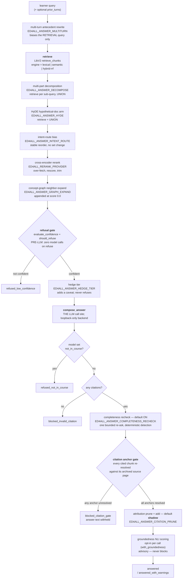
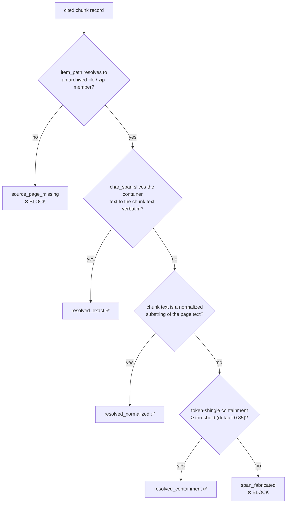
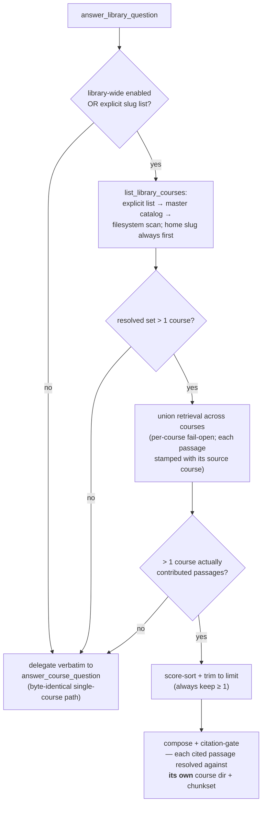

# Retrieval and serving — the read path

**Code:** `lib/retrieval/grounded_answer.py::answer_course_question` (the single
per-course entry point), `lib/retrieval/library_wide.py::answer_library_question`
(the library-wide wrapper), plus the supporting modules named per stage below.
**Retrieval engine:** `LibV2/tools/libv2/retriever.py::retrieve_chunks`.
**Callers:** `cli/commands/libv2_ask.py`, `LibV2/tools/libv2/cli.py`,
`gui/services/answer_service.py`.
**Relates to:** `docs/architecture/ADR-002-retrieval-scope.md` (what LibV2's
reference retriever is and is not), `docs/operations/behavior-flags.md`
(per-flag detail), and `docs/operations/seat-scripts.md` (the portable contract
for local model-serving seats).

The rest of the pipeline is the *write* path: a corpus becomes an
accessible-HTML course, a chunkset, a concept graph, and a vector index. This
document is the *read* path — what happens when a learner asks the built course a
question.

The design constraint that shapes every stage: **a confident, fluent, ungrounded
answer is the failure this path exists to prevent.** A wrong answer that cites a
real page is a content bug. A wrong answer that cites nothing, or cites a page
that does not contain what the answer claims, is a trust failure — and it is the
failure mode an LLM produces by default. So the path is a sequence of stages, two
of which can *withhold* an answer outright, and both of them withhold rather than
degrade.

---

## 1. The single-course path end to end

Dashed boxes are behind default-OFF flags and are skipped entirely on a stock
ask. Solid boxes run on a stock ask (though two of them — the completeness
recheck and the attribution pass — are flag-governed with an on/shadow default;
see §2).



Six terminal statuses, and the split between them is deliberate:

| Status | Meaning | Citations returned |
|---|---|---|
| `answered` | Composed, every citation anchored | yes |
| `answered_with_warnings` | Same, but a claim was contradicted, all citations pruned as claim-less, or the answer was hedged | yes (possibly empty) |
| `refused_low_confidence` | Retrieval never cleared the confidence floor — **no LLM call was made** | no |
| `refused_not_in_course` | The model itself declared the question out of corpus | no |
| `blocked_invalid_citation` | The model produced an answer with zero citations | no |
| `blocked_citation_gate` | At least one cited chunk could not be anchored to its source page | no |

The `blocked_*` statuses withhold the **answer text as well as** the citations.
There is no partial emission with the bad citation quietly dropped: dropping a
citation changes the support story the learner is shown, which is exactly the
misrepresentation the gate exists to catch.

---

## 2. Which arms are always on, and which are flags

This distinction matters more than any other in this document, because a
default-flag reading of the module list badly overstates what a stock ask does.

**Always on** (no flag, no opt-in):

- Retrieval via `retrieve_chunks`.
- The pre-LLM refusal gate (`lib/retrieval/refusal.py`).
- Answer composition (`lib/retrieval/answer_composer.py`).
- The citation anchor gate (`lib/retrieval/citation_anchor.py`).

**On by default but flag-governed:**

- `ED4ALL_ANSWER_COMPLETENESS_RECHECK` — default `on`.
- `ED4ALL_ANSWER_CITATION_PRUNE` — default `shadow` (computes and captures the
  prune/add decision, mutates nothing).

**Opt-in per call, not by flag:**

- Groundedness NLI scoring — the `with_groundedness` keyword argument.
- Citation-gate bypass — the `validate_citations=False` keyword, test-only.

**Default OFF** (every one of these is a no-op that leaves the stock path
byte-identical): `ED4ALL_ANSWER_MULTITURN`, `ED4ALL_ANSWER_DECOMPOSE`,
`ED4ALL_ANSWER_HYDE`, `ED4ALL_ANSWER_INTENT_ROUTE`, `ED4ALL_RERANK_PROVIDER`,
`ED4ALL_ANSWER_GRAPH_EXPAND`, `ED4ALL_ANSWER_HEDGE_TIER`,
`ED4ALL_ANSWER_COMPLETENESS_RERETRIEVE`, `ED4ALL_ANSWER_NLI_ADD` (`off`),
`ED4ALL_ANSWER_LIBRARY_WIDE`, `ED4ALL_ANSWER_EXCLUDE_CHUNK_TYPES`,
`ED4ALL_ANSWER_ASSESSMENT_GUARD`.

### The verdict-safety rule the augmentation arms follow

Every candidate-shaping arm except rerank is written so that turning it on
**cannot** convert a would-be answer into a refusal. The mechanism differs per
arm but the intent is uniform:

- Decompose and HyDE **union** their extra retrievals into the candidate set,
  passing the flat top-scorer as the merge base, so the original query's best
  hits are always retained.
- The multi-turn rewrite biases only the *retrieval* query; the original query
  still drives composition and the grounding gate. When the rewrite changes the
  query, the original query is retrieved *as well* and unioned — so an off-topic
  prior turn cannot evict good passages out of the top-`limit` window.
- Intent-route performs a **stable reorder with no set change**, so the refusal
  signals (`top_score`, `n_above_floor`) are arithmetically identical.
- Graph expansion runs **last**, strictly after rerank's trim, and appends
  neighbors at score `0.0`. A 0.0 passage clears no refusal floor, so the verdict
  is unchanged; neighbors only fill residual composer slots left by a thin
  retrieval.

Rerank is the exception: it genuinely reorders and trims the candidate pool. What
it does guarantee is that it runs strictly *before* the refusal gate and
**preserves each passage's native first-stage score**, so the per-engine refusal
threshold is still measured against the distribution it was calibrated on rather
than against cross-encoder scores. It also fails open — a reranker resolution or
scoring failure leaves the retrieved order untouched.

---

## 3. Retrieval and the refusal gate

`_retrieve` lazily imports `LibV2.tools.libv2.retriever.retrieve_chunks` and
passes `engine` only when the installed signature accepts it. Three engines are
valid: `lexical` (the default), `semantic`, and `hybrid-rrf`. Two failure
behaviors are worth naming because both are anti-silent-degradation:

- An unknown engine name raises rather than falling back.
- A non-lexical engine requested against a tree whose `retrieve_chunks` has no
  `engine` parameter raises a `RuntimeError` naming the missing dependency —
  **never** a silent downgrade to lexical. A downgrade would quietly change every
  score in the run and invalidate the refusal threshold with no signal.

Typed semantic errors (`SemanticIndexMissing`, `SemanticIndexStale`) propagate
for the same reason.

### The confidence arithmetic

`lib/retrieval/refusal.py` computes four signals over the retrieved scores —
`top_score`, `n_above_floor`, `mean_top3`, `n_passages` — and applies a frozen
`RefusalPolicy`:

```
n_above_floor = count(passages with score >= score_floor)

confident  =  top_score >= min_top_score
         AND  n_above_floor >= min_passages_above_floor
```

`mean_top3` and `n_passages` are recorded as diagnostics; only the two terms
above decide the verdict.

An empty passage list is never confident. `should_refuse` is the inverse
projection, carrying `reason_code = low_confidence`.

**Policies are pinned per (engine, embedding model).** A cosine threshold tuned
for one embedder is meaningless for another, so for the `semantic` and
`hybrid-rrf` engines the live vector index's `embedding_model_id` is read from
its manifest and used as part of the policy key. `hybrid-rrf`'s fused RRF score
is not itself a cosine, but its semantic arm — and therefore the whole fused
distribution the threshold is measured against — is a function of the embedder,
so keying it by model is what keeps the pin honest. An unpinned model falls back
to the permissive `v0-uncalibrated` default rather than reusing a stale
threshold; `lexical` is model-agnostic.

Policy version strings distinguish a measured pin from the permissive default,
and the calibration harness (`refusal.calibrate` /
`calibrate_from_distributions`) is what produces a pin. Its pin rule is
pre-declared so the artifact is reproducible: take the **largest**
`min_top_score` whose refusal precision and answer recall both clear their
targets *and* whose refusal recall is above zero (a threshold that refuses
nothing is useless). When no candidate qualifies — the distributions overlap —
it recommends nothing and the engine keeps `v0-uncalibrated`, rather than
proposing a threshold it cannot defend.

The refusal gate runs **before** any model call. On a refusal the path costs one
retrieval and zero LLM tokens.

---

## 4. Composition

`lib/retrieval/answer_composer.py::compose_answer` is *the* LLM call site — the
only one that runs unconditionally. (Two optional arms also call a model: the
HyDE hypothetical-document generator, and the completeness recheck's bounded
re-ask, which reuses the composer.) Its contract:

- It renders numbered passage context and calls a duck-typed
  `client.chat_completion`.
- It parses the JSON envelope leniently (first `{...}` span).
- It **validates every cited id against the provided passage ids**, and fires a
  single remediation retry on unknown ids. The model cites `chunk_id` values
  directly — they are the passage labels — so there is no index-remapping layer
  that can drift.
- Transport failures map to `AnswerBackendUnavailable`. It **never returns a
  fabricated envelope**.

`ComposedAnswer.allowed_chunk_ids` records the renderer-**included** (in-window)
passage set. Passages dropped from the prompt for budget are not in it. The
downstream attribution pass runs over exactly this set, so it can never "add" a
citation for a passage the model never saw.

The backend is resolved by `lib/retrieval/answer_backend.py` and the **resolved
`base_url` host must be loopback** — `localhost`, `127.0.0.0/8`, or `[::1]`.
A non-loopback resolution raises. This is enforced unconditionally on the
resolved URL, independent of any per-endpoint flag in the registry, so a course
answer cannot leave the box.

---

## 5. The citation anchor gate

This is the load-bearing gate, and the reason it is not simply "did the model
cite something" is worth stating plainly: a model can cite a real chunk id whose
text does not actually contain what the answer claims, and it can cite a chunk
whose recorded span points at nothing. Either produces a citation that *looks*
like provenance and is not. The gate re-derives provenance from the archive
rather than trusting the chunk record.

`lib/retrieval/citation_anchor.py::resolve_citation_anchor` takes a chunk record
and the LibV2 course dir and answers: *find the exact archived source page, and
verify the chunk's text and span against it.* It is pure, deterministic,
read-only — no network, no LLM, no decision capture.



The ladder is first-match-wins, best to worst. Three statuses resolve; the rest
block. `source_sha_mismatch` is wired in the enum but **does not fire today** —
chunks currently carry only an aggregate whole-corpus sha, which cannot verify a
single page, so the per-page sha emit is a deferred follow-up.

Two design choices in this module are easy to misread:

**Why it lives resolver-side, not chunker-side.** Legacy corpora must not
re-chunk (the byte-stability contract). The chunker's `char_span` has two known
degradation arms — a whitespace-collapsed fallback that indexes into a different
string space, and a total-miss fallback that fabricates
`[search_from, search_from + len(needle)]` with no marker. The resolver
**classifies** those states honestly as `span_fabricated`. It never repairs a
span.

**Why token-shingle containment exists at all.** Chunk `text` is
post-plain-text-extraction, post-boilerplate-strip, post-feedback-strip, so it is
generally *not* a contiguous substring of the page text even when it genuinely
came from that page. Containment is the workhorse that keeps honest chunks from
being blocked as fabrications. Two normalization fixes support it — neutralizing
a template-chrome mark on structural-root tags before re-extracting the page, and
`html.unescape`-ing both sides so entity mismatches do not sink an otherwise
contained chunk. Both are normalization only. A chunk whose text is genuinely
absent from the page still scores low and reports `span_fabricated`.

The answer path's containment floor is `ED4ALL_ANSWER_ANCHOR_CONTAINMENT`
(default `0.85`). Parse-with-fallback: a value outside `[0.5, 1.0]` — or any
garbage — falls **back to 0.85** rather than being clamped, so a misconfigured
knob can never disable the anchor floor. It governs only the gate calls the
answer pipeline makes; `citation_anchor`'s own 0.85 default is untouched.

---

## 6. After the gate: prune, add, score

Three passes run on an answer that cleared the gate. None of them can turn an
answered response into a refusal.

**Attribution prune + add** (`lib/retrieval/citation_attribution.py`,
`ED4ALL_ANSWER_CITATION_PRUNE`, default **`shadow`**). Runs over all
gate-eligible passages in retrieval-rank order — the set the model *could* have
cited — so an under-cited definitional supporter can be credited and a
model-cited chunk supporting zero claims can be dropped. A typo'd flag value
falls back to `shadow` rather than `off`, so a misconfiguration never silently
disables the audit trail. Thresholds: `ED4ALL_ANSWER_PRUNE_MIN_OVERLAP` (0.25)
for the prune decision, `ED4ALL_ANSWER_ADD_MIN_SHINGLE` (0.50) for the add.

Policy consequence: an answered response whose every citation was pruned as
claim-less ships with **no sources plus an unverified-support advisory**
(`answered_with_warnings`) rather than a misleading citation.

**Groundedness** (`lib/retrieval/groundedness.py`, opt-in per call). Advisory,
never blocks. It measures fabrication-against-corpus, not citation-selection
quality — that is what the attribution pass measures — so its evidence pool is
the full gate-eligible set, and each claim records whether its best supporting
chunk was actually cited. A contradicted claim escalates the status to
`answered_with_warnings`.

**NLI-based citation add** (`ED4ALL_ANSWER_NLI_ADD`, default `off`). Runs after
both of the above and **reuses** the per-claim NLI verdicts rather than
re-running NLI. In shadow mode it mutates nothing.

---

## 7. Completeness recheck

Default **on** (`ED4ALL_ANSWER_COMPLETENESS_RECHECK`), and it addresses a
specific observed failure: a multi-part question where the model answers one part
and silently drops the other, *even when the dropped part's grounding was a top
passage*.

The *detection* is free: `lib/retrieval/answer_completeness.py` is pure stdlib —
no LLM, no model load, no embedding call. It splits the question, tests each part
for whether the answer addressed it, and tests each unaddressed part for whether
any retrieved passage supports it. Only an **uncovered-but-grounded** part
triggers the re-ask, which is one additional composer call and is bounded to one.

The bias is deliberately asymmetric in three places:

- The splitter **under-splits**. A false single-part is free (we simply never
  re-ask); a false multi-part costs a needless re-ask.
- The "is this part answered" predicate is **recall-leaning** — it uses a lower
  token-coverage bar than the attribution keep-decision, preferring to conclude a
  part *was* addressed.
- The grounding test is the safety valve: an uncovered part with no supporting
  passage is not a re-ask trigger, because re-asking would only produce another
  refusal.

The recheck runs **before** the citation gate, so the merged answer and unioned
citations flow through gate → prune → groundedness exactly like a single-pass
answer. It never regresses an already-answered response. Its optional satellite
`ED4ALL_ANSWER_COMPLETENESS_RERETRIEVE` (default off) retrieves fresh passages
per uncovered sub-question before re-asking; any passages so adopted are folded
into the main pool *after* the refusal verdict was computed, so the verdict is
unaffected.

---

## 8. The library-wide ask

`lib/retrieval/library_wide.py::answer_library_question` is the wrapper, gated by
`ED4ALL_ANSWER_LIBRARY_WIDE` (default off) or an explicit `course_slugs` list.



Its guarantees mirror the single-course path:

- **Per-course provenance.** Each unioned passage carries the course it was
  actually retrieved from, and the citation gate resolves each cited passage
  against *that* course's dir and chunkset kind. A citation cannot be attributed
  to the wrong course, and a `course_slug` is never inferred.
- **Local-only.** Composition reuses the same loopback-enforced backend. No cloud
  call is introduced by widening the scope.
- **Fail-open to single-course, three times.** When the catalog resolves to one
  course, when only the home course carries a retrievable chunkset, or when every
  other course's retrieval errored, the call degrades to the single-course path.
  A per-course retrieval error skips that course and is logged; it never fails
  the union.
- **Always keep ≥ 1.** The union is trimmed to `limit` but never below one
  passage when any course contributed.

Apart from the home slug, a course is only enumerated if it actually carries a
readable `chunks.jsonl` — so the union never widens to a catalog entry whose
course was removed or never archived a chunkset. The home slug is added
unconditionally, because it is the fail-open target the whole wrapper degrades
back to.

---

## 9. The assessment guard sits outside this path

`lib/retrieval/assessment_guard.py` (`ED4ALL_ANSWER_ASSESSMENT_GUARD`, three-valued
`off`/`shadow`/`on`, default off) matches a learner question against the course's
own assessment stems and, on a match above
`ED4ALL_ANSWER_ASSESSMENT_GUARD_THRESHOLD` (default 0.75), returns a
redirect-with-hint instead of doing the homework.

It is wired in exactly one place: `gui/services/answer_service.py`, **before**
that service's call into `answer_library_question` (which delegates to
`answer_course_question`), not inside either. The two CLI entry points do not
consult it. That placement is the reason the guard
can short-circuit without perturbing any of the gates above: it either returns
its own redirect envelope (in `on` mode) or stamps an additive
`assessment_guard` signal onto the normal result (in `shadow` mode). It never
refuses.

---

## 10. Invariants a change here must preserve

1. **No silent downgrade of the retrieval engine.** A missing semantic
   dependency, a missing index, or an unknown engine name raises. It never
   quietly becomes lexical — that would change every score and invalidate the
   calibrated refusal threshold with no signal.
2. **The refusal gate runs before any model call.** A refusal must cost zero LLM
   tokens.
3. **A blocked citation withholds the answer text too.** Never emit a partial
   answer with the failing citation dropped.
4. **Anchors are re-derived, never repaired.** The resolver classifies a bad span
   honestly; it does not fix one.
5. **Augmentation arms are verdict-safe.** A new candidate-shaping arm must not
   be able to turn a would-be answer into a refusal — union rather than replace,
   or append below the floor.
6. **Composition is loopback-only.** The resolved base URL host must be a
   loopback address, with no escape hatch.
7. **Flag-off is byte-identical.** Not merely equivalent output — the arm's code
   must not run at all.
