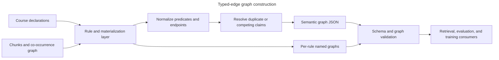

# Typed-edge semantic graph

Trainforge turns relationships that are implicit in course content into an
auditable semantic graph. The result complements the co-occurrence graph:
co-occurrence answers *which concepts appear together*, while typed edges
record *how two learning entities are related and why that claim exists*.

The JSON artifact is `graph/concept_graph_semantic.json`. A TriG companion can
preserve each rule's raw output in a separate named graph, including rules that
produced no edges. Together, these forms support retrieval, quality review,
course analysis, and downstream training without discarding provenance.

The diagram shows course declarations and chunk-derived signals entering the
rule layer. Edges are normalized and resolved into JSON, while uncollapsed
rule output is retained in named graphs. Both representations pass validation
before use.

## Edge contract

Each edge identifies two graph nodes and a canonical relationship:

- `source` and `target` are node identifiers. New graph builds materialize
  supported structural endpoints before validation; dangling endpoints and
  self-edges are rejected by the graph quality gate.
- `type` is the stable JSON slug for the relationship. Consumers that need RDF
  resolve it through
  [`lib/ontology/edge_predicates.py`](../../lib/ontology/edge_predicates.py).
- `confidence`, when present, expresses the producer's strength of support on
  a zero-to-one scale. It does not indicate whether a claim was asserted or
  inferred.
- `edge_kind`, when present, is `asserted` or `inferred`.
- `provenance` identifies the producing rule and rule version and carries the
  evidence needed to inspect or reproduce the claim.
- Run and creation stamps connect an edge to the graph build that emitted it.
  Additional consensus fields may describe later corroboration,
  contradiction, or retraction without erasing the original claim.

The complete wire shape and compatibility rules live in
[`schemas/knowledge/concept_graph_semantic.schema.json`](../../schemas/knowledge/concept_graph_semantic.schema.json).
This page intentionally does not duplicate its predicate, node-class, evidence,
or status inventories.

## Predicates and direction

Predicate meaning comes from three synchronized sources:

1. The semantic-graph JSON Schema defines accepted wire slugs.
2. [`lib/ontology/edge_predicates.py`](../../lib/ontology/edge_predicates.py)
   resolves those slugs to RDF predicates.
3. [`schemas/context/courseforge_v1.vocabulary.ttl`](../../schemas/context/courseforge_v1.vocabulary.ttl)
   declares the vocabulary's RDF semantics.

Use established web vocabularies when their meaning fits. Concept-to-concept
taxonomy uses SKOS broader/narrower semantics; `is-a` remains reserved for
class-level subsumption. Ed4All-specific pedagogical relationships use the
project vocabulary.

Most edges are directed: reversing their endpoints changes the claim.
Symmetric predicates are canonicalized as unordered pairs for duplicate and
collision handling. The orchestrator's precedence policy determines which
claim survives when rules produce competing relationships for the same pair;
the retained edge keeps the evidence from its producing rule. Raw per-rule
named graphs remain available for audit even when the resolved JSON omits a
competing edge.

Do not infer direction from identifier spelling or file order. Producers must
define source and target semantics explicitly, and consumers must use the
predicate registry.

## Asserted and inferred claims

`edge_kind` separates two evidence classes:

- **Asserted** edges materialize an explicit upstream declaration, such as a
  learning-objective reference, a targeted concept, or an assessment link.
- **Inferred** edges are proposed from structure, text patterns, ordering,
  co-occurrence, statistical evidence, or a model-assisted rule.

This distinction is independent of confidence. An explicit declaration can be
uncertain, and a derived relationship can be strongly supported. Consumers
that require author-declared relationships should filter by `edge_kind`, not a
confidence threshold.

The canonical rule classification is
[`lib/ontology/edge_kind.py`](../../lib/ontology/edge_kind.py). New rules must
be registered there; documentation must not maintain a second rule list.
Legacy edges may omit the field and should be treated as having unknown kind,
not silently recast as asserted or inferred.

## Provenance and evidence

Every edge requires a provenance object. At minimum it names the rule and its
version; known rules provide evidence shaped for that rule. Evidence can point
back to chunks, objectives, questions, misconceptions, source references, or
the measured signal that justified the relationship.

Graph-level metadata records the rule versions used for the build and includes
deterministic version/hash surfaces for drift detection. Named graphs retain
rule boundaries, which makes it possible to compare rule output without
reverse-engineering a flattened graph.

Model-assisted proposals, when explicitly enabled by a caller, are constrained
to supported predicates and known endpoints, are marked inferred, and pass
through decision capture. The deterministic rule path remains the normal graph
construction path.

## Validation

Validation is layered rather than delegated to a single file:

- JSON Schema checks the serialized graph shape, predicate slugs, ranges, and
  rule-specific evidence contracts.
- Graph quality validation checks referential integrity, self-edges, and
  minimum structural expectations.
- JSON-LD context and vocabulary tests keep slugs and RDF IRIs synchronized.
- SHACL shapes validate RDF constraints; SHACL-AF rules can provide a
  flag-gated equivalent for supported derivations.
- Rule-output validation detects regressions in individual producers, while
  named-graph tests preserve per-rule provenance.

Canonical validation behavior is documented in
[`docs/validation/gates.md`](../validation/gates.md). A failed gate indicates a
bad artifact or contract drift; do not weaken a gate to accept it.

## Extending the graph safely

Treat a new predicate or rule as a contract change:

1. Define the relationship's domain, range, direction, symmetry, and intended
   meaning. Reuse a standard RDF predicate when its semantics match exactly.
2. Update the JSON Schema, predicate registry, JSON-LD context, vocabulary, and
   relevant SHACL shapes together. Their synchronization tests must pass.
3. Implement the producer with a versioned rule, bounded evidence, and a clear
   `asserted` or `inferred` classification.
4. Define duplicate and collision behavior in the orchestrator. Never rely on
   incidental rule order without making that ordering part of the contract.
5. Update JSON and named-graph consumers and add focused tests for direction,
   endpoint materialization, RDF round trips, provenance, and validation.
6. Preserve compatibility intentionally. Version semantic changes and migrate
   stored artifacts rather than silently reinterpreting an existing slug.

## Implementation map

- [`Trainforge/rag/typed_edge_inference.py`](../../Trainforge/rag/typed_edge_inference.py)
  orchestrates rules, endpoint materialization, edge classification, and
  collision resolution.
- [`Trainforge/rag/inference_rules/`](../../Trainforge/rag/inference_rules/)
  contains focused deterministic producers.
- [`Trainforge/rag/named_graph_writer.py`](../../Trainforge/rag/named_graph_writer.py)
  emits auditable per-rule RDF datasets.
- [`schemas/context/concept_graph_semantic_v1.jsonld`](../../schemas/context/concept_graph_semantic_v1.jsonld)
  maps the JSON representation into JSON-LD.
- [`schemas/context/courseforge_v1.shacl.ttl`](../../schemas/context/courseforge_v1.shacl.ttl)
  and
  [`schemas/context/courseforge_v1.shacl-rules.ttl`](../../schemas/context/courseforge_v1.shacl-rules.ttl)
  define RDF constraints and supported rule equivalents.
- [`lib/validators/concept_graph.py`](../../lib/validators/concept_graph.py)
  enforces graph-level integrity.
