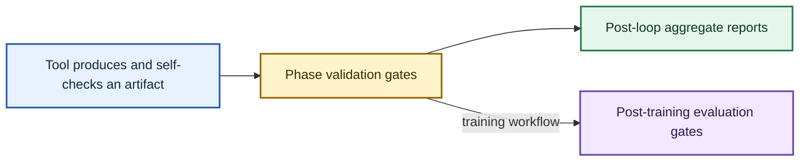
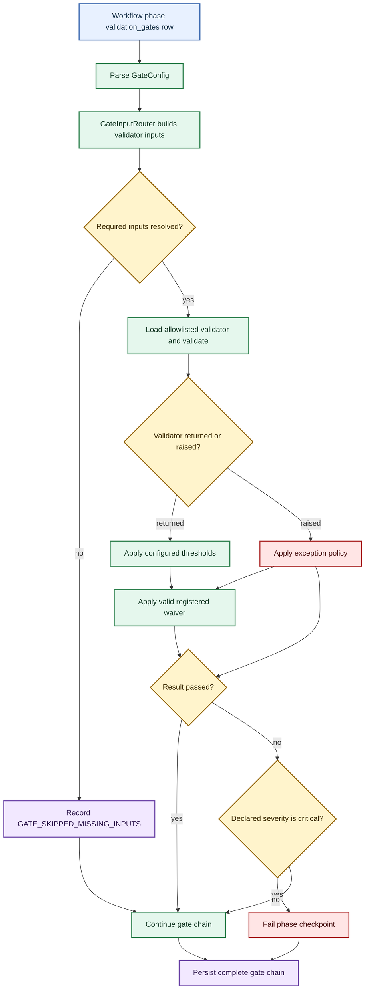
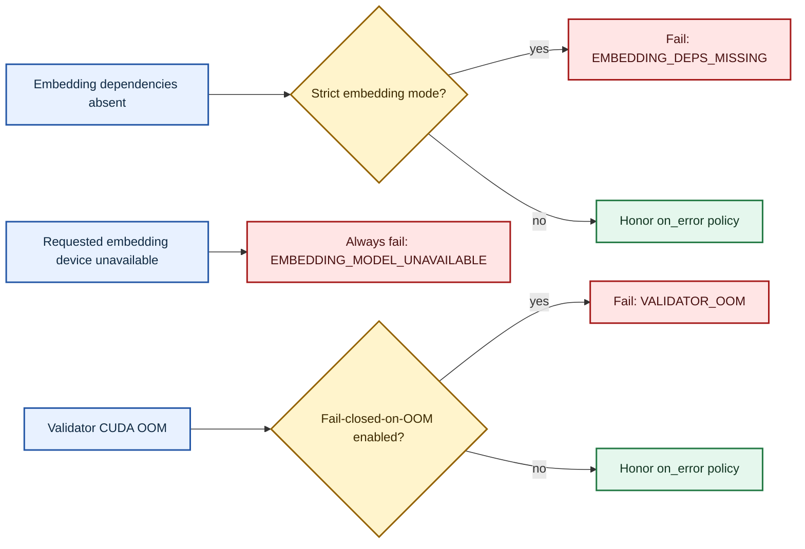
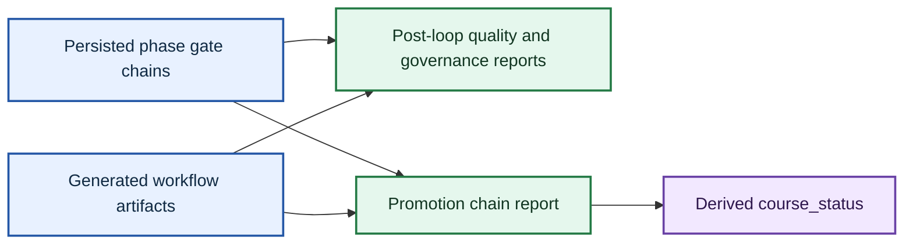

# Validation Architecture

Ed4All validates artifacts at four boundaries: inside tools, after workflow
phases, after the phase loop, and after model training. This guide explains how
those boundaries connect, how failures propagate, and where to inspect the live
contract.

For the current validator catalog, see
[`validators.md`](../validation/validators.md). For phase-to-gate wiring and
gate-specific rationale, see [`gates.md`](../validation/gates.md).

## 1. Four validation layers

| Layer | Boundary | Responsibility | Effect on the run |
|---|---|---|---|
| **Tool self-checks** | Inside a phase tool | Validate or retry the unit being produced | Defined by that tool |
| **Phase gates** | After a phase's tasks complete | Apply the gates declared on that phase | A failed `critical` gate fails the phase |
| **Post-loop aggregators** | After the workflow phase loop | Compose gate results and artifacts into operator-facing reports | Best-effort; aggregation errors do not change `final_status` |
| **Post-training gates** | During and after adapter training | Decide whether evaluation permits promotion | Blocking unless the dedicated advisory override applies |

Phase gates are the primary meaning of “validation gate” in project
documentation. They attach to `validation_gates` arrays under workflow phases
in `config/workflows.yaml`.



The accessible labels carry the meaning; color is supplementary.

## 2. Phase-gate attachment and lifecycle

Each YAML gate row becomes a `GateConfig`. The executor routes phase outputs to
the validator's input contract, runs the validator, applies thresholds and any
waiver, persists one result, and decides whether the phase can complete.



The executor evaluates the full parsed chain; it does not truncate the result
list after the first failure. Each parsed gate therefore contributes a run,
waiver, or structured-skip record to the phase checkpoint.

### 2.1 Input routing

`MCP/hardening/gate_input_routing.py::GateInputRouter` maps the validator's
dotted import path to a builder. A builder returns validator-specific inputs
and a list of missing requirements. The router also converts a missing builder
or builder exception into a missing-input result.

Missing requirements produce a `GATE_SKIPPED_MISSING_INPUTS` issue and
`waiver_info.skipped="true"`. This is an auditable skip, not evidence that the
validator passed. Ordinarily the result has `passed=True`; required training
synthesis is stricter when `with_training` is enabled and `skip_training` is
false, so a missing gate input clears the phase's gate status.

Router inputs are merged with the executor's fallback artifact mapping.
Configured threshold values are also exposed to validators, while the generic
manager independently enforces result-level thresholds such as
`max_critical_issues`, `max_issues`, `min_score`, and `required_score`.

### 2.2 Severity, `on_fail`, and `on_error`

These controls are independent:

| Control | Values | Default | Runtime meaning |
|---|---|---|---|
| `severity` | `critical`, `warning`, `info` | `critical` | A failed result clears the executor's phase status only when this is `critical` |
| `behavior.on_fail` | `block`, `warn` | `block` | Controls short-circuit behavior in `ValidationGateManager.run_phase_gates`; the workflow executor calls `run_gate` directly and still evaluates the full chain |
| `behavior.on_error` | `fail_closed`, `warn` | `fail_closed` | Determines whether an ordinary validator exception fails or is retained as a passing warning result |

The YAML-declared `severity` is authoritative for phase blocking. A warning
gate can return `passed=False` and remain non-blocking even if its `on_fail`
value is `block`. Conversely, omitting severity selects the critical default;
the executor logs that omission.

`GateResult` does not own the configuration severity. Before persistence, the
executor stamps the declared severity when a result does not already contain
one. Diagnose phase blocking from the YAML row and the result together.

### 2.3 Fail-closed and dependency failures

For an ordinary exception, `on_error: fail_closed` creates a failed result with
a critical `VALIDATOR_ERROR` issue. `on_error: warn` retains the issue but sets
the result to passed.

Three dependency or resource conditions have more specific behavior:



- Missing optional embedding extras use `EMBEDDING_DEPS_MISSING`. With
  `TRAINFORGE_REQUIRE_EMBEDDINGS=true`, the result fails regardless of
  `on_error`; otherwise `on_error` remains authoritative.
- An installed embedding stack that cannot start on the explicitly requested
  device raises `EmbeddingModelUnavailable`. It always fails closed, does not
  silently fall back from CUDA to CPU, and ignores `on_error`.
- CUDA OOM produces `VALIDATOR_OOM`. It follows `on_error` unless
  `ED4ALL_VALIDATOR_FAIL_CLOSED_ON_OOM` is enabled, which forces failure.

Embedding device policy is distinct from NLI device policy. NLI loading may
degrade from CUDA to CPU with a warning; embedding loading does not. Validators
that depend on optional RDF/SHACL packages likewise return explicit warning
results when those extras are unavailable rather than disappearing from the
gate chain.

Validator imports are restricted to the allowlisted namespaces enforced by
`MCP/hardening/validation_gates.py::load_validator`.

### 2.4 Waivers

`ValidationGateManager` accepts a `GateWaiver` keyed by `gate_id`. A valid
waiver requires an operator identity, a reason of at least 20 characters, and
a remediation plan; it may also expire. An active waiver changes the result to
`passed=True`, sets `waived=True`, and persists `waiver_info`. Expired waivers
are ignored.

There is no phase-gate waiver declaration in workflow YAML and no pipeline CLI
surface that registers one. Editing checkpoint state is not a waiver and does
not create the required audit record.

## 3. Bloom classification status

Bloom metadata checks and Bloom text classification are separate concerns.
Structural validators can compare declared levels, allowed ranges, ladders,
verbs, and distributions without a trained text classifier.

Ed4All currently ships **no trained or provisioned Bloom classifier**:

- `BloomBertEnsemble` is a compatibility scaffold. Its default behavior is to
  load no members and return the explicit `unknown` abstention result.
- `TRAINFORGE_REQUIRE_BERT_ENSEMBLE=true` makes that unavailable classifier a
  strict error instead of accepting abstention.
- `ED4ALL_BLOOM_TRIVOTE` enables the heuristic trivote path. It combines the
  asserted level, a zero-shot NLI heuristic, and deterministic verb evidence;
  insufficient voters produce a structured warning rather than a fabricated
  classification.
- No fine-tuned Bloom heads or validated weights ship with the repository.
  `ED4ALL_BLOOM_TRIVOTE_HEADS` enables the optional heads voter, and
  `BloomDebertaHeads` can then load explicitly supplied local artifacts. The
  flag does not provide weights, and the loader does not make local artifacts
  trained, validated, or provisioned by Ed4All. Strict mode fails when no
  usable NLI or heads backend is available. Without strict mode, a missing or
  unloadable heads voter abstains and the heuristic trivote continues with its
  active zero-shot NLI signal and the remaining available evidence.

The active DeBERTa NLI classifier is a distinct entailment service used by
grounding and contradiction checks. Its availability does not imply that a
trained Bloom classifier exists, and its zero-shot use in trivote remains a
heuristic.

## 4. Calibration policy

A validator should move from advisory to blocking only after its false-positive
behavior and threshold signal have been reviewed on approved calibration data.
Do not promote a gate by lowering thresholds, suppressing issue codes, or
turning an exception into a pass.

`lib/governance/calibration_gate.py::resolve_severity_flip` supports validators
that read a named finite numeric signal from an approved quality report. A
missing, unreadable, non-numeric, or below-threshold signal defers the flip. The
helper returns an audit payload for the caller's `DecisionCapture`; it does not
rewrite workflow YAML. Gates without a mechanized flip remain governed by
their declared YAML severity and the policy recorded in
[`gates.md`](../validation/gates.md).

## 5. Post-training gates

Post-training validation appears in the training workflow and in the optional
training tail of the end-to-end workflow. Its phase gates use the same
`GateConfig`, routing, severity, exception, threshold, and persistence rules as
other phase gates.

The training runner also enforces `EvalGatingValidator` inline through
`Trainforge/training/runner.py::_enforce_eval_gate`. That check blocks adapter
promotion when it fails. `ED4ALL_GATE_ADVISORY=1` (or `true`) makes this inline
check advisory; it does not change ordinary phase-gate behavior.

Training remains operator-directed. Gate output supports a promotion decision;
it does not replace the required evaluation review or promotion ledger update.

## 6. Aggregator boundary and course status

After the phase loop, `WorkflowRunner.run_workflow` invokes report aggregators
over persisted gate chains and generated artifacts. These aggregators are
read-only views and are best-effort: an aggregator exception is logged and does
not alter the workflow's `final_status`.



The promotion-chain aggregator preserves missing stage reports as explicit
failed rows rather than treating absence as success. `derive_course_status`
then produces one of:

- `failed`
- `non_certified_archive`
- `certified_accessible`
- `certified_instructional`
- `certified_trainable`

The status calculation accounts for whether training was expected, so an
intentional non-training run is judged against the stages it was asked to
produce. Aggregated status never replaces the underlying per-phase gate chain.
For report schemas, outputs, and feature flags, see
[`aggregators.md`](aggregators.md).

## 7. Reading and verifying the live contract

Do not copy gate counts into architecture prose. The live declaration is:

```text
config/workflows.yaml
  workflows.<workflow>.phases[].validation_gates[]
```

For any review or release:

1. Parse `config/workflows.yaml` and enumerate every workflow, phase,
   `gate_id`, validator path, severity, behavior, and threshold.
2. Confirm each validator path has the intended input builder in
   `MCP/hardening/gate_input_routing.py`.
3. Confirm the validator is listed in [`validators.md`](../validation/validators.md)
   and its phase attachment is listed in [`gates.md`](../validation/gates.md).
4. Run the validation-gate, input-routing, workflow-schema, and documentation
   consistency tests before changing severity or thresholds.

Runtime evidence is split across two surfaces:

- `runtime/state/runs/<run-id>/checkpoints/<phase>_checkpoint.json` contains the
  phase's complete persisted gate chain.
- `runtime/state/workflows/<workflow-id>.json` contains workflow phase outputs
  and is the state used by resume logic.

Use the checkpoint to understand what each gate reported and the workflow state
to understand how the runner proceeded. Treat a structured skip, waiver,
warning failure, critical failure, and successful validation as distinct
outcomes.
