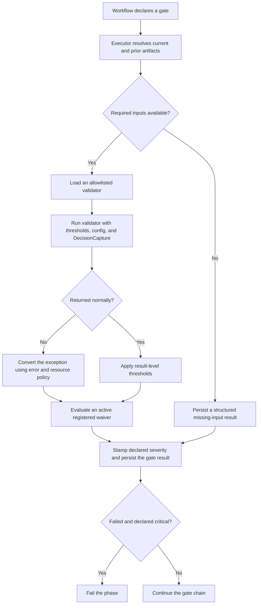

# Validation Architecture

Ed4All treats validation as an execution boundary, not a reporting afterthought.
Tools may validate their own units, workflow phases run configured gates, and
post-training checks protect adapter promotion. A failed required gate is an
artifact failure: fix the artifact or record an authorized waiver; do not lower
the standard to make a run appear healthy.

The live catalog and wiring are maintained separately:

- [Validation gates](../validation/gates.md) explains configured gate behavior
  and workflow attachment.
- [Validator reference](../validation/validators.md) documents validator input
  and output contracts.
- [ADR-005: gate severity and blocking](ADR-005-gate-severity-blocking.md)
  records the governing severity decision.

## 1. Boundaries and ownership

| Boundary | Owner | Contract |
|---|---|---|
| Tool self-check | Producing tool | Reject, repair, or retry an invalid unit before publishing it as a phase artifact. |
| Workflow gate | Executor and `ValidationGateManager` | Route declared inputs, run the validator, apply policy, and persist a structured result. |
| Aggregate report | Read-only aggregator | Summarize persisted evidence without rewriting the underlying verdicts. |
| Post-training evaluation | Training runner and evaluation validators | Hold an adapter unless evaluation and operator review permit promotion. |

Gate declarations live under each workflow phase's `validation_gates` entry in
`config/workflows.yaml`. The workflow configuration is authoritative for gate
identity, validator path, severity, thresholds, gate-specific configuration,
and error behavior. Do not copy the current inventory or counts into
architecture prose.

## 2. Gate lifecycle

Reading order: declaration → input routing → validation or structured skip →
exception and threshold policy → waiver evaluation → persistence → phase
decision. The labels carry the full meaning; the diagram does not depend on
color.

The executor evaluates the complete parsed gate chain and returns one result
for every enabled gate, including structured skips. A critical failure changes
the phase outcome, but it does not erase later diagnostic results.

### 2.1 Input routing and missing inputs

`MCP/hardening/gate_input_routing.py::GateInputRouter` maps each shipping
validator to a small input builder. Builders receive accumulated workflow
outputs, current-phase outputs, and workflow parameters. The executor merges
that routed data with its generic artifact mapping and forwards configured
threshold and validator-specific configuration values.

A missing builder, builder exception, or unresolved required artifact produces
`GATE_SKIPPED_MISSING_INPUTS` with `waiver_info.skipped="true"`. This is an
auditable skip, never a successful validation. The ordinary compatibility path
records it as non-blocking; a workflow contract that explicitly requires the
missing artifact—such as required training synthesis—may clear the phase gate
status. Consumers must distinguish `passed`, `failed`, `waived`, `skipped`, and
`errored` results.

Adding a validator requires both a permitted validator import and an input
route. Tests verify that configured shipping validators have routing coverage;
do not add validator-specific routing branches to the executor.

### 2.2 Severity, issue level, and error behavior

Three controls answer different questions:

| Control | Question answered |
|---|---|
| Declared gate `severity` | Does a failed result block this workflow phase? |
| `GateIssue.severity` | How serious is this individual finding inside the result? |
| `behavior.on_error` | How is a validator exception converted into a gate result? |

The declared gate severity is authoritative for executor blocking. A warning
gate may retain `passed=false` for an honest report while allowing the phase to
continue. A critical gate blocks when its effective result fails. Individual
issue severity does not override that workflow declaration.

Ordinary validator exceptions fail closed by default and produce a
`VALIDATOR_ERROR` issue. `on_error: warn` preserves the error evidence while
making that particular result non-blocking. `behavior.on_fail` controls the
manager's phase-gate convenience API; the workflow executor invokes gates
individually, evaluates the complete chain, and applies declared severity.

## 3. Fail-loud dependency and resource policy

Validation must never claim success because a required model or device failed
to run.

- Missing optional embedding dependencies produce
  `EMBEDDING_DEPS_MISSING`. Permissive mode follows the configured error policy;
  `TRAINFORGE_REQUIRE_EMBEDDINGS=true` fails closed.
- `EmbeddingModelUnavailable` means the embedding stack is installed but the
  explicitly requested device could not start. It always produces
  `EMBEDDING_MODEL_UNAVAILABLE` and fails closed, regardless of `on_error`.
  There is no silent CUDA-to-CPU embedding fallback; operators select CPU
  explicitly with `ED4ALL_EMBEDDING_DEVICE=cpu`.
- Validator CUDA out-of-memory produces `VALIDATOR_OOM`, includes available
  resource evidence, and emits a validation decision event. It follows
  `on_error` unless `ED4ALL_VALIDATOR_FAIL_CLOSED_ON_OOM` is enabled, which
  forces a blocking result.
- NLI device policy is separate. NLI loading may use its documented CPU
  degradation path with an explicit warning; that behavior does not authorize
  embedding fallback.
- Optional RDF or SHACL dependencies surface explicit results according to the
  owning validator contract; they do not make the gate disappear.

Validator imports are restricted to the allowlisted namespaces in
`MCP/hardening/validation_gates.py`. Configuration cannot load arbitrary Python
modules.

### 3.1 Bloom classifier availability

Bloom structure checks do not imply that a trained text classifier is
available. Ed4All does not ship or provision a trained Bloom classifier;
`BloomBertEnsemble` therefore abstains unless a usable implementation is
provided. `TRAINFORGE_REQUIRE_BERT_ENSEMBLE` is the strict switch: it turns an
unprovisioned ensemble into an error rather than inventing a classification.

`ED4ALL_BLOOM_TRIVOTE` enables a heuristic vote from asserted metadata,
deterministic verb evidence, and an available zero-shot signal. It is not a
trained or provisioned Bloom model, and insufficient evidence produces an
abstention or warning. `ED4ALL_BLOOM_TRIVOTE_HEADS` may load an explicitly
supplied local artifact; Ed4All does not ship that artifact. If it is absent or
unusable, permissive mode abstains and continues with the available heuristic
evidence, while strict mode fails.

The active DeBERTa service is an NLI entailment model used by grounding and
contradiction checks. It is distinct from, and is not evidence of, a trained
Bloom classifier.

## 4. Decision capture

The executor supplies the active `DecisionCapture` to validation inputs under
the established `decision_capture` and `capture` keys. The gate manager also
injects those keys for direct callers while preserving an explicit per-call
override.

Validators that make a substantive selection, remediation, classification, or
resource-policy decision emit a schema-valid event with dynamic evidence.
Resource failures such as validator OOM are captured as decisions so a
non-blocking configuration cannot turn them into invisible passes. Capture
failure must not change the validator result; the gate result remains the
source of truth for blocking and persistence. See
[Decision capture](decision-capture.md) for the event contract.

## 5. Waiver governance

A waiver is an operator-approved exception attached to a `gate_id`, not an edit
to the artifact or checkpoint. `GateWaiver` requires:

- the approving identity;
- a substantive reason;
- a remediation plan; and
- an optional expiration time.

The manager validates a waiver before registration. An active, unexpired waiver
sets `waived=true`, changes the effective result to passing, and persists the
waiver metadata with the original findings. Expired waivers are ignored.

Workflow YAML does not declare waivers, and the standard pipeline command does
not provide an ad hoc waiver flag. Editing persisted state, weakening a
threshold, changing severity, or suppressing an issue code is not a waiver.
Any future waiver surface must preserve identity, reason, remediation,
expiration, DecisionCapture, and immutable auditability.

## 6. Persistence and reporting

The executor persists the complete gate chain in the phase checkpoint beneath
`runtime/state/runs/<run-id>/checkpoints/`. The workflow runner also stores
phase outputs, including `_gate_results`, in its workflow state beneath
`runtime/state/workflows/`. These files have different purposes:

- phase checkpoints preserve task and gate evidence for diagnosis and resume;
- workflow state records how orchestration proceeded and supplies accumulated
  outputs to later routing; and
- generated validation reports present stable, operator-facing views.

Persistence failure is logged loudly. A later report must not reinterpret
absence as success.

Post-loop aggregators read persisted gate chains and generated artifacts. They
are best-effort reporting views: an aggregator exception does not retroactively
change the workflow's final execution status. Missing required report inputs
remain explicit failed or missing rows in governance reports rather than being
defaulted to pass. Aggregated course status never replaces the underlying gate
results. See [Aggregator architecture](aggregators.md) for report composition.

## 7. Post-training and promotion boundary

Configured post-training gates use the same input routing, severity,
exception, waiver, capture, and persistence contracts as other workflow gates.
The training runner additionally applies `EvalGatingValidator` before adapter
promotion. A failed inline evaluation holds promotion unless the dedicated
`ED4ALL_GATE_ADVISORY` operator setting makes that inline check advisory; it
does not weaken ordinary workflow gates.

Validation produces evidence and a machine-readable hold/pass result. It does
not promote an adapter by itself. Training and promotion remain operator
decisions that require review of the evaluation matrix and an update to the
promotion ledger. Missing evaluation evidence is a hold, not permission to
ship.

## 8. Changing the validation contract

For a gate or validator change:

1. Update `config/workflows.yaml` and the validator implementation without
   lowering an established threshold or severity to obtain a pass.
2. Update the input builder and verify missing-input behavior.
3. Add regression coverage for pass, finding, exception, and relevant resource
   paths; include waiver and persistence behavior when affected.
4. Wire `DecisionCapture` for every new decision-making call site.
5. Update [gates.md](../validation/gates.md) and
   [validators.md](../validation/validators.md) instead of copying inventories
   here.
6. Run gate-manager, input-routing, workflow-schema, persistence, aggregator,
   post-training, documentation-contract, privacy, and repository-policy tests.

Stop at the first failed required gate and report its evidence verbatim. The
correct response to a failing gate is to repair the artifact or obtain a
governed waiver—not to hide, downgrade, or reinterpret the failure.
