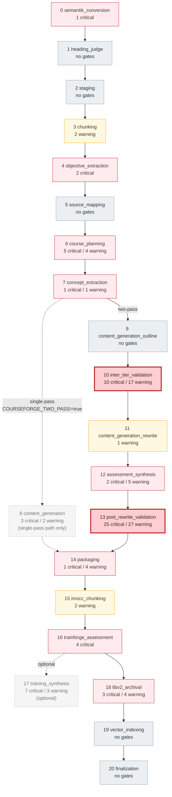
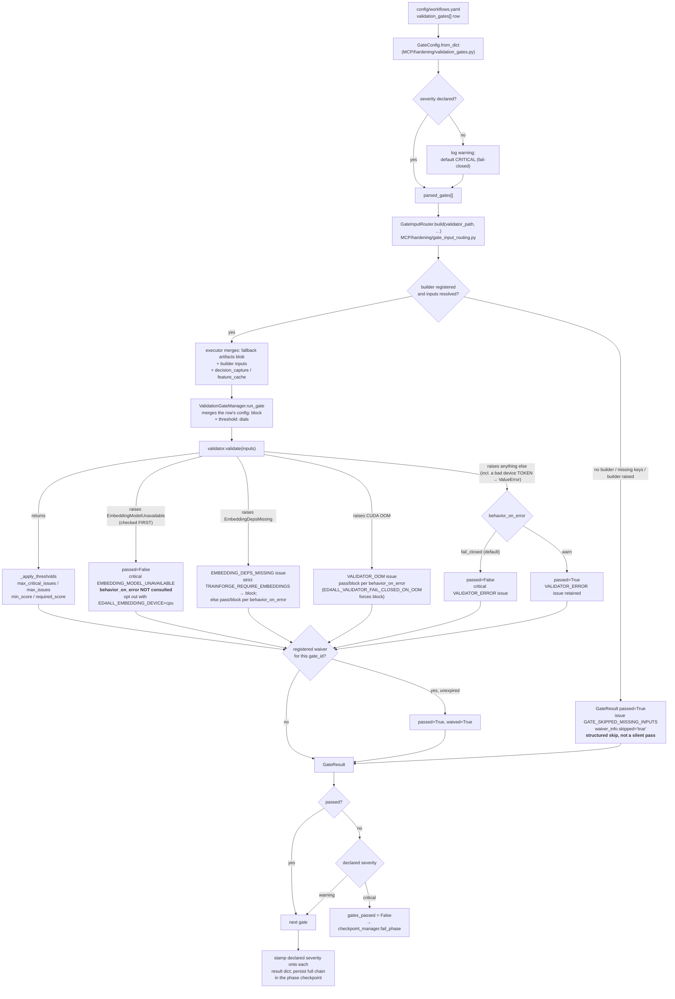

# Validation Architecture

How validation is layered in the Ed4All orchestrator: where gates attach, how a
single gate runs, what "blocking" actually means in code, and what the post-loop
aggregators compose out of the gate stream.

**Scope.** This file documents the *architecture*. The per-gate table
(workflow → phase → `gate_id` → validator, with per-gate rationale) lives in
[`docs/validation/gates.md`](../validation/gates.md);
per-validator detail in [`docs/validation/validators.md`](../validation/validators.md);
per-aggregator detail in [`docs/architecture/aggregators.md`](aggregators.md).
Nothing in those files is duplicated here.

**Source of truth.** `config/workflows.yaml::workflows.<name>.phases[].validation_gates`
is the only place gate wiring is declared. Every count below was re-derived from
that file (see [§6](#6-gate-counts-re-derived)).

---

## 1. The four layers

Validation is not one mechanism. Four distinct layers run at different times and
have different failure semantics:

| Layer | Runs | Failure semantics |
|---|---|---|
| **1. In-tool self-checks** | Inside a phase's tool, before it returns | Owned by the tool; can retry / regenerate its own units |
| **2. Phase validation gates** | After a phase's tasks complete, in `TaskExecutor.execute_phase` | Declared in YAML; only a `critical` failure clears `gates_passed` |
| **3. Post-loop aggregators** | Once, after the whole phase loop, in `WorkflowRunner.run_workflow` | Best-effort — an aggregator failure never changes `final_status` |
| **4. Post-training eval gates** | On the `post_training_validation` phase — in the standalone `trainforge_train` workflow, and in `textbook_to_course`'s opt-in `--with-training` tail, which carries the same two gate rows verbatim | Blocking unless `ED4ALL_GATE_ADVISORY` is truthy |

Layer 2 is what "validation gate" means everywhere else in the docs. Layers 3
and 4 are covered in [§5](#5-post-loop-aggregators-and-course_status) and
[§4.6](#46-post-training-eval-gates).

---

## 2. Where gates attach

Gates hang off phases, and they cluster hard: two validator-only phases carry
79 of the `textbook_to_course` workflow's 136 gate entries between them.

Dashed nodes are phases that a two-pass build with `--skip-training` does not
execute: `content_generation` is excluded by its `enabled_when_env` predicate
whenever the two-pass tiers are active, and `training_synthesis` is `optional`.
Their declared gates are therefore never evaluated on such a run — the gate
counts in [§6](#6-gate-counts-re-derived) are *declared*, not *executed*.

Three structural facts follow from the shape above:

1. **Generation phases barely gate themselves.** Neither outline emit
   (phase 9) nor rewrite emit (phase 11, one warning gate) carries the
   verification load. The load sits in the two dedicated validator-only phases
   that follow each tier.
2. **The same validators run twice.** `inter_tier_validation` and
   `post_rewrite_validation` re-run the same structural family against the two
   different artifact shapes — outline Blocks (no HTML body) and rewritten
   Blocks (HTML prose). The `outline_*` / `rewrite_*` `gate_id` prefixes in
   `docs/validation/gates.md` are the same validator bound twice.
3. **Cost is concentrated.** `inter_tier_validation` is cheap because outline
   Blocks carry no prose to entail; `post_rewrite_validation` is the single
   longest validator phase in a build because the entailment and grounding
   validators run NLI forward passes over every rewritten block. The
   `ED4ALL_VALIDATION_CHECKPOINT`, `ED4ALL_VALIDATION_FEATURE_CACHE`,
   `ED4ALL_NLI_CROSSBLOCK` and `ED4ALL_GROUNDEDNESS_FRONTIER` flags are all
   aimed at that cost.

---

## 3. Gate lifecycle

One gate = one row of YAML → one `GateConfig` → one input build → one validator
call → one `GateResult` appended to the phase's persisted gate chain.

### 3.1 Input routing

Validators do not receive raw phase outputs. `GateInputRouter` (built by
`default_router()`) maps a validator's **dotted import path** — exactly as it
appears in the YAML `validator:` field — to a builder function that assembles
that validator's specific input contract from `phase_outputs` and
`workflow_params`. Adding a validator is a one-line registry entry; the executor
needs no edit.

A builder returns `(inputs, missing)`. Three conditions produce a non-empty
`missing`, and all three land on the same outcome:

- no builder is registered for the validator path (`__no_builder_registered__`),
- the builder resolved but a required input is absent,
- the builder itself raised (`__builder_error__`; builders never raise by
  contract, so the router catches and converts).

In every case the executor emits a `GateResult` with `passed=True`, a single
`GATE_SKIPPED_MISSING_INPUTS` warning issue, and `waiver_info={"skipped": "true", …}`.
This is deliberate: a gate that could not be fed did not run, and the artifact
records that it did not run. It is a *structured skip*, distinguishable from a
real pass by both the issue code and the skip marker. The executor also logs a
warning naming the validator, so builder drift is observable.

Three of the 113 distinct validator paths declared across all workflows have no
registered builder today: `semantic_graph_rule_output` on `libv2_archival` (1,
warning severity) and the two `post_training_validation` gates (`eval_gating`,
`family_completeness` — declared on both `trainforge_train` and, since the
`--with-training` tail landed, `textbook_to_course`). They structured-skip when
their phase runs. The nine `training_synthesis` validators were in this list
until b0ea5791; all ten of that phase's gates — five of them critical —
resolved to `__no_builder_registered__` and were therefore skipped, so a
training corpus reached archival with no validation at all. One shared builder
(`_build_training_synthesis`) now serves all 13 registered dotted paths there
(9 canonical + 4 deprecated aliases), deriving the corpus tree from
`instruction_pairs_path` because `libv2_archival` has not run yet when the
phase is gated.

### 3.2 Severity, `on_fail`, and `on_error`

Each gate row declares three independent dials:

| Dial | Values | Default when omitted | What it actually controls |
|---|---|---|---|
| `severity` | `critical` / `warning` / `info` | **`critical`** | Whether a failure clears the phase's `gates_passed` |
| `behavior.on_fail` | `block` / `warn` | `block` | Consumed by `ValidationGateManager.run_phase_gates` only |
| `behavior.on_error` | `fail_closed` / `warn` | `fail_closed` | Whether a validator *exception* counts as a failure |

Two of those defaults are fail-closed by design. A gate row that forgets
`severity` blocks on failure, and the executor logs a loud warning naming the
gate so the omission is diagnosable rather than mysterious.

**`severity` is the only dial that stops a phase.** The executor's gate loop
clears `gates_passed` on exactly one condition — a failing gate whose parsed
severity is `CRITICAL`. `behavior.on_fail` is *not* consulted there: the
short-circuit-on-block logic lives in `ValidationGateManager.run_phase_gates`,
which the pipeline executor does not call (it drives `run_gate` itself, one gate
at a time, so the full chain always runs and is always persisted). The practical
consequence is worth stating plainly:

> A gate declared `severity: warning` with `behavior.on_fail: block` fails
> loudly, appears as a failure in the persisted chain, and **does not stop the
> workflow.** Exactly one gate in the repo is configured that way today
> (`content_grounding` on the rewrite phase). Do not read `on_fail: block` as
> "this blocks".

**Reading persisted checkpoints.** `GateResult` has no severity field of its
own. The executor stamps the *declared* severity onto each result dict — but
only when the validator left it unset. A validator that sets its own severity
string wins, so a checkpoint can show `"critical"` for a gate that
`config/workflows.yaml` declares `warning`. For blocking behavior, the YAML is
authoritative and the checkpoint is not.

### 3.3 What "fail closed" means

`behavior.on_error: fail_closed` means: *if the validator throws, treat the gate
as failed.* `run_gate` catches the exception, builds a `GateResult` with
`passed=False` and a critical `VALIDATOR_ERROR` issue carrying the exception
text, and only downgrades it to `passed=True` when the gate explicitly declared
`on_error: warn`.

The reasoning is the same one that drives the structured skip: a validator that
crashed verified nothing. Rewriting "the check exploded" into "the check passed"
is the silent-degradation failure mode — it produces a green build whose green
means nothing. Fail-closed is therefore the default, and a gate opts *out* of it
only when the validator's dependencies are genuinely optional (see
[§4](#4-graceful-degradation)).

Two refinements sit on top:

- **CUDA OOM is distinguished from a validator bug.** An out-of-memory raised
  inside a validator — an NLI or embedding forward pass on a card that a
  resident generation model is starving — is detected and surfaced as a distinct,
  greppable `VALIDATOR_OOM` issue plus a decision-capture event, rather than
  being folded into the generic `VALIDATOR_ERROR` path. Pass/block still honours
  the gate's `behavior_on_error`; `ED4ALL_VALIDATOR_FAIL_CLOSED_ON_OOM` forces
  block regardless. The point of the split is that an OOM is an *environment*
  problem with an environment fix (free VRAM, raise the free-VRAM floor, pin the
  scorer to CPU), and it must never look like a passing gate.
- **The two typed embedding-backend errors are split out ahead of the OOM
  sniff**, and one of them ignores `behavior_on_error` entirely. An unavailable
  embedding *device* (`EmbeddingModelUnavailable`) always fails the gate closed;
  missing `[embedding]` *extras* (`EmbeddingDepsMissing`) keeps honouring
  `on_error: warn` unless `TRAINFORGE_REQUIRE_EMBEDDINGS` is on. Full contract
  and the residual gaps: [§4.2](#42-a-requested-device-that-is-not-there--a-different-contract)
  and [§4.3](#43-what-fatal-does-and-does-not-buy-you).
- **Validator imports are allowlisted.** `load_validator` refuses any dotted
  path outside `lib.validators.`, `lib.leak_checker`, and `Courseforge.router.`,
  so a YAML edit cannot load arbitrary modules.

### 3.4 Waivers

`ValidationGateManager` supports a real, auditable waiver surface: a
`GateWaiver` registered for a `gate_id` (requiring a `who`, a 20-character
minimum `reason`, and a `remediation_plan`, with optional expiry) flips a failed
gate to `passed=True, waived=True` and stamps `waiver_info` onto the result.
Expired waivers are ignored.

There is **no CLI or YAML surface that registers a waiver for a pipeline phase
gate.** Hand-editing a persisted checkpoint or workflow-state file to clear a
failure is not this feature and leaves no auditable record in the gate chain.

---

## 4. Graceful degradation

### 4.1 The optional-extras contract

A family of validators — the statistical / embedding tier — depends on
`sentence-transformers` (the `[embedding]` pyproject extra) or on an NLI model.
Those are optional installs. The contract, uniform across the family:

**Default (extras absent).** The validator calls `try_load_embedder()`, gets
`None`, and returns a `GateResult` with `passed=True`, `score=1.0`, and a single
**warning**-severity `EMBEDDING_DEPS_MISSING` issue explaining which extra to
install. It emits decision-capture events on the degrade path so the silent-skip
is visible in the audit trail. The gate does not block, and it does not fabricate
a score.

**Strict mode.** `TRAINFORGE_REQUIRE_EMBEDDINGS=true` flips the policy.
`is_strict_mode()` becomes true, `try_load_embedder()` raises
`EmbeddingDepsMissing` instead of returning `None`, and the exception propagates
out of `validate()`. `run_gate` routes it to
`ValidationGateManager._build_embedding_deps_missing_gate_result`, which emits a
distinct `EMBEDDING_DEPS_MISSING` result rather than the generic
`VALIDATOR_ERROR`, and resolves pass/block as: strict mode on → `passed=False`
with a **critical** issue *regardless of* `behavior_on_error` (honouring
`on_error: warn` there would silently undo the operator's own opt-in); strict
mode off → honour `behavior_on_error` exactly as before (`warn` → `passed=True`
with a **warning** issue). So the same missing dependency is a non-blocking
warning by default and a hard block for an operator who has declared that
embedding-tier validation is required. **The optional-extras contract is
unchanged by everything below.**

### 4.2 A requested DEVICE that is not there — a different contract

This is not the extras contract and it is never a degrade.
`ED4ALL_EMBEDDING_DEVICE` defaults to `cuda` for this tier too
(`SentenceEmbedder` passes `device=` explicitly instead of letting
`sentence-transformers` auto-select), and there is no CUDA→CPU fallback. When
the extras ARE installed but the model cannot be constructed on the resolved
device, `SentenceEmbedder._ensure_model` raises `EmbeddingModelUnavailable` —
deliberately **not** a subclass of `EmbeddingDepsMissing` (and not a superclass
either; the two are unrelated `RuntimeError` subclasses) so it can never be
mistaken for the optional-extras escape hatch — with a message naming
`ED4ALL_EMBEDDING_DEVICE=cpu`. Missing extras stays a warning regardless of
device; a missing device stays fatal regardless of
`TRAINFORGE_REQUIRE_EMBEDDINGS`.

**The fatality is enforced at both layers, and it survives `on_error: warn`.**

*Validator layer.* Eight validators load the embedder, then call
`SentenceEmbedder.preload()` **before** their audit loop so the model load lands
at the boundary where the failure is actionable, and additionally narrow every
`except Exception` around `encode` / `encode_batch` with an
`except EmbeddingModelUnavailable: raise` ahead of it. So the typed error can no
longer be downgraded into a warning-severity `EMBEDDING_ENCODE_ERROR`, a `None`
vector treated as skip-with-pass, or (in `distractor_misconception_alignment`) a
silent per-pair downgrade to Jaccard:
`objective_assessment_similarity`, `concept_example_similarity`,
`objective_roundtrip_similarity`, `co_terminal_alignment`, `source_coverage`,
`rewrite_source_grounding`, `terminal_objective_source_grounding`,
`distractor_misconception_alignment`. A genuinely transient, non-device encode
failure still degrades to the warning-severity `EMBEDDING_ENCODE_ERROR` as
before — that path was narrowed, not removed.

*Gate-manager layer.* The validator-level raise would be worthless on its own:
all **13** wirings of those eight validators in `config/workflows.yaml` carry
`behavior.on_error: warn`, and the generic handler rewrites any raise into
`passed=True` under that setting. `ValidationGateManager.run_gate` therefore
checks the two typed embedding errors **first**, via `_exc_chain_has` (an
`isinstance` walk over `__cause__` / `__context__`, depth-capped, so a validator
that re-raises the error wrapped is still recognised) and **before** the
`is_cuda_oom` message sniff — `_ensure_model` wraps *any* construction failure
including a CUDA OOM, so the OOM branch would otherwise match and hand it back
to `on_error: warn`. `_build_embedding_device_gate_result` consults neither
`behavior_on_error`, nor `TRAINFORGE_REQUIRE_EMBEDDINGS`, nor
`ED4ALL_VALIDATOR_FAIL_CLOSED_ON_OOM`: it always returns `passed=False` with a
critical `EMBEDDING_MODEL_UNAVAILABLE` issue, an ERROR log line, and a
`DecisionCapture` event. The documented opt-out is the explicit, greppable
`ED4ALL_EMBEDDING_DEVICE=cpu`. Regression coverage over the real gate configs:
`MCP/hardening/tests/test_validation_gates_embedding_device.py`.

### 4.3 What "fatal" does and does not buy you

`passed=False` is not the same as "blocks the build", and the remaining gaps are
named here rather than implied away.

**Every one of those 13 wirings is declared `severity: warning`.** Both gate
loops — `ValidationGateManager.run_phase_gates` and the production one in
`MCP/core/executor.py` — set `gates_passed = False` only for
`severity: critical` (see [§3.2](#32-severity-on_fail-and-on_error): `severity`
is the only dial that stops a phase). So a device-unavailable result is recorded
as a FAILED gate in the phase checkpoint's `gate_results`, with the critical
issue, the ERROR log, and the capture — it is never reported as a pass — but on
the current config it does **not** by itself halt the phase. Promoting any of
these gates to `severity: critical` is a separate decision, calibration-gated
where the YAML says so (`# TODO(calibration)`); do not read the typed
passthrough as having made them blocking. The § 3.4 waiver surface also still
applies to this branch: a registered `GateWaiver` flips the result to
`passed=True, waived=True`, which is intended (auditable, operator-owned) but is
an override.

**A typo'd `ED4ALL_EMBEDDING_DEVICE` token is still a warn-pass.** Device
resolution runs before any typed embedding error exists:
`lib/embedding/providers.py::normalize_device_token` raises a plain `ValueError`
on an unrecognized token (`auto` included — this project never auto-detects a
device). That `ValueError` is neither `EmbeddingModelUnavailable` nor
`EmbeddingDepsMissing`, so the typed passthrough does not see it, and the
generic handler under `on_error: warn` returns `passed=True` with a
`VALIDATOR_ERROR` issue. A misspelled device is therefore *less* safe than an
absent one. Pin the token exactly (`cpu` / `cuda` / `cuda:N`).

**The batched feature-cache path still swallows the typed error — latent, not
live.** `lib/validators/feature_cache.py::BlockFeatureCache.embed` wraps its
batched encode in a broad `except Exception` and returns a partial (possibly
empty) `{sha -> vector}` map on failure; `_resolve_embedder_locked` does the same
around `try_load_embedder`. Neither was narrowed. It is not reachable for the
device case as currently wired: the only caller is
`rewrite_source_grounding`, and both it and the cache resolve
`try_load_embedder()` with no arguments, so they share the *same*
`(model_name, device)` process-singleton — the validator's `preload()` therefore
raises first and the cache never gets to swallow anything. The hole becomes live
the moment either premise breaks: a new `feature_cache.embed()` caller that does
not preload, or a `BlockFeatureCache` built with a different
`embedder_model_name` (whose own construction failure — missing weights, not
just a missing device — is also wrapped in `EmbeddingModelUnavailable`). Narrow
those two handlers if you add such a caller.

**Known deviation — `distractor_misconception_alignment` does not honour
`TRAINFORGE_REQUIRE_EMBEDDINGS` on missing extras.** Its `try_load_embedder()`
call re-raises `EmbeddingModelUnavailable` (device: fatal, as above), but a
strict-mode `EmbeddingDepsMissing` is still caught by the broad
`except Exception` that follows and degrades the gate to Jaccard token-overlap
with a warning-severity `EMBEDDING_DEPS_MISSING`. The tier-wide strict flip does
not reach this one validator. Pre-existing and **deliberately left unchanged**
pending an owner decision; do not "fix" it as a drive-by.

**`bloom_classifier_disagreement` is not on this contract at all.** It rides the
same `[embedding]` extras group (it reuses that group's `transformers` pin) but
loads a BERT ensemble, not a `SentenceEmbedder`: its typed error is
`BertEnsembleDepsMissing` and its strict flag is
`TRAINFORGE_REQUIRE_BERT_ENSEMBLE`. `ED4ALL_EMBEDDING_DEVICE` and the
passthrough above do not apply to it.

The NLI-backed validators follow the missing-extras shape with their own issue
code (`NLI_DEPS_MISSING`) and the same `TRAINFORGE_REQUIRE_EMBEDDINGS` flag.
`ED4ALL_NLI_DEVICE` deliberately does **not** share the embedding device
contract — it still degrades `cuda`→CPU with a warning.

The equivalent pattern predates the embedding tier: the SHACL validators degrade
to a single warning issue with `passed=True` when the RDF/SHACL extras are
missing, on the same "cannot block on an optional dependency" reasoning.

### 4.4 Why degrade rather than skip

The degrade path deliberately produces a `GateResult` rather than omitting the
gate. Every declared gate that was parsed contributes exactly one entry to the
persisted chain — there is no cap, no truncation, no merge — so a chain with N
entries reflects N configured gates. That invariant is what makes the chain
auditable after the fact: "this gate is absent" is always a wiring question, and
never "it probably ran and passed".

### 4.5 Calibration-gated severity flips

Some gates ship at `warning` with the *intent* of becoming `critical`, but
promoting a gate on the day it lands risks blocking builds on a validator whose
false-positive rate is unmeasured. The resolution is a calibration gate rather
than a code edit.

`lib/governance/calibration_gate.py::resolve_severity_flip` reads a named
summary signal out of a reference course's
`quality/trainforge_assessment_quality_report.json` and returns
`(apply_flip, decision_payload)` — the flip fires only when the observed signal
is a finite numeric at or above the configured threshold. A missing report, an
unreadable report, or an absent signal all defer the flip; the gate stays at its
shipped severity. The helper does not emit the decision itself; it returns a
pre-built payload so the calling validator logs it against its own capture
handle, which keeps every flip in the audit trail in one greppable shape.

Note what this flips and what it does not: the helper is consumed *inside* a
validator to raise the severity of an individual `GateIssue` it emits. The gate
row's own `severity:` in `config/workflows.yaml` is unchanged. One validator
uses this mechanism today (`assessment_retrieval_grounding`, promoting its
`NO_SOURCE_ATTRIBUTION` issue from warning to critical). Gates carrying a
deferred flip that has *not* been mechanized are marked in
`docs/validation/gates.md` with a calibration TODO, and promoting one is a YAML
severity edit.

### 4.6 Post-training eval gates

The training runner enforces `EvalGatingValidator` inline (`_enforce_eval_gate`
in `Trainforge/training/runner.py`) so a direct-CLI training run is gated
regardless of how it was invoked. A failure raises and blocks promotion of the
trained adapter — unless `ED4ALL_GATE_ADVISORY` is `1` or `true`, which makes
the gate log-only and ships the run dir anyway. This flag governs that one call
site; it does not touch the layer-2 phase gates described above.

---

## 5. Post-loop aggregators and `course_status`

After the phase loop finishes, `WorkflowRunner.run_workflow` runs a sequence of
aggregators that read the per-phase gate chains and the on-disk artifacts and
roll them into operator-facing JSON reports. Every one is **best-effort**: an
aggregator that raises logs a warning and does not change `final_status`. The
per-phase reports remain the source of truth; the aggregators are a view over
them.

```mermaid
flowchart TD
    subgraph LOOP["phase loop"]
        GC["per-phase _gate_results chains<br/>+ phase checkpoints"]
        ART["on-disk artifacts<br/>export dir · LibV2 course dir<br/>llm_usage.jsonl · vram_trajectory.jsonl"]
    end

    GC --> AGG
    ART --> AGG

    subgraph AGG["post-loop aggregators (best-effort, in call order)"]
        direction TB
        A1["CourseforgeValidationReport"]
        A2["TrainforgeAssessmentQualityReport"]
        A3["CoverageMapAggregator"]
        A4["BlockQualityRollupAggregator<br/><i>flag-gated</i>"]
        A5["EdgeConsensusAggregator"]
        A6["PromotionChainAggregator"]
        A7["procurement_evidence exporter<br/><i>advisory</i>"]
        A8["ConceptCoverageAggregator<br/><i>flag-gated</i>"]
        A9["IntelligenceLevelAggregator<br/><i>flag-gated</i>"]
        A10["bloom-label harvester<br/><i>flag-gated</i>"]
        A11["AccessibilityConformanceAggregator"]
        A12["BuildCostAggregator"]
        A13["ProvenanceResolutionAggregator"]
    end

    A6 --> CS["derive_course_status<br/>lib/governance/course_status.py"]
    CS --> ENUM["course_status stamped on the<br/>promotion-chain report"]
    A6 -.->|"chain_hash"| A7

    ENUM --> E1["failed"]
    ENUM --> E2["non_certified_archive"]
    ENUM --> E3["certified_accessible"]
    ENUM --> E4["certified_instructional"]
    ENUM --> E5["certified_trainable"]
```

`PromotionChainAggregator` is the one that composes a verdict. It walks a
canonical **9-arrow chain** — source documents → accessible HTML → Courseforge
Blocks → rewritten HTML → IMSCC → IMSCC chunks → assessment items → training
pairs → adapter → eval report — reading each stage's report best-effort and
emitting one row per arrow. A stage whose report is missing does not vanish: it
surfaces as an explicit `missing_stage_report` row with a failing
`promotion_decision`, which is the anti-silent-degradation contract — a skipped
stage must look different from a passed one.

`derive_course_status` then walks those rows and returns one of five values.
The tiers are cohort-driven: three frozen gate-id cohorts
(accessibility → instructional → trainable) each promote the status one tier
when they pass jointly.

| `course_status` | Meaning |
|---|---|
| `failed` | An arrow hard-failed on a critical-cohort gate, or a stage report is missing on a run that was supposed to produce it |
| `non_certified_archive` | Arrows through IMSCC chunking landed cleanly, but nothing past them ran or passed — archivable, never reached the assessment/training cohort |
| `certified_accessible` | The accessibility cohort passes |
| `certified_instructional` | Accessibility **and** instructional cohorts pass |
| `certified_trainable` | All three cohorts pass |

The composer never returns `None` — every input maps to one of the five. It also
takes a three-valued `training_expected` hint so a deliberately non-training run
(`--skip-training`, or `--stop-after imscc_chunking`) certifies at the tier its
completed arrows support instead of being forced to `failed` by training arrows
that were never dispatched.

`PromotionChainAggregator` supersedes the per-aggregator
`final_promotion_decision` heuristics that individual reports used to compute.
The procurement-evidence exporter is keyed to the chain report by `chain_hash`
and is strictly advisory: it never mutates the chain report or `course_status`.

Per-aggregator outputs, schemas, and flag gating: [`docs/architecture/aggregators.md`](aggregators.md)
and the root `CLAUDE.md § Aggregators` table.

---

## 6. Gate counts (re-derived)

Counted directly from `config/workflows.yaml` by walking
`workflows.<name>.phases[].validation_gates[]`. "Entries" counts rows;
"distinct" counts unique `gate_id` values within the workflow (the same gate id
can be bound at more than one phase).

| Workflow | Critical | Warning | Total entries | Distinct gate ids |
|---|---:|---:|---:|---:|
| `course_generation` | 34 | 29 | 63 | 59 |
| `rag_training` | 4 | 3 | 7 | 7 |
| `textbook_to_course` | 64 | 72 | 136 | 127 |
| `trainforge_train` | 2 | 0 | 2 | 2 |
| **Total** | **104** | **104** | **208** | — |

**These match the root `CLAUDE.md § Validation Gates` table exactly** — same
per-workflow critical/warning splits, same 208 total. No discrepancy to report.

Every gate row declares `severity` explicitly (no row relies on the
critical-by-default fallback), and no row sets `enabled: false`.

Behavior-dial distribution across all 208 rows, with omitted dials resolved to
their `GateConfig.from_dict` defaults:

| Dial | Value | Rows |
|---|---|---:|
| `on_fail` | `block` (91 explicit + 14 defaulted) | 105 |
| `on_fail` | `warn` | 103 |
| `on_error` | `fail_closed` (86 explicit + 4 defaulted) | 90 |
| `on_error` | `warn` | 118 |

Full `(severity, on_fail, on_error)` distribution across the 208 rows:

| Combination | Rows |
|---|---:|
| `(warning, warn, warn)` | 97 |
| `(critical, block, fail_closed)` | 83 |
| `(critical, block, warn)` | 21 |
| `(warning, warn, fail_closed)` | 6 |
| `(warning, block, fail_closed)` | 1 |

The first two are the coherent postures and cover 180 of the 208 rows. The
outliers are worth knowing about: 21 rows are `(critical, block, warn)` — they
block on a *failure* but tolerate a validator *crash* — 6 rows are
`(warning, warn, fail_closed)`, which is inert in practice because a warning
gate cannot clear `gates_passed` however it fails, and exactly one row is
`(warning, block, fail_closed)`, the non-blocking `content_grounding` gate
discussed in [§3.2](#32-severity-on_fail-and-on_error).

Per-phase distribution for `textbook_to_course`:

| Phase | Critical | Warning | Total |
|---|---:|---:|---:|
| `semantik_conversion` | 1 | 0 | 1 |
| `chunking` | 0 | 2 | 2 |
| `objective_extraction` | 2 | 0 | 2 |
| `course_planning` | 5 | 4 | 9 |
| `concept_extraction` | 1 | 1 | 2 |
| `content_generation` | 3 | 2 | 5 |
| `inter_tier_validation` | 10 | 17 | 27 |
| `content_generation_rewrite` | 0 | 1 | 1 |
| `assessment_synthesis` | 2 | 5 | 7 |
| `post_rewrite_validation` | 25 | 27 | 52 |
| `packaging` | 1 | 4 | 5 |
| `imscc_chunking` | 0 | 2 | 2 |
| `trainforge_assessment` | 4 | 0 | 4 |
| `training_synthesis` | 7 | 3 | 10 |
| `libv2_archival` | 3 | 4 | 7 |

`heading_judge`, `staging`, `source_mapping`, `content_generation_outline`,
`vector_indexing`, and `finalization` declare no gates.

Across all four workflows the gates resolve to **112 distinct validator dotted
paths in 107 distinct modules**, almost all under `lib/validators/` with the
`outline_*` / `rewrite_*` structural family living in
`Courseforge/router/inter_tier_gates.py`.

### 6.1 Validators are reachable only by string

There is **no Python import edge** from the executor to any validator. Validator
classes are resolved at gate time from the dotted path in the YAML `validator:`
field, through the allowlisted `importlib` load in `load_validator`. A naive
dead-code sweep will report most of `lib/validators/` as unreachable. It is not.
The same holds for the aggregator modules, which are imported lazily inside
their `_maybe_write_*` call sites — several behind default-off flags, where
"flag off" means "wrote no file", not "dead code".

---

## 7. Reading a run's validation outcome

Two on-disk surfaces record gate results and they are not the same thing:

- `runtime/state/runs/<RUN_ID>/checkpoints/<phase>_checkpoint.json` — written by
  `CheckpointManager` from the executor. Carries the **full gate chain** for the
  phase. Stamped `completed` when `gates_passed`, `failed` otherwise.
- `runtime/state/workflows/<WORKFLOW_ID>.json` → `phase_outputs[<phase>]` — written by
  `WorkflowRunner`. This is what `--resume` reads; a phase is skipped on resume
  only when it is marked complete and its gates did not fail.

When they disagree, the checkpoint tells you what the gates said and the
workflow state tells you what the runner did about it. A phase can legitimately
carry a `failed` checkpoint while the run continued — the graceful
`course_planning` gate-retry path (`ED4ALL_PLANNING_GATE_RETRIES`, default `0` =
off) exhausts its budget, appends a `PLANNING_GATE_RETRIES_EXHAUSTED` warning
entry to the gate chain, and returns complete-with-warning. It re-stamps the
*workflow state* (`_completed` / `_gates_passed` / `_gate_results`, plus a
`_planning_gate_retries_exhausted: true` marker) but not the phase *checkpoint*,
which keeps the earlier `failed` stamp. That marker is the way to tell this code
path apart from a hand-edited state file: the retry path always leaves it, and a
manual edit leaves no auditable record in the gate chain at all.

Stale `failed_phase` / `paused_phase` markers from superseded attempts can also
survive on a workflow state whose final status is complete; they are not the
run's outcome.

For a failing gate, the useful reading order is: the issue `code` (it is
machine-readable and greppable across the repo), then the declared severity in
`config/workflows.yaml` (not the checkpoint's stamped severity), then the
per-gate row in [`docs/validation/gates.md`](../validation/gates.md) for what
the validator is actually checking.
