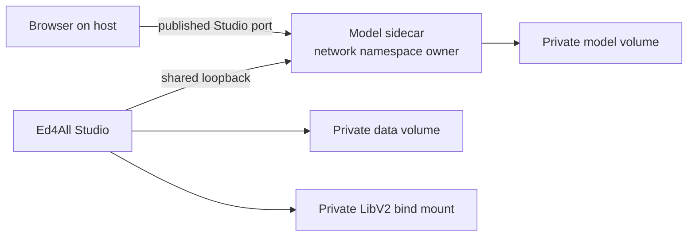

# Docker deployment

The checked-in Compose stack provides a portable local Ed4All Studio with a
private model sidecar. It packages the application, keeps mutable course data
outside the image, and preserves the grounded-answer requirement that model
traffic stays on loopback.

## Build and start

Run these commands from the repository root:

```bash
docker compose config
docker compose build gui
docker compose up -d
docker compose ps
```

`docker compose config` must succeed before the build. It renders the effective
configuration, including any machine-local override, and catches invalid YAML,
missing interpolation values, and incompatible service settings early.

The model store starts empty on a new installation. Select an approved model in
your private override, then pull that exact identifier into the sidecar:

```bash
export ED4ALL_DOCKER_MODEL='<model-id-from-private-configuration>'
docker compose exec ollama ollama pull "$ED4ALL_DOCKER_MODEL"
docker compose exec ollama ollama list
```

Open `http://127.0.0.1:8077` after the Studio health check passes. Model choice,
licensing approval, and hardware fit are operator decisions; this public guide
does not pin a model or accelerator profile.

## Services and deployment profiles

The base stack has two cooperating services:

- `gui` builds from [`Dockerfile.gui`](../../Dockerfile.gui) and runs the Studio
  application, pipeline commands, retrieval, and health endpoint.
- `ollama` runs the private OpenAI-compatible answer service and owns the shared
  network namespace.



Text equivalent: the host browser reaches Studio through the port published by
the model sidecar, which owns the shared network namespace. Studio reaches the
model through loopback and reads private data and LibV2 storage. Model files are
kept in a separate private volume.

The base Compose file does not define named Compose `profiles`; both services
start together because grounded answers require their shared loopback topology.
Machine-specific runtime settings belong in the ignored
`docker-compose.override.yml` or another private override file. To select a
non-default override explicitly:

```bash
export ED4ALL_COMPOSE_OVERRIDE='<path-to-private-override>'
docker compose -f docker-compose.yml -f "$ED4ALL_COMPOSE_OVERRIDE" config
docker compose -f docker-compose.yml -f "$ED4ALL_COMPOSE_OVERRIDE" up -d
```

Do not publish the model API or replace the shared namespace with a service-name
URL. The answer backend rejects non-loopback endpoints by design.

## Private environment and volumes

The effective environment is deployment configuration, not documentation.
Keep credentials, tokens, model identifiers, endpoint overrides, frame origins,
and host-specific device settings in a private override or secret-management
system. Do not bake them into an image or commit them.

The stack uses these persistent storage boundaries:

- `ed4all-data` holds mutable application state, uploads, generated artifacts,
  caches, and captures beneath the container data root;
- the repository’s `LibV2` directory is bind-mounted as the private course
  library shared with trusted host-side tools; and
- `ollama-models` holds model files managed by the sidecar.

The image contains source code and installed Python dependencies. It does not
contain the operator’s course library, generated runs, credentials, model
weights, or dependency caches. Those remain external runtime state and must not
be added to Git or published as project dependencies.

Studio mode exposes the learner-facing surface. If an operator enables the full
control surface, configure a strong private `ED4ALL_GUI_TOKEN` before exposing
it beyond a trusted loopback session. See
[`gui/README.md`](../../gui/README.md) for the current authentication contract.

## Health and diagnostics

Check container state and the unauthenticated liveness endpoint:

```bash
docker compose ps
curl -fsS http://127.0.0.1:8077/api/health
docker compose logs --tail=200 gui
docker compose logs --tail=200 ollama
```

Run Ed4All’s diagnostics inside the application container when the service is
healthy enough to execute commands:

```bash
docker compose exec gui ed4all doctor
docker compose exec gui ed4all doctor --ping
```

The container health check verifies that Studio is responding. `ed4all doctor`
checks a broader set of runtime dependencies; `--ping` adds configured service
connectivity. A warning or failure is evidence to investigate, not permission
to bypass the affected subsystem.

## Updates

Back up private state first. Then update images and rebuild the application:

```bash
docker compose pull ollama
docker compose build --pull gui
docker compose up -d
docker compose ps
curl -fsS http://127.0.0.1:8077/api/health
```

Rebuilding replaces the application container but preserves named volumes and
the LibV2 bind mount. Review the rendered configuration and release notes before
an update that changes schemas, storage layout, or provider requirements.

Use `docker compose down` to stop and remove containers while preserving data.
Do not add `--volumes` unless you deliberately intend to delete the named data
and model stores.

## Backup boundary

The built-in backup command covers Ed4All’s resolved mutable data directories,
including the LibV2 library when configured through the standard path helpers.
Run it from the application container with an output path on operator-controlled
storage:

```bash
docker compose exec gui ed4all backup --output /data/backups/ed4all-backup.tar.gz
docker compose exec gui ed4all backup --verify /data/backups/ed4all-backup.tar.gz
```

Model volumes and external caches are intentionally outside that application
backup. Re-create them from approved upstream sources or back them up with the
container platform’s volume tooling. Backups include private data and may
include credentials; never commit or publish them. See
[Backup and restore](backup-restore.md) before relying on a snapshot.

## No silent fallback

The container deployment follows the same fail-loud contract as native Ed4All:

- an unavailable or non-loopback answer service does not produce a canned
  answer;
- semantic retrieval does not downgrade to lexical when its index or embedding
  backend is unavailable;
- an explicitly selected device or precision is not silently replaced;
- missing conformance schemas do not become partial validation; and
- an unhealthy service is not treated as ready because its container process
  still exists.

Choose a supported alternative explicitly, correct the dependency, and rerun
the health or doctor check.

## Troubleshooting

### Compose configuration fails

Run `docker compose config` and inspect the reported service or interpolation.
If the failure appears only with a local override, validate the base file alone:

```bash
docker compose -f docker-compose.yml config
```

### Studio is unreachable or unhealthy

```bash
docker compose ps
docker compose logs --tail=200 gui
curl -v http://127.0.0.1:8077/api/health
```

Keep the Studio port mapping on the network-namespace owner. A service that
joins another service’s namespace cannot publish its own independent ports.

### Model requests fail

```bash
docker compose exec ollama ollama list
docker compose logs --tail=200 ollama
docker compose exec gui ed4all doctor --ping
```

Confirm that the privately configured model was pulled and that the GUI still
resolves the answer provider through shared loopback. Do not work around a
loopback-policy error by exposing the model API.

### Semantic retrieval or indexing fails

Confirm the configured embedding dependencies, model cache, device selection,
and vector-index manifest. The application image makes a portable CPU selection
explicit; a private accelerator override must also provide a compatible runtime
and Python stack. Ed4All reports an unavailable or mismatched backend instead of
changing device or retrieval engine silently.

### Data disappears after recreation

Inspect the effective mounts with `docker compose config` and verify that the
named data volume and LibV2 bind mount are present. Container writable layers
are disposable; persistent data must live on declared mounts.

## Related guides

- [Installation](installation.md)
- [Retrieval and serving](../architecture/retrieval-and-serving.md)
- [Behavior flags](behavior-flags.md)
- [Support bundles](support-bundle.md)
