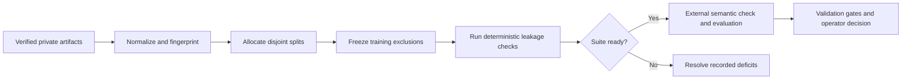

# Build a trustworthy adapter evaluation suite

Ed4All evaluates adapters against immutable, source-grounded questions that
remain separate from training data. This guide covers the offline suite
builder: how it allocates evaluation splits, records exclusions, detects
contamination, and reports whether the suite is ready for downstream review.

> **Final means unseen.** Use the development split for checkpoint selection.
> Do not inspect final evaluation answers or results while choosing a
> checkpoint, tuning retrieval, or changing training parameters.

The builder is deterministic and offline. It reads existing verified artifacts,
writes a suite and manifest, and does not call a model or mutate workflow state.

## Evaluation flow



In plain language: verified inputs become fingerprinted candidates; candidates
are assigned once; their source families are excluded from training; leakage
checks run; and only a complete, clean suite advances to semantic validation
and model evaluation.

## Prepare private inputs

Keep every input and generated report in ignored or external storage. Real
course identifiers, source identities, workflow identifiers, and model-service
details must not enter tracked files.

The command requires:

- a verified assessment bank;
- its answer key;
- canonical terminal and component objectives;
- canonical IMSCC chunks; and
- a private output directory.

Pass each instruction and preference dataset with a separate
`--training-pairs` option so the builder can compare final items with the
actual training records. Optional authored items may fill eligible deficits;
optional out-of-domain probes supply reviewed refusal cases.

Review provider and model terms in [Licensing and ToS posture](../LICENSING.md)
before authoring any additional evaluation content.

## Build the suite

Run from the repository root:

```bash
python3 -m Trainforge.eval.expanded_suite \
  --assessments <PRIVATE_ASSESSMENTS_JSON> \
  --answer-key <PRIVATE_ANSWER_KEY_JSON> \
  --objectives <PRIVATE_OBJECTIVES_JSON> \
  --chunks <PRIVATE_CHUNKS_JSONL> \
  --training-pairs <PRIVATE_INSTRUCTION_PAIRS_JSONL> \
  --training-pairs <PRIVATE_PREFERENCE_PAIRS_JSONL> \
  --authored-items <PRIVATE_AUTHORED_ITEMS_JSONL> \
  --ood-probes <PRIVATE_OOD_PROBES_JSON> \
  --output-dir <PRIVATE_EVALUATION_DIRECTORY>
```

Omit either optional input when it is not available. The builder writes:

- `expanded_eval_suite.json`, containing splits, exclusions, findings,
  deficits, source hashes, fingerprints, evaluation arms, and the arm-case
  count; and
- `manifest.json`, containing the suite hash, readiness state, split counts,
  deficits, and input hashes.

Exit code `0` means offline construction is complete and its enabled checks are
clean. Exit code `2` means the reports were written, but a quota, objective, or
contamination requirement remains unresolved. Neither exit code authorizes
adapter promotion.

## Understand split isolation

The allocator prioritizes objective-complete held-out coverage, then fills the
checkpoint-development, grounding-stress, pedagogy/misconception, and
out-of-domain splits without reusing an item fingerprint. A shortage remains a
visible deficit; the builder never copies an item between splits to make a
quota appear complete.

Each accepted item carries its scoring and audit contract: canonical objective,
Bloom level, answers, keypoints, source and citation anchors, content type,
difficulty, provenance, retrieval expectations, split, and fingerprint. Input
hashes and ordered exclusion identifiers bind the suite to the artifacts from
which it was built.

Source isolation is family-closed under
`cf_block_id_or_contiguous_follows_v1`. Chunks belong to the same family only
when they share an explicit `data-cf-block-id`, or a direct `follows_chunk`
edge connects contiguous character spans in the same item. Aggregate source
lists, whole item paths, and generic follows relationships do not define a
family. The suite records the qualifying evidence and its hash.

The frozen `dev_final_disjoint_family_max2_v1` reuse policy keeps development
and final source families disjoint. Final families remain inside the training
exclusion union, and any permitted second item from a family must use a
different objective, task, and failure mode.

## Treat contamination as blocking

The offline builder checks training records against non-development items for:

- exact or normalized text overlap;
- fuzzy text similarity;
- source-chunk identity; and
- answer or keypoint containment.

The suite declares semantic similarity as
`pending_external_embedder_validation`; the CLI does not run an embedding
model. Complete semantic comparison with the production embedding setup before
using the suite for a promotion decision, and repeat it against the final SFT
and DPO records. Quarantine a contaminated training record or evaluation item.
Never weaken a threshold or reassign an item merely to obtain a pass.

## Fill deficits safely

Authored deficit items are eligible only for their preassigned development,
grounding-stress, or pedagogy split. They need a complete scoring contract,
source anchors, a unique fingerprint, and qualified independent review before
the builder accepts them.

Out-of-domain items must be reviewed refusal probes grounded in other licensed
material. Do not fabricate target-course facts to create them. Additional
items do not expand or replace the frozen target-course training exclusion.

The authoring queue rejects assessment-item sources, broad overview passages,
and passages without adequate lexical support for the selected objective. A
missing suitable source remains a deficit rather than silently receiving an
unrelated objective or held-out source.

## Compare like with like

Every non-development item is projected across the same six arms:

| Adapter stage | Without retrieval | With retrieval |
|---|---|---|
| Base model | `base_no_rag` | `base_rag` |
| SFT adapter | `sft_no_rag` | `sft_rag` |
| DPO adapter | `dpo_no_rag` | `dpo_rag` |

All six cases retain the same item fingerprint. Differences can therefore be
attributed to retrieval and adapter stage instead of question sampling.

## Decide after validation

Suite readiness is one prerequisite, not a promotion verdict. Run the
evaluation harness and the configured validation gates, preserve their reports,
and let an operator review the evidence before choosing promote, hold, or
reject. A failed critical gate blocks promotion.

Canonical references:

- [Validation gates](../validation/gates.md) defines enforced gate behavior.
- [Pipeline invocation](pipeline-invocation.md) covers execution, stop, and
  resume semantics.
- [Trainforge training pipeline](../../Trainforge/CLAUDE.md#training-pipeline)
  documents the evaluation harness, gate integration, and promotion ledger.
- [LibV2 operations](../../LibV2/CLAUDE.md) documents model import, inspection,
  and promotion commands.
