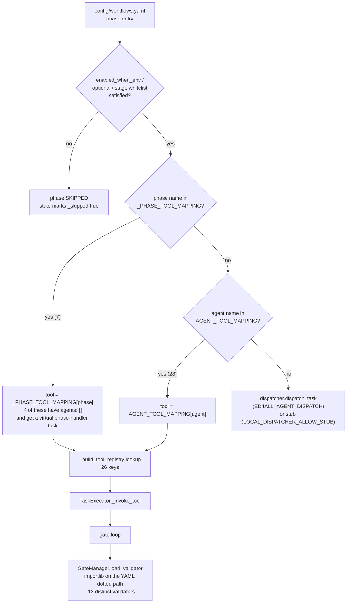
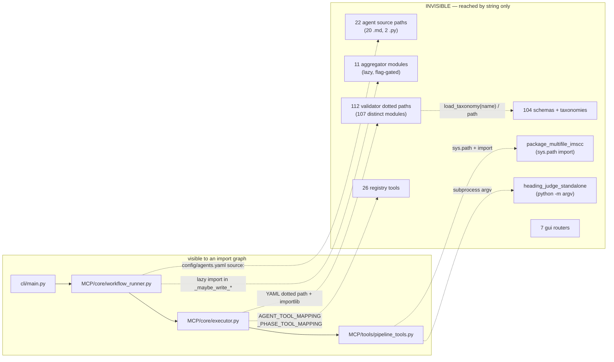

# Full-Run Inventory — the PROTECTED SET

**What this is.** The authoritative record of what participates in a full
`textbook_to_course` production run, and therefore what a dead-code sweep must
**not** delete. It was derived by reading the dispatch tables, the workflow
config, and the module bodies, and by cross-checking against a completed
21-phase production run's checkpoint + workflow-state artifacts.

**How to use it.** Before removing any file, look for it here. If it is listed,
it is protected — removing it breaks a run, and the breakage is frequently
**silent** (a phase that produces nothing rather than a phase that errors).
If a file is *not* listed, that is **not** proof it is dead: this document
covers the full-run path, not the training/eval harnesses, the developer
tooling, or the test suite. Absence means "not established as protected",
not "safe to delete".

**Verification convention.** Every row carries evidence — a call site, a
registry key, a config reference, or an observed run artifact. Anything I could
not verify from the repo is marked `UNVERIFIED:` inline. Counts in this document
were computed from the repo at the time of writing; re-derive them rather than
trusting them after a config change.

---

## 0. Relationship to the other inventory documents

Four inventory docs already exist. This one does not replace them wholesale —
each retains authority over a different scope.

| Document | Scope | Status relative to this doc |
|---|---|---|
| [`docs/MANIFEST.md`](../MANIFEST.md) | One line per git-tracked file, whole repo, alphabetical | **Remains authoritative** for *file existence and purpose*. It is a complete index; this doc is a reachability judgement over a subset. It self-describes as "a convenience index, not an authority", and its header records a generation date well before the current phase set. **Do not use it to decide deletion.** |
| [`docs/FILE_MANIFEST.md`](../FILE_MANIFEST.md) | Per-area "productive core vs. gitignored data/runtime" orientation map | **Remains authoritative** for the *tracked-vs-gitignored* distinction (which trees are regenerable working data). **Superseded by this doc** for any claim about whether a module is live. Its tracked-vs-gitignored statements were re-checked and hold (§7 items 5 and 10). |
| [`docs/file-audit-cleanup.md`](../file-audit-cleanup.md) | Actionable gitignore + local-disk trash list | **Remains authoritative**, and is complementary — it covers *untracked, gitignored* scratch files. This doc covers *tracked* code. The two do not overlap. |
| [`docs/dart-surface-inventory.md`](../dart-surface-inventory.md) | Every surviving `dart` naming token, classified by rename blast radius | **Remains authoritative** for the rename/purge plan. It is a *naming* inventory, not a reachability inventory. Its "legacy alias" findings agree with §1.2 here: the `dart-*` agent keys are live dispatch routes, not dead names. |

**The parallel-mechanism risk is real.** To avoid it: this document owns
"is it reachable in a full run". It does not restate file purposes (that is
`MANIFEST.md`) and does not restate gitignore posture (that is
`FILE_MANIFEST.md` / `file-audit-cleanup.md`).

---

## 1. Reachable ONLY by dynamic dispatch — invisible to import-graph analysis

> **Read this section before running any dead-code tool.**
>
> Everything below is reached by a **string** — a registry key, a phase name, a
> dotted path in YAML, a `python -m` argv, a filesystem path, or an env-var
> comparison. **There is no Python `import` edge to any of it from the
> orchestrator.** Every static analyser, IDE "find usages", `vulture`,
> `deadcode`, and coverage-based sweep will report these as unreachable. They
> are not. Deleting them typically produces a *silent* failure: the phase runs,
> reports success, and emits nothing.

### 1.1 Phase names resolved via `_PHASE_TOOL_MAPPING`

`MCP/core/executor.py::_PHASE_TOOL_MAPPING` — **7 entries**, checked *before*
the agent table. Verified by cross-checking every value against the tool
registry: all 7 resolve.

| Phase name (string) | Tool key (string) | `agents:` in `config/workflows.yaml` | Why deletion is silent |
|---|---|---|---|
| `heading_judge` | `run_heading_judge` | `[]` | **Only route.** |
| `inter_tier_validation` | `run_inter_tier_validation` | `[]` | **Only route.** |
| `assessment_synthesis` | `run_assessment_synthesis` | `[]` | **Only route.** |
| `post_rewrite_validation` | `run_post_rewrite_validation` | `[]` | **Only route.** |
| `content_generation_outline` | `run_content_generation_outline` | `["content-generator"]` | Overrides the agent (which maps to `generate_course_content`). |
| `content_generation_rewrite` | `run_content_generation_rewrite` | `["content-generator"]` | Overrides the agent. |
| `imscc_chunking` | `run_imscc_chunking` | `["semantik-chunker"]` | **Critical fork** — the same agent maps to `run_dart_chunking`. Only the phase-name override selects the IMSCC-side chunkset. Removing it silently emits the wrong chunkset kind. |

**The four `agents: []` phases are the sharpest edge.** For a phase with an
empty agent list, `workflow_runner._create_phase_tasks` synthesizes a virtual
`phase-handler` task **only if the phase name appears in `_PHASE_TOOL_MAPPING`**.
Remove the mapping row and **no task is created at all** — the phase no-ops
without an error.

### 1.2 Agent names resolved via `AGENT_TOOL_MAPPING`

`MCP/core/executor.py::AGENT_TOOL_MAPPING` — **28 entries**. Verified: every
value resolves to a registered tool key (zero orphans). The agent-name strings
come from `config/workflows.yaml` `agents:` lists (**18 distinct agent names**
across all four workflows).

Protected because they are string keys, never imports:

- All 28 mapping keys and their tool-name values.
- **Legacy read-compat aliases that are live dispatch routes** —
  `dart-chunker` → `run_dart_chunking`; `dart-converter` and
  `dart-automation-coordinator` → `extract_and_convert_pdf`. These exist so
  resumed runs and older persisted state still route. They look like dead
  renames. They are not.
- Agents wired for other workflows and for the remediation/IMSCC-intake path
  (`imscc-intake-parser`, `content-analyzer`, `accessibility-remediation`,
  `content-quality-remediation`, `intelligent-design-mapper`,
  `remediation-validator`, `assessment-extractor`, `assessment-validator`,
  `requirements-collector`, `oscqr-course-evaluator`, `quality-assurance`).
  Not reached by a `textbook_to_course` phase; reached by `course_generation` /
  `rag_training` phases and by external MCP clients.

### 1.3 Tools registered in `_build_tool_registry`

`MCP/tools/pipeline_tools.py::_build_tool_registry` — **26 `registry[...]`
assignments, 26 distinct keys**:

```
analyze_imscc_content        archive_to_libv2             build_source_module_map
create_course_project        extract_and_convert_pdf      extract_textbook_structure
generate_assessments         generate_course_content      get_courseforge_status
intake_imscc_package         package_imscc                plan_course_structure
remediate_course_content     run_assessment_synthesis     run_concept_extraction
run_content_generation_outline                            run_content_generation_rewrite
run_dart_chunking            run_heading_judge            run_imscc_chunking
run_inter_tier_validation    run_post_rewrite_validation  run_vector_indexing
stage_dart_outputs           synthesize_training          validate_assessment
```

**Registry-only tools** (intentionally *not* decorated `@mcp.tool()`, so they
are invisible to external MCP clients and reachable only through the two string
tables above): `build_source_module_map`, `extract_textbook_structure`,
`plan_course_structure`, `run_concept_extraction`, `run_dart_chunking`,
`run_imscc_chunking`, `run_heading_judge`, `run_assessment_synthesis`,
`run_content_generation_outline`, `run_content_generation_rewrite`,
`run_inter_tier_validation`, `run_post_rewrite_validation`,
`run_vector_indexing`.

`create_course_project` is registered but reached by **neither** dispatch table.
It is retained as a deprecated Courseforge MCP surface
(`MCP/tools/courseforge_tools.py` emits a deprecation message; a schema entry
exists in `MCP/core/tool_schemas.py`). **UNVERIFIED:** whether any external MCP
client still calls it. Treat as protected-pending-review, not as confirmed live.

### 1.4 Validator dotted paths named in `config/workflows.yaml`

**The single largest dynamic surface in the repo.** Gate configs name a
validator as a dotted `module.ClassName` string;
`MCP/hardening/validation_gates.py::load_validator` (line ~274) resolves it with
`importlib.import_module` + `getattr`. **No import edge exists from the executor
to any validator.**

Measured from `config/workflows.yaml`:

| Workflow | Gate entries |
|---|---:|
| `textbook_to_course` | 136 |
| `course_generation` | 63 |
| `rag_training` | 7 |
| `trainforge_train` | 2 |
| **Total** | **208** |

Those 208 entries resolve to **112 distinct validator dotted paths**. Verified:
**every one of the 112 resolves to a file that exists on disk** (zero missing).

Protected trees:

- `lib/validators/` — 114 top-level `.py` files plus subpackages
  `alignment/`, `bloom/`, `libv2/`, `pair/`, `shacl/`,
  `_assessment_helpers/`, `_pair_promotion_stages/`.
- `Courseforge/router/inter_tier_gates.py` — supplies **4 distinct validator
  classes** covering 8 gate ids (the `outline_*` / `rewrite_*` structural
  family): `BlockContentTypeValidator`, `BlockCurieAnchoringValidator`,
  `BlockPageObjectivesValidator`, `BlockSourceRefValidator`.

**The import allowlist is itself load-bearing.**
`validation_gates.py::ALLOWED_VALIDATOR_PREFIXES` is
`("lib.validators.", "lib.leak_checker", "Courseforge.router.")`. A validator
moved outside those three prefixes raises `ImportError` at gate time even though
the dotted path is correct. `lib/leak_checker.py` is in the allowlist and must
not be relocated.

Shared gate machinery, reached only from inside validators:
`lib/validators/feature_cache.py` (`BlockFeatureCache`),
`lib/validators/shacl_runner.py`, `lib/validators/shacl_result_enricher.py`,
`lib/validators/shape_provenance.py`, `lib/classifiers/nli_classifier.py`,
`lib/classifiers/nli_microbatch.py`, `lib/classifiers/bloom_bert_ensemble.py`,
`lib/classifiers/bloom_zero_shot.py`, `lib/retrieval/groundedness.py`,
`lib/governance/calibration_gate.py`.

**Second dynamic reader of the same dotted paths:**
`MCP/core/config.py::OrchestratorConfig.validate` (the `importlib` call is at
line 314) independently walks every `validation_gates` entry and imports each
validator to assert the class exists, raising `ValueError` when
`fail_fast=True`. **Scope correction — this is not automatic.** `validate()`
and its `validate_and_raise()` wrapper (line 341) are opt-in methods; grep finds
**no production caller** — only `MCP/tests/test_config.py`. So a validator
deleted while its YAML row survives does *not* fail config load; it fails at
gate time via `GateManager.load_validator`, and it fails this test. Do not rely
on config load to catch the breakage.

#### Declared-deprecated re-export shims — verify before deleting

These modules exist solely to re-export a validator that moved into a
subpackage. Each carries a docstring claiming back-compat with
`config/workflows.yaml`. **That specific claim is stale:** I extracted every
validator dotted path from `config/workflows.yaml` and **none of these shim
paths appear** — the config uses the subpackage paths directly.

`lib/validators/bloom_alignment.py`, `bloom_classifier_disagreement.py`,
`bloom_structural_enforcement.py`, `libv2_manifest.py`,
`libv2_packet_integrity.py`, `libv2_model.py`, `pair_claim_support.py`,
`pair_lo_refs.py`, `pair_objective_delivery.py`, `training_pair_promotion.py`.

They are **not** protected by workflow config. They may still be protected by
test imports or by external MCP clients. **UNVERIFIED:** their test-suite and
external-client usage. Resolve that before removal; do not treat this paragraph
as clearance to delete.

### 1.5 `config/agents.yaml` `source:` entries

`config/agents.yaml` declares 24 agents; **22 carry a `source:` path**. Verified:
**all 22 paths exist on disk.**

- 15 → `Courseforge/agents/*.md`
- 4 → `Trainforge/agents/*.md`
- 1 → `SemantiK/CLAUDE.md`
- 1 → `Trainforge/synthesize_training.py`
- 1 → `LibV2/tools/libv2/importer.py`

`MCP/core/config.py:228` reads the key (`source=agent_data.get("source", "")`)
into the agent record. **UNVERIFIED:** whether any downstream code *acts* on the
value or merely stores it — I confirmed the read, not a consumer. Treat the
`.md` agent specs as protected documentation-of-record regardless; they are
referenced by path from config and would be invisible to an import graph either
way.

The `projects:` block maps `semantik`/`courseforge`/`trainforge`/`libv2` to the
four top-level directories. Verified: all four resolve.

Two agents (`textbook-stager`, `semantik-chunker`) have **no** `source:` — they
are utility agents with no spec file. That is expected, not a gap.

### 1.6 `importlib` / `__import__` / `getattr` dispatch sites

Verified call sites outside the test tree:

| Site | Mechanism | What it reaches |
|---|---|---|
| `MCP/hardening/validation_gates.py:274` | `import_module` + `getattr` | all 112 validator classes (§1.4) |
| `MCP/core/config.py:314` | `import_module` | same set, inside `OrchestratorConfig.validate` — an opt-in method with no production caller (§1.4) |
| `lib/validators/page_objectives.py:99-107` | `spec_from_file_location` on `Courseforge/scripts/validate_page_objectives.py` | a **non-package script directory**; also `sys.path.insert` because that script imports `generate_course` at module-load time |
| `lib/validators/block_prose_entailment.py:302` | `import_module` on a `module:function` string from `ED4ALL_NLI_VALIDATORS_FACTORY` | the picklable NLI factory that crosses a spawn-process boundary **as a string** |
| `lib/semantik/table_structure.py:155` | `spec_from_file_location` | the H43 table module |
| `lib/semantik/latex_mathml.py:92` | `spec_from_file_location` | LaTeX/MathML helper |
| `gui/app.py:258` | `import_module(f"gui.routers.{name}")` | all 7 GUI routers, mounted from a **string list**, tolerant of a missing module |
| `MCP/core/workflow_runner.py:5146` | `importlib.util.find_spec` | optional-dependency probing (skip decisions) |
| `LibV2/tools/libv2/eval_harness.py:800` | `import_module` | `LibV2.tools.libv2.semantic_retriever` |
| `Trainforge/eval/lm_eval_wrapper.py:74` | `import_module` | external eval harness package |
| `Trainforge/training/peft_trainer.py:202` | `__import__(module)` | optional training backends |
| `lib/diagnostics/environment.py:299` | `find_spec` | optional-dependency doctor probes |

### 1.7 Subprocess dispatch — reached by argv, no import edge

| Invocation | Site | Notes |
|---|---|---|
| `python -m semantik_structure.glmocr.heading_judge_standalone <layout> --apply --out <dir>` | `MCP/tools/pipeline_tools.py` `_run_heading_judge` (~line 20399) | Per chapter. Interpreter is `SEMANTIK_PYTHON` when set, else `sys.executable`; cwd is `SEMANTIK_RUNTIME_DIR` when set, else `lib/paths.py::SEMANTIK_PATH`. **`heading_judge_standalone.py` has zero Python importers.** |
| Cross-venv SemantiK bridge | `MCP/tools/pipeline_tools.py` (~line 8486, `subprocess.run` with a constructed `bridge_env`) | Fallback when the in-process cascade import fails. Static analysis reads the fallback branch as unreachable. It carries `SEMANTIK_THETA_DEVICE`, the graceful-stop sentinel path, and an opt-in `PYTORCH_CUDA_ALLOC_CONF` through to the child. |

### 1.8 Config-string behavior with no code symbol

These are behaviors expressed entirely in YAML plus string comparison — there is
no function to find:

- `enabled_when_env:` predicates. `content_generation` declares
  `COURSEFORGE_TWO_PASS!=true`; the two-pass tiers are its complement. **Exactly
  one of the two paths runs.** Evaluated by
  `workflow_runner._should_skip_phase`.
- `depends_on_when_env:` conditional dependency edges.
- `optional: true` + a CLI skip flag (e.g. `--skip-training`).
- The `courseforge_stage` whitelist consumed by
  `_should_skip_for_courseforge_stage` — how the `courseforge-outline` /
  `-validate` / `-rewrite` / `courseforge` stage subcommands select phases.
- `seats:` annotations. **3 distinct logical seat names** appear across
  `textbook_to_course` phases. They resolve to base URLs via
  `ED4ALL_SEAT_BASE_URLS`, then to containers via `ED4ALL_VLLM_CONTAINERS`, then
  to launch specs via `ED4ALL_SEAT_LAUNCH_SPECS` — a **three-hop, all-string**
  resolution consumed by `lib/vllm_container_lifecycle.py`.

### 1.9 Env-flag-gated modules — dormant is not dead

**A module behind a default-OFF flag is protected.** "Flag off" means "wrote no
file on this run", not "unused code".

Aggregators are lazily imported inside `_maybe_write_*` methods in
`MCP/core/workflow_runner.py` — verified import lines: 3544, 3622, 3717, 3798,
3882, 3978, 4030, 4105, 4153, 4248, 4337, 4411, 4528. Every module under
`lib/aggregators/` is reached this way and by nothing else:

`accessibility_conformance.py`, `block_quality_rollup.py`, `build_cost.py`,
`concept_coverage.py`, `courseforge_validation_report.py`, `coverage_map.py`,
`edge_consensus.py`, `intelligence_level.py`, `promotion_chain_report.py`,
`provenance_resolution.py`, `trainforge_assessment_quality_report.py`.

Of these, `concept_coverage.py`, `intelligence_level.py`, and
`block_quality_rollup.py` write **nothing** unless their flag
(`ED4ALL_CONCEPT_COVERAGE`, `ED4ALL_INTELLIGENCE_RUBRIC`,
`ED4ALL_BLOCK_QUALITY_RUBRIC`) is on. They are still protected.

Same posture for `lib/governance/procurement_evidence.py`,
`lib/governance/course_status.py`, `lib/governance/source_coverage.py`, and
`lib/bloom_labels/` (harvester behind `ED4ALL_HARVEST_BLOOM_LABELS`, also
drivable standalone).

The canonical per-flag list lives in
[`docs/operations/behavior-flags.md`](behavior-flags.md) and the per-subsystem
`CLAUDE.md` flag tables. **Any module named by a flag row there is protected.**

### 1.10 Schemas and taxonomies referenced by path or `$ref`

`schemas/` holds **104 non-test schema/shape/taxonomy files** (`*.json`,
`*.yaml`, `*.ttl`). They are read at
runtime by constructed path, by `$ref` from another schema, or by
`lib/ontology/taxonomy.py::load_taxonomy(name)` — a **name-string** loader, so
the taxonomy file never appears in an import graph.

`ci/integrity_check.py::check_schemas` globs `schemas/**/*.json` and validates
every one. **A schema file with zero Python references is still exercised by
CI.**

The most-referenced schemas, by **count of non-test `.py` files outside
`schemas/` that name the file**, re-derived with

```
grep -rl --include=*.py "<basename>" . | grep -v -e __pycache__ -e '^./schemas/' -e '/tests/' -e 'test_' | wc -l
```

`events/decision_event.schema.json` (20),
`knowledge/courseforge_jsonld_v1.schema.json` (17),
`knowledge/chunk_v4.schema.json` (15), `taxonomies/bloom_verbs.json` (14),
`knowledge/instruction_pair.schema.json` (9),
`taxonomies/content_type.json` (9), `taxonomies/semantik_lexicon.json` (7),
`knowledge/source_reference.schema.json` (5). These counts are
**method-sensitive** — counting occurrences rather than files, or including
`.md`/`.yaml`, roughly doubles every figure and reorders the list. Re-derive
with the command above rather than citing the numbers.

**Zero-Python-reference but NOT dead** (each verified reachable another way):

| File(s) | Reached by |
|---|---|
| `taxonomies/block_kinds.json`, `block_relations.json`, the 8 `genre_profile_*.json`, `assessment_method.json` | `schemas/tests/test_block_ontology.py`; documented in `docs/architecture/block-ontology.md` + `schemas/ONTOLOGY.md`; **cross-referenced from inside other taxonomy JSONs** |
| `aggregators/coverage_map.schema.json`, `concept_coverage.schema.json`, `intelligence_level.schema.json`, `trainforge_assessment_quality_report.schema.json` | aggregator tests under `lib/aggregators/tests/`; named in root `CLAUDE.md` as the aggregator output contracts |
| `eval/generation_quality_eval.schema.json`, `generation_quality_curve.schema.json` | `Trainforge/eval/generation_curve_runner.py`, `lib/objectives/generation_quality_eval.py` |
| `training/schema_translation_catalog.*` | `Trainforge/generators/schema_translation_generator.py` |
| `training/family_map.rdf_shacl.yaml` | `lib/tests/test_family_map_loader.py` |
| `retrieval/refusal_probes.schema.v1_1.json` | `schemas/tests/test_refusal_probes_schema_v1_1.py`, `lib/tests/test_refusal_policy.py` |
| `library/catalog_entry.schema.json` | `LibV2/tools/libv2/catalog.py` |
| `events/audit_event.schema.json` | `lib/run_finalizer.py` |
| `events/run_manifest.schema.json` | `cli/validators/run_validator.py`, `cli/main.py`, `cli/comparators/run_diff.py`, `cli/reporters/run_summarizer.py`, `cli/exporters/training_exporter.py` |
| `taxonomies/pedagogy_framework.yaml`, `quality/oscqr_items.schema.json`, `compliance/wcag22_compliance.schema.json`, `events/hash_chained_event.schema.json`, `context/training_pair.shacl.ttl`, `knowledge/course_metadata.schema.json` | documented in `schemas/README.md` / `schemas/ONTOLOGY.md` only. **UNVERIFIED:** no runtime or test consumer found. These are the genuine review candidates in `schemas/` — investigate individually, do not bulk-delete. |

SHACL shapes under `schemas/context/` (`courseforge_v1.shacl.ttl`,
`.shacl-rules.ttl`, `.shacl-closed.ttl`, `courseforge_v1.vocabulary.ttl`,
`aliases.ttl`) are loaded by path from `lib/validators/shacl_runner.py` and the
Trainforge rule runner. Protected.

### 1.11 Scripts invoked by CI, Docker, or `.claude` agents

| Invoker | Invokes |
|---|---|
| `.github/workflows/ci.yml` | `ruff check lib/ MCP/ cli/ Trainforge/ LibV2/tools/ Courseforge/scripts/`; `pytest --cov`; `python ci/integrity_check.py --verbose`; `python -m pytest gui/tests/ -q` |
| `.github/workflows/release.yml` | `python -m pytest -q`; `python ci/integrity_check.py --verbose` |
| `.github/workflows/docker.yml` | builds `Dockerfile.gui` with context `.` |
| `Dockerfile` | `pip install -e ".[full]"`; `CMD ["python", "-m", "MCP.server"]` |
| `Dockerfile.gui` | `pip install -e ".[gui,server,embedding]"`; `CMD ["ed4all", "gui", "--host", "0.0.0.0", "--port", "8077"]` |
| `docker-compose.yml` | service `gui` built from `Dockerfile.gui`; service `ollama` from the upstream image |
| `pyproject.toml` | console script `ed4all = "cli.main:main"` |

**`ci/integrity_check.py` is protected and it protects others.** It validates
all `schemas/**/*.json`, hash chains, `config/workflows.yaml`, path security,
the write facade, and — via `check_validator_test_coverage` — asserts every
validator module has a test, honouring the exemption list
`ci/validator_test_allowlist.txt`. **Both files are protected**; deleting the
allowlist fails CI.

It also exercises `lib/tool_registry.py` (`get_registry`,
`validate_required_tools`, `snapshot`) — a registry **distinct from**
`_build_tool_registry`. Do not conflate them.

`.claude/agents/*.md` (10 specs) and `.claude/skills/*/SKILL.md` (5 skills) are
loaded by name by the Claude Code harness. No code references them.

`conftest.py` at the repo root installs a repo-wide pytest hook from
`lib/testing/reachability.py` and registers the `real_libv2_archive` marker.
`lib/testing/` (`reachability.py`, `no_network.py`) is protected — it is imported
only from `conftest.py`.

### 1.12 Dispatch resolution, end to end





---

## 2. Orchestration spine

Reachable by ordinary imports, but load-bearing for every run.

| Path | Role | Phase(s) | Evidence |
|---|---|---|---|
| `cli/main.py` | console entry `ed4all` | all | `pyproject.toml` `[project.scripts]` |
| `cli/commands/run.py` | builds workflow params, drives the run | all | constructs the `params` block observed in workflow state |
| `cli/commands/stop.py` | graceful stop sentinel | all | pairs with `lib/generation/stop_control.py` |
| `MCP/core/config.py` | `OrchestratorConfig`; its `validate()` method also imports every gate's validator, but is opt-in with no production caller (§1.4) | load-time (config), test-only (validate) | `importlib` walk at line 314 |
| `MCP/core/workflow_runner.py` | phase loop, skip predicates, resume, seat schedule, post-loop aggregators | all | writes `state/workflows/<WORKFLOW_ID>.json` |
| `MCP/core/executor.py` | dispatch tables + per-phase gate loop | all | writes every phase checkpoint |
| `MCP/core/param_mapper.py`, `schemas.py`, `tool_schemas.py` | param routing + tool schema records | all | imported by executor/config |
| `MCP/hardening/checkpoint.py` | `CheckpointManager`, `PhaseCheckpoint` | all | writes `state/runs/<RUN_ID>/checkpoints/` |
| `MCP/hardening/validation_gates.py` | `GateManager`, dynamic validator loading, allowlist | all gated phases | §1.4 |
| `MCP/hardening/gate_input_routing.py` | `GateInputRouter.build(cache=)` | all gated phases | executor gate loop |
| `MCP/hardening/error_classifier.py` | transient/permanent classification | all | imported by `pipeline_tools.py` |
| `MCP/hardening/lockfile.py` | batch locking | all | — |
| `MCP/ipc/status_tracker.py` | multi-terminal status IPC | all | documented contract in root `CLAUDE.md` |
| `MCP/orchestrator/` (`local_dispatcher.py`, `api_dispatcher.py`, `llm_backend.py`, `task_mailbox.py`, `pipeline_orchestrator.py`, `worker_contracts.py`, `content_prompts.py`) | subagent dispatch + mailbox | all (mode-dependent) | `ED4ALL_AGENT_DISPATCH`, `ED4ALL_MAILBOX_BASE_DIR` |
| `MCP/tools/pipeline_tools.py` | the tool registry and most phase bodies (~31k lines) | all | §1.3 |
| `MCP/tools/_content_gen_helpers.py` | outline + course-planning helpers | 6, 9 | imported by `_run_content_generation_outline`, `_plan_course_structure` |
| `MCP/tools/courseforge_tools.py` | `register_courseforge_tools` | 2 | used by `_stage_dart_outputs` |
| `MCP/tools/trainforge_tools.py` | `register_trainforge_tools` | 16, 18 | imported by `pipeline_tools.py` |
| `MCP/tools/gui_tools.py` | 9 `gui_*` MCP tools over `state/gui/` | none (GUI bridge) | `MCP/server.py:575` |
| `MCP/tools/analysis_tools.py`, `orchestrator_tools.py` | MCP surfaces outside the pipeline path | none | `MCP/server.py:557,539` registration |
| `MCP/tools/quiz_generator.py` | quiz engine behind a CLI verb | none | ordinary import from `cli/commands/libv2_generate_quiz.py:44`. **Not** registered in `MCP/server.py` |
| `MCP/tools/tutoring_tools.py`, `intent_dispatch_tool.py` | tutoring / intent surfaces | none | referenced by `LibV2/tools/intent_router.py` and `cli/commands/libv2_ask.py`. **Not** registered in `MCP/server.py`. **UNVERIFIED:** whether `intent_dispatch_tool` has a live caller or only a docstring reference |
| `MCP/server.py` | FastMCP server; registers 6 tool modules (`courseforge`, `orchestrator`, `trainforge`, `analysis`, `pipeline`, `gui`) | — | `Dockerfile` `CMD` |
| `lib/paths.py` | `PROJECT_ROOT`, `LIBV2_PATH`, `STATE_PATH`, `SEMANTIK_PATH`, `ed4all_home`, `get_state_runs_dir`, `courseforge_exports_dir`, `semantik_output_dir` | all | ubiquitous |
| `lib/libv2_storage.py` | `LibV2Storage`, `resolve_staged_chunks_path`, `resolve_imscc_chunks_path` | 3, 12, 15, 17 | chunking/assessment/synthesis tools |
| `lib/decision_capture.py` | `DecisionCapture` — mandatory at every LLM call site | all | ≥8 call sites in `pipeline_tools.py` |
| `lib/generation/stop_control.py` | stop sentinel polling | all long phases | `run.py:39` |
| `lib/generation/llm_checkpoint.py` | fingerprinted per-unit resume sidecars | 6, 7, 9, 11 | sidecar files observed beside phase outputs |
| `lib/gpu_lifecycle.py` | phase-boundary GPU release | all | `workflow_runner.py:1653,1678` |
| `lib/vllm_container_lifecycle.py` | seat lifecycle + schedule reconciliation | phases carrying `seats:` | `workflow_runner.py:1724,1791,1820,3006` |
| `lib/llm/` (`endpoints.py`, `rate_limiter.py`, `truncation_guard.py`, `oom.py`, `vram_doctor.py`, `vram_reclaim.py`) | provider registry + LLM guards | all LLM phases | `workflow_runner.py:43` |
| `lib/secure_paths.py`, `lib/write_facade.py`, `lib/file_lock.py`, `lib/hash_chain.py`, `lib/state_manager.py`, `lib/run_finalizer.py` | path/write/state safety | all | `ci/integrity_check.py` `check_path_security` + `check_write_facade` |
| `lib/tool_registry.py` | CI-facing registry snapshot | — | `ci/integrity_check.py:311` |

---

## 3. Per-phase module manifest

Phase indices are 0-based positions in
`config/workflows.yaml::workflows.textbook_to_course.phases` (21 declared).
Two are conditionally skipped: `content_generation` (idx 8, when the two-pass
tiers are active) and `training_synthesis` (idx 17, optional).

### idx 0 — `semantik_conversion`

Agent `semantik-converter` → `extract_and_convert_pdf`.

- `SemantiK/semantik_structure/cascade.py::run_pipeline_v2` — lazy import at
  `pipeline_tools.py:10117`, called at `:10204`.
- `SemantiK/semantik_structure/v2_config.py` (`resolve_local_v2_config`),
  `stop_seam.py` (chapter-seam stop), `gpu_lifecycle.py` (self-contained twin of
  `lib/gpu_lifecycle.py` for the cross-venv child).
- Direct cascade imports (verified from `cascade.py`'s import block):
  `assembler/`, `council/cross_reranker.py`, `council/orchestrator.py`,
  `council/base.py`, `gates/` (incl. `table_h43.py`, `wcag_coverage.py`),
  `qwen_specialists/` (`runner`, `reviewer`, `runtime`, `block_resegment`,
  `deterministic_structure`, `ocr_repair`), `reading_order.py`,
  `soft_reranker/`, `structure_graph.py`, `theta/`, `validate.py`,
  `scan_lane.py`, `page_arranger.py`, `structure_router.py`,
  `extract_shared.py`, `glm_ocr_enrich.py`, `image_extract.py`,
  `figure_captioner.py`, `conformance_audit.py`, `unit_coverage.py`,
  `reasoning_qc.py`, `glmocr/lane.py`.
- **117 of 151 non-test `semantik_structure` modules are statically reachable
  from `cascade.py`.** See §7 for the 34 that are not and what they belong to.
- `lib/semantik/cascade_ir.py` (`build_chapters_ir`), `adapter.py`
  (`normalize_cascade_to_ed4all`), `vendor_ingest.py` (vendor-HTML branch),
  `affordance_conservation.py`, plus `heading_classifier.py`,
  `opener_classifier.py`, `subclassifier.py`, `composite_units.py`,
  `structure_emit.py`, `table_structure.py`, `latex_mathml.py`, `math_fold.py`,
  `tikz_draw.py`, `toc_frontmatter_detector.py`.
- Cross-venv subprocess fallback: §1.7.
- Gate: `dart_markers` → `lib/validators/dart_markers.py`.

### idx 1 — `heading_judge`

`agents: []`; phase-name route only.

- `python -m semantik_structure.glmocr.heading_judge_standalone` per chapter
  (§1.7). `SemantiK/semantik_structure/glmocr/` is protected in full.
- Outputs mirrored to `state/runs/<RUN_ID>/heading_judge/`.
- Per-chapter fail-open; skip-with-pass when `SEMANTIK_HEADING_JUDGE` is off.
- Stop-cooperative: `check_stop("heading_judge", idx)` at each chapter boundary.
- No gates declared.

### idx 2 — `staging`

Agent `textbook-stager` → `stage_dart_outputs`.
`MCP/tools/courseforge_tools.py`. `ED4ALL_STAGE_MODE` selects
copy/symlink/hardlink. Emits a role-tagged staging manifest. No gates.

### idx 3 — `chunking`

Agent `semantik-chunker` → `run_dart_chunking`.

- `Trainforge/chunker/` — `chunker.py`, `__init__.py`, `frontmatter.py`,
  `apparatus_dumps.py`, `helpers.py`, `boilerplate.py`,
  `stranded_heading_tails.py`, `cross_course_dedup.py`.
- `lib/chunk_heading_sanity.py`, `lib/ontology/concept_tagging.py`.
- Gates: `chunkset_manifest`, `chunk_wcag_status`.

### idx 4 — `objective_extraction`

Agent `textbook-ingestor` → `extract_textbook_structure`.

- `lib/semantic_structure_extractor/semantic_structure_extractor.py`,
  `resegment.py` (`ED4ALL_RESEGMENT_COLLAPSED`).
- `lib/textbook_title_sanitize.py`.
- Gates: `textbook_outline_enrichment`, `chunk_health`.

### idx 5 — `source_mapping`

Agent `source-router` → `build_source_module_map`. TF-IDF router, no LLM.
Emits `source_module_map.json`. No gates.

### idx 6 — `course_planning`

Agent `course-outliner` → `plan_course_structure` (wrapper →
`MCP/tools/_content_gen_helpers.py`).

- `Courseforge/generators/_textbook_synthesis_provider.py`.
- `lib/objectives/` — the objective-synthesis package (19 modules +
  `__init__.py`). The execution map attributes these to this phase:
  `chunk_window.py`, `objective_dedup.py`, `objective_grounding.py`,
  `citation_reselect.py`, `citation_sanitize.py`, `chapter_anchor.py`,
  `terminal_children.py`, `sub_objectives.py`, `source_backfill.py`,
  `bloom_relevel.py`, `bloom_complement.py`, `objective_review.py`,
  `library_exemplars.py`, `lo_map_builder.py`, `block_alignment.py`,
  `apparatus_lexicon.py`. Same-package and protected with them:
  `filler_lexicon.py`, `restructure.py` (also the
  `ed4all objectives restructure` verb), `generation_quality_eval.py`.
- `lib/ontology/lo_backlink.py`, `learning_objectives.py`, `bloom.py`,
  `terminal_coverage.py`.
- `lib/governance/source_coverage.py` (`workflow_runner.py:7007`).
- Resume sidecars via `lib/generation/llm_checkpoint.py`.
- 9 gates including the critical `objective_entailment`.

### idx 7 — `concept_extraction`

Agent `pedagogy-graph-builder` → `run_concept_extraction`. **This agent is
declared only in `config/workflows.yaml`, not in `config/agents.yaml`** — it has
no `.md` spec and no capability record. Deleting the `AGENT_TOOL_MAPPING` row is
unrecoverable from config.

- `Trainforge/rag/typed_edge_inference.py`, `Trainforge/process_course.py`,
  `Trainforge/training/graph_layout.py`, `Trainforge/pedagogy_graph_builder.py`.
- `lib/ontology/` — `curie_discovery.py`, `curie_extraction.py`,
  `concept_classifier.py`, `concept_node_merge.py`,
  `concept_objective_linker.py`, `cooccurrence_graph.py`,
  `intra_chunk_linker.py`, `lexical_concept_seeds.py`,
  `page_concept_fallback.py`, `related_edge_cap.py`, `misconception_id.py`,
  `lo_heuristic_link.py`, `concept_id.py`, `edge_kind.py`,
  `edge_predicates.py`, `edge_slug_normalizer.py`, `relation_templates.py`.
- `lib/aggregators/edge_consensus.py`.
- Gates: `concept_graph`, `domain_concept_vocabulary`.

### idx 8 — `content_generation` (single-pass; skipped when two-pass is on)

Agent `content-generator` → `generate_course_content`. **Protected.** It is the
sole path when `COURSEFORGE_TWO_PASS` is not `true`. Its gates
(`content_structure`, `content_authorship`, `content_grounding`, `source_refs`,
`manifest_completeness`) and their validators are protected with it.

### idx 9 — `content_generation_outline`

Phase-name route → `run_content_generation_outline` (the largest tool body).

- `Courseforge/router/router.py`, `policy.py` (reads
  `Courseforge/config/block_routing.yaml`, validated against
  `schemas/courseforge/block_routing.schema.json`; path overridable via
  `COURSEFORGE_BLOCK_ROUTING_PATH`, which is how the
  `block_routing.license_clean.yaml` / `block_routing.nvidia_large.yaml`
  variants are selected — **all three YAMLs are protected**).
- `Courseforge/generators/_outliner_provider.py`, `_outline_provider.py`,
  `_provider.py`, `_base.py`.
- `Courseforge/scripts/blocks.py` (`Block`, `BLOCK_TYPES`, `Touch`).
- `lib/generation/` — `block_planner.py`, `block_catalog.py` (reads
  `Courseforge/config/block_catalog.yaml`), `content_page_budget.py`,
  `faq_page.py`, `key_terms.py`, `anchored_rubric.py`, `prereq_sequencer.py`,
  `prerequisite_from_definition_mention.py`, `reflection_calibration.py`,
  `recall_self_check.py`, `new_block_types.py`, `misconception_rich.py`,
  `block_a11y.py`, `svg_plots.py`, `technique_modes.py`, `llm_checkpoint.py`,
  `stop_control.py`.
- `lib/retrieval/_prompts.py`; `lib/ontology/slugs.py`, `content_types.py`,
  `teaching_roles.py`, `framework_blocks.py`.
- No gates declared on this phase (the outline is gated at idx 10).

### idx 10 / 13 — `inter_tier_validation` / `post_rewrite_validation`

`agents: []`; phase-name route only. These carry the two heaviest gate sets in
the repo. Together they reach the large majority of the 112 validators.

- `Courseforge/router/inter_tier_gates.py` (4 validator classes, 8 gate ids).
- `Courseforge/scripts/blocks.py`.
- Emits `02_validation_report/report.json`.
- `post_rewrite_validation` additionally depends on `assessment_synthesis`
  under `COURSEFORGE_TWO_PASS` (`depends_on_when_env`), so it observes the
  emitted assessments.

### idx 11 — `content_generation_rewrite`

Phase-name route → `run_content_generation_rewrite`.

- `Courseforge/generators/_rewrite_provider.py`, `_rewrite_batch.py`,
  `_rewrite_fit_window.py`.
- `Courseforge/scripts/generate_course.py`.
- `lib/utils/html_balance.py`.
- Failure-driven reuse over the rewrite tier's `blocks_final.jsonl`.
- Gate: `content_grounding`.

### idx 12 — `assessment_synthesis`

`agents: []`; phase-name route only.

- `Courseforge/scripts/qti_emitter.py`, `answer_key_emitter.py`.
- `Trainforge/generators/_assessment_provider.py`.
- `lib/licensing/__init__.py` (`provider_verdict_roster`),
  `lib/licensing/teacher_roster.py`.
- Emits QTI 1.2 / imsdt / assignment XML + `manifest.json` into
  `<export>/06_assessments/`.
- 7 gates declared.

### idx 14 / 20 — `packaging` / `finalization`

Agent `brightspace-packager` → `package_imscc` (both phases).

- `Courseforge/scripts/package_multifile_imscc.py` — imported via **`sys.path`
  manipulation** at `pipeline_tools.py:23426` as `_pkg_mod`. Not a normal
  package import; invisible to an import graph.
- `Courseforge/scripts/render_learning_objectives_page.py`,
  `validate_page_objectives.py` (also dynamically loaded by
  `lib/validators/page_objectives.py`, §1.6).
- `Courseforge/schemas/` (IMSCC XSDs), `Courseforge/imscc-standards/`,
  `Courseforge/templates/` — packaging inputs.
- 5 gates declared on `packaging`; none on `finalization`.

### idx 15 — `imscc_chunking`

Phase-name route → `run_imscc_chunking` (**not** the agent's
`run_dart_chunking` — §1.1).

- `Trainforge/parsers/html_content_parser.py` (and `imscc_parser.py`,
  `qti_parser.py`, `xpath_walker.py`).
- `Trainforge/chunker/` with `chunkset_kind="imscc"`.
- `lib/ontology/concept_tagging.py`.
- Gates: `chunkset_manifest`, `chunk_wcag_status`.

### idx 16 — `trainforge_assessment`

Agent `assessment-generator` → `generate_assessments`.

- `Trainforge/process_course.py` (`CourseProcessor`),
  `Trainforge/generators/assessment_generator.py`,
  `assessment_quality_report.py`, `question_factory.py`,
  `abstention_generator.py`, `violation_generator.py`.
- `lib/assessment/irt_difficulty.py`.
- 4 gates.

### idx 17 — `training_synthesis` (optional)

Agent `training-synthesizer` → `synthesize_training`.

- `Trainforge/synthesize_training.py`, `Trainforge/instruction_pair_extractor.py`.
- `Trainforge/generators/` synthesis family — `_base_synthesis_provider.py`,
  `_synthesis_provider.py`, `_synthesis_common.py`, `_local_provider.py`,
  `_together_provider.py`, `_nvidia_provider.py`, `_anthropic_provider.py`,
  `_claude_session_provider.py`, `_curriculum_provider.py`,
  `_openai_compatible_client.py`, `_session_budget.py`,
  `instruction_factory.py`, `preference_factory.py`, `summary_factory.py`,
  `assessment_sft_generator.py`, `graph_sft_generator.py`,
  `kg_metadata_generator.py`, `pair_decontamination.py`,
  `content_extractor.py`, `schema_translation_generator.py`.
- `lib/validators/pair/` + `lib/validators/synthesis_*.py` (**10 gates** — the
  densest gate set of any optional phase).
- **Protected despite being skipped on a `--skip-training` run.** The skip is a
  CLI choice, not a deprecation.

### idx 18 — `libv2_archival`

Agent `libv2-archivist` → `archive_to_libv2`.

- `Trainforge/rag/kg_quality_report.py`, `libv2_bridge.py`,
  `named_graph_writer.py`, `shacl_rule_runner.py`,
  `Trainforge/rag/inference_rules/`.
- `LibV2/tools/libv2/importer.py`, `catalog.py`, `validator.py`,
  `_shacl_validator.py`, `jsonld_emit.py`, `rdf_export.py`, `migrate.py`,
  `outcome_linker.py`, `concept_vocabulary.py`.
- `lib/ontology/slugs.py` (`libv2_course_slug`), `lib/secure_paths.py`,
  `lib/trainforge_capture.py`, `lib/libv2_fsck.py`.
- Stamps `chunker_version` on `course_manifest.json`.
- 7 gates.

### idx 19 — `vector_indexing`

Agent `rag-indexer` → `run_vector_indexing`.

- `lib/embedding/providers.py`, `sentence_embedder.py`, `_math.py`.
- `LibV2/tools/libv2/vector_index.py`, `indexer.py`, `retriever.py`,
  `semantic_retriever.py`, `multi_retriever.py`, `result_fusion.py`,
  `retrieval_scoring.py`.
- Anti-poisoning guard on `ED4ALL_EMBEDDING_ALLOW_FAKE`; fails closed rather
  than writing a partial index.
- No gates declared.

### 3.1 Post-loop aggregators

All 11 modules under `lib/aggregators/` plus
`lib/governance/procurement_evidence.py`, `lib/governance/course_status.py`,
and `lib/bloom_labels/`. Lazily imported (§1.9); best-effort — an aggregator
failure logs a warning and does not change `final_status`.

---

## 4. Config surface

| Path | Role | Evidence |
|---|---|---|
| `config/workflows.yaml` | phase order, agents, seats, deps, skip predicates, timeouts, `inputs_from`, `outputs`, all 208 gate entries. **Authoritative for blocking severity.** | read by `WorkflowRunner` / `TaskExecutor`; validated by `ci/integrity_check.py::check_config_files` |
| `config/agents.yaml` | 24 agent records + 4 project paths + fallback config | `MCP/core/config.py:228` |
| `config/endpoints.yaml` | provider registry — **12 endpoints** (`anthropic`, `local`, `together`, `together-vision`, `nvidia`, `nvidia-deepseek`, `spark-super`, `spark-nano`, `claude_session`, `groq`, `fireworks`, `deepseek`). **A new provider is a registry row, never a subclass.** | `lib/llm/endpoints.py`; schema `schemas/config/endpoints.schema.json` |
| `config/tests/` | config-shape regression tests | pytest |
| `schemas/config/workflows_meta.schema.json` | meta-schema validating `workflows.yaml` at load | root `CLAUDE.md` contract |
| `Courseforge/config/block_routing.yaml` + `.license_clean.yaml` + `.nvidia_large.yaml` | block routing policy + two operator variants | `Courseforge/router/policy.py:60`, `COURSEFORGE_BLOCK_ROUTING_PATH` |
| `Courseforge/config/block_catalog.yaml` | machine-readable block catalog | `lib/generation/block_catalog.py:35` |
| `pyproject.toml` | console script + the `server` / `training` / `embedding` / `gui` / `full` extras | `[project.scripts]`, Dockerfiles |
| `pytest.ini`, `conftest.py` | test config + repo-wide hooks | §1.11 |

**Packaging caveat with protection consequences.** `pyproject.toml` sets
`include = ["lib*", "MCP*", "cli*", "gui*"]` — **`SemantiK`, `Courseforge`,
`Trainforge`, and `LibV2` are not installed as packages.** `Courseforge`,
`LibV2`, and `SemantiK` have **no `__init__.py`**; they import as PEP-420
namespace packages because the repo root is on `sys.path` under an editable
install. Verified: `Courseforge.router.inter_tier_gates`,
`lib.validators.libv2.manifest`, `Trainforge.chunker`, and
`LibV2.tools.libv2.vector_index` all import successfully. **Adding or removing
an `__init__.py` in these trees can break the namespace-package resolution that
the validator dotted paths depend on.**

---

## 5. GUI

Not on the pipeline path, but live. Shipped as the `gui` extra and as the
`Dockerfile.gui` image.

- `gui/app.py` — mounts routers by **string name** (§1.6), tolerating a missing
  module. `gui/server.py`, `launch.py`, `auth.py`, `models.py`,
  `settings_store.py`, `shared_state.py`, `env_catalog.py`.
- `gui/routers/` — **8 router modules, of which 7 are mounted**: `settings`,
  `uploads`, `runs`, `courses`, `retrieval`, `learn`, `library` are the names
  that appear in the mount lists (which mount list applies depends on
  `ED4ALL_GUI_MODE`).
  **`http_query.py` is never mounted** — it is imported directly by
  `retrieval.py:28` and `learn.py:43` for `QUERY_METHODS` and
  `apply_deprecation_if_post`. It is live shared code, not a dead router.
- `gui/services/` — 14 modules + `__init__.py`; `gui/static/`; `gui/tests/`
  (run by CI).
- `MCP/tools/gui_tools.py` — the 9 `gui_*` MCP tools over `state/gui/`.
- `run-gui.sh` / `run-gui.bat` launchers.

---

## 6. Test fixtures

Fixture roots are protected; fixture policy lives in root `CLAUDE.md`.

| Root | Scope |
|---|---|
| `tests/fixtures/pipeline/`, `tests/fixtures/retrieval/` | cross-project end-to-end |
| `Trainforge/tests/fixtures/` | mini-course corpora |
| `Courseforge/scripts/tests/fixtures/` | sample HTML + IMSCC |
| `schemas/tests/fixtures/` | per-wave schema snapshots |

`ci/validator_test_allowlist.txt` is protected — `ci/integrity_check.py`
requires it to exempt validators from the test-coverage check.

---

## 7. Conflicts found while verifying — resolve before the deletion pass

Recorded honestly rather than silently reconciled.

1. **SemantiK v1 lane misattributed as cascade internals.** The execution map
   lists `classify.py`, `hierarchy.py`, `enrich.py`, `escalate.py`,
   `emit_html.py`, `ontology_map.py`, and `ir.py` as "cascade internals". They
   are **not statically reachable from `cascade.py`**. They belong to the
   **v1 lane** — `semantik_structure/pipeline.py:24` imports them as a group
   (`from . import classify, enrich, escalate, hierarchy, ontology_map, reason,
   validate`) — and to the data-generation parsers. `pipeline.py` itself is
   reached by `SemantiK/scripts/infer_pdf.py`, not by the pipeline.
   **This is the single largest candidate cluster for the deletion pass, and it
   needs its own decision with the v1 lane's retirement status established
   first.** Do not delete on the strength of this document alone.

2. **34 `semantik_structure` modules are not statically reachable from
   `cascade.py`**: the v1 lane above, the 6 `parse_*.py` corpus parsers,
   `arxiv_license.py`, `arxiv_sections.py`, `text_utils.py`, `worker_pool.py`,
   `prerender_cache.py`, `reason*.py`, `reasoning_qc_standalone.py`,
   `pipeline.py`, `pipeline_v2.py`, `figure_router.py`, `math_reconstruct/__init__.py`,
   `assembler/skeleton.py`, `council/image_specialist.py`, `council/multihead.py`,
   `gates/soft_document.py`, `qwen_specialists/{data_loader,train_config,training,training_lock}.py`.
   Spot-checked reachability from other entry points: `text_utils.py`,
   `prerender_cache.py`, and `worker_pool.py` are imported by `SemantiK/scripts/`
   eval utilities; the `qwen_specialists` training quartet is the adapter-training
   harness; `reasoning_qc_standalone.py` is a `python -m` entry point.
   **UNVERIFIED:** reachability of `figure_router.py`, `assembler/skeleton.py`,
   `council/image_specialist.py`, `council/multihead.py`, `gates/soft_document.py`
   from any live entry point.
   **Scope note:** 8 of these 34 — the 6 `parse_*.py` plus `arxiv_license.py`
   and `arxiv_sections.py` — are **gitignored and untracked** (see item 10), so
   they are outside a tracked-file deletion pass entirely. That leaves **26**
   tracked unreachable modules to adjudicate. Of the 151 non-test
   `semantik_structure` modules counted above, **143 are tracked**.

3. **`lib/bloom_labels` is a package, not a module.** The execution map cites
   `lib/bloom_labels.py`; the harvester is `lib/bloom_labels/harvester.py`
   exported via `lib/bloom_labels/__init__.py`.

4. **Root `CLAUDE.md` claims the block-ontology taxonomies are "read by the
   SemantiK block-ontology surface".** I found **no Python read** of
   `block_kinds.json` / `block_relations.json` / `genre_profile_*.json` /
   `assessment_method.json` anywhere in the non-test tree. They are exercised by
   `schemas/tests/test_block_ontology.py`, documented in
   `docs/architecture/block-ontology.md` + `schemas/ONTOLOGY.md`, and
   cross-referenced from inside other taxonomy JSONs. The doc claim overstates
   the runtime coupling.

5. **`docs/FILE_MANIFEST.md` — one clarification, no confirmed drift.**
   It lists an accessibility-validator, imscc-extractor, and component-applier
   under `Courseforge/scripts/` alongside four `.py` filenames. Those three are
   **subdirectories** (`accessibility-validator/`, `component-applier/`,
   `imscc-extractor/`, and a fourth, `remediation-validator/`), not modules —
   the mixed list reads as if all six were files. The seven top-level `.py`
   modules in `Courseforge/scripts/` are the ones on the run path.
   *(An earlier draft of this document accused `FILE_MANIFEST.md` of a second
   drift over `semantik_structure/parse_*.py`. That accusation was wrong and is
   retracted — see item 10.)*

6. **The deprecated validator shims' back-compat claim is stale** (§1.4). They
   claim `config/workflows.yaml` needs them; it does not.

7. **`create_course_project`** is registered but unreachable from either
   dispatch table (§1.3).

8. **Gate-chain shortfalls carried over from the execution map, unresolved
   here.** `assessment_synthesis` declares 7 gates and 5 were recorded;
   `packaging` declares 5 and 4 were recorded. **UNVERIFIED:** the mechanism
   that dropped `assessment_item_writing`, `assessment_quality`, and
   `cartridge_conformance` from those chains. All three validators exist on disk
   and are protected regardless. Do not document a reason without reading the
   gate parser.

9. **`operator_waiver` has no code support.** It appears in one run's persisted
   workflow state as a hand-added annotation on a manual edit. `grep` over the
   repo finds no such key. **There is no phase-gate waiver feature.** (A
   distinct, real waiver surface — `GateResult.waiver_info`, declared at
   `MCP/hardening/validation_gates.py:100` and set at `:400`/`:405` — exists and
   is unrelated.) Nothing should be protected or deleted on the strength of
   that key.

10. **`semantik_structure/parse_*.py` are gitignored, not tracked.**
    `docs/FILE_MANIFEST.md` states that the corpus-provenance harvester source
    (`scripts/pair_from_*`, `fetch_*`, `crawl_*`, `mine_*`,
    `semantik_structure/parse_*.py`) is deliberately kept out of the repo.
    **That statement is correct.** The six `parse_*.py` files are present on
    working disk but matched by `.gitignore`; `git ls-files` returns none of
    them. `arxiv_license.py` and `arxiv_sections.py` are ignored the same way.
    A deletion pass over *tracked* files will never see these eight, and a
    working-tree `find` will — reconcile the two before acting on either.

---

## 8. Deletion checklist

Before removing any file, confirm all of the following return nothing:

1. `grep -rn "<basename-without-.py>" config/` — dotted validator path, agent
   name, or seat name.
2. `grep -rn "<ClassName>" MCP/core/executor.py MCP/hardening/validation_gates.py`
3. `grep -rn "<module>" --include=*.py . | grep -E "importlib|__import__|spec_from_file_location"`
4. `grep -rn "<module-dotted-path>" --include=*.py .` — a `python -m` argv.
5. `grep -rn "<basename>" .github/ docker-compose.yml Dockerfile Dockerfile.gui .claude/`
6. `grep -rn "<basename>" docs/operations/behavior-flags.md */CLAUDE.md` — a
   flag row means "dormant", not "dead".
7. `grep -rn "<basename>" ci/` — including `ci/validator_test_allowlist.txt`.
8. For a schema or taxonomy: check `$ref` from other schemas **and**
   `load_taxonomy("<stem>")`, and remember `ci/integrity_check.py` globs the
   whole tree.

If a file is listed in §1, **stop** — it is dynamically reached and the grep
checks above are the only thing standing between it and a silent runtime break.
