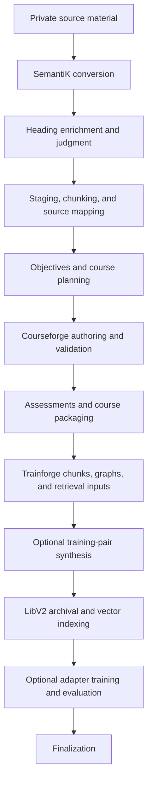

# End-to-end course build

This playbook turns private learning material into accessible HTML, a course
package, a private LibV2 archive, and retrieval artifacts. Training-pair
synthesis and adapter training are separate, explicit decisions.

SemantiK's preferred conversion path combines GLM-OCR with SDK normalization,
content enrichment, and the super heading judge before Courseforge begins
course authoring.

Use these references for details owned elsewhere:

- [Installation and dependencies](installation.md)
- [Pipeline invocation, stopping, and resuming](pipeline-invocation.md)
- [Licensing and provider posture](../LICENSING.md)
- [License-clean operation](license-clean-run.md)
- [Validation gates](../validation/gates.md)
- [Portable run environment](run-env.example.sh)
- [Private model-seat configuration](seat-scripts.md)
- [Backup and restore](backup-restore.md)

## Privacy boundary

Source material, course names and identifiers, converted HTML, generated
course content, packages, indexes, training pairs, adapters, run identifiers,
logs, captures, endpoints, credentials, and model caches are always private.
Keep them in operator-controlled, ignored locations and do not commit them.
Never copy their values into tracked documentation, code comments, fixtures,
or configuration.

Prepare an ignored environment file containing the private source path, course
name, data roots, provider endpoints, and model identifiers required by the
deployment. The public [`run-env.example.sh`](run-env.example.sh) documents the
portable shape. Real launch specifications belong under the ignored
`runtime/seats/` tree described by [`seat-scripts.md`](seat-scripts.md).

Before processing material, confirm that its license and the selected provider
terms permit the intended courseware and any later training use. Installation
or successful execution does not establish those rights.

## Pipeline shape

The live `textbook_to_course` workflow executes these stages in order. Some
Courseforge branches are conditional, but their relative order remains fixed.



The diagram uses text labels in addition to arrows. A retrieval-ready course
does not require training pairs or an adapter.

## 1. Install and configure

1. Install the base package and only the extras required for conversion,
   retrieval, GUI use, or training. Follow
   [`installation.md`](installation.md); do not vendor dependencies or model
   weights into the repository.
2. Place the private source outside the tracked tree.
3. Load the ignored operator environment.
4. If the pipeline manages local model services, configure the logical seat
   registries with private values. Use
   [`seat-schedule.env.example`](seat-schedule.env.example) as a shape, not as
   a deployment profile.
5. Review [`license-clean-run.md`](license-clean-run.md) before selecting any
   content-generation or synthesis provider.

After loading the ignored environment, fail before dispatch if the required
private values are absent:

```bash
: "${ED4ALL_SOURCE:?set the private source path}"
: "${ED4ALL_COURSE_NAME:?set the private course name}"
```

## 2. Run preflight

Start with local, non-network diagnostics:

```bash
ed4all --version
ed4all doctor
ed4all doctor --run textbook_to_course --mode local
```

When the configured run depends on reachable model services, add the bounded
provider probe:

```bash
ed4all doctor --run textbook_to_course --mode local --ping
```

`--ping` performs real network calls to configured provider endpoints; leave it
off when that is not intended. Resolve every failure before dispatch. Review
warnings rather than treating a degraded preflight as approval.

Confirm that:

- the private source is readable;
- required Python and system dependencies are installed;
- required schemas, browser assets, and local model artifacts are available;
- configured endpoints report the intended model and produce coherent output;
- output locations have sufficient capacity; and
- provider and model licensing matches the intended use.

## 3. Inspect the plan

A dry run resolves the workflow without processing the source:

```bash
ed4all run textbook-to-course \
  --corpus "$ED4ALL_SOURCE" \
  --course-name "$ED4ALL_COURSE_NAME" \
  --skip-training \
  --dry-run
```

Review the resolved phases, providers, models, output roots, and conditional
branches. Use the same ignored environment for the dry run and the real run.

## 4. Use inspection boundaries

For unfamiliar or difficult source material, stop after a meaningful phase and
inspect its artifacts before continuing. For example:

```bash
ed4all run textbook-to-course \
  --corpus "$ED4ALL_SOURCE" \
  --course-name "$ED4ALL_COURSE_NAME" \
  --skip-training \
  --stop-after objective_extraction
```

At the SemantiK boundary, review OCR fidelity, reading order, headings, tables,
figures, alternative text, source coverage, and conversion diagnostics. Fix a
conversion defect at its source rather than compensating for it downstream.

Later useful boundaries include Courseforge outline validation, packaging, and
`imscc_chunking`. Stopping after `imscc_chunking` produces an inspectable course
package and chunkset, but it stops before LibV2 archival and vector indexing; it
is not the final retrieval-ready build. The canonical phase names and selective
rerun controls are in
[`pipeline-invocation.md`](pipeline-invocation.md).

## 5. Build a retrieval-ready course

The safe first complete build excludes training-pair synthesis and the adapter
training tail:

```bash
ed4all run textbook-to-course \
  --corpus "$ED4ALL_SOURCE" \
  --course-name "$ED4ALL_COURSE_NAME" \
  --skip-training
```

`--skip-training` suppresses `training_synthesis`. Adapter fitting is already
off unless `--with-training` is supplied. The remaining workflow continues
through LibV2 archival, vector indexing, and finalization.

Before accepting the result, inspect:

- SemantiK accessible HTML and conversion-quality sidecars;
- objectives, source mappings, outlines, authored pages, and Courseforge
  validation reports;
- assessments and the packaged course archive;
- Trainforge chunk provenance, objective links, concept and pedagogy graphs;
- LibV2 manifest integrity and archive layout; and
- semantic and hybrid retrieval against representative private questions.

Use paths reported by the run. Do not assume an in-repository output layout.

## 6. Respect validation gates

Validation gates run at their configured phase boundaries. A blocking failure
means the artifact or environment is not acceptable. Stop at the first failed
gate, preserve its report, and fix the cause.

Never lower a threshold, downgrade severity, suppress an issue, or introduce a
fallback merely to continue. A warning still requires review, and a skipped or
unavailable check is not evidence that its contract passed. The authoritative
gate mapping and failure policies are in
[`validation/gates.md`](../validation/gates.md).

## 7. Stop and resume safely

Use the private identifier printed by the active run:

```bash
: "${ED4ALL_RUN_ID:?set the private run or workflow identifier}"
ed4all stop "$ED4ALL_RUN_ID"
```

The run finishes its in-flight unit, checkpoints, and pauses with exit code
`3`. Resume the same workflow from its checkpoint:

```bash
ed4all run textbook-to-course --resume "$ED4ALL_RUN_ID"
```

Do not use `--force` after a graceful stop; it can clear the resume sidecars
that preserve unit-level progress. Global stop behavior, signal handling, and
resume overrides are documented in
[`pipeline-invocation.md`](pipeline-invocation.md#7-graceful-stop-resume-and-checkpoints).

## 8. Opt into training deliberately

Training-pair synthesis changes the licensing and review surface. Before
enabling it, review the private course archive, holdout integrity, provider
provenance, and all synthesis gates. Follow the licensing register and
[`license-clean-run.md`](license-clean-run.md); do not infer approval from a
successful course build.

Adapter training is a second explicit decision. It can be attached to a new
build with `--with-training`, or run later against an existing private archive:

```bash
: "${ED4ALL_BASE_MODEL:?set an approved base-model short name}"
ed4all run trainforge_train \
  --course-name "$ED4ALL_COURSE_NAME" \
  --base-model "$ED4ALL_BASE_MODEL"
```

Use `ed4all run --help` for validated training configuration overrides. Do not
start a training run until its required configuration, dependencies, holdouts,
and licensing review are complete.

A completed training process does not authorize promotion. Review the adapter
evaluation matrix, regressions, memorization and contamination checks, model
card, and promotion record, then explicitly choose promote, hold, or reject.

## 9. Preserve and share evidence safely

Back up private archives and state using
[`backup-restore.md`](backup-restore.md). When maintainers need diagnostics,
create a support bundle and inspect it before sharing; decision captures and
plaintext logs can contain source-derived material.

Keep run summaries, gate reports, captures, course artifacts, endpoint details,
and model files outside the public repository. Public issues and documentation
must use content-sanitized descriptions and neutral placeholders.
