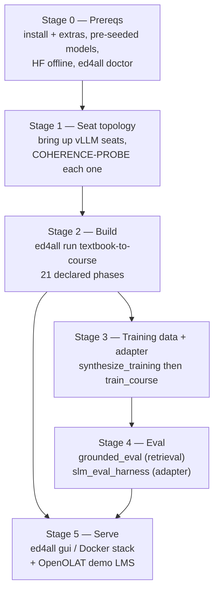
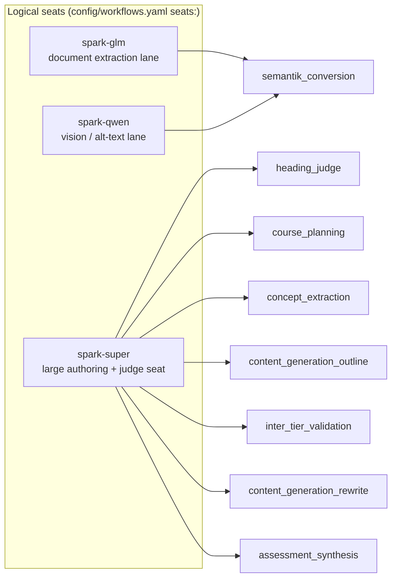
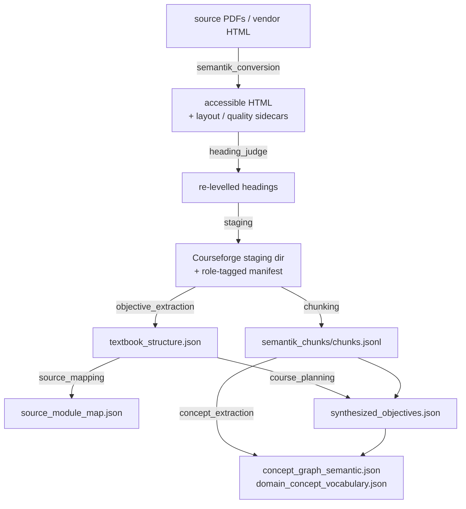
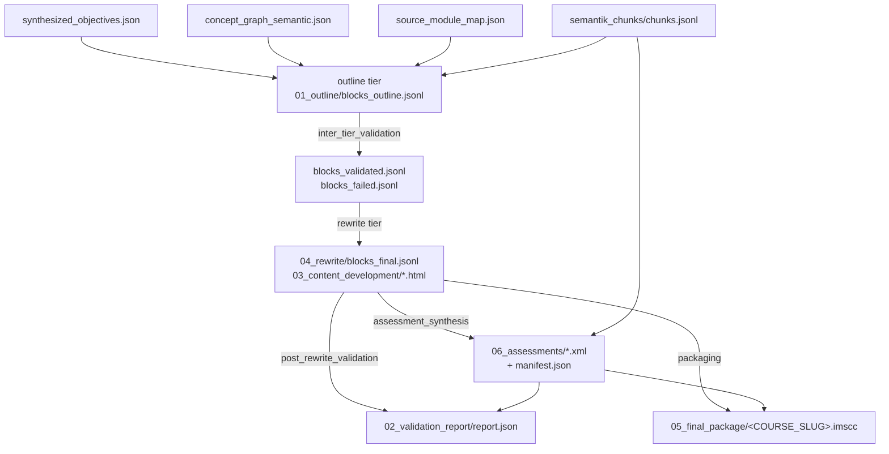
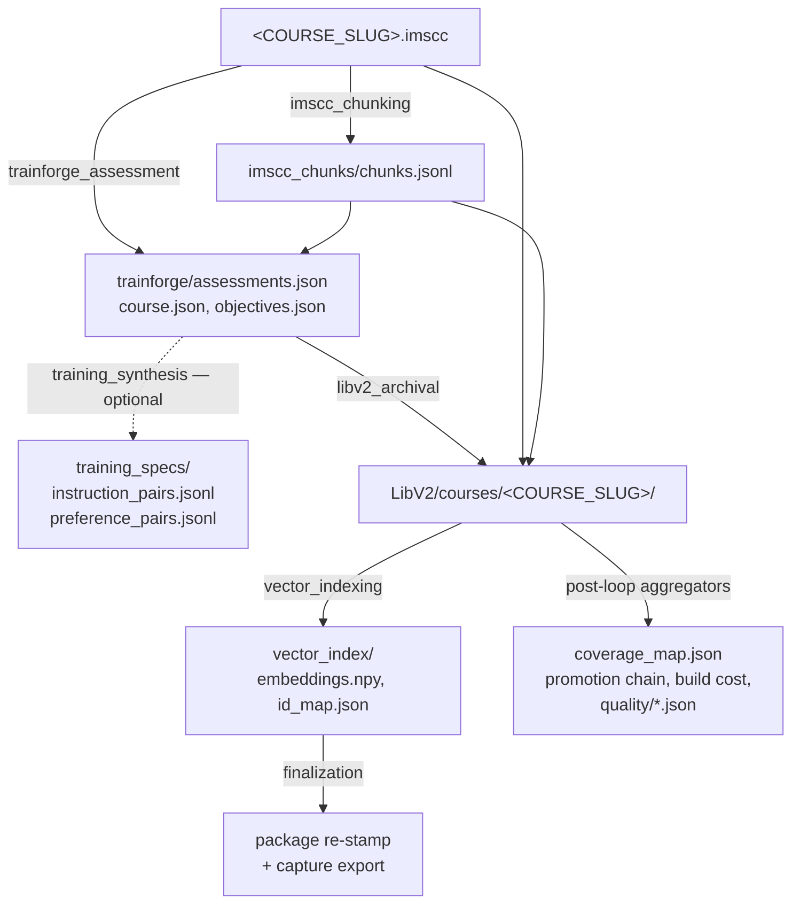
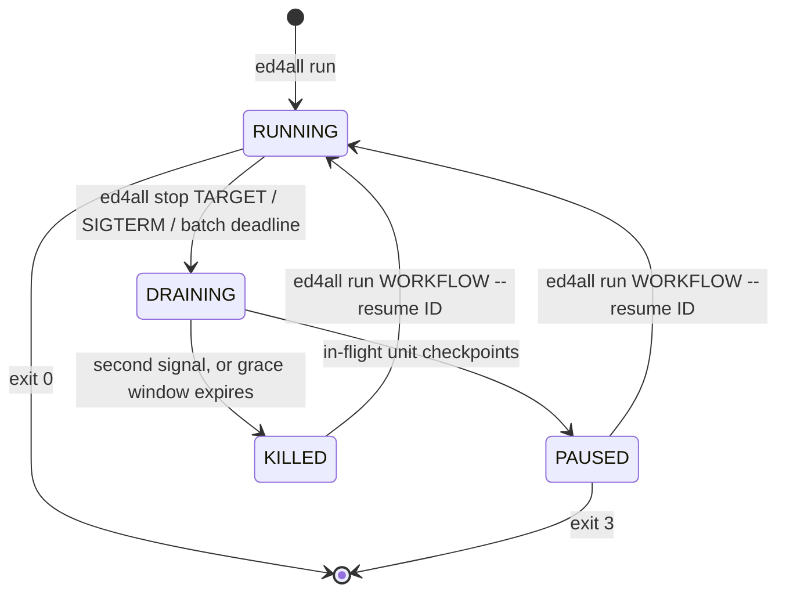

# Full-run playbook — raw corpus to a trained, evaluated, servable course

This is the **spine** document for the whole campaign: install → serve the model
seats → build the course → synthesize training pairs → train an adapter →
evaluate → serve. It orders the other operations docs and states what runs in
what sequence; it deliberately does **not** duplicate their detail. Each stage
links to the doc that owns it.

Everything below was verified against the code in this repo. Lines that could
not be verified carry an explicit `UNVERIFIED:` marker. Course identifiers are
written as `<COURSE_SLUG>` / `<COURSE_NAME>` / `<RUN_ID>` / `<WORKFLOW_ID>`
placeholders — substitute your own.

**Owned by other docs (read them for depth):**

| Topic | Doc |
|---|---|
| Per-stage invocation, timeout knobs, corpus-prep gotchas, graceful-stop semantics | [`pipeline-invocation.md`](pipeline-invocation.md) |
| Single-box big-model deployment + env profile | `dgx-spark.md` (untracked operator-local runbook, like `spark-profile.md`) |
| Big-memory concurrent-serving flag profile | [`spark-profile.md`](spark-profile.md) |
| Serving the large local models (vLLM / Ollama) | [`nemotron-spark-serving.md`](nemotron-spark-serving.md) |
| License-clean provider routing for training data | [`license-clean-run.md`](license-clean-run.md), [`../LICENSING.md`](../LICENSING.md) |
| Container topology (GUI + ollama sidecar, LibV2 bind mount) | [`docker.md`](docker.md) |
| Backup / restore | [`backup-restore.md`](backup-restore.md) |
| Support bundles | [`support-bundle.md`](support-bundle.md) |
| Behavior-flag reference | [`behavior-flags.md`](behavior-flags.md) |
| Seat-schedule env recipe | [`seat-schedule.env.example`](seat-schedule.env.example) |

---

## 0. Campaign overview



Stages 2 and 5 are independently useful. Stages 3–4 are only needed when you
want a course-pinned SLM adapter.

Note that `--stop-after imscc_chunking` halts **before** `libv2_archival` and
`vector_indexing`. It yields a packaged cartridge plus a retrieval-ready
chunkset with no training synthesis — but the course is not yet *askable*:
`vector_indexing` (index 19 in the §2.2 table) is the phase that builds the vector
index the grounded-ask path reads. Run through `vector_indexing` if you want to
query the course.

---

## Stage 0 — Prerequisites

### 0.1 Install

The package declares these extras in `pyproject.toml`:

| Extra | Pulls | Needed for |
|---|---|---|
| `embedding` | sentence-transformers, torch, numpy, scikit-learn, sympy | `vector_indexing` phase, every statistical-tier validator, retrieval + eval |
| `semantik` | pypdfium2, pdfplumber, pikepdf, pytesseract, playwright, timm, einops, … | `semantik_conversion` (PDF → accessible HTML) |
| `training` | torch, transformers, trl, peft, accelerate, bitsandbytes, datasets, lm-eval | Stage 3 LoRA training + Stage 4 adapter eval |
| `gui` | fastapi, uvicorn, python-multipart, python-dotenv | Stage 5 control-plane / learner GUI |
| `server` | mcp | the FastMCP server (`MCP/server.py`) |
| `dev` | pytest, black, ruff, pyld, pyshacl | tests + the SHACL validators |
| `anthropic` | anthropic SDK | `--mode api` with the Anthropic backend only |
| `eval-calibration` | ragas (exact pin) | one-off **offline** cross-check of the eval denominator math. Install into a **throwaway venv only** — the pinned ragas release and the resident stack's langchain requirement are mutually incompatible. Never imported by the eval loop or any gate. |
| `full` | `ed4all[server,dev,gui]` | convenience meta-extra |

A full-campaign box wants at least:

```bash
pip install -e '.[embedding,semantik,training,gui]'
ed4all --version
```

`requires-python = ">=3.10"`. The console script is `ed4all = cli.main:main`.

### 0.2 Models are pre-seeded, never fetched at run time

Model weights are staged onto the box deliberately. Runs execute with the
HuggingFace hub in **offline** mode so nothing reaches out mid-build:

```bash
export HF_HUB_OFFLINE=1
export TRANSFORMERS_OFFLINE=1
# Optional: pin the cache location so backups + containers agree.
export HF_HOME=/path/to/hf-cache
```

The embedding provider enforces this itself: `lib/embedding/providers.py` sets
`HF_HUB_OFFLINE=1` and `local_files_only=True` around the model load and
restores the prior value afterwards. The consequence for operators is that **a
model that is not already in the cache fails the run loudly** rather than
silently downloading — that is the intended behavior. Stage new weights as a
deliberate, separate step.

### 0.3 Data root

All mutable data dirs resolve under `ED4ALL_HOME` when it is set (otherwise
repo-relative). Set it before anything else if you are not running out of the
checkout:

```bash
export ED4ALL_HOME=/path/to/ed4all-data
export ED4ALL_LIBV2_ROOT=/path/to/ed4all-data/LibV2   # optional explicit override
```

### 0.4 Preflight — `ed4all doctor`

`ed4all doctor` has two modes. Preflight (default) probes the live environment;
post-mortem (`--run-id`) reads a past run off disk and probes nothing.

Check groups registered in `lib/diagnostics/`: `gpu`, `gpu_profile`, `window`,
`environment`, `provider`, `seat`, `postmortem`.

```bash
# Default preflight: gpu / gpu_profile / window / environment groups. Makes NO
# network calls. The `seat` group (vLLM seat topology) is added automatically
# when a seat registry (ED4ALL_SEAT_BASE_URLS / ED4ALL_VLLM_CONTAINERS) is set.
ed4all doctor

# Model the provider + seat fanout for the actual workflow you are about to run:
ed4all doctor --run textbook_to_course --mode local

# Add a real 1-token reachability call per distinct OpenAI-compatible seat:
ed4all doctor --run textbook_to_course --mode local --ping

# Just one group, machine-readable:
ed4all doctor -g gpu --json
```

Verified flags: `--base-url`, `--json`, `--group/-g` (repeatable), `--run/-r`,
`--provider`, `--mode`, `--ping`, `--run-id`. `--run-id` is mutually exclusive
with `--run` / `--ping`.

On a big-memory concurrent-serving box, the `gpu_profile` group emits advisory
warnings for small-box defaults left on. See [`spark-profile.md`](spark-profile.md).

---

## Stage 1 — Seat topology

### 1.1 Which seats exist and which phase needs which

`config/workflows.yaml` annotates the GPU-serving `textbook_to_course` phases
with a `seats:` list of **logical** seat names. Three logical seats are
declared. Phases 2–5 (`staging` through `source_mapping`) carry no `seats:` key
at all — they are deterministic and need no serving seat:



| Phase | `seats:` annotation |
|---|---|
| `semantik_conversion` | `spark-glm`, `spark-qwen` |
| `heading_judge` | `spark-super` |
| `staging`, `chunking`, `objective_extraction`, `source_mapping` | *(no `seats:` key)* |
| `course_planning` | `spark-super` |
| `concept_extraction` | `spark-super` |
| `content_generation` (single-pass only) | `spark-super` |
| `content_generation_outline` | `spark-super` |
| `inter_tier_validation` | `spark-super` |
| `content_generation_rewrite` | `spark-super` |
| `assessment_synthesis` | `spark-super` |
| everything downstream of `assessment_synthesis` | `[]` (no serving seat) |

Phases 13–20 (`post_rewrite_validation` through `finalization`) declare an
**empty** seat list. That is load-bearing under a seat schedule: it means the
schedule may stop every vLLM seat and hand the whole card to the in-process
NLI / embedding models those validator phases actually need.

Logical names map to URLs and containers through env registries — see
[`seat-schedule.env.example`](seat-schedule.env.example) for the full recipe and
[`nemotron-spark-serving.md`](nemotron-spark-serving.md) for how to launch the
servers themselves.

### 1.2 The COHERENCE-PROBE rule

**A vLLM seat that was warm-started with `docker start` can come up live but
mode-collapsed. `/v1/models` answering 200 does NOT catch this** — liveness only
proves the HTTP server is up and a model id is registered. A collapsed seat
answers every prompt with degenerate or empty content, and the pipeline will
happily author a whole course out of soup.

The check that does catch it is a **content** probe:
`lib/vllm_container_lifecycle.py::coherence_probe` POSTs a fixed prompt to
`{base_url}/v1/chat/completions` (model id auto-resolved from `/v1/models`) at
`temperature=0` and returns `True` only when the assistant content is non-empty
and non-degenerate. It never raises — any HTTP error, malformed JSON, empty
content, or soup returns `False`.

Manual equivalent, before you launch a build:

```bash
# 1. Liveness — necessary, NOT sufficient.
curl -s http://localhost:8001/v1/models | python3 -m json.tool

# 2. Coherence — the one that matters. Read the answer with your own eyes.
curl -s -X POST http://localhost:8001/v1/chat/completions \
  -H 'Content-Type: application/json' \
  -d '{"model":"<MODEL_ID_FROM_STEP_1>","temperature":0,"max_tokens":64,
       "messages":[{"role":"user","content":"Name three primary colors."}]}' \
  | python3 -c 'import sys,json;print(json.load(sys.stdin)["choices"][0]["message"]["content"])'
```

If the answer is empty, repeated tokens, or unrelated soup: **cold-recreate the
container** (`docker rm -f` then relaunch), do not `docker start` it again.

### 1.3 Automating it — `ED4ALL_SEAT_SCHEDULE`

Set this and the pipeline owns the seat lifecycle at every phase boundary:
reconcile resident seats to the phase's `seats:` annotation, poll `/v1/models`
for liveness up to `ED4ALL_SEAT_LOAD_TIMEOUT_SECONDS` (default 1200), then run a
**bounded** coherence check of `ED4ALL_SEAT_COHERENCE_ATTEMPTS` tries (default
3, ~8s apart). A live-but-incoherent seat is cold-recreated immediately via its
`ED4ALL_SEAT_LAUNCH_SPECS` entry and re-checked once — self-healing in tens of
seconds rather than riding out the 20-minute liveness ceiling. A seat that still
cannot come up coherently, or has no launch spec, raises loudly and fails the
phase.

Copy [`seat-schedule.env.example`](seat-schedule.env.example), edit the seat
names / URLs / container names / launch-script paths for your box, and source it
**before** `ed4all run`. Do not apply it to a live run mid-build.

---

## Stage 2 — The build

### 2.1 Invocation

```bash
# Full build, through vector_indexing to a fully archived, askable course.
ed4all run textbook-to-course \
  --corpus /path/to/corpus \
  --course-name <COURSE_NAME> \
  --skip-training

# Retrieval-ready slice: packaged cartridge + chunkset, no training synthesis,
# no LibV2 archival and no vector index (so not yet askable).
ed4all run textbook-to-course \
  --corpus /path/to/corpus \
  --course-name <COURSE_NAME> \
  --skip-training --stop-after imscc_chunking

# Plan only — resolves the workflow and prints the phase list, dispatches nothing.
ed4all run textbook-to-course \
  --corpus /path/to/corpus --course-name <COURSE_NAME> --dry-run
```

The two-pass content path is what the evidence run used and what the seat
annotations assume:

```bash
export COURSEFORGE_TWO_PASS=true
```

This is load-bearing, not cosmetic. `content_generation` (phase index 8)
declares `enabled_when_env: COURSEFORGE_TWO_PASS!=true` and phases 9, 10, 11, 13
declare `COURSEFORGE_TWO_PASS=true`. **Exactly one of the two paths runs.**

> **`ED4ALL_AGENT_DISPATCH` is not required for `--mode local`, and defaults
> off.** With it unset (the default), every phase — including the
> reasoning-heavy ones — runs its in-process Python tool from the registry in
> `MCP/tools/pipeline_tools.py`, which is the normal local build path. Setting
> it truthy instead routes the agents in `AGENT_SUBAGENT_SET`
> (`MCP/core/executor.py`) through `dispatcher.dispatch_task` and the mailbox
> bridge, which needs a dispatcher and a servicer on the other end. Stubbed
> `PhaseOutput`s are a *different* mechanism entirely: they only appear when no
> `agent_tool` is wired **and** `LOCAL_DISPATCHER_ALLOW_STUB` is set (tests /
> dry-run). Do not set `ED4ALL_AGENT_DISPATCH` to "avoid stubs".

Verified `ed4all run` options (`cli/commands/run.py`): `--corpus`,
`--course-name`, `--mode {local,api}`, `--api-provider/--provider
{anthropic,openai,nvidia}`, `--model`, `--weeks`, `--no-assessments`,
`--assessment-count` (default 50), `--bloom-levels`, `--priority`,
`--objectives`, `--resume`, `--skip-conversion`, `--semantik-output-dir`,
`--reuse-objectives`, `--reuse-conversion`, `--blocks`, `--block-ids`,
`--pages`, `--force`, `--libv2-root`, `--skip-training`, `--stop-after`,
`--license-note`, `--attribution`, `--dry-run`, `--watch`, `--json`.

> **Set the same env for `--dry-run` as for the real run.** `--dry-run` and
> `run_workflow` both order phases with the *same*
> `WorkflowRunner._topological_sort`, so the printed order is the execution
> order — **given the same environment**. Several `depends_on_when_env:` edges
> are conditional on `COURSEFORGE_TWO_PASS=true`; dry-running without it
> exported produces a genuinely different (single-pass) order — e.g.
> `packaging` lands before `content_generation_rewrite`. Export
> `COURSEFORGE_TWO_PASS=true` first, then `--dry-run` matches §2.2 exactly.

> **Conflict on `--provider local`.** `dgx-spark.md` (operator-local) § (f)
> documents `ed4all run textbook-to-course --provider local …`. That value is
> **rejected** by the current CLI: `--api-provider/--provider` is a
> `click.Choice(["anthropic", "openai", "nvidia"])`, and passing `local` exits
> with `Error: Invalid value for '--api-provider' / '--provider': 'local' is not
> one of 'anthropic', 'openai', 'nvidia'.` (reproduced against this checkout).
> The working pure-local route is to **omit `--provider` entirely** and route the
> per-tier seats with the `*_PROVIDER` / `*_MODEL` env vars, exactly as
> [`license-clean-run.md`](license-clean-run.md) and
> [`pipeline-invocation.md`](pipeline-invocation.md) § 8.2 do. `dgx-spark.md`
> § (c) already sets those env vars; only its `--provider local` flag is stale.

### 2.2 The phase sequence

21 phases are declared. Under the canonical posture (`COURSEFORGE_TWO_PASS=true`
plus `--skip-training`) **19 execute**: index 8 is skipped by the env predicate
and index 17 by `--skip-training`.

Wall-clock below is from **one completed 21-phase production run** on the
three-seat local topology in §1 (a multi-chapter scanned-PDF corpus producing a
10-week course). Treat it as an order-of-magnitude shape, not a guarantee —
timings scale with corpus size, seat throughput, and flag stack.

| # | Phase | Executes? | Observed wall-clock | Emits | Gates declared |
|--:|---|---|--:|---|--:|
| 0 | `semantik_conversion` | yes | 1:08:32 | `{stem}_accessible.html` + layout/quality sidecars | 1 |
| 1 | `heading_judge` | always dispatched; skip-with-pass when `SEMANTIK_HEADING_JUDGE` is off or the corpus is born-digital | 0.03 s skipped / ~20 s active | judged HTML, `.heading_judgments.json`, `.corrected_layout.json` (`.prejudge.bak` kept) | 0 |
| 2 | `staging` | yes | 0.04 s | Courseforge staging dir + role-tagged manifest | 0 |
| 3 | `chunking` | yes | 2:31 | `LibV2/courses/<COURSE_SLUG>/semantik_chunks/chunks.jsonl` + manifest | 2 |
| 4 | `objective_extraction` | yes | 1:32 | `01_learning_objectives/textbook_structure.json` | 2 |
| 5 | `source_mapping` | yes | 2.4 s | `source_module_map.json` (TF-IDF, no LLM) | 0 |
| 6 | `course_planning` | yes | 1:57 | `01_learning_objectives/synthesized_objectives.json` | 9 |
| 7 | `concept_extraction` | yes | 4:26 | `concept_graph/concept_graph_semantic.json`, `domain_concept_vocabulary.json` | 2 |
| 8 | `content_generation` | **skipped** when `COURSEFORGE_TWO_PASS=true` | — | (state pre-populated so downstream `inputs_from` resolves) | 5 |
| 9 | `content_generation_outline` | two-pass only | 1:43:31 | `01_outline/blocks_outline.jsonl`, `outline_chunks.json`, `outline_objectives.json` | 0 |
| 10 | `inter_tier_validation` | two-pass only | 13.3 s | `01_outline/blocks_validated.jsonl`, `blocks_failed.jsonl` | 27 |
| 11 | `content_generation_rewrite` | two-pass only | 1:15:40 | `04_rewrite/blocks_final.jsonl`, `03_content_development/*.html` | 1 |
| 12 | `assessment_synthesis` | optional | 48:38 | `06_assessments/week_NN_{quiz,discussion,assignment}.xml` + `manifest.json` | 7 |
| 13 | `post_rewrite_validation` | two-pass only | 1:51:06 | `02_validation_report/report.json` | 52 |
| 14 | `packaging` | yes | 1.0 s | `05_final_package/<COURSE_SLUG>.imscc` + `packaging_report.json` | 5 |
| 15 | `imscc_chunking` | yes | 3.0 s | `imscc_chunks/chunks.jsonl` + manifest | 2 |
| 16 | `trainforge_assessment` | optional | 1:04 | `trainforge/{assessments,course,objectives,manifest}.json` | 4 |
| 17 | `training_synthesis` | **skipped** by `--skip-training` | — | `training_specs/{instruction,preference}_pairs.jsonl` | 10 |
| 18 | `libv2_archival` | yes | 1.0 s | `LibV2/courses/<COURSE_SLUG>/` (manifest, objectives, source/, corpus/, graph/, quality/) | 7 |
| 19 | `vector_indexing` | optional | 20.1 s | `vector_index/{embeddings.npy,id_map.json,manifest.json}` | 0 |
| 20 | `finalization` | yes | 0.2 s | final package re-stamp + training-capture export | 0 |

Gate entries sum to **136** across all 21 phases — matching the count in the
root `CLAUDE.md`. With phases 8 and 17 skipped, **121** gate entries are
actually evaluated.

**Where the time goes.** Sum of per-phase durations on the evidence run was
about **7 hours**. Five phases account for ~97% of it: post-rewrite validation
(1:51), the outline tier (1:44), the rewrite tier (1:16), conversion (1:09),
and assessment synthesis (0:49). Everything downstream of packaging is seconds.
Note that `post_rewrite_validation` runs **52 gates** and
is the single heaviest phase despite dispatching no authoring LLM calls — it is
dominated by NLI entailment scoring.

### 2.3 Artifact flow







The chunkset is produced **twice** — once from the staged HTML
(`semantik_chunks/`) and once from the packaged cartridge (`imscc_chunks/`). The
`chunkset_drift` gate at `libv2_archival` compares them.

### 2.4 Reading gate outcomes correctly

This is the single most misread part of a build log.

**`gates_passed` is cleared only by a failing gate whose declared severity is
`critical`** (`MCP/core/executor.py`). A gate declared `severity: warning` fails
loudly in the chain and **does not stop the workflow — even when it declares
`behavior.on_fail: block`.** Do not read `on_fail: block` as blocking; read the
`severity` field in `config/workflows.yaml`.

Two more traps:

- **`config/workflows.yaml` is authoritative for blocking behavior, not the
  persisted checkpoint.** The executor stamps a gate's declared severity onto
  the persisted result *only when the validator left it unset*; some validators
  set their own. A gate declared `warning` in YAML can persist as `"critical"`
  in the checkpoint JSON.
- Two state surfaces exist and they mean different things.
  `state/runs/<RUN_ID>/checkpoints/<phase>_checkpoint.json` is the execution
  record plus the full gate chain. `state/workflows/<WORKFLOW_ID>.json` →
  `phase_outputs[<phase>]` is what `--resume` actually reads; a phase is skipped
  on resume only when it is `_completed` **and** `_gates_passed` is not `False`.
  Stale `paused_phase` / `failed_phase` markers can survive on a workflow whose
  final status is `COMPLETE` — they are residue from superseded attempts, not the
  run's outcome.

There is **no operator waiver feature for phase gates** in this repo. Clearing a
gate means fixing the input, re-rolling the affected units, or changing the
declared severity in `config/workflows.yaml` — all of which are auditable.

---

## Stage 3 — Training pairs and the adapter

### 3.1 Synthesize the training pairs

The build's `training_synthesis` phase is skipped whenever `--skip-training` is
passed (the canonical license-clean posture). Run the synthesizer as a
standalone step when you actually want pairs, choosing a license-clean provider:

```bash
python -m Trainforge.synthesize_training \
  --slug <COURSE_SLUG> \
  --provider local \
  --with-assessment-sft --with-graph-sft
```

Verified arguments include: `--corpus` / `--slug` (mutually exclusive, one
required), `--course-code`, `--provider {mock,anthropic,claude_session,together,local}`
(default `mock` — a template factory, plumbing tests only), `--seed`,
`--max-dispatches`, `--pilot-report-every`, `--no-checkpoint`, `--stratify`,
`--with-assessment-sft`, `--with-graph-sft`.

**Licensing is decided here, not by which tool wrote the code.** The trained
model is a derivative of whatever provider generated these pairs. `local` (the
NVIDIA-licensed canonical Nano model on-device) or `together` (hosted OSS) are
the clean routes;
`--provider anthropic` fails closed for training-pair synthesis. Read
[`../LICENSING.md`](../LICENSING.md) before choosing.

A per-pair resume sidecar is written to
`training_specs/.synthesis_pairs_checkpoint.jsonl` unless you pass
`--no-checkpoint`. A crashed 10-hour synthesis resumes without re-paying for
completed pairs.

When a prompt/validator contract changes, checkpoint reuse is intentionally the
wrong operation: begin a fresh synthesis pass while retaining the upstream
chunks, objectives, and assessments. Use the generic fresh-start tool in
dry-run mode first:

```bash
python scripts/prepare_fresh_training_synthesis.py \
  --workflow-state state/workflows/<WORKFLOW_ID>.json \
  --training-specs-dir <PROJECT_WORKSPACE>/trainforge/training_specs \
  --runs-dir state/runs
```

After reviewing the exact JSON plan, repeat with `--apply`. The tool archives
the old pair/generation journals, pilot outputs, in-progress/final pair files,
synthesis telemetry, phase checkpoint, and stale run stop sentinel. It resets
`training_synthesis` plus already-observed downstream phase state, but preserves
all earlier phase outputs and assessment inputs byte-for-byte. The archive
contains the original workflow state and a move manifest, so discarded pilot
evidence remains auditable. The tool never starts a service or resumes a run.

### 3.2 Train the adapter

```bash
# Dry run first — emits the model card stub + decision capture, no GPU needed.
python -m Trainforge.train_course \
  --course-code <COURSE_SLUG> --base-model nemotron3-nano-30b --dry-run

# Real training run.
python -m Trainforge.train_course \
  --course-code <COURSE_SLUG> --base-model nemotron3-nano-30b
```

Verified options: `--course-code` (accepts either the course-code form or the
LibV2 slug — both resolve identically), `--base-model` (required),
`--config-overrides` (per-run `TrainingConfig` overrides — a YAML/JSON file
path, an inline JSON object, or inline `key=value[,key=value]` pairs; the same
flag exists on `ed4all run`), `--backend {local,runpod}` (default `local`;
`runpod` is stubbed and fails loud), `--output-dir`, `--dry-run`.

`--config-overrides` is how a `dpo_learning_rate` reaches the trainer:
`Trainforge/training/configs/nemotron3-nano-30b.yaml` ships it `null` on
purpose, and `Trainforge/training/peft_trainer.py` raises rather than reusing
the SFT rate, so DPO on that base does not start without it. Supply the value
the short DPO canary selected:

```bash
python -m Trainforge.train_course \
  --course-code <COURSE_SLUG> --base-model nemotron3-nano-30b \
  --config-overrides dpo_learning_rate=<canary value>

# ...or through the pipeline, on a fresh run or a --resume:
ed4all run trainforge_train --course-name <COURSE_SLUG> \
  --base-model nemotron3-nano-30b \
  --config-overrides dpo_learning_rate=<canary value>
```

Both routes validate the spec against the real `TrainingConfig` field set
before anything starts — an unknown key, a bad type, or an out-of-range
value exits nonzero (naming the supported field list on an unknown key)
rather than surfacing hours in. The override set is
recorded on `model_card.json::config_overrides`, so the run stays
reproducible.

The canonical registry default is `nemotron3-nano-30b`, resolving to
`nvidia/NVIDIA-Nemotron-3-Nano-30B-A3B-BF16` at immutable revision
`cbd3fa9f933d55ef16a84236559f4ee2a0526848`. Its checked-in configuration
performs BF16 LoRA, not QLoRA.

Output lands at `LibV2/courses/<COURSE_SLUG>/models/<model_id>/` unless
`--output-dir` overrides the models root.

> **`ed4all run trainforge_train` reaches `train_course` as of e15ad5f1.**
> It previously did not: the `training` phase declares
> `agents: [training-synthesizer]`, which `AGENT_TOOL_MAPPING` maps to
> `synthesize_training` (instruction-pair synthesis), and no registry tool
> wrapped `Trainforge.train_course` at all. Now a registry-only `run_training`
> tool does, and the phase reaches it by NAME through
> `MCP/core/executor.py::_PHASE_TOOL_MAPPING`, which is consulted BEFORE the
> agent mapping; a deterministic-tool set additionally forces in-process
> execution under `ED4ALL_AGENT_DISPATCH` (the subagent fork precedes the
> registry lookup and cannot produce an adapter). `post_training_validation`
> still gates promotion on `eval_gating` + `family_completeness`.
>
> Caveat that remains: `ed4all run` exposes no `--course-code` or
> `--base-model` option. The course comes from `--course-name`; the base model
> falls back to `ED4ALL_CAMPAIGN_BASE_MODEL` and then the campaign default,
> resolved against `BaseModelRegistry` BEFORE a runner is constructed (an
> unknown name returns the registry's supported list, never a silent
> substitution). To pin a base model explicitly, use the
> `python -m Trainforge.train_course` invocation above.

A graceful stop during training raises `GracefulStopRequested`; on the standalone
`python -m` path that converts to the canonical paused exit code **3**.

---

## Stage 4 — Evaluation

Two distinct harnesses answer two distinct questions. Run both.

### 4.1 Retrieval / grounded-answer eval (does the course answer honestly?)

The gold set lives at
`LibV2/courses/<COURSE_SLUG>/retrieval_eval/gold_set.json`, alongside
`refusal_probes.json`. The refusal probes are as important as the questions — they
measure whether the system declines to answer things the corpus does not cover.

```bash
python -m lib.retrieval.grounded_eval \
  --course <COURSE_SLUG> \
  --engine hybrid-rrf \
  --limit 8
```

Verified arguments: `--course` (required), `--engine` (default `semantic`;
`lexical` / `semantic` / `hybrid-rrf`), `--limit` (default 8),
`--no-groundedness` (skips the per-answer NLI pass), `--repo-root`.

Writes a timestamped
`retrieval_eval/grounded_answer_eval_<ts>.json` plus a review sample, and prints
a JSON summary (course slug, engine, headline, blocked, written paths). Exit
codes: `0` ok, `2` eval refused, `3` grounded-answer pipeline unavailable.

A faster structural smoke over the index, before paying for a full eval:

```bash
python scripts/retrieval_smoke.py \
  --course-code <COURSE_SLUG> --sample 25 --k 5 --engine hybrid-rrf
```

### 4.2 Adapter eval (did the LoRA actually learn anything?)

```bash
# 2-5 minute smoke first — loads the real adapter, caps each evaluator at N=3.
python -m Trainforge.eval.slm_eval_harness \
  --course-path LibV2/courses/<COURSE_SLUG> \
  --adapter-path LibV2/courses/<COURSE_SLUG>/models/<MODEL_ID> \
  --base-model nemotron3-nano-30b --smoke

# Full run, with the base-model ablation (~3x wall time).
python -m Trainforge.eval.slm_eval_harness \
  --course-path LibV2/courses/<COURSE_SLUG> \
  --adapter-path LibV2/courses/<COURSE_SLUG>/models/<MODEL_ID> \
  --base-model nemotron3-nano-30b --with-ablation
```

Verified arguments: `--course-path` (required), `--adapter-path`,
`--base-model`, `--profile`, `--output`, `--max-prompts`, `--with-ablation`,
`--stub`, `--smoke`, `--no-eval-checkpoint`.

The smoke report carries `smoke_mode: true`, and `EvalGatingValidator` refuses
to gate on it — a smoke run can never accidentally promote an adapter. Full
reports default to `<adapter-path>/eval/eval_report.json`, which is exactly what
the `post_training_validation` phase's `eval_gating` gate reads.

Per-stage eval results checkpoint to
`<course-path>/eval/.eval_results_checkpoint.jsonl` by default, so a crashed
eval re-run skips completed evaluators.

Only after the full report passes the promotion gates should retrieval
generation bind the LoRA. The binding hook is the explicit served model ID
(`ED4ALL_ANSWER_MODEL`, or `LOCAL_SYNTHESIS_MODEL` for other local generation
surfaces). Until promotion, `nemotron-3-nano-30b-a3b` remains the base-model
default; the pipeline does not fabricate or pre-bind an adapter ID.

---

## Stage 5 — Serving

### 5.1 Verify the course is askable

```bash
ed4all libv2 ask --slug <COURSE_SLUG> --query "…" --show-routing
```

Verified options: `--slug` (required), `--query` (required), `--top-k`
(default 5), `--show-routing`, `--format {json,text}`, `--courses-root`,
`--library-wide`.

### 5.2 The GUI

```bash
# One-click: builds a venv, installs, serves, opens a browser.
./run-gui.sh            # run-gui.bat on Windows

# Or, with the gui extra already installed:
ed4all gui
```

Verified `ed4all gui` options: `--host`, `--port`, `--reload/--no-reload`,
`--learner`, `--mode {full,studio,learner}`.

Modes: `full` (operator + Studio + learner), `studio` (end-user library +
course viewer), `learner` (the answer surface only). Env fallbacks:
`ED4ALL_GUI_MODE`, and the legacy `ED4ALL_GUI_LEARNER` (`ED4ALL_GUI_MODE`
wins).

**Auth is opt-in and partial — read `gui/auth.py` before binding off-loopback.**
A single shared secret (`ED4ALL_GUI_TOKEN`, or the settings store's
`secrets.gui_token`, env taking precedence) gates the *operator-classified*
routes, and **only in `full` mode**. When no token is configured the middleware
is a pass-through, i.e. the historical wide-open behavior; a non-loopback bind
without a token logs a startup warning. Studio and learner surfaces are open by
contract in every mode (in those modes the operator routers are not mounted at
all), as are `/api/health` and the Studio-shared API routers. The `ed4all gui`
`--mode` help text still says the GUI has no auth; that string predates the
token gate. Treat "no token configured" as "no auth" and keep the loopback bind
unless you have set one.

Container topology (GUI + ollama sidecar sharing a netns, LibV2 bind-mounted as
the shared course library) is in [`docker.md`](docker.md):

```bash
docker compose up -d
curl -s http://127.0.0.1:8077/api/health
```

### 5.3 The OpenOLAT demo LMS

An OpenOLAT deployment can host the grounded-ask widget as a course element —
the end-to-end "a learner asks the course a question inside an LMS"
demonstration.

**The demo deployment is operator-local and deliberately not tracked** (`demo/`
is gitignored, alongside the `run-env.*.sh` profiles). It is deployment config
for one site, not shipped product config, so a fresh clone will not contain it.
The shape is recorded here so it can be rebuilt; the Ed4All side of the
integration — the embeddable widget and its frame-ancestors allowlist — *is*
tracked and is what the demo depends on.

Two independent Docker stacks: the LMS shell (its own compose file, port 8080)
and the Ed4All GUI (repo-root `docker-compose.yml`, port 8077). The browser
loads both origins directly; they never talk server-to-server.

Provisioning is one idempotent command over the OpenOLAT REST API — it
find-or-creates a published course keyed by `externalRef`, imports the cartridge
HTML pages as native Single Page elements, adds the External Page element that
iframes `<widget-base>/learn/?course=<COURSE_SLUG>&embed=1`, and creates a demo
learner:

```bash
cd <demo-deployment-dir>
cp demo.env.example .env        # set ED4ALL_DEMO_SLUG in the gitignored .env
set -a; . ./.env; set +a
python3 provision.py
```

The course slug is machine-local demo data and is deliberately not baked into
any tracked file — supply it via the gitignored `.env` or `--slug`.

To let the LMS origin iframe the widget, set the opt-in allowlist
(`ED4ALL_GUI_FRAME_ANCESTORS`, resolved per-request in `gui/app.py`) — unset
means no `frame-ancestors` header is emitted at all.

Only the CC HTML pages import into OpenOLAT. The cartridge's QTI 1.2 quizzes,
imsdt discussion topics, and assignments are **dropped** — OpenOLAT 19.x cannot
read them (QTI 1.2 import was removed at v16, and the CC discussion-topic
envelope is not read at all), so the provisioner was designed around them rather
than attempting an import. Note that answer keys live in the QTI XML and
therefore do not transfer. Measured import fidelity, start/stop procedure, URLs,
and credential handling are recorded alongside the untracked deployment itself.
For the course-packaging side of this path, see
[`demo-course.md`](demo-course.md).

---

## Stage 6 — Ops

### 6.1 Graceful stop and resume



```bash
ed4all stop <WORKFLOW_ID|RUN_ID>   # pause ONE run at its next unit boundary
ed4all stop --all                  # global STOP_ALL: pause AND block all runs
ed4all stop --clear-all            # remove STOP_ALL (operator-owned, never auto-cleared)
```

Verified: `stop` takes an optional positional target plus `--all`,
`--clear-all`, `--json`, and requires **exactly one** of target / `--all` /
`--clear-all` (otherwise it exits 2).

Four rules that matter:

1. **Exit code 3 means paused, not failed.** The four `ed4all run` exit codes
   are: `0` completed with all gates passed; `1` the workflow could not be
   created or initialised; `2` ran to completion but at least one gate failed or
   the workflow reported a non-ok status; `3` PAUSED at a checkpoint and
   resumable. Do not wire CI or a supervisor to treat 3 as an error.
2. **Resume with a plain `--resume`. Never `--force` after a stop.** `--force`
   strips the `_completed` flags and clears the resume sidecars — it discards
   exactly the checkpointed work you paused to keep.
   ```bash
   ed4all run textbook-to-course --resume <WORKFLOW_ID>
   ```
3. **SIGTERM/SIGINT to a live `ed4all run` is the same request.** The first
   signal writes the run-scoped sentinel and drains to a checkpoint; a second
   signal hard-kills (and re-stamps the still-`RUNNING` state file `paused` so
   resume sees the truth).
4. **`STOP_ALL` blocks new and resumed runs**, not just running ones. If a fresh
   `ed4all run` refuses to start with an error naming a clear command, that is
   why — run `ed4all stop --clear-all`.

Worst-case loss on a stop is one in-flight LLM call for every authoring loop,
and one chapter for SemantiK conversion. The per-phase table is in
[`pipeline-invocation.md`](pipeline-invocation.md) § 7.

### 6.2 Post-mortem

```bash
ed4all doctor --run-id <RUN_ID>
```

Reads the run's persisted checkpoints and VRAM trajectory off disk, runs only
the `postmortem` group, does **no** live probing (no GPU, no ollama, no
network). Exits 2 if the analyzed run failed.

### 6.3 Support bundle

```bash
ed4all support-bundle --run-id <RUN_ID> --output ./ed4all-support.tar.gz
```

Verified options: `--run-id` (default: the newest run dir plus live-env doctor
groups), `--output/-o` (default `./ed4all-support-<ts>.tar.gz`),
`--include-captures`, `--state-root`, `--captures-root`.

Decision-capture JSONL is **excluded by default** because capture rationales can
quote verbatim source text. Review before adding `--include-captures` to
anything you intend to share. Detail: [`support-bundle.md`](support-bundle.md).

### 6.4 Backup

```bash
ed4all backup --output ./ed4all-backup.tar.gz     # create (0600, honors ED4ALL_HOME)
ed4all backup --verify ./ed4all-backup.tar.gz     # sha256 vs manifest + LibV2 fsck
```

Create mode tars every resolved data dir **including `secrets.json`** and chmods
the archive 0600. Treat the artifact as secret. Detail:
[`backup-restore.md`](backup-restore.md).

---

## Stage 7 — Failure playbook

### A phase pauses at a batch deadline

**Symptom:** a phase reports `paused` and the run exits 3 without you asking for
a stop.

A batch timeout (`ED4ALL_BATCH_TIMEOUT_MINUTES`, or a phase's
`batch_timeout_minutes:`) now writes the run-scoped stop sentinel at the deadline
and grants a grace window of `min(600s, 10% of the timeout)` for in-flight
workers to reach a unit boundary. A grace-drained batch surfaces `paused` — not
`TIMEOUT`. Only if the grace *also* expires does the executor hard-cancel and
mark the unfinished tasks `TIMEOUT`.

**Do:** resume with a plain `--resume`. The sidecars replay completed units, so
the retry is close to free.

**Then:** decide whether the deadline was wrong or the seat was slow. The phases
that hit this in practice are the two-pass tiers — `content_generation_outline`
and `content_generation_rewrite` both declare `batch_timeout_minutes: 240`. Note
that `timeout_minutes` and `batch_timeout_minutes` in
`config/workflows.yaml` are not the only knobs; the env override that actually
fires for slow in-process synthesis is `ED4ALL_TASK_TIMEOUT_MINUTES`. See
[`pipeline-invocation.md`](pipeline-invocation.md) § 4 for which knob governs
which lane.

**Do not:** pass `--force`. It clears the sidecars and you re-pay for everything.

### A gate blocks the run

**First, check whether it actually blocks.** Look up the gate in
`config/workflows.yaml` (not the checkpoint) and read its `severity`. If it says
`warning`, it did not stop the workflow no matter what `behavior.on_fail` says —
you are looking at a loud warning, and the phase continued.

If the gate is genuinely `critical`:

1. Read `state/runs/<RUN_ID>/checkpoints/<phase>_checkpoint.json` for the full
   gate chain — score, issue list, and the failing gate id.
2. For content gates, the fix is usually a **scoped re-roll**, not a full
   rebuild. The rewrite tier supports three additive eviction scopes that all
   preserve byte-identical reuse of everything out of scope:
   ```bash
   export COURSEFORGE_TWO_PASS=true
   ed4all run courseforge-rewrite --course-name <COURSE_NAME> \
     --blocks assessment_item,example                    # by block TYPE
   ed4all run courseforge-rewrite --course-name <COURSE_NAME> \
     --block-ids '<page_id>#<block_type>_<slug>_<idx>'   # exact instances
   ed4all run courseforge-rewrite --course-name <COURSE_NAME> \
     --pages week_01                                     # a page id or module prefix
   ```
   An unknown block id or an unmatched page token fails the rewrite phase
   **loudly** — never a silent no-op.
3. Re-run validators only, with no LLM dispatch, to confirm the fix:
   ```bash
   ed4all run courseforge-validate --course-name <COURSE_NAME>
   ```
4. For objective-level gate failures, `ed4all objectives restructure
   <objectives_path> --course-name <COURSE_NAME>` rebuilds an existing
   objectives doc deterministically (no LLM) and round-trips into
   `--reuse-objectives` — minutes instead of a re-synthesis.

`ED4ALL_PLANNING_GATE_RETRIES` bounds how many nondeterministic
`course_planning` re-rolls are attempted before the phase stops blocking and
fail-opens complete-with-warning. It defaults to `0` (off).

There is no waiver mechanism. Editing run state by hand to flip `_gates_passed`
is not a supported operation and leaves the checkpoint and the state file
disagreeing.

### A seat mode-collapses

**Symptom:** the seat answers `/v1/models` with 200, the build runs, and the
output is degenerate — empty blocks, repeated tokens, or content unrelated to
the corpus. Downstream gates fire in a wide, undifferentiated pattern
(entailment, grounding, and structural gates all failing at once) rather than on
a specific defect.

**Diagnose:** run the manual coherence probe in §1.2 against that seat's base
URL. Liveness proves nothing here.

**Fix: cold-recreate, never warm-restart.**

```bash
docker rm -f <container>     # NOT `docker stop` + `docker start`
# relaunch via the seat's launch script
```

A `docker start` on a previously-running vLLM container is the documented
trigger for this failure mode. That is precisely why
`ED4ALL_SEAT_LAUNCH_SPECS` exists: with `ED4ALL_SEAT_SCHEDULE` on, the pipeline
detects live-but-incoherent at a phase boundary and cold-recreates the seat
automatically (~30–45 s), instead of waiting out the 20-minute liveness ceiling
or — worse — authoring a course from a collapsed model.

**Then:** discard whatever the collapsed seat produced. Use the scoped rewrite
eviction above to re-roll the affected pages or block instances; do not trust a
gate pass on content authored during the collapse window.

### The run is unrecoverable and you need help

```bash
ed4all doctor --run-id <RUN_ID>                                    # post-mortem
ed4all support-bundle --run-id <RUN_ID> -o ./ed4all-support.tar.gz # redacted bundle
```

---

## Known conflicts recorded by this doc

| Conflict | Status |
|---|---|
| `dgx-spark.md` § (f) documents `ed4all run … --provider local`; the CLI rejects it (`click.Choice(["anthropic","openai","nvidia"])`). Reproduced against this checkout. | Real. Use the `*_PROVIDER` env vars instead, per §2.1. |
| Root `CLAUDE.md` documented a `trainforge_train` invocation passing the course as `--course-code` plus a `--base-model` pin; `ed4all run` exposed neither option. | **Fully resolved** — routing by e15ad5f1, flags by 23f06886. Routing: the `training` phase reaches `Trainforge.train_course` via the `run_training` registry tool (phase-name dispatch), not `synthesize_training`. Flags: `ed4all run` now has a real `--base-model`, validated at PARSE time against `Trainforge/training/base_models.py::BaseModelRegistry` (unknown name → exit 2 with the supported list, never a silent substitution) and re-pinnable on `--resume`; precedence is `--base-model` > `ED4ALL_CAMPAIGN_BASE_MODEL` > the registry default (`nemotron3-nano-30b`). The course is still passed as `--course-name` — `--course-code` is only the handler-side param alias in `config/workflows.yaml::training`'s `inputs_from` block and a genuine flag on the separate `python -m Trainforge.train_course` CLI (§3.2). |
| `--dry-run` appears to print a different phase order than the run executes. | **Not a defect.** Both paths call the same `WorkflowRunner._topological_sort`; the order only diverges when the dry-run shell lacks `COURSEFORGE_TWO_PASS=true`, because several `depends_on_when_env:` edges are conditional on it. Export it before dry-running. |
| The `ed4all gui --mode` help text asserts "The GUI has no auth"; `gui/auth.py` implements a shared-secret token gate over the operator routes in `full` mode. | Real (stale help string). The gate is a pass-through when no token is configured, so the help text is right for the default posture and wrong once a token is set. See §5.2. |

---

## See also

- [`pipeline-invocation.md`](pipeline-invocation.md) — per-stage reference, timeout knobs, graceful-stop semantics, corpus-prep gotchas
- [`convert-verb.md`](convert-verb.md) — the standalone `ed4all convert` remediation slice
- [`demo-course.md`](demo-course.md) — minting the bundled license-clean demo course
- [`library-versioning.md`](library-versioning.md) — LibV2 manifest / license / attribution
- [`visual-review.md`](visual-review.md) — rendered-output review
- [`behavior-flags.md`](behavior-flags.md) — full cross-cutting flag reference
- [`../validation/gates.md`](../validation/gates.md) — per-gate table and validator wiring
