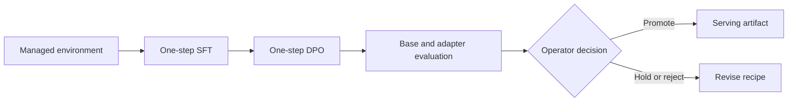

# Qualify a Nemotron Nano LoRA

Use this guide to verify a Nemotron Nano adapter recipe before approving a
long-running SFT and DPO job. A canary proves that the selected environment,
learning rate, memory budget, and evaluation route work together; it does not
promote a model automatically.

> Training is always an operator decision. Run it only against approved private
> data, stop at the first failed gate, and keep run artifacts outside the public
> repository.

## Prepare the managed environment

Create and use the repository-managed training environment:

```bash
scripts/ops/bootstrap-training-env.sh
scripts/ops/ed4all-training --help
```

The bootstrap validates the supported Torch, Transformers, TRL, PEFT,
Accelerate, and Datasets version band before model weights load. It is
offline-first and reads packages from `ED4ALL_TRAINING_WHEEL_DIR`. Set
`ED4ALL_TRAINING_OFFLINE_ONLY=true` when network resolution must be forbidden.

Architecture-specific profiles validate the processor architecture, accelerator
runtime, device capability, and extension ABI. An incompatible profile fails
loudly. Keep wheel payloads and integrity records in the operator-local cache;
the repository tracks installation behavior, not dependency binaries.

Do not modify the system Python environment to bypass a failed preflight. Fix
the managed environment or select a compatible profile.

## Run a bounded canary

The checked-in Nemotron Nano recipe intentionally leaves
`dpo_learning_rate` unset. Supply a positive candidate rate through the
canonical per-run override route; the trainer will not silently reuse the SFT
rate.

```bash
scripts/ops/ed4all-training run trainforge_train \
  --course-name <private-course-slug> \
  --config-overrides 'max_steps=1,dpo_learning_rate=<positive-rate>'
```

`max_steps=1` bounds both stages for qualification. Do not carry that override
into a production run. Record candidate rates and observations in an ignored
operator log, never in tracked documentation.

Review the following evidence after each candidate:

- SFT and DPO each complete one optimizer step without an out-of-memory event
  or non-finite loss.
- The model card records the supplied override and effective DPO rate.
- Peak device and host memory leave a safe operating margin for the intended
  deployment.
- Checkpoints and resume metadata are complete.

## Evaluate before promotion

Promotion requires all of these gates:

1. Compare the candidate DPO checkpoint with the selected SFT checkpoint on
   the same downstream probe. A regression blocks promotion.
2. Compare base and adapter from one loaded BF16 base through PEFT's
   `disable_adapter()` context. Loading a second base is not the supported
   evaluation route.
3. Render prompts with the pinned tokenizer template and
   `enable_thinking=false`. Hand-written ChatML is not an evaluation path.
4. Review the evaluation matrix manually and record the operator's promote,
   hold, or reject decision in private run state.



The same sequence in text is: validate the environment, run bounded SFT and
DPO steps, compare base and adapter, then let the operator decide whether the
candidate advances.

## Prepare the serving artifact

Do not infer dynamic-adapter support from a backend name. When the installed
serving stack has not explicitly qualified dynamic LoRA for this architecture,
merge the promoted adapter into an immutable BF16 Hugging Face checkpoint with
`Trainforge.training.adapter_export.merge_promoted_adapter`, then build the
serving artifact from that directory.

Keep the original adapter with its model card for provenance and rollback. An
unmerged serving route is acceptable only when the installed backend reports
support for the exact architecture and a fixed-prompt coherence check confirms
equivalent tokenization and materially equivalent output. Unsupported
combinations fail loudly; there is no silent backend fallback.

## Related guidance

- [Training pipeline invocation](pipeline-invocation.md)
- [Expanded adapter evaluation](expanded-adapter-evaluation.md)
- [Licensing and provider posture](../LICENSING.md)
