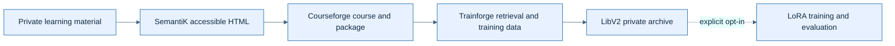

# Run Ed4All pipelines

Ed4All turns private source material into accessible HTML, course packages,
retrieval artifacts, and—when explicitly requested—training artifacts. This
guide covers the public command surface without exposing a corpus name, course
identifier, machine path, endpoint, or run record.

> **Private by design:** source files, generated content, course names, slugs,
> run state, model artifacts, and training data are operator-owned data. Keep
> them in Git-ignored locations and check `git status` before every commit.

## Quick Start

Install the capabilities you need by following [Installation and local
dependencies](installation.md). The repository documents dependencies; it does
not distribute third-party packages, model weights, or caches.

From an activated environment, inspect the live interface before starting:

```bash
ed4all --help
ed4all run --help
ed4all convert --help
ed4all stop --help
```

Preview a complete book-to-course run with private placeholders:

```bash
ed4all run textbook-to-course \
  --corpus <PRIVATE_CORPUS_PATH> \
  --course-name <PRIVATE_COURSE_NAME> \
  --dry-run
```

Remove `--dry-run` only after the plan, provider, private paths, and required
dependencies are correct.



Text equivalent: private material flows through SemantiK, Courseforge,
Trainforge, and LibV2. Adapter training and evaluation run only when selected.

## 1. Discover workflows and stages

`config/workflows.yaml` is the source of truth for workflow names, phase order,
dependencies, timeouts, and validation gates. Do not rely on a copied phase
count.

```bash
# Show workflow names without printing private run data.
python - <<'PY'
from pathlib import Path
import yaml

config = yaml.safe_load(Path("config/workflows.yaml").read_text())
print("\n".join(sorted(config["workflows"])))
PY

# Show the resolved plan for one workflow.
ed4all run <WORKFLOW> \
  --corpus <PRIVATE_CORPUS_PATH> \
  --course-name <PRIVATE_COURSE_NAME> \
  --dry-run
```

The canonical full build is `textbook-to-course`. The registry also declares
focused course-generation, retrieval/training, and post-import training
workflows. Some workflows do not consume every common option; `--dry-run` is
the safest way to verify a specific invocation.

To stop deliberately after a valid phase, use the exact phase name shown in
the workflow registry:

```bash
ed4all run <WORKFLOW> \
  --corpus <PRIVATE_CORPUS_PATH> \
  --course-name <PRIVATE_COURSE_NAME> \
  --stop-after <PHASE_NAME> \
  --dry-run
```

## 2. Protect inputs and outputs

Use placeholders in public docs, tests, examples, comments, and configuration.
Never commit real course titles, derived slugs, corpus excerpts, absolute local
paths, hostnames, LAN addresses, or generated artifacts.

The repository ignores these operator-data surfaces:

- `inputs/` contents for source material;
- `runtime/` contents for mutable state, logs, checkpoints, and scratch data;
- `SemantiK/output/` contents for converted documents;
- `Courseforge/runtime/` contents for Courseforge working state; and
- `LibV2/courses/` contents for private course archives.

An explicit output path can bypass those protections. Before a run, confirm
that every custom output or library root is ignored:

```bash
git check-ignore -v <PRIVATE_OUTPUT_PATH>
git status --short
```

Treat generated accessible HTML as private even when its source was public:
the output may contain source text, attribution, inferred structure, and
operator-selected identifiers.

## 3. Run a workflow

The standard form is:

```bash
ed4all run <WORKFLOW> \
  --corpus <PRIVATE_CORPUS_PATH> \
  --course-name <PRIVATE_COURSE_NAME> \
  [--mode local|api]
```

Useful, verified controls include:

- `--weeks <INTEGER>` to set a workflow-dependent duration;
- `--objectives <PRIVATE_OBJECTIVES_PATH>` to merge learning objectives;
- `--no-assessments` to omit an applicable assessment phase;
- `--stop-after <PHASE_NAME>` to complete through a named boundary;
- `--watch` to print phase transitions;
- `--json` for machine-readable output; and
- `--dry-run` to inspect the plan without executing it.

Use `ed4all run --help` as the authority for advanced Courseforge reruns,
conversion reuse, provider selection, and training overrides. Several of those
options are workflow-specific and intentionally fail when their prerequisites
are absent.

Training is not an implicit side effect. A full build adds its training tail
only with `--with-training`; an existing private LibV2 archive can use the
dedicated `trainforge_train` workflow. Read [Licensing and ToS
posture](../LICENSING.md) before synthesis or training.

## 4. Convert material without building a course

`convert` is the standalone SemantiK slice. It accepts a PDF, a directory of
PDFs, an HTML file, or a directory of publisher HTML and writes accessible HTML
plus sidecars to the private output directory you choose.

```bash
ed4all convert <PRIVATE_INPUT_PATH> \
  --output <PRIVATE_OUTPUT_DIRECTORY>
```

For PDF conversion, the preferred SemantiK route is GLM-OCR through its SDK,
followed by document enrichment and the Super heading judge. Enable that route
for the operator environment:

```bash
export SEMANTIK_GLMOCR_LANE=1
ed4all convert <PRIVATE_PDF_PATH> \
  --output <PRIVATE_OUTPUT_DIRECTORY>
```

The heading judge is default-on for GLM-OCR layout sidecars. Born-digital HTML
uses the vendor-ingest path instead. Conversion alone does not create a course,
package, retrieval index, LibV2 archive, or workflow run ID. See the focused
[`convert` guide](convert-verb.md) for its output contract and exit codes.

Reuse existing conversion artifacts only when they belong to the same private
source and have been inspected:

```bash
ed4all convert <PRIVATE_INPUT_PATH> \
  --output <PRIVATE_OUTPUT_DIRECTORY> \
  --reuse-conversion
```

## 5. Choose an execution mode

`--mode local` is the default. It uses the current agent session and dispatches
workflow phase workers as subagents, without an API key. The host agent harness
must support that dispatch protocol; a harness without it can run deterministic
scripts and validators directly but cannot execute the cross-agent local
workflow.

`--mode api` uses the selected SDK backend. The default API path uses the
Anthropic SDK and requires `ANTHROPIC_API_KEY`. Provider and model overrides are
listed by `ed4all run --help`. Provider selection does not waive the rules in
[`docs/LICENSING.md`](../LICENSING.md), especially for training-pair synthesis.

```bash
# Agent-session execution.
ed4all run <WORKFLOW> \
  --corpus <PRIVATE_CORPUS_PATH> \
  --course-name <PRIVATE_COURSE_NAME> \
  --mode local \
  --dry-run

# Direct SDK execution after configuring credentials outside Git.
ed4all run <WORKFLOW> \
  --corpus <PRIVATE_CORPUS_PATH> \
  --course-name <PRIVATE_COURSE_NAME> \
  --mode api \
  --dry-run
```

Never place credentials in tracked shell scripts, examples, Markdown, or
configuration.

## 6. Preflight and start

Before removing `--dry-run`:

1. Confirm the corpus and all generated destinations are ignored.
2. Read the resolved phase sequence and selected provider.
3. Install every dependency required by those phases.
4. Review provider and source licensing.
5. Ensure enough local storage and accelerator capacity for the selected work.
6. Start the run and retain its emitted run ID privately.

Use the same CLI and workflow contracts on any compatible host. Install
architecture-appropriate accelerator dependencies as described under [Platform
dependencies](installation.md#platform-dependencies), and keep device-specific
launch values and endpoint details in ignored operator configuration.

## 7. Graceful stop, resume, and checkpoints

Request a run-scoped stop with the private workflow ID or run ID printed by the
running command:

```bash
ed4all stop <PRIVATE_RUN_ID>
```

The active unit finishes, writes its checkpoint, and the command exits with
code `3` to indicate a resumable pause. `SIGTERM` or the first `SIGINT` sent to
`ed4all run` requests the same graceful behavior; a second signal force-quits
and can lose in-flight work.

Resume from the last durable checkpoint:

```bash
ed4all run <WORKFLOW> --resume <PRIVATE_RUN_ID>
```

Resume with the same workflow and relevant options. Do not use `--force` for a
normal resume: `--force` deliberately invalidates completed-phase skipping for
supported stage reruns.

For coordinated maintenance, a global sentinel pauses every polling run at its
next safe boundary:

```bash
ed4all stop --all
ed4all stop --clear-all
```

The global sentinel is operator-owned and is not cleared automatically. Clear
it before starting new work. Long-running phases also use unit-level resume
sidecars, so a retried phase can retain completed units even when its phase
checkpoint was not finalized.

## 8. Failures and validation gates

Validation is part of the workflow, not an optional report. Gate definitions,
severity, thresholds, and failure behavior live under
`config/workflows.yaml::validation_gates`; [Validation gates](../validation/gates.md)
explains their contracts.

When a blocking gate fails:

1. stop at the first failure and retain the original output;
2. read the validator finding and the owning phase log;
3. fix the source artifact, configuration, or missing dependency;
4. resume or rerun the smallest supported scope; and
5. rerun the same gate without lowering its threshold or severity.

There is no supported silent-degradation path. A missing dependency, invalid
artifact, unknown phase, or unsupported option should fail loudly.

For a completed or failed private run, these read-only commands expose the
recorded state:

```bash
ed4all list-runs
ed4all summarize-run <PRIVATE_RUN_ID>
ed4all validate-run <PRIVATE_RUN_ID>
```

Use `--json` where the command advertises it when another local tool consumes
the result. Do not paste unredacted run output into public issues or commits.

## 9. Artifact boundaries

Artifacts are private unless an explicit publication review proves otherwise:

- SemantiK emits accessible HTML and conversion sidecars;
- Courseforge emits modular content and an IMS Common Cartridge package;
- Trainforge emits assessments, retrieval inputs, instruction pairs, and
  preference pairs as selected by the workflow;
- LibV2 stores the course archive, indexes, training specifications, adapters,
  model cards, and evaluation records; and
- `runtime/` stores mutable workflow state, checkpoints, logs, and diagnostics.

Use [LibV2 integrity checks](../architecture/retrieval-and-serving.md) and the
validation commands before consuming an archive. Moving an artifact outside
an ignored directory does not make it safe to publish.

## 10. Related operator guides

- [Installation and local dependencies](installation.md)
- [Standalone conversion](convert-verb.md)
- [Licensing and ToS posture](../LICENSING.md)
- [Validation gates](../validation/gates.md)
- [Pipeline architecture](../architecture/pipeline-flow.md)
- [Repository organization](../architecture/repo-organization.md)
