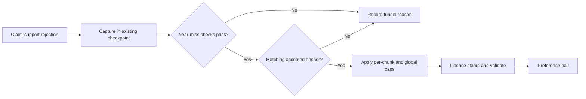

# Mine safe DPO negatives from rejected completions

Trainforge can reuse a narrowly qualified rejected instruction completion as
the negative side of a DPO preference pair. The selector is deterministic: it
uses persisted claim-support evidence, requires an accepted completion for the
same generation contract, and makes no additional model or network call.

Reject mining is optional and defaults to off. It is designed for plausible
near misses, not malformed, unsupported, or template-collapsed output.

## Choose a mode

`TRAINFORGE_DPO_MINE_REJECTS` has three effective modes:

| Value | Capture rejected completions | Emit preference pairs |
|---|---:|---:|
| unset, empty, false, or unrecognized | No | No |
| `shadow` | Yes | No |
| `1`, `true`, `yes`, or `on` | Yes | Yes |

Values are case-insensitive. The default `off` path retains the existing
checkpoint and output behavior: rejected rows keep `pair: null`, no pool is
built, and no reject-mining summary is written.

Always inspect a complete `shadow` pass before considering `on`. Shadow mode
runs the capture and selection funnel without changing
`preference_pairs.jsonl`.

> **Launch-time setting:** the mode is part of the synthesis run contract.
> Changing it on a paused run invalidates that contract and raises
> `FreshStartError`; start a fresh run instead of forcing incompatible resume
> state.

## How selection stays bounded

Only instruction units rejected by the `claim_support` stage can enter the
pool. Earlier promotion failures and failures based only on metadata are not
eligible because they do not carry the claim evidence needed to identify a
near miss.



An eligible rejected completion must satisfy every current selector contract:

- no contradicted claims;
- at least three scored claims;
- claim-support rate at or above the configured floor and below `1.0`;
- worst failing-claim entailment at or above its configured floor;
- no recognized learning-objective identifier splice;
- at least 25 distinct completion tokens not already present in the prompt;
- no recurring template skeleton at or above the configured limit; and
- chosen/rejected token Jaccard within `[0.30, 0.70]`.

The accepted anchor must match the rejected candidate on chunk, learning
objective references, unframed prompt, citation contract, and teacher identity,
and it must come from a different variant. Trainforge never manufactures,
templates, extracts, or borrows a chosen response when no matching accepted
anchor exists.

Selection permits at most one mined negative per anchor and per chunk. A
global ceiling limits mined rows to a fraction of the accepted instruction
corpus. Ordering and tie-breaking are deterministic, including after input
reordering.

## Current defaults

The master switch must be enabled for its satellite settings to have any
effect.

| Environment variable | Accepted range | Default |
|---|---|---:|
| `TRAINFORGE_DPO_MINE_MIN_SUPPORT` | float in `[0.0, 1.0)` | `0.50` |
| `TRAINFORGE_DPO_MINE_MIN_FAIL_ENTAILMENT` | float in `[0.0, 1.0)` | `0.15` |
| `TRAINFORGE_DPO_MINE_MAX_SKELETON_FREQ` | positive integer | `3` |
| `TRAINFORGE_DPO_MINE_MAX_FRACTION` | float in `(0.0, 1.0]` | `0.25` |

An empty, unparseable, or out-of-range satellite value resolves to its default
as defined by the behavior-flag contract. Do not weaken these filters merely
to increase yield.

## Run a private shadow pass

Use private, ignored inputs and outputs. Real course identifiers, source names,
and workflow state must not be copied into tracked documentation.

At least two instruction variants per chunk are required for possible yield:
one variant cannot provide both an accepted anchor and a rejected candidate.

```bash
export TRAINFORGE_DPO_MINE_REJECTS=shadow

ed4all run textbook-to-course \
  --corpus <PRIVATE_CORPUS_PATH> \
  --course-name <PRIVATE_COURSE_NAME> \
  --instruction-variants-per-chunk 2
```

After a complete synthesis pass, inspect the private summary:

```bash
jq '.reject_mining' <PRIVATE_SYNTHESIS_SUMMARY_JSON>
```

Do not interpret an incomplete pass. If synthesis stops early or exhausts its
dispatch budget, mining emits nothing and records
`reject_mining_skipped: "incomplete_pass"` because a prefix-only pool is
biased.

The summary accounts for captured and resumed candidates, selection outcomes,
caps, emitted rows, and whether the pass was shadow-only. Common signals are:

| Signal | Meaning |
|---|---|
| `candidates_seen: 0` | Nothing reached the eligible capture stage. |
| `no_anchor` | No accepted completion matched the rejected candidate. |
| `stale_contract` | Resume data was not confirmed under the current generation contract. |
| `lo_id_splice`, `low_novel_content`, or `skeleton_collapse` | Degenerate output was excluded. |
| `identity_mismatch` | Candidate and anchor generation identities differ. |
| `global_capped` | The configured corpus-fraction ceiling was reached. |

Only consider `on` when the complete shadow report is clean, the selected rows
have been reviewed, and `emitted` meets the active trainer
`min_dpo_pairs` requirement. The repository default is `50`.

```bash
export TRAINFORGE_DPO_MINE_REJECTS=on
```

## Identify mined records

Emitted rows use the normal preference-pair schema and carry
`source: "mined_rejection"` plus a `reject_mining` audit block. That block
records the rejection reason, candidate and anchor variant indexes,
claim-support metrics, completion similarity, skeleton frequency, rank, and
generation-contract fingerprint.

```bash
jq -c 'select(.source == "mined_rejection")' \
  <PRIVATE_PREFERENCE_PAIRS_JSONL>
```

Each selected row receives canonical teacher-license provenance. A barred,
unregistered, or otherwise ineligible teacher causes the candidate to be
dropped rather than emitted. A `reject_mined_preference_selection` decision
event is written for each selected row and for the pass summary.

The emitted compatibility field `promotion_status: "validated"` does not by
itself authorize training or model promotion. Downstream schema, licensing,
pair-quality, training, and evaluation checks remain authoritative.

## Fail loudly at the training boundary

Mined rows are admitted by the trainer's shared
`editorial_or_misconception` predicate. The same predicate is used for the
preflight count and the training filter so their results cannot drift.

The default training configuration requires at least `50` admissible DPO pairs
and sets `dpo_fail_hard: true`. Falling below that floor raises
`InsufficientPreferencePairsError`; Trainforge will not silently label an
SFT-only adapter as a completed DPO run. An explicit
`dpo_fail_hard=false` override is the opt-in SFT-only route.

The `dpo_yield_projection` validation gate provides an earlier warning using
the same default floor. It does not replace the trainer's fail-loud check.
Every other configured synthesis and post-training gate still applies; never
lower a threshold or severity to admit mined data.

## Canonical references

- [Trainforge behavior flags](behavior-flags-trainforge.md) owns the complete
  flag definitions and parsing rules.
- [Validation gates](../validation/gates.md) owns gate wiring, thresholds, and
  severity.
- [Licensing and ToS posture](../LICENSING.md) governs the teacher that
  produced the reused completion.
- [Trainforge training pipeline](../../Trainforge/CLAUDE.md#training-pipeline)
  documents DPO admission, training configuration, and evaluation.
- `Trainforge/synthesis/synthesis_reject_mining.py` is the selector source of
  truth; `Trainforge/synthesis/synthesize_training.py` owns its pipeline hook.
