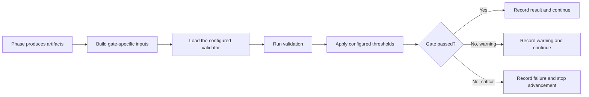

# Validation gates

Ed4All validates artifacts at phase boundaries. A gate is part of the pipeline
contract: a failing critical gate means the artifact is not ready to advance.
Fix the artifact or its producer; do not lower a threshold or severity to make a
run pass.

The executable source of truth is `config/workflows.yaml`. This guide explains
how that configuration is applied and provides a current, compact inventory.
Validator responsibilities and direct invocation are documented in
[Validators](validators.md); the system design is in
[Validation architecture](../architecture/validation-architecture.md).

## How a gate runs



Each gate declaration contains:

- `gate_id`: stable identifier in results and logs;
- `validator`: allowlisted import path for the validator class;
- `severity`: `critical` or `warning`;
- `threshold`: result-level limits and validator inputs;
- `config`: validator-specific options; and
- `behavior.on_fail` / `behavior.on_error`: whether a failed result or an
  execution error blocks or warns.

Threshold values are forwarded to the validator and then applied to its result.
Per-call inputs take precedence when a builder explicitly supplies the same
key. Validator-specific `config` is also forwarded, and is available as
`_gate_config` for validators that need the complete declaration.

## Failure semantics

Critical gates normally use `on_fail: block` and `on_error: fail_closed`.
Warning gates normally use `on_fail: warn` and `on_error: warn`. The declaration
in `config/workflows.yaml` is authoritative when a gate intentionally differs.

There is no automatic threshold reduction, severity downgrade, or validator
substitution. In particular:

- an ordinary validator exception produces `VALIDATOR_ERROR`; `on_error`
  determines whether that result blocks;
- an unavailable configured embedding device produces
  `EMBEDDING_MODEL_UNAVAILABLE` and always fails closed; choosing CPU must be
  explicit with `ED4ALL_EMBEDDING_DEVICE=cpu`;
- missing optional embedding dependencies produce `EMBEDDING_DEPS_MISSING`;
  they honor `on_error` unless strict embedding mode is enabled;
- a CUDA out-of-memory error produces the distinct `VALIDATOR_OOM` result;
  `ED4ALL_VALIDATOR_FAIL_CLOSED_ON_OOM=1` makes it blocking regardless of the
  gate's `on_error` policy; and
- a feature-gated validator may return an explicit informational skip when its
  owning behavior flag is off. That is a declared no-op, not a silent fallback.

Warnings remain visible in gate results. They are not equivalent to a clean
pass and should be reviewed before publication, synthesis, or training.

## Current gate inventory

`C` means critical and `W` means warning. Validator class paths, descriptions,
behavior, and thresholds remain in the adjacent YAML declaration so this table
cannot override executable configuration.

| Workflow | Phase | Gates |
|---|---|---|
| `course_generation` | `content_generation` | `content_structure` (C), `content_authorship` (C), `manifest_completeness` (W) |
| `course_generation` | `inter_tier_validation` | `outline_curie_anchoring` (C), `outline_content_type` (C), `outline_page_objectives` (C), `outline_assessment_item_payload` (C), `outline_anchored_rubric` (W), `outline_triangle_completeness` (W), `block_cognitive_load` (W), `retrieval_presence` (W), `block_sequence_order` (W), `bloom_type_range` (C), `near_dup_example` (W), `bloom_ladder_ceiling` (W) |
| `course_generation` | `post_rewrite_validation` | `rewrite_curie_anchoring` (C), `rewrite_content_type` (C), `rewrite_page_objectives` (C), `rewrite_source_refs` (C), `rewrite_assessment_item_payload` (C), `rewrite_html_shape` (C), `rewrite_source_grounding` (W), `block_prose_entailment` (W), `block_prose_stutter` (W), `numeric_literal_grounding` (W), `worked_example_math` (W), `rewrite_content_lint` (W), `manifest_completeness` (W), `example_completeness` (C), `rewrite_anchored_rubric` (W), `rewrite_triangle_completeness` (W), `udl_coverage` (C), `block_cognitive_load` (W), `anatomy_slot_presence` (C), `interaction_feedback` (C), `block_quality_rubric` (C), `qa_checklist` (W), `retrieval_presence` (W), `bloom_type_range` (C), `resource_link_purpose` (C), `b08_sequence` (C), `b09_debrief` (C), `b10_protocol` (C), `interactive_a11y` (C), `callout_structure` (C), `key_terms_definition_quality` (C), `mayer_ctml` (C), `recall_self_check_format` (C), `block_quality_rollup` (W), `course_level_qa` (W), `bloom_distribution` (W), `cross_week_spacing` (W), `bloom_ladder_ceiling` (W) |
| `course_generation` | `assessment_synthesis` | `qti_well_formed` (C), `assessment_objective_alignment` (C), `discussion_assignment_grounded` (W), `cumulative_assessment` (W), `synthesized_quiz_distractor` (W), `assessment_item_writing` (W), `assessment_quality` (W) |
| `course_generation` | `packaging` | `imscc_structure` (C), `page_objectives` (C), `page_objectives_shacl` (W), `cartridge_conformance` (W) |
| `course_generation` | `validation` | `wcag_compliance` (C), `oscqr_score` (W) |
| `rag_training` | `assessment_generation` | `assessment_quality` (C), `bloom_alignment` (W), `leak_check` (C), `outcome_ref_integrity` (W), `content_fact_check` (W), `question_quality` (C) |
| `rag_training` | `validation` | `final_quality` (C) |
| `textbook_to_course` | `semantik_conversion` | `semantik_markers` (C) |
| `textbook_to_course` | `chunking` | `chunkset_manifest` (W), `chunk_wcag_status` (W) |
| `textbook_to_course` | `objective_extraction` | `textbook_outline_enrichment` (C), `chunk_health` (C) |
| `textbook_to_course` | `course_planning` | `abcd_verb_alignment` (C), `objective_source_refs` (C), `objective_entailment` (C), `objective_specificity` (W), `chapter_objective_coverage` (C), `terminal_objective_coverage` (C), `co_terminal_alignment` (W), `source_coverage` (W), `terminal_objective_source_grounding` (W) |
| `textbook_to_course` | `concept_extraction` | `concept_graph` (W), `domain_concept_vocabulary` (C) |
| `textbook_to_course` | `content_generation` | `content_structure` (W), `source_refs` (C), `content_grounding` (C), `content_authorship` (C), `manifest_completeness` (W) |
| `textbook_to_course` | `inter_tier_validation` | `outline_curie_anchoring` (C), `outline_content_type` (C), `outline_page_objectives` (C), `outline_source_refs` (C), `outline_assessment_item_payload` (C), `outline_shacl` (W), `outline_objective_assessment_similarity` (W), `outline_concept_example_similarity` (W), `outline_objective_roundtrip_similarity` (W), `outline_bloom_classifier_disagreement` (W), `outline_block_objective_delivery` (C), `outline_assessment_retrieval_grounding` (W), `outline_distractor_plausibility` (W), `outline_distractor_misconception_alignment` (W), `outline_distractor_structural` (W), `outline_assessment_numeric_equivalence` (W), `outline_padded_distractor` (C), `outline_instructional_depth` (W), `outline_bloom_structural_enforcement` (W), `outline_anchored_rubric` (W), `outline_triangle_completeness` (W), `block_cognitive_load` (W), `retrieval_presence` (W), `block_sequence_order` (W), `bloom_type_range` (C), `prerequisite_sequencing` (W), `near_dup_example` (W), `bloom_ladder_ceiling` (W) |
| `textbook_to_course` | `content_generation_rewrite` | `content_grounding` (W) |
| `textbook_to_course` | `assessment_synthesis` | `qti_well_formed` (C), `assessment_objective_alignment` (C), `discussion_assignment_grounded` (W), `cumulative_assessment` (W), `synthesized_quiz_distractor` (W), `assessment_item_writing` (W), `assessment_quality` (W) |
| `textbook_to_course` | `post_rewrite_validation` | `rewrite_curie_anchoring` (C), `rewrite_content_type` (C), `rewrite_page_objectives` (C), `rewrite_source_refs` (C), `rewrite_assessment_item_payload` (C), `rewrite_html_shape` (C), `rewrite_source_grounding` (W), `block_prose_entailment` (W), `block_prose_stutter` (W), `numeric_literal_grounding` (W), `worked_example_math` (W), `rewrite_content_lint` (W), `rewrite_shacl` (W), `rewrite_objective_assessment_similarity` (W), `rewrite_concept_example_similarity` (W), `rewrite_objective_roundtrip_similarity` (W), `rewrite_bloom_classifier_disagreement` (W), `rewrite_block_objective_delivery` (W), `claim_support` (C), `rewrite_assessment_retrieval_grounding` (W), `rewrite_distractor_plausibility` (W), `rewrite_distractor_misconception_alignment` (W), `rewrite_distractor_structural` (W), `rewrite_assessment_numeric_equivalence` (C), `rewrite_padded_distractor` (C), `rewrite_instructional_depth` (W), `rewrite_bloom_structural_enforcement` (W), `manifest_completeness` (W), `example_completeness` (C), `rewrite_anchored_rubric` (W), `rewrite_triangle_completeness` (W), `udl_coverage` (C), `block_cognitive_load` (W), `anatomy_slot_presence` (C), `interaction_feedback` (C), `block_quality_rubric` (C), `qa_checklist` (W), `retrieval_presence` (W), `bloom_type_range` (C), `resource_link_purpose` (C), `b08_sequence` (C), `b09_debrief` (C), `b10_protocol` (C), `interactive_a11y` (C), `callout_structure` (C), `key_terms_definition_quality` (C), `mayer_ctml` (C), `recall_self_check_format` (C), `misconception_productive_failure` (C), `block_quality_rollup` (W), `course_level_qa` (W), `bloom_distribution` (W), `cross_week_spacing` (W), `bloom_ladder_ceiling` (W) |
| `textbook_to_course` | `packaging` | `imscc_structure` (W), `page_objectives` (C), `page_objectives_shacl` (W), `wcag_compliance` (W), `cartridge_conformance` (W) |
| `textbook_to_course` | `imscc_chunking` | `chunkset_manifest` (W), `chunk_wcag_status` (W) |
| `textbook_to_course` | `trainforge_assessment` | `imscc_input_valid` (C), `assessment_quality` (C), `assessment_objective_alignment` (C), `trainforge_padded_distractor` (C) |
| `textbook_to_course` | `training_synthesis` | `synthesis_quota` (W), `dpo_yield_projection` (W), `min_edge_count` (C), `synthesis_diversity` (C), `property_coverage` (C), `synthesis_leakage` (C), `curie_anchoring` (C), `pair_claim_support` (W), `pair_lo_refs` (C), `pair_objective_delivery` (W), `pair_promotion` (C), `rejected_claim_entailment` (W) |
| `textbook_to_course` | `libv2_archival` | `libv2_manifest` (C), `difficulty_provenance` (W), `packet_integrity_strict` (C), `semantic_graph_rule_output` (W), `kg_quality_report` (C), `chunkset_drift` (W) |
| `textbook_to_course` | `vector_indexing` | `course_completeness` (W) |
| `textbook_to_course` | `post_training_validation` | `eval_gating` (C), `family_completeness` (C) |
| `trainforge_train` | `post_training_validation` | `eval_gating` (C), `family_completeness` (C) |

## Thresholds and validator options

Most declarations use `threshold: {max_critical_issues: 0}`. The following
declarations add another threshold, use a different threshold, omit the
result-level threshold block, or provide validator-specific `config`. Values
below are reproduced exactly from `config/workflows.yaml`.

| Workflow / phase / gate | Effective declaration details |
|---|---|
| `course_generation` / `content_generation` / `manifest_completeness` | `threshold: {max_critical_issues: 0}`; `config: {require_concept_tags: false}` |
| `course_generation` / `post_rewrite_validation` / `rewrite_source_grounding` | `threshold: {max_critical_issues: 0}`; `config.thresholds: {min_grounded_sentence_rate: 0.6, min_grounding_cosine: 0.45}` |
| `course_generation` / `post_rewrite_validation` / `block_prose_entailment` | `threshold: {max_critical_issues: 0}`; `config: {shadow: false, thresholds: {contradiction_floor: 0.5, entailment_floor: 0.5, max_contradicted_rate: 0.05, min_block_entailment_rate: 0.4}}` |
| `course_generation` / `post_rewrite_validation` / `numeric_literal_grounding` | `threshold: {max_critical_issues: 0}`; `config: {shadow: false, thresholds: {min_absent_fractions: 1}}` |
| `course_generation` / `post_rewrite_validation` / `worked_example_math` | `threshold: {max_critical_issues: 0}`; `config: {shadow: false}` |
| `course_generation` / `post_rewrite_validation` / `rewrite_content_lint` | `threshold: {max_critical_issues: 0}`; `config: {shadow: false}` |
| `course_generation` / `post_rewrite_validation` / `manifest_completeness` | `threshold: {max_critical_issues: 0}`; `config: {require_concept_tags: false}` |
| `course_generation` / `post_rewrite_validation` / `example_completeness` | `threshold: {max_critical_issues: 0}`; `config.thresholds: {min_word_tokens: 40}` |
| `course_generation` / `validation` / `wcag_compliance` | `threshold: {max_critical_issues: 0, min_score: 0.9}` |
| `course_generation` / `validation` / `oscqr_score` | `threshold: {min_score: 0.7}` |
| `rag_training` / `assessment_generation` / `assessment_quality` | `threshold: {max_critical_issues: 0, min_score: 0.8}`; see assessment-type table below |
| `rag_training` / `assessment_generation` / `bloom_alignment` | `threshold: {min_alignment_score: 0.7}` |
| `rag_training` / `assessment_generation` / `leak_check` | `threshold: {boilerplate_ngram_tokens: 15, max_boilerplate_chunk_fraction: 0.1, max_leaks: 0}` |
| `rag_training` / `assessment_generation` / `outcome_ref_integrity` | `threshold: {max_broken_refs: 0}` |
| `rag_training` / `assessment_generation` / `content_fact_check` | `threshold: {max_fact_flags: 0}` |
| `rag_training` / `assessment_generation` / `question_quality` | `threshold: {min_score: 0.6}` |
| `rag_training` / `validation` / `final_quality` | `threshold: {min_score: 0.85}` |
| `textbook_to_course` / `course_planning` / `objective_source_refs` | `threshold: {max_critical_issues: 0}`; `config: {require_to_attribution: false}` |
| `textbook_to_course` / `course_planning` / `objective_entailment` | `threshold: {max_critical_issues: 0}`; `config: {require_to_entailment: false, shadow: false, thresholds: {contradiction_floor: 0.5, entailment_floor: 0.7, objective_entailment_rate_floor: 1.0}}` |
| `textbook_to_course` / `course_planning` / `objective_specificity` | `threshold: {max_critical_issues: 0}`; `config: {max_vacuous_rate: 0.05, min_content_residual: 2, min_generic_object_residual: 4, min_statement_token_recall: 0.5}` |
| `textbook_to_course` / `course_planning` / `co_terminal_alignment` | `threshold: {max_critical_issues: 0}`; `config: {threshold: 0.45, weak_rate_warn: 0.3}` |
| `textbook_to_course` / `course_planning` / `source_coverage` | `threshold: {max_critical_issues: 0}`; `config: {coverage_floor: 0.45, max_uncited_chunk_rate: 0.1, max_uncovered_rate: 0.15}` |
| `textbook_to_course` / `content_generation` / `manifest_completeness` | `threshold: {max_critical_issues: 0}`; `config: {require_concept_tags: false}` |
| `textbook_to_course` / `post_rewrite_validation` / `rewrite_source_grounding` | `threshold: {max_critical_issues: 0}`; `config.thresholds: {min_grounded_sentence_rate: 0.6, min_grounding_cosine: 0.45}` |
| `textbook_to_course` / `post_rewrite_validation` / `block_prose_entailment` | `threshold: {max_critical_issues: 0}`; `config: {shadow: false, thresholds: {contradiction_floor: 0.5, entailment_floor: 0.5, max_contradicted_rate: 0.05, min_block_entailment_rate: 0.4}}` |
| `textbook_to_course` / `post_rewrite_validation` / `numeric_literal_grounding` | `threshold: {max_critical_issues: 0}`; `config: {shadow: false, thresholds: {min_absent_fractions: 1}}` |
| `textbook_to_course` / `post_rewrite_validation` / `worked_example_math` | `threshold: {max_critical_issues: 0}`; `config: {shadow: false}` |
| `textbook_to_course` / `post_rewrite_validation` / `rewrite_content_lint` | `threshold: {max_critical_issues: 0}`; `config: {shadow: false}` |
| `textbook_to_course` / `post_rewrite_validation` / `manifest_completeness` | `threshold: {max_critical_issues: 0}`; `config: {require_concept_tags: false}` |
| `textbook_to_course` / `post_rewrite_validation` / `example_completeness` | `threshold: {max_critical_issues: 0}`; `config.thresholds: {min_word_tokens: 40}` |
| `textbook_to_course` / `trainforge_assessment` / `assessment_quality` | `threshold: {max_critical_issues: 0, min_score: 0.8}`; see assessment-type table below |
| `textbook_to_course` / `training_synthesis` / `synthesis_quota` | `threshold: {max_estimated_dispatches: 1500}` |
| `textbook_to_course` / `training_synthesis` / `dpo_yield_projection` | `threshold: {min_dpo_pairs: 50}` |
| `textbook_to_course` / `training_synthesis` / `min_edge_count` | `threshold: {max_critical_issues: 0, min_concept_nodes: 50, min_edge_types: 4, min_edges: 100}` |
| `textbook_to_course` / `training_synthesis` / `synthesis_diversity` | `threshold: {max_critical_issues: 0, max_single_share: 0.35, max_top3_share: 0.6, min_distinct_templates: 8, min_total_pairs: 100}` |
| `textbook_to_course` / `training_synthesis` / `synthesis_leakage` | `threshold: {max_critical_issues: 0}`; `config.thresholds: {leak_rate_threshold: 0.05, leak_span_chars: 50}` |
| `textbook_to_course` / `training_synthesis` / `curie_anchoring` | `threshold: {min_pair_anchoring_rate: 0.95}` |
| `textbook_to_course` / `training_synthesis` / `pair_claim_support` | No threshold block |
| `textbook_to_course` / `training_synthesis` / `pair_lo_refs` | No threshold block |
| `textbook_to_course` / `training_synthesis` / `pair_objective_delivery` | `config.thresholds: {bloom_gap_threshold: 2, contradiction_floor: 0.5, deterministic_template_entailment_floor: 0.3, instruction_entailment_floor: 0.4, preference_entailment_floor: 0.45}`; no threshold block |
| `textbook_to_course` / `training_synthesis` / `pair_promotion` | No threshold block |
| `textbook_to_course` / `training_synthesis` / `rejected_claim_entailment` | No threshold block |
| `textbook_to_course` / `libv2_archival` / `packet_integrity_strict` | `threshold: {max_critical_issues: 0}`; `config: {strict: true}` |
| `textbook_to_course` / `libv2_archival` / `kg_quality_report` | `threshold: {min_accuracy: 0.95, min_completeness: 0.95, min_consistency: 0.95, min_coverage: 0.5}` |

Both `assessment_quality` declarations use the same
`config.per_question_type_thresholds` values:

| Question type | Stem diversity | Answer diversity | Maximum distractor-template ratio | Minimum stem characters |
|---|---:|---:|---:|---:|
| `essay` | 0.55 | 0.50 | 1.00 | 15 |
| `fill_in_blank` | 0.65 | 0.55 | 0.30 | 10 |
| `multiple_choice` | 0.75 | 0.65 | 0.25 | 12 |
| `short_answer` | 0.65 | 0.55 | 1.00 | 12 |
| `true_false` | 0.50 | 0.40 | 1.00 | 10 |

## Inspecting gate configuration and results

To inspect one workflow's declared gates without running the pipeline:

```bash
python - <<'PY'
from pathlib import Path
import yaml

workflow_name = "textbook_to_course"
config = yaml.safe_load(Path("config/workflows.yaml").read_text())
for phase in config["workflows"][workflow_name]["phases"]:
    gates = phase.get("validation_gates", [])
    if gates:
        print(phase["name"])
        for gate in gates:
            print("  ", gate)
PY
```

During execution, each result records the gate id, validator, version, pass
state, score, issues, timing, and any error. Phase checkpoint data carries the
serialized `gate_results` list, and workflow phase outputs expose the same list
as `_gate_results` for downstream reporting. Start with the first failed gate:

1. Read its issue code, message, and suggestion.
2. Confirm that the expected input artifact exists and is the artifact produced
   by the current phase.
3. Confirm the configured validator and threshold in `config/workflows.yaml`.
4. Reproduce the validator directly when possible; see
   [Validators](validators.md).
5. Fix the producer or artifact, rerun the phase, and verify that the original
   issue is gone without introducing new warnings.

## Changing a gate

A gate change is a contract change. Update the workflow declaration and tests
together:

1. Implement or update the validator under an allowlisted module prefix.
2. Declare the gate in the correct phase with explicit severity, threshold, and
   error/failure behavior.
3. Add tests for a clean artifact, each blocking defect, malformed inputs, and
   validator errors.
4. Verify every configured validator imports successfully and every threshold
   reaches its validator.
5. Update this inventory and any owning behavior-flag documentation.

Do not promote or demote severity based on a single convenient run. Calibration
and go/no-go decisions require representative artifacts and explicit review.
