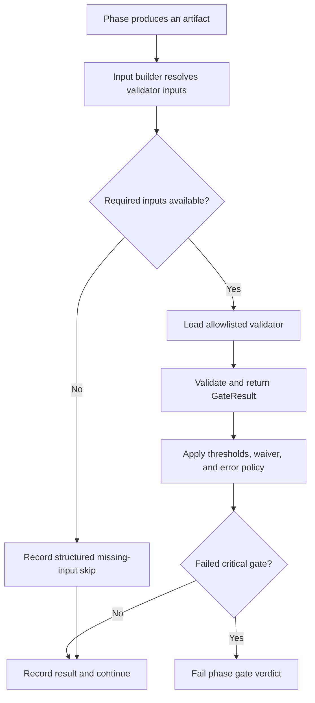

# Validator contributor guide

Validators inspect pipeline artifacts and return structured evidence. Workflow
gates decide when those validators run, which inputs they receive, and whether
a failed result is advisory or blocking.

This guide describes validator families and the extension contract. For the
configured workflow instances, severities, and thresholds, see
[Validation gates](gates.md). For end-to-end result flow, see
[Validation architecture](../architecture/validation-architecture.md).

## Validator families

The families overlap by design. Choose a home based on the artifact and
responsibility, then reuse shared helpers instead of creating a parallel
framework.

### Structure, schema, and provenance

These validators check machine-readable contracts: required fields, identifier
resolution, source references, manifests, hashes, graph shapes, ordering, and
package integrity. Most are deterministic and should report malformed or
missing artifacts with stable issue codes and actionable locations.

Representative modules include:

- `page_objectives.py`, `source_refs.py`, and `content_type.py` for authored
  block contracts;
- `shacl_runner.py` and the `shacl/` resources for graph constraints;
- `chunkset_manifest.py` and `chunkset_drift.py` for corpus integrity; and
- the `libv2/` package for archive and model-package validation.

### Accessibility and content quality

These validators inspect accessible markup, interaction semantics, writing
quality, instructional scaffolds, and assessment construction. Examples
include `rewrite_html_shape.py`, `interactive_a11y.py`, `mayer_ctml.py`,
`assessment_item_writing.py`, and `key_terms_definition_quality.py`.

Keep deterministic syntax and structure checks separate from semantic claims.
An HTML parser can prove that alternative text exists; it cannot, by itself,
prove that the text accurately describes an image.

### Alignment and semantic support

These validators compare objectives, assessments, blocks, source evidence, and
claims. The family includes deterministic rubric checks as well as embedding
and natural-language-inference (NLI) checks.

Optional statistical dependencies must fail loudly:

- missing embedding packages use `EMBEDDING_DEPS_MISSING`;
- an unavailable requested embedding device uses
  `EMBEDDING_MODEL_UNAVAILABLE` and fails closed;
- an individual encoding failure uses `EMBEDDING_ENCODE_ERROR`; and
- missing NLI support produces a structured dependency result or abstention,
  never evidence that a semantic claim passed.

Selecting CPU for embeddings is explicit through
`ED4ALL_EMBEDDING_DEVICE=cpu`; the validation layer does not silently change
the requested device.

### Graph, synthesis, and training packages

These validators protect the knowledge graph, generated training pairs, and
post-training artifacts. They cover graph sufficiency, property coverage,
pair diversity, leakage, learning-outcome references, promotion eligibility,
archive completeness, and evaluation gates.

Training data and model promotion remain operator-governed. A validator
produces evidence and a gate verdict; it does not authorize synthesis,
training, or promotion by itself.

## Result contract

A validator class implements the protocol in
[`MCP/hardening/validation_gates.py`](../../MCP/hardening/validation_gates.py):
it exposes `name` and `version`, accepts an input mapping through `validate`,
and returns a `GateResult`.

A useful result includes:

- a stable `passed` value;
- a score when the check has a meaningful aggregate measure;
- structured `GateIssue` entries with severity, stable code, message,
  location when available, and a practical suggestion;
- an error field when validation could not execute; and
- an action only when an owning router consumes the validator action contract.

Issue severity describes an individual finding. Gate severity is workflow
policy. Do not infer one from the other or hard-code workflow blocking inside
an ordinary validator.

Validators must not lower thresholds, substitute a weaker check, or convert an
unavailable dependency into a clean pass. Feature-gated behavior may return an
explicit no-op or abstention only when that behavior is part of the documented
contract.

## Runtime flow

The labels carry the full meaning; color is not required to interpret the
diagram. Explicitly requested training synthesis has a stricter artifact
contract: unresolved required gate inputs fail that phase rather than becoming
a non-blocking skip.

## Input routing and loading

`GateInputRouter` in
[`MCP/hardening/gate_input_routing.py`](../../MCP/hardening/gate_input_routing.py)
maps a validator's dotted class path to a builder. A builder returns the input
mapping and a list of unresolved required keys. Missing builders and builder
errors become structured missing-input results instead of vacuous validation.

`ValidationGateManager` restricts dynamic imports to its allowlisted module
prefixes. A new validator must live under an allowed namespace or accompany an
explicit, reviewed allowlist change.

Thresholds and validator-specific `config` originate in
[`config/workflows.yaml`](../../config/workflows.yaml). The executor forwards
them to the validator, and the gate manager also applies generic result-level
thresholds. Per-call inputs retain precedence over duplicate configured keys.

## Error policy

Validator errors stay distinguishable from content findings:

- ordinary exceptions produce `VALIDATOR_ERROR`; `behavior.on_error` decides
  whether that result warns or fails closed;
- CUDA out-of-memory produces `VALIDATOR_OOM`; the configured error behavior
  applies unless `ED4ALL_VALIDATOR_FAIL_CLOSED_ON_OOM` forces failure;
- an unavailable configured embedding device produces
  `EMBEDDING_MODEL_UNAVAILABLE` and always fails closed; and
- strict embedding dependency mode promotes missing packages to a failed
  result rather than installing or downloading anything.

After error handling, a result that remains failed blocks the phase only when
its declared gate severity is critical. See
[ADR-005](../architecture/ADR-005-gate-severity-blocking.md) for that decision.

## Decision capture

The executor makes `decision_capture` and `capture` available to validators.
Every validator path that calls an LLM must emit at least one decision event
per call, or per batch for a batched call. Its rationale must be at least 20
characters and must include dynamic evidence such as artifact identifiers,
model settings, scores, or result distributions. Static boilerplate is not an
audit trail.

Deterministic validators that make auditable selection, scoring, or governance
decisions should follow the established capture pattern for their family.
Capture failures must not disguise the validation result. Add a regression
test that injects a capture double, proves the event fires, and checks the
dynamic rationale. The canonical event contract is documented in
[Decision capture](../architecture/decision-capture.md).

## Bloom classification status

Structural Bloom checks remain deterministic: declared levels, verb ranges,
ladders, and distributions do not require a trained text classifier.

`ED4ALL_BLOOM_TRIVOTE` enables a heuristic vote using available declared,
verb, and active DeBERTa NLI evidence. It is not a trained or provisioned Bloom
classifier; unavailable signals abstain rather than fabricate a vote.

`ED4ALL_BLOOM_TRIVOTE_HEADS` selects an optional heads voter only when a
complete local artifact can load. The repository does not ship that local
artifact. A missing or invalid artifact abstains, and the heuristic path falls
back to or continues with its remaining available voters.

`TRAINFORGE_REQUIRE_BERT_ENSEMBLE` is a strict availability policy. It does
not provision a classifier; strict mode fails when the required provisioned
signal is unavailable.

DeBERTa is the active NLI entailment service used by semantic support checks.
It is distinct from a trained Bloom classifier, even when its zero-shot signal
participates in the heuristic vote.

## Adding or changing a validator

Treat implementation, routing, policy, and tests as one contract:

1. Place the validator in the family that owns its artifact and reuse canonical
   ontology, parsing, and result helpers.
2. Implement `validate(inputs) -> GateResult` with stable issue codes and
   explicit malformed-input and dependency behavior.
3. Register the dotted validator path with the correct input builder. Add an
   allowlist entry only if an existing allowed namespace is unsuitable.
4. Declare the gate in the owning workflow phase with explicit severity,
   threshold, `config`, `on_fail`, and `on_error` values.
5. Wire `DecisionCapture` for every LLM call and for other decisions required
   by the owning validator family.
6. Test a clean artifact, each important defect, malformed and missing inputs,
   threshold forwarding, dependency failures, and decision capture where
   applicable.
7. Run the gate through the executor path to prove the builder supplies real
   inputs and the result is persisted with the intended severity.
8. Update [Validation gates](gates.md) when the configured instance or its
   public rationale changes. Do not copy the gate inventory into this guide.

Do not promote a warning gate to critical from a convenient single run.
Threshold and severity changes require representative calibration evidence and
explicit review.

## Sources of truth

- [Validation gates](gates.md): configured workflow instances and policy.
- [Validation architecture](../architecture/validation-architecture.md):
  execution, persistence, waivers, aggregators, and post-training boundaries.
- [`config/workflows.yaml`](../../config/workflows.yaml): executable gate
  declarations.
- [`MCP/hardening/validation_gates.py`](../../MCP/hardening/validation_gates.py):
  result, threshold, waiver, loading, and error semantics.
- [`MCP/hardening/gate_input_routing.py`](../../MCP/hardening/gate_input_routing.py):
  validator input builders.
- [`lib/validators/`](../../lib/validators/): validator implementations and
  family-level tests.
