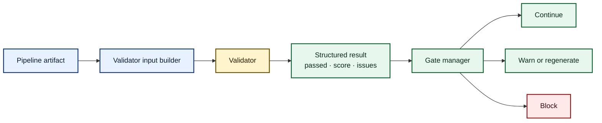

# Validator Catalog

> **What this page is:** a user-facing map of Ed4All’s validation layers.
> For workflow placement, severity, actions, and configured thresholds, use
> [Validation Gates](gates.md). For execution and result flow, use
> [Validation Architecture](../architecture/validation-architecture.md).

Validators inspect artifacts and return structured results. Gates decide when
those validators run and whether a result warns, regenerates, blocks, or is
reported for review. Keeping those responsibilities separate makes validation
behavior visible without duplicating workflow policy here.

## How validation fits together

The diagram is intentionally redundant in text: an artifact is normalized by
an input builder, inspected by a validator, returned as a structured result,
and interpreted by the gate manager.

## Catalog at a glance

| Layer | What it checks | Representative validators | Dependency behavior |
|---|---|---|---|
| **Deterministic** | Schemas, references, HTML structure, accessibility metadata, graph shape, coverage, ordering, provenance, and archive integrity | `page_objectives`, `content_type`, `source_refs`, `assessment_objective_alignment`, `libv2_manifest`, `libv2_model`, `course_completeness`, `min_edge_count`, `synthesis_diversity`, `synthesis_leakage`, `rewrite_html_shape`, `chunk_wcag_status`, `udl_coverage`, `key_terms_definition_quality`, `mayer_ctml`, `bloom_distribution`, `bloom_type_range`, `prereq_sequencing`, `recall_self_check`, `misconception_productive_failure`, `difficulty_provenance` | No embedding or language model is required. Missing or malformed required artifacts are reported through each validator’s structured issue codes. |
| **Embedding** | Semantic similarity and source alignment | `objective_assessment_similarity`, `concept_example_similarity`, `objective_roundtrip_similarity`, `co_terminal_alignment`, `source_coverage`, `terminal_objective_source_grounding` | Missing optional packages produce `EMBEDDING_DEPS_MISSING`. A requested device that cannot initialize produces `EMBEDDING_MODEL_UNAVAILABLE` and fails closed. Per-item encoding failures use `EMBEDDING_ENCODE_ERROR`. |
| **NLI** | Entailment, contradiction, claim support, and optional semantic grounding | `objective_entailment`, discussion/source grounding integrations, synthesis support checks, and the NLI signal used by Bloom trivote | Missing NLI support produces `NLI_DEPS_MISSING` or a validator-specific abstention. Strict modes fail closed where documented by the owning gate. DeBERTa is the active NLI engine; it is not a trained Bloom classifier. |
| **Experimental or opt-in** | Additional quality signals that are disabled, warning-only, or explicitly unprovisioned by default | Bloom disagreement/trivote, prerequisite-health extensions, distribution checks, advanced multimedia and instructional-design checks | Disabled modes return their documented no-op or abstention result. Enabling a flag does not create model artifacts or bypass dependency checks. |

This matrix is intentionally compact. The complete, live validator paths are
declared in `config/workflows.yaml`; [Validation Gates](gates.md) renders that
wiring into an operator-readable catalog.

## Core deterministic families

### Artifact and reference integrity

- `page_objectives.py` and `assessment_objective_alignment.py` verify that
  instructional and assessment content resolves to declared objectives.
- `source_refs.py` verifies source provenance against the staged conversion
  manifest. Its read path accepts the documented legacy provenance prefix for
  existing artifacts; new output uses the canonical SemantiK form.
- `libv2_manifest.py`, `libv2_model.py`, and
  `libv2/course_completeness.py` verify archive structure, hashes, model-card
  integrity, weights, graphs, chunks, and index consistency. Common public
  issue codes include `ARCHIVE_NO_CHUNKS`, `ARCHIVE_TOO_THIN`,
  `ARCHIVE_NO_INDEX`, `ARCHIVE_INDEX_MISMATCH`, and `ARCHIVE_FAKE_INDEX`.

### Content, accessibility, and instructional structure

- `rewrite_html_shape.py`, `chunk_wcag_status.py`, `udl_coverage.py`, and
  `mayer_ctml.py` inspect structural accessibility and multimedia-learning
  signals. User-visible codes include `REWRITE_BLOCK_SHAPE_INVALID`,
  `REWRITE_BLOCK_A11Y_CONTRACT`, `CHUNK_WCAG_FLAGGED`,
  `CHUNK_FIGURE_NO_ALT`, `WCAG_FIELDS_ABSENT`,
  `UDL_SINGLE_REPRESENTATION`, `UDL_NO_AUTONOMY_AFFORDANCE`,
  `CTML_NO_SIGNALING`, `CTML_CAPTION_NOT_ADJACENT`,
  `CTML_REDUNDANT_NARRATION`, and `CTML_NOT_SEGMENTED`.
- `key_terms_definition_quality.py`, `recall_self_check.py`, and
  `misconception_productive_failure.py` inspect glossary, recall, and
  misconception scaffolds. Their stable codes include `KEYTERM_DEF_CIRCULAR`,
  `KEYTERM_DEF_TOO_LONG`, `KEYTERM_DEF_NOT_DISTINCT`,
  `RECALL_SELF_CHECK_OPTIONS_VISIBLE`, `RECALL_SELF_CHECK_ANSWER_INLINE`,
  `MISCONCEPTION_NO_NAMED_CONCEPT`, and
  `MISCONCEPTION_NO_PRODUCTIVE_FAILURE`.

### Graph, synthesis, and training-package quality

- `kg_quality.py` delegates graph scoring to Trainforge’s KG reporter.
  Optional prerequisite-health output uses `KG_PREREQ_CYCLE_DETECTED` and
  `KG_PREREQ_DANGLING_BACKGROUND`; it does not change the primary composite.
- `min_edge_count.py` protects synthesis from structurally empty graphs.
- `synthesis_diversity.py` and `synthesis_leakage.py` inspect generated pair
  diversity and contamination without invoking a model.
- `difficulty_provenance.py` reports `DIFFICULTY_PROVENANCE_MISSING` and
  `DIFFICULTY_IRT_WITHOUT_RESPONSES` when calibration claims lack evidence.

## Statistical dependency contracts

### Embeddings

Embedding validators distinguish three states:

1. **Packages unavailable:** return `EMBEDDING_DEPS_MISSING`; the configured
   gate policy decides whether that warning is blocking.
2. **Packages present, requested device unavailable:** the gate manager emits
   `EMBEDDING_MODEL_UNAVAILABLE` and fails closed. There is no automatic CPU
   fallback; select CPU explicitly with `ED4ALL_EMBEDDING_DEVICE=cpu`.
3. **A specific encode operation fails:** the validator reports
   `EMBEDDING_ENCODE_ERROR` for the affected comparison according to its
   documented result contract.

`TRAINFORGE_REQUIRE_EMBEDDINGS` is the strict dependency switch used by the
statistical tier. It changes failure posture; it does not install packages or
provision a device.

### NLI

NLI validators use `lib/classifiers/nli_classifier.py`. The active model is
DeBERTa-based entailment infrastructure shared across groundedness and support
checks. Missing support is surfaced as `NLI_DEPS_MISSING` or a structured
abstention; it is never evidence that a claim passed.

## Bloom classifier status

> **Default status: no trained or provisioned Bloom classifier.**
>
> The default compatibility path loads no reliable classifier members and
> returns structured abstention. The Bloom taxonomy, verb ontology, declared
> levels, distribution checks, and type-range checks remain active
> deterministic features; classifier abstention does not disable them.

| Mode | Signals | Current behavior |
|---|---|---|
| Default | Legacy classifier compatibility surface | No trained/provisioned member is available. The disagreement validator abstains rather than inventing a vote. |
| `ED4ALL_BLOOM_TRIVOTE=on` | Artifact’s asserted level + canonical verb detector + active DeBERTa NLI heuristic | This is an interpretable heuristic vote, not a trained Bloom classifier. Missing signals abstain; insufficient participation emits `BLOOM_TRIVOTE_INSUFFICIENT_VOTERS`. |
| `ED4ALL_BLOOM_TRIVOTE_HEADS=on` | Replaces the trivote NLI heuristic only when a complete local head artifact loads | A fresh checkout ships no heads. The loader accepts only explicitly supplied local artifacts. When no complete artifact loads, the head backend abstains and trivote continues with its zero-shot NLI signal. |
| `TRAINFORGE_REQUIRE_BERT_ENSEMBLE=on` | Strict availability policy | Fails closed with `BERT_ENSEMBLE_DEPS_MISSING` when the required classifier signal is unavailable. The flag provisions nothing and downloads nothing. |

Disagreement and dispersion continue to use the public compatibility codes in
the `BERT_ENSEMBLE_*` family. The narrow import shim at
`lib/validators/bloom_classifier_disagreement.py` remains for older imports;
the canonical implementation is
`lib/validators/bloom/classifier_disagreement.py`.

## Gate-manager error semantics

`MCP/hardening/validation_gates.py::ValidationGateManager` loads only allowed
validator modules, forwards configured thresholds, injects decision capture,
and converts validator output into a common result shape.

- Ordinary exceptions become `VALIDATOR_ERROR`; the gate’s configured
  `behavior.on_error` decides warn versus fail-closed behavior.
- CUDA out-of-memory failures become the distinct `VALIDATOR_OOM` issue and a
  decision-capture event. By default, pass/block still follows
  `behavior.on_error`. `ED4ALL_VALIDATOR_FAIL_CLOSED_ON_OOM=on` always blocks.
- Embedding device initialization failures become
  `EMBEDDING_MODEL_UNAVAILABLE` and always fail closed, even for a gate whose
  ordinary error policy is `warn`.
- Missing embedding packages remain distinguishable as
  `EMBEDDING_DEPS_MISSING`; strict dependency policy can promote them to a
  blocking result.

These rules prevent infrastructure failures from masquerading as validator
success while preserving each gate’s declared policy.

## Canonical ontology helpers

Validators should reuse these authorities instead of maintaining local copies:

- `lib/ontology/bloom.py` — Bloom levels, verbs, and cognitive domains.
- `lib/ontology/slugs.py::canonical_slug` — canonical identifier formatting.
- `lib/ontology/teaching_roles.py` — component/purpose to teaching-role map.
- `lib/ontology/taxonomy.py::load_taxonomy` — checked-in taxonomy loader.
- `lib/ontology/misconception_id.py::canonical_mc_id` — stable misconception
  identity across graphs and training pairs.

## Finding the exact policy

Use this page to identify the validator family, then follow the source of truth:

- **Where and when does it run?** See [Validation Gates](gates.md).
- **How are inputs, results, retries, and decisions handled?** See
  [Validation Architecture](../architecture/validation-architecture.md).
- **What threshold or action applies?** Read the gate entry in
  `config/workflows.yaml`; do not infer it from a validator default.
